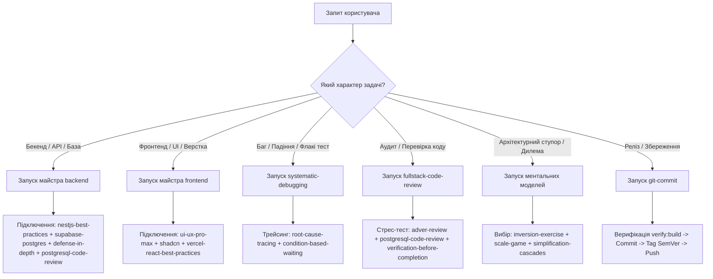

# 🤖 SmartFeed Studio — Master Skills & Multi-Domain Agent Guide

> **Файл розташування:** [`.agents/AGENTS.md`](./AGENTS.md)  
> **Призначення:** Єдиний центр інтелекту, каталог та диспетчер усіх **79 скілів** SmartFeed Studio (4 майстер-оркестратори та 75 спеціалізованих підскілів).  
> **Спеціалізовані агенти:** [🎨 Frontend Engineering Agent (`agents_frontend`)](./agents_frontend.md) · [⚙️ Backend Engineering Agent (`agents_backend`)](./agents_backend.md) · [🔍 Code Review & Audit Agent (`agents_review`)](./agents_review.md)

---

## 🏛 1. Дворівнева архітектура скілів (Skills Architecture)

Усі скіли в SmartFeed Studio організовані у чітку двошарову ієрархію:

1. **Майстер-оркестратори (Master Skills)** — розташовані безпосередньо в [`.agents/skills/`](skills/). Керують повними інженерними життєвими циклами (7 етапів для бекенду і фронтенду, релізи, мета-генерація скілів) та автоматично залучають підскіли.
2. **Спеціалізовані підскіли (Sub-Skills)** — розташовані в [`.agents/skills/sub-skills/`](skills/sub-skills/). Виконують точкові інженерні завдання: перевірка схем БД, патерни компонентів, мікроанімації, аналіз граничних умов, ліквідація гонок пам'яті, безпековий аудит.
3. **Синхронізація з Claude Code**: Усі 79 сумісних скілів дзеркалюються через відносні символічні посилання у [`.claude/skills/`](../.claude/skills/), які валідовані та резолвляться без жодного битого посилання.

```text
                                 ┌──────────────────────────────────────────────┐
                                 │   .agents/AGENTS.md (Master Agent Guide)     │
                                 └──────────────────────┬───────────────────────┘
                                                        │
           ┌────────────────────────┬───────────────────┴────────────────┬────────────────────────┐
           ▼                        ▼                                    ▼                        ▼
 ┌───────────────────┐    ┌───────────────────┐                ┌───────────────────┐    ┌───────────────────┐
 │ backend (Master)  │    │ frontend (Master) │                │ git-commit(Master)│    │skill-creator(Mstr)│
 └─────────┬─────────┘    └─────────┬─────────┘                └─────────┬─────────┘    └─────────┬─────────┘
           │                        │                                    │                        │
           ▼                        ▼                                    ▼                        ▼
 ┌──────────────────────────────────────────────────────────────────────────────────────────────────────┐
 │                              .agents/skills/sub-skills/ (75 Sub-Skills)                              │
 │  ⚙️ Backend & DB  │  💻 Frontend & UI  │  🔍 Code Review  │  🐞 Debug  │  🧠 Analysis  │  📋 Plans  │  🛠 DevOps  │  🔒 Security  │
 └──────────────────────────────────────────────────────────────────────────────────────────────────────┘
```

---

## 🗺 2. Навігаційна матриця за напрямками (8 напрямків, 79 скілів)

| Напрямок                               | Кількість | Майстер-скіли                                                                                | Ключові підскіли                                                                                                                                                |
| :------------------------------------- | :-------: | :------------------------------------------------------------------------------------------- | :-------------------------------------------------------------------------------------------------------------------------------------------------------------- |
| **1. ⚙️ Backend & Бази Даних**         |    19     | [`backend`](skills/backend/SKILL.md)                                                         | `nestjs-best-practices`, `supabase-postgres-best-practices`, `prisma-client-api`, `postgresql-code-review`, `postgresql-optimization`, `subscription-lifecycle` |
| **2. 💻 Frontend & UI/UX Дизайн**      |    18     | [`frontend`](skills/frontend/SKILL.md)                                                       | `ui-ux-pro-max`, `shadcn`, `tailwind-design-system`, `vercel-react-best-practices`, `image`, `emil-design-eng`, `design-taste-frontend`                         |
| **3. 🔍 Код-Ревью, Аудит & Якість**    |     7     | —                                                                                            | `fullstack-code-review`, `adver-review`, `postgresql-code-review`, `requesting-code-review`, `code-review-reception`, `verification-before-completion`          |
| **4. 🐞 Дебаг, Трейсинг & Тестування** |     8     | —                                                                                            | `systematic-debugging`, `root-cause-tracing`, `playwright-best-practices`, `test-driven-development-tdd`, `condition-based-waiting`                             |
| **5. 🧠 Системний Аналіз & Стратегія** |     9     | —                                                                                            | `inversion-exercise`, `scale-game`, `collision-zone-thinking`, `meta-pattern-recognition`, `simplification-cascades`                                            |
| **6. 📋 Планування & Оркестрація**     |     5     | —                                                                                            | `writing-plans`, `executing-plans`, `subagent-driven-development`, `dispatching-parallel-agents`, `remembering-conversations`                                   |
| **7. 🛠 Монорепо, Типи, Git & Скіли**   |    13     | [`git-commit`](skills/git-commit/SKILL.md), [`skill-creator`](skills/skill-creator/SKILL.md) | `turborepo`, `typescript-advanced-types`, `ai-sdk`, `firecrawl-parse`, `using-git-worktrees`, `writing-skills`                                                  |
| **8. 🔒 Безпека & Аудит**              |     6     | —                                                                                            | `api-security-best-practices`, `api-security-testing`, `better-auth-security-best-practices`, `security-best-practices`, `firebase-security-rules-auditor`      |

---

## ⚙️ Напрямок 1: Backend Architecture, APIs & Бази Даних (18 скілів)

### 👑 Майстер-скіл

- [**`backend`**](skills/backend/SKILL.md) — Повний 7-фазний життєвий цикл бекенд-інженерії: Task Analysis → Architecture Planning → Solution Exploration → TDD RED → Implementation GREEN з 4-шаровим захистом → Code Review & Audit → Systematic Debugging.
  - **Коли застосовувати:** Будь-яка задача на бекенді (NestJS, CQRS, Prisma, контролери, сервіси, фонові задачі BullMQ, транзакції, квоти).
  - **Тригери:** `/backend`, `NestJS`, `Prisma`, `PostgreSQL`, `BullMQ`, `CQRS`, `API endpoint`, `middleware`.

### 🧩 Спеціалізовані підскіли

1. [**`nestjs-best-practices`**](skills/sub-skills/nestjs-best-practices/SKILL.md)
   - **Призначення:** Архітектурні стандарти NestJS 11: чистий CQRS, відсутність циклічних залежностей, Dependency Injection, ValidationPipe з `whitelist: true`, централізовані `GlobalHttpExceptionFilter`.
   - **Коли застосовувати:** Створення модулів, контролерів, провайдерів, командних і запитових хендлерів NestJS.
2. [**`backend-development`**](skills/sub-skills/backend-development/SKILL.md)
   - **Призначення:** REST API стандарти, OWASP Top 10, stateless JWT auth, безпечне хешування паролів (Argon2id/bcrypt), rate limiting, безпека заголовків.
   - **Коли застосовувати:** Розробка публічних API, механізмів авторизації, рефреш-токенів, обробки файлів.
3. [**`backend-patterns`**](skills/sub-skills/backend-patterns/SKILL.md)
   - **Призначення:** Патерни доменної структури (DDD), ізоляція репозиторіїв та сервісів, Redis кешування, асинхронні черги задач BullMQ.
   - **Коли застосовувати:** Проектування складних сервісних потоків, планування бекграунд-воркерів, кешування важких відповідей.
4. [**`defense-in-depth-validation`**](skills/sub-skills/defense-in-depth-validation/SKILL.md)
   - **Призначення:** Реалізація 4 рівнів валідації (Layer 1: DTO / `class-validator`; Layer 2: Domain/Quota validation; Layer 3: Security/Guard checks; Layer 4: DB FK & constraints).
   - **Коли застосовувати:** Будь-яка операція мутації даних, створення користувачів, списання кредитів, зміна ліцензій.
5. [**`sentry-backend-bugs`**](skills/sub-skills/sentry-backend-bugs/SKILL.md)
   - **Призначення:** Запобігання критичним рантайм-багам: unhandled promise rejections, відсутність null-checks на зв'язках, гонки ресурсів, витоки пам'яті стрімів, блокування з'єднань БД.
   - **Коли застосовувати:** Написання асинхронних обробників, операцій з пулом з'єднань, обробки стрімів та файлів.
6. [**`subscription-lifecycle`**](skills/sub-skills/subscription-lifecycle/SKILL.md)
   - **Призначення:** Доменна модель білінгу, тарифних планів, термінів дії ліцензій, grace-періодів, авто-даунгрейдів та перевірки квот (SKU, seats, AI credits, S3).
   - **Коли застосовувати:** Управління підписками, ліцензіями, перевірка лімітів організацій, інтеграція з платіжними провайдерами.
7. [**`supabase-postgres-best-practices`**](skills/sub-skills/supabase-postgres-best-practices/SKILL.md)
   - **Призначення:** Залізні правила PostgreSQL: 100% індекси на foreign keys, `timestamptz`, `snake_case` мапінг (`@@map`), cursor-based пагінація, усунення N+1 запитів.
   - **Коли застосовувати:** Зміна `schema.prisma`, проектування нових моделей, оптимізація повільних запитів, написання міграцій.
8. [**`neon-postgres`**](skills/sub-skills/neon-postgres/SKILL.md)
   - **Призначення:** Специфікації Serverless Postgres: пул з'єднань, compute cold starts, повнотекстовий пошук, векторні розширення (`pgvector`).
   - **Коли застосовувати:** Хмарні розгортання PostgreSQL, налаштування пошукових індексів `pg_trgm`, конфігурація векторного пошуку.
9. [**`prisma-client-api`**](skills/sub-skills/prisma-client-api/SKILL.md)
   - **Призначення:** Правильне та безпечне використання методів Prisma Client (`findMany`, `$transaction`, `upsert`, зв'язки `include` vs `select`, усунення `where as any`).
   - **Коли застосовувати:** Написання або рефакторинг запитів до БД у репозиторіях та сервісах.
10. [**`prisma-cli`**](skills/sub-skills/prisma-cli/SKILL.md)
    - **Призначення:** Робота з CLI інструментами Prisma: безпечне виконання `prisma generate`, `db push`, `migrate dev`, `studio`, `db seed`.
    - **Коли застосовувати:** Застосування міграцій, оновлення згенерованого клієнта, робота з локальною структурою БД.
11. [**`prisma-postgres`**](skills/sub-skills/prisma-postgres/SKILL.md)
    - **Призначення:** Оптимізація зв'язки Prisma ORM + PostgreSQL: конфігурація `@prisma/adapter-pg`, пул з'єднань через `pg.Pool`, транзакційна ізоляція.
    - **Коли застосовувати:** Налаштування `PrismaService`, конфігурація connection pooling та таймаутів підключень.
12. [**`prisma-upgrade-v7`**](skills/sub-skills/prisma-upgrade-v7/SKILL.md)
    - **Призначення:** Керівництво з міграції та сумісності з Prisma v7: зміни конфігурації `prisma.config.ts`, генераторів, адаптерів.
    - **Коли застосовувати:** Оновлення версій Prisma, розв'язання breaking changes.
13. [**`prisma-compute`**](skills/sub-skills/prisma-compute/SKILL.md)
    - **Призначення:** Розгортання та хостинг compute середовищ для сервісів з Prisma.
    - **Коли застосовувати:** Налаштування середовища виконання та інфраструктури БД.
14. [**`integrate-backend`**](skills/sub-skills/integrate-backend/SKILL.md)
    - **Призначення:** Безпечна стиковка фронтенду з бекендом: спільні TypeScript DTO з `@smartfeed/shared`, дедуплікація запитів через `useRef`, локалізовані обробники помилок.
    - **Коли застосовувати:** Підключення UI-компонентів до бекенд REST API, обробка відповідей і мережевих помилок.
15. [**`api-security-best-practices`**](skills/sub-skills/api-security-best-practices/SKILL.md)
    - **Призначення:** OWASP API Security: JWT верифікація з фіксованим алгоритмом, авторизація ресурсів та тенантів, input validation, rate limiting, захист від SSRF/injection.
    - **Коли застосовувати:** Дизайн нових API ендпоінтів, аудит існуючих контролерів на вразливості.
16. [**`better-auth-security-best-practices`**](skills/sub-skills/better-auth-security-best-practices/SKILL.md)
    - **Призначення:** Захист секретів (≥120 біт ентропії), CSRF, trusted origins, шифрування OAuth-токенів, audit logging, конфігурація сесій та cookies.
    - **Коли застосовувати:** Налаштування аутентифікації, управління токенами та сесіями, інтеграція OAuth провайдерів.
17. [**`postgresql-optimization`**](skills/sub-skills/postgresql-optimization/SKILL.md)
    - **Призначення:** Розширені можливості PostgreSQL: JSONB з GIN індексами, масиви, повнотекстовий пошук `tsvector`/`tsquery`, віконні функції, partitioning, materialized views.
    - **Коли застосовувати:** Оптимізація повільних запитів, профілювання БД, моніторинг продуктивності.
18. [**`security-best-practices`**](skills/sub-skills/security-best-practices/SKILL.md)
    - **Призначення:** Мовно- та фреймворк-специфічний безпековий рев'ю: TypeScript/NestJS антипатерни, secure-by-default код, генерація security report.
    - **Коли застосовувати:** Комплексний безпековий аудит будь-якого модуля (backend чи frontend).
19. [**`postgresql-code-review`**](skills/sub-skills/postgresql-code-review/SKILL.md)
    - **Призначення:** Спеціалізований аудит коду PostgreSQL: валідація JSONB операцій та GIN індексів, ефективність масивів (`@>`), дизайн схеми (CITEXT, TIMESTAMPTZ, ENUM, CHECK констрейнти), оптимізація тригерів і функцій PL/pgSQL, перевірка розширень та безпека RLS.
    - **Коли застосовувати:** Написання, оптимізація та рев'ю запитів PostgreSQL, міграцій, схеми `schema.prisma` та констрейнтів.

---

## 💻 Напрямок 2: Frontend Engineering & UI/UX Дизайн (17 скілів)

### 👑 Майстер-скіл

- [**`frontend`**](skills/frontend/SKILL.md) — Повний 7-фазний життєвий цикл фронтенд-інженерії: Task/UX Analysis → Planning & Decomposition (<250 рядків) → Solution & Architecture → Playwright TDD RED → Implementation GREEN & Polish → Code Review DoD → Systematic Debugging.
  - **Коли застосовувати:** Будь-яка задача на фронтенді (`apps/desktop`, `apps/admin-portal`, React 18, Next.js 14, Tauri v2).
  - **Тригери:** `/frontend`, `React`, `Next.js`, `Tauri`, `shadcn`, `Tailwind`, `компонент`, `сторінка`, `верстка`, `модалка`.

### 🧩 Спеціалізовані підскіли

1. [**`ui-ux-pro-max`**](skills/sub-skills/ui-ux-pro-max/SKILL.md)
   - **Призначення:** Преміальний UI/UX стандарт: 100% Solid Sticky Headers (`thead.sticky.top-0` та шапки модалок мають непрозорий `bg-card`/`bg-background`), відсутність дублюючих CTA кнопок, мікроанімації, адаптивність, відсутність обрізання тексту.
   - **Коли застосовувати:** Верстка екранів, таблиць, діалогів, віджетів, оптимізація візуальної ієрархії.
2. [**`shadcn`**](skills/sub-skills/shadcn/SKILL.md)
   - **Призначення:** Еталонне використання компонентів shadcn/ui: злиття класів через `cn()`, ARIA атрибути, фокус-стани, правильна ієрархія Dialog, Dropdown, Table, Card.
   - **Коли застосовувати:** Додавання нових або модифікація існуючих компонентів дизайн-системи.
3. [**`tailwind-design-system`**](skills/sub-skills/tailwind-design-system/SKILL.md)
   - **Призначення:** Архітектура дизайн-токенів Tailwind CSS: 100% семантичні змінні (`--background`, `--primary`, `--card`, `--border`). Повна заборона хардкодних кольорів (`purple-*`, `violet-*`, `fuchsia-*`).
   - **Коли застосовувати:** Стилізація компонентів, створення нових кольорових схем, перевірка гармонії тем.
4. [**`design-taste-frontend`**](skills/sub-skills/design-taste-frontend/SKILL.md)
   - **Призначення:** Анти-шаблонний підхід до фронтенду: вишукана типографіка, змістовна сітка, уникнення "дефолтного AI-вигляду".
   - **Коли застосовувати:** Створення головних сторінок, лендингів, дашбордів, презентаційних екранів.
5. [**`design-taste-frontend-v1`**](skills/sub-skills/design-taste-frontend-v1/SKILL.md)
   - **Призначення:** Базова версія правил естетичного оформлення інтерфейсів для специфічних проектних компонентів.
   - **Коли застосовувати:** Редизайн застарілих форм або карток із збереженням консервативного стилю.
6. [**`beautiful-desing`**](skills/sub-skills/beautiful-desing/SKILL.md)
   - **Призначення:** Створення WOW-ефекту: плавні градієнти, м'які тіні, glassmorphism, стан наведення (hover), живі інтерактивні елементи.
   - **Коли застосовувати:** Полірування інтерфейсу, фінальний шліф перед демонстрацією користувачу.
7. [**`frontend-design`**](skills/sub-skills/frontend-design/SKILL.md)
   - **Призначення:** Візуальна ідентичність додатку: правила шрифтових пар, контрастності тексту, відступів та пропорцій.
   - **Коли застосовувати:** Проектування нових модулів чи екранів з нуля.
8. [**`frontend-desing`**](skills/sub-skills/frontend-desing/SKILL.md)
   - **Призначення:** Поглиблені принципи компонування сучасного Web та Desktop UI (Tauri).
   - **Коли застосовувати:** Інтеграція десктопних нативних вікон, панелей інструментів та сайдбарів.
9. [**`emil-design-eng`**](skills/sub-skills/emil-design-eng/SKILL.md)
   - **Призначення:** Інженерія мікро-деталей від Еміля Ковальські: фізика пружин (spring animations), оптимістичні оновлення інтерфейсу, тактильний відгук на кліки.
   - **Коли застосовувати:** Анімація розкриття модалок, перетягування (drag-and-drop), акордеонів, тостів.
10. [**`canvas-design`**](skills/sub-skills/canvas-design/SKILL.md)
    - **Призначення:** Робота з Canvas 2D: відмальовка графіків, бейджів, генерація зображень попереднього перегляду фідів.
    - **Коли застосовувати:** Графічні компоненти, прев'ю товарних карток, генерація банерів.
11. [**`vercel-react-best-practices`**](skills/sub-skills/vercel-react-best-practices/SKILL.md)
    - **Призначення:** Продуктивність React 18/19 та Next.js: усунення зайвих ререндерів, hoisting констант, мемоізація селекторів, усунення подвійного монтування `React.StrictMode` у dev.
    - **Коли застосовувати:** Оптимізація продуктивності сторінок, списків з тисячами товарів, усунення лагів.
12. [**`vercel-composition-patterns`**](skills/sub-skills/vercel-composition-patterns/SKILL.md)
    - **Призначення:** Масштабована композиція React: патерн Compound Components, передача `children` замість пропсів-конфігурацій на 30 полів, уникнення boolean-props пекла.
    - **Коли застосовувати:** Рефакторинг великих компонентів (наприклад, майстрів імпорту чи таблиць каталогів).
13. [**`modern-web-guidance`**](skills/sub-skills/modern-web-guidance/SKILL.md)
    - **Призначення:** Сучасні стандарти вебу: семантична розмітка HTML5, доступність (a11y), валідація, прогресивне завантаження.
    - **Коли застосовувати:** Аудит розмітки та приведення сторінок до стандартів W3C / WCAG.
14. [**`web-design-guidelines`**](skills/sub-skills/web-design-guidelines/SKILL.md)
    - **Призначення:** Контроль стандартів Web Interface Guidelines: видимий фокус клавіатури, табуляція цифр (`font-variant-numeric: tabular-nums`), автозаповнення та валідація форм.
    - **Коли застосовувати:** Перевірка форм вводу, фінансових даних, списків цін і лічильників.
15. [**`image`**](skills/sub-skills/image/SKILL.md)
    - **Призначення:** Створення та оптимізація зображень: hero images, соціальна графіка, мокапи продуктів, банери, OG-зображення, WebP оптимізація.
    - **Коли застосовувати:** Генерація графічних асетів для лендінгів, маркетингових матеріалів, прев'ю фідів.
16. [**`brainstorming-ideas-into-designs`**](skills/sub-skills/brainstorming-ideas-into-designs/SKILL.md)
    - **Призначення:** Структурований мозковий штурм: перетворення нечіткої ідеї користувача на інженерні специфікації через сокративське опитування та дослідження альтернатив.
    - **Коли застосовувати:** Початковий етап нової великої фічі, дизайн-спрінти, прототипування UI.
17. [**`webapp-testing`**](skills/sub-skills/webapp-testing/SKILL.md)
    - **Призначення:** Тестування локальних веб-додатків через Playwright скрипти: запуск серверів, знімки, інспекція DOM, дебаг UI.
    - **Коли застосовувати:** Інструментальне дослідження локального сайту через браузерний стек.

---

## 🔍 Напрямок 3: Код-Ревью, Аудит & Контроль Якості (7 скілів)

1. [**`fullstack-code-review`**](skills/sub-skills/fullstack-code-review/SKILL.md)
   - **Призначення:** Центральний майстер рев'ю для SmartFeed Studio: сувора інспекція меж CQRS, ліміту розміру файлів (<250–300 рядків), 100% двомовного перекладу i18n (UA ⇄ EN), індексів PostgreSQL, відсутності витоків даних і дублюючих HTTP-запитів.
   - **Коли застосовувати:** Перед здачею будь-якої задачі, після рефакторингу або за запитом `/fullstack-code-review`.
2. [**`adver-review`**](skills/sub-skills/adver-review/SKILL.md)
   - **Призначення:** Безжальний змагальний аудит (Adversarial Review): ламання припущень, пошук вразливостей CWE/OWASP, гонок (TOCTOU), витоків пам'яті; кожна знайдена вада обов'язково відтворюється автотестом.
   - **Коли застосовувати:** Аудит безпеки, перевірка білінгу, генерації ліцензій, криптографії чи прав доступу.
3. [**`postgresql-code-review`**](skills/sub-skills/postgresql-code-review/SKILL.md)
   - **Призначення:** Поглиблений аудит специфічного коду PostgreSQL: JSONB containment queries (`@>`), GIN-індексація масивів, кастомні домени/ENUM, `CITEXT`/`TIMESTAMPTZ`, CHECK-констрейнти, оптимізація PL/pgSQL функцій та RLS.
   - **Коли застосовувати:** Аудит міграцій, схеми `schema.prisma`, складних SQL запитів, функцій БД та перевірка відсутності анти-патернів PostgreSQL.
4. [**`requesting-code-review`**](skills/sub-skills/requesting-code-review/SKILL.md)
   - **Призначення:** Протокол самоперевірки та відправки дифу на рев'ю спеціалізованому сабагенту без засмічення контексту.
   - **Коли застосовувати:** Після завершення пакету підзадач у плані перед переходом до наступного кроку.
5. [**`code-review-reception`**](skills/sub-skills/code-review-reception/SKILL.md)
   - **Призначення:** Зріла інженерна реакція на зауваження: технічна аргументація, перевірка кожного пункту автотестом, категорична заборона формального "погоджуюсь, але нічого не змінив".
   - **Коли застосовувати:** Отримання фідбеку від рев'юера чи користувача, усунення зауважень.
6. [**`verification-before-completion`**](skills/sub-skills/verification-before-completion/SKILL.md)
   - **Призначення:** Залізне правило контролю: перед заявою про успіх обов'язковий запуск повного білда, генерації контрактів, типізації (`tsc --noEmit`) та тестового набору.
   - **Коли застосовувати:** Безпосередньо перед фінальною відповіддю користувачу.
7. [**`testing-anti-patterns`**](skills/sub-skills/testing-anti-patterns/SKILL.md)
   - **Призначення:** Захист від шкідливих тестів: ніколи не тестувати поведінку власних моків, ніколи не додавати публічні методи суто для тестів, ніколи не мокати незрозумілі залежності.
   - **Коли застосовувати:** Написання модульних та інтеграційних тестів у Jest або Vitest.

---

## 🐞 Напрямок 4: Дебаг, Трейсинг & Тестування (8 скілів)

1. [**`systematic-debugging`**](skills/sub-skills/systematic-debugging/SKILL.md)
   - **Призначення:** 4-фазний системний дебаг: 1. Відтворити баг ізольованим мінімальним тестом; 2. Простежити першопричину назад; 3. Внести структурне архітектурне виправлення; 4. Перевірити 100% тестів.
   - **Коли застосовувати:** Будь-який несподіваний збій, падіння тесту, регресія.
2. [**`root-cause-tracing`**](skills/sub-skills/root-cause-tracing/SKILL.md)
   - **Призначення:** Трейсинг аномалій назад по стеку викликів до самого витоку даних. Категорична заборона "лікувати симптоми" через мовчазні `catch {}` чи `|| null`.
   - **Коли застосовувати:** Помилки з незрозумілим джерелом (NullPointerException, десинхронізація стану).
3. [**`condition-based-waiting`**](skills/sub-skills/condition-based-waiting/SKILL.md)
   - **Призначення:** Заміна випадкових `sleep(2000)` та флакі-таймаутів на очікування конкретних предикатів або подій (`expect.poll`, `page.waitForResponse`, `waitForSelector`).
   - **Коли застосовувати:** Будь-які асинхронні E2E тести Playwright або Jest інтеграційні перевірки.
4. [**`test-driven-development`**](skills/sub-skills/test-driven-development/SKILL.md)
   - **Призначення:** Фундаментальна філософія TDD: тест пишеться до коду, підтверджується падіння (RED), пишеться мінімальний код для проходження (GREEN), після чого проводиться рефакторинг.
   - **Коли застосовувати:** Розробка нового функціоналу або усунення багів.
5. [**`test-driven-development-tdd`**](skills/sub-skills/test-driven-development-tdd/SKILL.md)
   - **Призначення:** Практичне застосування TDD для контрактів `@smartfeed/shared` та CQRS команд.
   - **Коли застосовувати:** Створення нових бізнес-правил та DTO.
6. [**`playwright-best-practices`**](skills/sub-skills/playwright-best-practices/SKILL.md)
   - **Призначення:** Майстер тестування інтерфейсів у SmartFeed Studio: Page Object Model (POM), стійкі `data-testid` селектори, перевірка перемикання локалей (UA ⇄ EN), перевірка network dedup (`requestCount === 1`).
   - **Коли застосовувати:** Написання E2E тестів для Desktop (`apps/desktop`) та Admin Portal (`apps/admin-portal`).
7. [**`webapp-testing`**](skills/sub-skills/webapp-testing/SKILL.md)
   - **Призначення:** Утиліти взаємодії з веб-додатками: запуск локальних серверів, зняття логів консолі, дослідження DOM.
   - **Коли застосовувати:** Інструментальне дослідження локального сайту через браузерний стек.
8. [**`testing-skills-with-subagents`**](skills/sub-skills/testing-skills-with-subagents/SKILL.md)
   - **Призначення:** TDD для процесів та документації: перевірка поведінки моделі до і після впровадження нових скілів або правил.
   - **Коли застосовувати:** Тестування та оптимізація інструкцій у `.agents/skills/` чи `.agents/rules/`.

---

## 🧠 Напрямок 5: Системний Аналіз, Архітектура & Ментальні Моделі (9 скілів)

1. [**`inversion-exercise`**](skills/sub-skills/inversion-exercise/SKILL.md)
   - **Призначення:** Метод інверсії (Inversion Thinking): "Як гарантовано завалити цей модуль?" або "Що зробить систему максимально повільною?". Виявлення прихованих ризиків та контрінтуїтивних простих рішень.
   - **Коли застосовувати:** Проектування нових підсистем, оцінка ризиків міграцій.
2. [**`collision-zone-thinking`**](skills/sub-skills/collision-zone-thinking/SKILL.md)
   - **Призначення:** Зіткнення непоєднуваних концепцій: синтез локальної native БД (SQLCipher в Rust) та хмарного CQRS бекенду.
   - **Коли застосовувати:** Архітектурні дилеми, винахід нестандартних рішень на стику технологій.
3. [**`meta-pattern-recognition`**](skills/sub-skills/meta-pattern-recognition/SKILL.md)
   - **Призначення:** Знаходження крос-доменних мета-патернів: якщо патерн працює в парсингу XML, чергах BullMQ та лінивому завантаженні UI — це універсальний принцип.
   - **Коли застосовувати:** Уніфікація кодової бази та усунення дублювання концепцій.
4. [**`scale-game`**](skills/sub-skills/scale-game/SKILL.md)
   - **Призначення:** Перевірка на екстремумах масштабу: "Що станеться, якщо у фіді буде 1,000,000 товарів?" або "Що якщо запит виконується 0.1 мс чи 60 секунд?".
   - **Коли застосовувати:** Оцінка масштабованості алгоритмів парсингу, транзакцій та UI віртуалізації.
5. [**`simplification-cascades`**](skills/sub-skills/simplification-cascades/SKILL.md)
   - **Призначення:** Каскадне спрощення: пошук єдиного архітектурного спрощення, яке автоматично ліквідує 3–4 проміжні класи або таблиці.
   - **Коли застосовувати:** Боротьба з надмірною складністю (overengineering).
6. [**`preserving-productive-tensions`**](skills/sub-skills/preserving-productive-tensions/SKILL.md)
   - **Призначення:** Утримання здорового балансу між протилежними вимогами: сувора безпека vs зручність UX; нативний Rust vs легкий веб-клієнт.
   - **Коли застосовувати:** Прийняття складних компромісних продуктових рішень.
7. [**`tracing-knowledge-lineages`**](skills/sub-skills/tracing-knowledge-lineages/SKILL.md)
   - **Призначення:** Дослідження походження архітектурних рішень: чому саме так побудована система, які проблеми вирішувались у минулому.
   - **Коли застосовувати:** Рефакторинг успадкованого коду, модифікація старих модулів.
8. [**`brainstorming-ideas-into-designs`**](skills/sub-skills/brainstorming-ideas-into-designs/SKILL.md)
   - **Призначення:** Структурований мозковий штурм: перетворення нечіткої ідеї користувача на інженерні специфікації з вимогами та варіантами реалізації.
   - **Коли застосовувати:** Початковий етап нової великої фічі (наприклад, AI-збагачення фідів).
9. [**`when-stuck-problem-solving-dispatch`**](skills/sub-skills/when-stuck-problem-solving-dispatch/SKILL.md)
   - **Призначення:** Диспетчер виходу зі ступору: автоматично підбирає ментальну модель (інверсія, екстремум, спрощення), якщо агент зайшов у глухий кут.
   - **Коли застосовувати:** Коли виправлення багу чи реалізація застрягла або ускладнилася.

---

## 📋 Напрямок 6: Планування, Оркестрація & Декомпозиція (5 скілів)

1. [**`writing-plans`**](skills/sub-skills/writing-plans/SKILL.md)
   - **Призначення:** Створення детермінованих планів у [`plans/active/<feature>.md`](../plans/active/): обов'язкове врахування контрактів `@smartfeed/shared`, 4 рівнів валідації, ліміту файлів (<250 рядків) та сценаріїв збоїв мережі.
   - **Коли застосовувати:** Перед будь-якою багатоетапною зміною в кодовій базі.
2. [**`executing-plans`**](skills/sub-skills/executing-plans/SKILL.md)
   - **Призначення:** Пакетне виконання затверджених планів із зупинками на верифікацію після кожної пачки (batch) із 2–3 задач.
   - **Коли застосовувати:** Фаза реалізації після явної команди користувача ("виконуй", "починай").
3. [**`subagent-driven-development`**](skills/sub-skills/subagent-driven-development/SKILL.md)
   - **Призначення:** Розподіл завдань між ізольованими сабагентами: виконавець (implementer) отримує лише свій контекст, після чого рецензент (reviewer) перевіряє зміни.
   - **Коли застосовувати:** Реалізація великих незалежних блоків завдань з метою економії контексту головного агента.
4. [**`dispatching-parallel-agents`**](skills/sub-skills/dispatching-parallel-agents/SKILL.md)
   - **Призначення:** Одночасний запуск кількох сабагентів для паралельного вирішення незалежних задач (наприклад, одночасний аудит різних модулів).
   - **Коли застосовувати:** Масовий аналіз помилок, паралельний рефакторинг різних пакетів monorepo.
5. [**`remembering-conversations`**](skills/sub-skills/remembering-conversations/SKILL.md)
   - **Призначення:** Пошук у збережених сесіях діалогів: знаходження раніше узгоджених рішень, нюансів бізнес-логіки та технічних вимог.
   - **Коли застосовувати:** Коли користувач посилається на попередні обговорення або потрібно відновити забутий контекст.

---

## 🛠 Напрямок 7: Монорепозиторій, Типізація, Git & Управління Скілами (14 скілів)

### 👑 Майстер-скіли

- [**`git-commit`**](skills/git-commit/SKILL.md) — Повний автоматизований релізний пайплайн: 1. `pnpm verify:build` (Zero-Broken-Build Gate); 2. Безпечне додавання файлів `git add .`; 3. Генерація Conventional Commit; 4. Розрахунок SemVer тегу (MAJOR/MINOR/PATCH); 5. Push комміту разом із тегами (`git push origin <branch> --tags`).
  - **Коли застосовувати:** Тільки на явний запит користувача (`/git-commit`, `/commit`, "закоміть", "вивантаж").
- [**`skill-creator`**](skills/skill-creator/SKILL.md) — Створення, калібрування описів та тестування нових скілів з оптимізацією тригерів.
  - **Коли застосовувати:** Створення нових кастомних скілів, модифікація або оптимізація існуючих інструкцій.

### 🧩 Спеціалізовані підскіли

1. [**`turborepo`**](skills/sub-skills/turborepo/SKILL.md)
   - **Призначення:** Налаштування monorepo pipeline: залежності між задачами (`^build`), кешування артефактів, фільтрація пакетів (`pnpm --filter`).
   - **Коли застосовувати:** Оптимізація часу збірки, редагування `turbo.json`, налаштування CI/CD скриптів.
2. [**`typescript-advanced-types`**](skills/sub-skills/typescript-advanced-types/SKILL.md)
   - **Призначення:** Просунута типізація: Conditional Types, Infer, Template Literals, Mapped Types, виключення приведення `as any`.
   - **Коли застосовувати:** Проектування складних загальних типів у `@smartfeed/shared`.
3. [**`ai-sdk`**](skills/sub-skills/ai-sdk/SKILL.md)
   - **Призначення:** Робота з Vercel AI SDK: генерація структурованих об'єктів (`generateObject`), стрімінг відповідей (`streamText`), хуки `useChat`.
   - **Коли застосовувати:** Розробка модулів AI-збагачення каталогів товарів, генерації описів за допомогою LLM.
4. [**`firecrawl-parse`**](skills/sub-skills/firecrawl-parse/SKILL.md)
   - **Призначення:** Конвертація файлів (PDF, DOCX, XLSX, HTML) у чистий Markdown для подальшого аналізу агентом.
   - **Коли застосовувати:** Аналіз завантажених користувачем прайс-листів чи зовнішніх специфікацій фідів.
5. [**`using-git-worktrees`**](skills/sub-skills/using-git-worktrees/SKILL.md)
   - **Призначення:** Ізольована паралельна робота з кількома гілками через git worktree без ризику пошкодити основне робоче дерево.
   - **Коли застосовувати:** Швидка перевірка чужої гілки чи хотфікс без перемикання поточної гілки.
6. [**`finishing-a-development-branch`**](skills/sub-skills/finishing-a-development-branch/SKILL.md)
   - **Призначення:** Структуроване завершення розробки гілки: перевірка чисток, оновлення документації, злиття або створення PR.
   - **Коли застосовувати:** Фіналізація роботи перед об'єднанням гілок.
7. [**`writing-skills`**](skills/sub-skills/writing-skills/SKILL.md)
   - **Призначення:** Методологія написання документації скілів з використанням TDD підходу.
   - **Коли застосовувати:** Створення нових `.md` файлів з інструкціями для ШІ-агентів.
8. [**`gardening-skills-wiki`**](skills/sub-skills/gardening-skills-wiki/SKILL.md)
   - **Призначення:** Аудит здоров'я бази знань: пошук битих посилань, контроль узгодженості імен, актуалізація індексів.
   - **Коли застосовувати:** Періодична чистка та синхронізація документації скілів.
9. [**`sharing-skills`**](skills/sub-skills/sharing-skills/SKILL.md)
   - **Призначення:** Експорт розроблених у проекті скілів у зовнішні спільні репозиторії.
   - **Коли застосовувати:** Поділ напрацьованими скілами зі спільнотою.
10. [**`getting-started-with-skills`**](skills/sub-skills/getting-started-with-skills/SKILL.md)
    - **Призначення:** Стартовий гайд по взаємодії зі скілами для нових розробників та агентів.
    - **Коли застосовувати:** Онбординг та ознайомлення з наявними можливостями.
11. [**`pulling-updates-from-skills-repository`**](skills/sub-skills/pulling-updates-from-skills-repository/SKILL.md)
    - **Призначення:** Підтягування оновлень скілів із зовнішніх джерел з перевіркою конфліктів.
    - **Коли застосовувати:** Синхронізація з upstream-репозиторіями.

---

## 🔒 Напрямок 8: Безпека & Аудит (7 скілів)

1. [**`api-security-best-practices`**](skills/sub-skills/api-security-best-practices/SKILL.md)
   - **Призначення:** OWASP API Security Top 10: JWT з фіксованим алгоритмом, авторизація ресурсів/тенантів, input validation, rate limiting, SSRF захист.
   - **Коли застосовувати:** Дизайн та аудит REST API ендпоінтів.
2. [**`api-security-testing`**](skills/sub-skills/api-security-testing/SKILL.md)
   - **Призначення:** Практичне тестування безпеки API: BOLA/IDOR доведення з двома наборами креденшелів, mass assignment, обхід rate limits, ID tampering.
   - **Коли застосовувати:** Стрес-тести безпеки, аудит авторизації та тенант-ізоляції.
3. [**`better-auth-security-best-practices`**](skills/sub-skills/better-auth-security-best-practices/SKILL.md)
   - **Призначення:** Захист секретів (≥32 chars, ≥120 біт ентропії), CSRF, trusted origins, шифрування OAuth токенів, cookies безпека, audit logging.
   - **Коли застосовувати:** Налаштування аутентифікації, OAuth провайдерів, сесій.
4. [**`security-best-practices`**](skills/sub-skills/security-best-practices/SKILL.md)
   - **Призначення:** Мовно-специфічний безпековий рев'ю: TypeScript/NestJS антипатерни, XSS-превенція для React, secure-by-default код, генерація security report.
   - **Коли застосовувати:** Комплексний аудит будь-якого модуля.
5. [**`firebase-security-rules-auditor`**](skills/sub-skills/firebase-security-rules-auditor/SKILL.md)
   - **Призначення:** Аудит правил безпеки Firebase/Firestore: перевірка прав доступу, тенант-ізоляція, валідація схем.
   - **Коли застосовувати:** Аудит інфраструктурної безпеки та правил доступу.
6. [**`api-security-testing`**](skills/sub-skills/api-security-testing/SKILL.md) — вже описаний вище.
7. [**`postgresql-optimization`**](skills/sub-skills/postgresql-optimization/SKILL.md) — крос-доменний скіл, також використовується в Напрямку 1.

---

## 🚦 3. Протокол авто-маршрутизації агента (Automatic Routing Engine)

Коли агент отримує запит від користувача, він **зобов'язаний діяти за цим маршрутизатором**:



---

## 🔒 4. Статус цілісності посилань та шляхів (Verified 100%)

Усі шляхи в середині скілів та між ними перевірені та відновлені після реорганізації:

- ✅ **Майстер-скіли (`backend`, `frontend`)**: усі посилання на підскіли виправлені на `../sub-skills/<skill>/SKILL.md`.
- ✅ **Підскіли (`playwright-best-practices`, `fullstack-code-review`)**: посилання на правила в `.agents/rules/` виправлені на три рівні вгору (`../../../rules/<rule>.md`).
- ✅ **Зовнішні симлінки (`.claude/skills/`)**: 100% символічних посилань вказують на актуальні шляхи в `../../.agents/skills/sub-skills/` без жодного битого лінка.
- ✅ **Маніфест `skills-lock.json`**: шляхи синхронізовані з новим розташуванням у `sub-skills/`.

---

## 🚫 5. Залізне правило імпортів монорепозиторію (Zero Relative Imports)

- **100% Path Aliases (`@/`)**: У всіх пакетах (`apps/desktop`, `apps/admin-portal`, `services/backend-api`) **СУВОРО ЗАБОРОНЕНО** використання відносних імпортів `../` та `./` між каталогами.
- **Префікс `@/`**: Усі внутрішні імпорти файлів виконуються строго через `@/` (наприклад, `@/components/...`, `@/lib/...`, `@/services/...`, `@/modules/...`, `@/prisma/...`).
- **Спільні контракти**: Імпортуються виключно через пакет `@smartfeed/shared`.
- Будь-який `../` вважається архітектурним дефектом і блокує прийом задачі.
