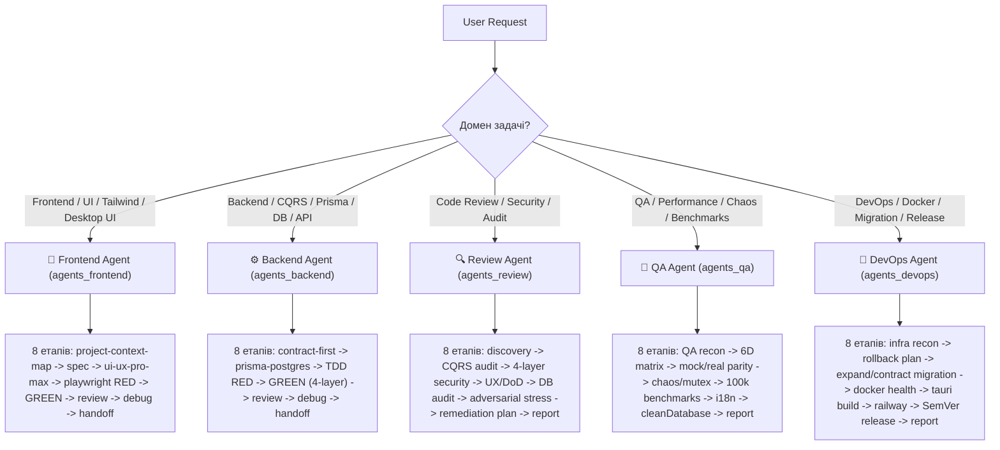

# 🤖 SmartFeed Studio — Master Intelligence & Agent Dispatcher Guide

> **Location:** [`.agents/AGENTS.md`](./AGENTS.md)  
> **Purpose:** Central intelligence dispatcher connecting specialized Agents and modular Skills.  
> **Specialized Agent Playbooks:** [🎨 Frontend Agent](references/agents_frontend.md) · [⚙️ Backend Agent](references/agents_backend.md) · [🔍 Code Review Agent](references/agents_review.md) · [🚀 DevOps Agent](references/agents_devops.md) · [🧪 QA Agent](references/agents_qa.md) · [📋 Prompts](references/task_prompt_examples.md)

---

## 🏛 1. Core Architecture: Agents Command Modular Skills

In SmartFeed Studio, the hierarchy is strictly role-driven:

1. **АГЕНТИ (Agents)** — це автономні спеціалізовані інженери (`agents_frontend`, `agents_backend`, `agents_review`, `agents_qa`, `agents_devops`). Кожен агент має чіткий **8-етапний життєвий цикл**.
2. **НА КОЖНОМУ ЕТАПІ** агент чітко визначає: **ЯКІ саме скіли** активуються та **ЯК САМЕ** вони використовуються.
3. **СКІЛИ (Skills)** — це 46 модульних інструментів та компетенцій, що розташовані безпосередньо в [`.agents/skills/<skill>/SKILL.md`](skills/) (і дзеркаляться в [`.claude/skills/`](../.claude/skills/)). Папки `sub-skills/` не існує — всі скіли рівноправні та модульні.
4. **`skill-creator`** — це мета-скіл у [`.agents/skills/skill-creator/SKILL.md`](skills/skill-creator/SKILL.md), який агенти використовують у контурі самопрокачування для синтезу нових правил та навичок.

```text
 ┌────────────────────────────────────────────────────────────────────────────────────────┐
 │                      SMARTFEED STUDIO — AGENTS & SKILLS ARCHITECTURE                   │
 └──────────────────────────────────────────┬─────────────────────────────────────────────┘
                                            │
        ┌───────────────────────────────────┼───────────────────────────────────┐
        ▼                                   ▼                                   ▼
 ┌──────────────┐                    ┌──────────────┐                    ┌──────────────┐
 │   FRONTEND   │                    │   BACKEND    │                    │ REVIEW / QA  │
 │    AGENT     │                    │    AGENT     │                    │   / DEVOPS   │
 └──────┬───────┘                    └──────┬───────┘                    └──────┬───────┘
        │ (8-Stage Lifecycle)               │ (8-Stage Lifecycle)               │ (8-Stage)
        ▼                                   ▼                                   ▼
 ┌──────────────────────────────────────────────────────────────────────────────────────┐
 │                      46 МОДУЛЬНИХ СКІЛІВ (.agents/skills/<skill>/)                   │
 │                                                                                      │
 │  💻 Frontend: ui-ux-pro-max, vercel-react-best-practices, i18n-localization, emil... │
 │  ⚙️ Backend: nestjs-best-practices, prisma-postgres-mastery, postgresql-opt...      │
 │  🧪 Testing: playwright-automation, test-driven-development, mock-real-parity...     │
 │  🛡️ Security: security-and-hardening, tauri-v2-security-and-ipc...                   │
 │  📋 Planning: planning-and-lifecycle, interview-me, spec-driven-development...       │
 │  🧬 Evolution: skill-creator (мета-контур створення та аудиту скілів)                │
 └──────────────────────────────────────────────────────────────────────────────────────┘
```

---

## 🗺 2. Каталог 46 скілів за категоріями

### 👑 Майстер-оркестратори життєвого циклу

- [`frontend`](skills/frontend/SKILL.md) — Повний життєвий цикл фронтенду: React 18, Next.js 14, Tauri v2.
- [`backend`](skills/backend/SKILL.md) — Повний життєвий цикл бекенду: NestJS CQRS, Prisma, BullMQ.
- [`review`](skills/review/SKILL.md) — 8-етапний корпоративний аудит архітектури, безпеки та якості.
- [`git-commit`](skills/git-commit/SKILL.md) — Conventional commits, звичайне вивантаження без екшенів або керований SemVer реліз за прапорцем (`--release`).
- [`skill-creator`](skills/skill-creator/SKILL.md) — Мета-скіл: створення, аудит, тестування та оптимізація скілів у `.agents/skills/`.

### 💻 Фронтенд та UI/UX Design

- [`ui-ux-pro-max`](skills/ui-ux-pro-max/SKILL.md) — 100% Solid Sticky Headers, семантичні токени, нуль дублів CTA, shadcn, ліміт <250 рядків.
- [`vercel-react-best-practices`](skills/vercel-react-best-practices/SKILL.md) — Продуктивність React 18, дедуплікація запитів через `useRef`, оптимізація рендерів.
- [`i18n-localization`](skills/i18n-localization/SKILL.md) — 100% двомовний паритет UA ⇄ EN, нуль сирих ключів, `title={t('...')}`, перевірка через `pnpm i18n:check`.
- [`emil-design-eng`](skills/emil-design-eng/SKILL.md) — Плавні пружинні анімації, тактильні мікроінтеракції, оптимістичний UI.
- [`image`](skills/image/SKILL.md) — Генерація та оптимізація графіки, WebP стиснення, робота з плейсхолдерами.

### ⚙️ Бекенд та Бази Даних

- [`nestjs-best-practices`](skills/nestjs-best-practices/SKILL.md) — CQRS, DTO валідація з `class-validator`, BullMQ черги, фільтри винятків.
- [`contract-first-api`](skills/contract-first-api/SKILL.md) — Єдині Zod-схеми та TypeScript DTO у `@smartfeed/shared`, нуль ad-hoc типів.
- [`prisma-postgres-mastery`](skills/prisma-postgres-mastery/SKILL.md) — 100% FK індекси, CUIDs, `@@map`, пул `pg.Pool`, нуль N+1, міграції Expand/Contract.
- [`postgresql-optimization`](skills/postgresql-optimization/SKILL.md) — GIN pg_trgm індекси, JSONB, повнотекстовий пошук, `EXPLAIN ANALYZE`, курсорна пагінація.
- [`streaming-large-feeds`](skills/streaming-large-feeds/SKILL.md) — Потоковий SAX XML/CSV парсинг каталогів на 100k+ SKU, backpressure, ліміти RAM.
- [`bullmq-jobs`](skills/bullmq-jobs/SKILL.md) — Асинхронні черги BullMQ, експоненційні ретраї, Dead Letter Queue (DLQ), ідемпотентність.
- [`idempotency-and-outbox`](skills/idempotency-and-outbox/SKILL.md) — Redis ключі ідемпотентності, Prisma Transactional Outbox для подій.
- [`subscription-lifecycle`](skills/subscription-lifecycle/SKILL.md) — Розрахунок термінів підписки, квоти seats/SKU/AI, grace-періоди, даунгрейди.
- [`rust-native-backend`](skills/rust-native-backend/SKILL.md) — Нативний Tauri v2 Rust бекенд, SQLCipher SQLite, транзакції, cascade deletes.

### 🔍 Якість Коду, Рев'ю та Дебаг

- [`code-review-and-quality`](skills/code-review-and-quality/SKILL.md) — 5-осьовий аудит якості (коректність, архітектура, безпека, читабельність, швидкість).
- [`code-simplification`](skills/code-simplification/SKILL.md) — Спрощення надлишкової складності без зміни поведінки, тести на кожну зміну.
- [`systematic-debugging`](skills/systematic-debugging/SKILL.md) — 4-фазний дебаг: відтворення тестом → пошук корінної причини → структурний фікс → верифікація.
- [`doubt-driven-development`](skills/doubt-driven-development/SKILL.md) — Змагальний критичний аналіз (adversarial review), моделювання гонок (TOCTOU) та обходу квот.
- [`browser-debugging`](skills/browser-debugging/SKILL.md) — Playwright MCP інспекція живого DOM дерева, консолі, мережі та скріншотів.

### 📋 Планування, Специфікації та Архітектура

- [`planning-and-lifecycle`](skills/planning-and-lifecycle/SKILL.md) — Детерміновані плани у `plans/active/`, інваріанти, перенесення в `plans/completed/`.
- [`interview-me`](skills/interview-me/SKILL.md) — Уточнення вимог по одному питанню за раз з підрахунком відсотка впевненості.
- [`spec-driven-development`](skills/spec-driven-development/SKILL.md) — Специфікація вимог та контрактів до написання коду.
- [`incremental-implementation`](skills/incremental-implementation/SKILL.md) — Тонкі вертикальні скибки (<250 рядків) та автономні ітерації.
- [`documentation-and-adrs`](skills/documentation-and-adrs/SKILL.md) — Фіксація архітектурних рішень (ADR) та синхронізація WIKI.
- [`project-context-map`](skills/project-context-map/SKILL.md) — Карта топології монорепозиторію, порти (:4000, :3000, :1420) та зв'язки модулів.
- [`lessons-learned-registry`](skills/lessons-learned-registry/SKILL.md) — Реєстр відомих помилок, антипатернів та зафіксованих інваріантів проекту.
- [`source-driven-development`](skills/source-driven-development/SKILL.md) — Верифікація правил за авторитетною документацією фреймворків.

### 🧪 Тестування, Безпека, DevOps & Інфраструктура

- [`playwright-automation`](skills/playwright-automation/SKILL.md) — Page Object Model, стабільні селектори, двомовні UA/EN тести, перевірка дедуплікації.
- [`test-driven-development`](skills/test-driven-development/SKILL.md) — Цикл RED-GREEN-REFACTOR, обов'язковий `cleanDatabase` teardown у `beforeAll`/`afterAll`.
- [`mock-real-parity`](skills/mock-real-parity/SKILL.md) — 100% поведінковий паритет між mockDatabaseDriver, нативним SQLite та Real NestJS API.
- [`performance-optimization`](skills/performance-optimization/SKILL.md) — Бенчмарки продуктивності, контроль p95 latency, профілювання CPU та RAM.
- [`security-and-hardening`](skills/security-and-hardening/SKILL.md) — 4-шаровий захист, OWASP Top 10, JWT безпека, нуль CWE-78 (тільки `execFile`).
- [`tauri-v2-security-and-ipc`](skills/tauri-v2-security-and-ipc/SKILL.md) — Безпека бінарників десктопу, SQLCipher, OS Keychain, валідація IPC.
- [`turborepo`](skills/turborepo/SKILL.md) — Оптимізація конвеєрів збірки монорепозиторію та кешування тасок.
- [`context-engineering`](skills/context-engineering/SKILL.md) — Ощадливе керування контекстом, гігієна промптів.
- [`observability-and-instrumentation`](skills/observability-and-instrumentation/SKILL.md) — Структуроване логування, моніторинг Sentry, трейсинг інцидентів.
- [`ci-cd-and-automation`](skills/ci-cd-and-automation/SKILL.md) — GitHub Actions пайплайни, оптимізація CI релізів.
- [`release-and-rollback`](skills/release-and-rollback/SKILL.md) — SemVer версіонування, smoke checks, детальні плани відкату (Rollback runbook).
- [`automated-guardrails-ci`](skills/automated-guardrails-ci/SKILL.md) — ESLint, Prettier, TypeScript strict typecheck, заборона relative imports `../`.
- [`ai-sdk`](skills/ai-sdk/SKILL.md) — Потокова генерація Vercel AI SDK, LLM збагачення даних фідів.
- [`firecrawl-parse`](skills/firecrawl-parse/SKILL.md) — Багатоформатний парсинг каталогів та документації в markdown.

---

## 🚦 3. Автоматична маршрутизація задач до профільних агентів



---

## 💬 4. Strict Communication Policy, Zero Plan Dumping & Upfront Research

- **Concise & Direct (Token Economy)**: Always answer user questions briefly, clearly, and to the point.
- **Zero Plan & File Dumping in Chat**: Never rewrite, dump, or duplicate full plans, task breakdowns, or file contents into chat messages. All detailed plans MUST be written directly to `plans/active/<feature>.md`. Chat responses must contain ONLY concise summaries (1-2 sentences) with clickable markdown file links (`file:///...`).
- **Reliability & Quality > "Working is Enough"**: Never write code to "just make it work" with quick hacks. Analyze deeply and pick the most efficient, robust, scalable, and reliable approach.
- **Upfront Research via `context7` & MCPs**: Before implementing features or designing architecture, refresh library APIs and official docs via `context7` (`resolve-library-id`, `query-docs`) and relevant MCPs.
- **Rule Reference**: [communication_and_research.md](rules/communication_and_research.md).
