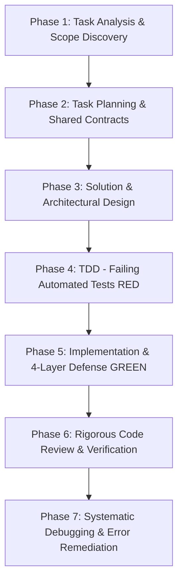

# 🛡️ Enterprise Backend Engineering Lifecycle (SmartFeed Studio)

A comprehensive, full-cycle backend engineering **master skill** for SmartFeed Studio. It consolidates ALL backend-related specialized skills, Prisma ORM skills, project rules, security standards, and planning/review protocols.

---

## 🧭 1. Consolidated Skills Architecture

This master skill synthesizes and enforces ALL project backend skills and ```text
┌────────────────────────────────────┐
│ backend (Master Skill) │
└───────────────┬────────────────────┘
┌──────────────┬──────────────┬───────────┴────────┬────────────────┬────────────────┐
▼ ▼ ▼ ▼ ▼ ▼
┌──────────┐ ┌──────────┐ ┌──────────────┐ ┌──────────────┐ ┌──────────────┐ ┌──────────────┐
│Arch & │ │Security &│ │DB & Prisma │ │Planning & │ │QA & Debug │ │Review & │
│CQRS │ │Validation│ │ │ │Execution │ │ │ │Self-Evolution│
├──────────┤ ├──────────┤ ├──────────────┤ ├──────────────┤ ├──────────────┤ ├──────────────┤
│nestjs-bp │ │defense-4l│ │supabase-pg-bp│ │writing-plans │ │tdd-cycle │ │fullstack-cr │
│backend- │ │sentry-bug│ │prisma-cli │ │executing- │ │testing-anti │ │adver-review │
│patterns │ │OWASP Top │ │prisma-client │ │plans │ │condition-wait│ │verification │
│subscription│api-sec-bp│ │prisma-postgre│ │subagent-dev │ │systematic- │ │skill-creator │
│ai-sdk │ │better-ath│ │prisma-upgr-v7│ │parallel-agts │ │debug & trace │ │writing-skills│
│rules.md │ │CWE-78 │ │neon-postgres │ │simplification│ │when-stuck │ │gardening-wiki│
│eng-disc │ │mutex-lock│ │pg-opt & rev │ │collision-zone│ │typescript-adv│ │worktrees │
└──────────┘ └──────────┘ └──────────────┘ └──────────────┘ └──────────────┘ └──────────────┘

```

### 📋 Операційна матриця підскілів бекенду (Що робить, Коли активується, В яких випадках)

| Підскіл | Що робить (Функціонал) | Коли активується (Фаза/Тригер) | В яких конкретних випадках застосовується |
| :--- | :--- | :--- | :--- |
| **`nestjs-best-practices`** | Стандарти NestJS 11: CQRS, нуль циклічних залежностей, DI синглтони, ValidationPipe | Фаза 1-3, 5; модулі та хендлери | Створення модулів, розділення `UsersModule` і `AuthModule`, конфігурація `GlobalHttpExceptionFilter`. |
| **`backend-development`** | REST API стандарти, OWASP Top 10, stateless JWT auth, Argon2id/bcrypt, rate limiting | Фаза 3, 5; публічні/приватні API | Дизайн ендпоінтів `/auth/*`, `/plans`, захист від брутфорсу через `ThrottlerGuard`, безпечні заголовки. |
| **`backend-patterns`** | Патерни DDD, ізоляція сервісів від репозиторіїв, Redis кешування, черги BullMQ | Фаза 2, 3; асинхронні потоки | Важкий парсинг XML/CSV на 50,000 товарів, фонова генерація фідів, черги завдань, кешування. |
| **`defense-in-depth-validation`** | 4-шаровий захист (DTO -> Domain/Квоти -> Guards/RBAC -> DB FK/Trx) | Фаза 2, 5; мутації даних | Створення сутностей, списання кредитів, перевірка ліцензій, захист від підробки параметрів. |
| **`sentry-backend-bugs`** | Захист від критичних багів: unhandled rejections, null-посилання, витоки пам'яті | Фаза 1, 5; асинхронні ланцюжки | Обробка стрімів великих файлів, читання реляцій Prisma (`user.organization?.name`), пул з'єднань. |
| **`subscription-lifecycle`** | Білінг, квоти тарифів, терміни дії, grace-періоди, авто-даунгрейди | Фаза 1, 3; управління ліцензіями | Запрошення користувачів (seats), імпорт товарів (SKU limit), нарахування AI-кредитів, S3 ліміти. |
| **`supabase-postgres-best-practices`** | Залізні стандарти PostgreSQL: 100% FK індекси, snake_case, timestamptz, курсорна пагінація | Фаза 3, 5; зміна БД та запити | Створення моделей у `schema.prisma`, виключення OFFSET пагінації, усунення N+1 запитів. |
| **`neon-postgres`** | Serverless Postgres: налаштування пулу, cold starts, повнотекстовий пошук, pgvector | Фаза 3; хмарна БД та пошук | Конфігурація триграмних індексів `pg_trgm` для пошуку товарів, налаштування векторних ембеддінгів. |
| **`prisma-client-api`** | Безпечні запити Prisma Client (`findMany`, `$transaction`, `upsert`, виключення `as any`) | Фаза 5; репозиторії та сервіси | Типізовані вибірки `Prisma.*WhereInput`, атомарні транзакції для запобігання неконсистентності. |
| **`prisma-cli`** | CLI команди Prisma: безпечне виконання `prisma generate`, `db push`, `migrate dev`, `studio` | Фаза 3, 5; міграції схеми | Накачування міграцій, генерація типізованого клієнта, робота з локальною структурою БД. |
| **`prisma-postgres`** | Оптимізація Prisma + PostgreSQL: пул `pg.Pool`, адаптер `@prisma/adapter-pg` | Фаза 3; конфігурація сервісу | Налаштування `PrismaService`, запобігання вичерпанню ліміту відкритих з'єднань PostgreSQL. |
| **`prisma-upgrade-v7`** | Керівництво з міграції та сумісності з Prisma v7: `prisma.config.ts`, адаптери | При оновленні ORM чи помилках | Розв'язання breaking changes при оновленні версій Prisma, міграція конфігурацій. |
| **`prisma-compute`** | Розгортання та хостинг compute середовищ для сервісів з Prisma | Фаза 3; хмарна інфраструктура | Налаштування середовища виконання бекенд-сервісу та автоматичного масштабування. |
| **`postgresql-optimization`** | JSONB з GIN індексами, масиви (`@>`), повнотекстовий пошук `tsvector`, віконні функції | Фаза 3; оптимізація продуктивності | Збереження сирих параметрів товарів у JSONB, агрегація статистики, партиціонування таблиць. |
| **`postgresql-code-review`** | Поглиблений аудит SQL/Prisma коду: RLS, CHECK констрейнти, тригери, безпека | Фаза 6; аудит БД | Перевірка правильності композитних індексів, каскадних видалень `ON DELETE CASCADE`. |
| **`integrate-backend`** | Контракти DTO, синхронізація статусів помилок, узгодження з фронтендом | Фаза 2, 3; API дизайн | Формування стандартизованих кодів помилок (`QUOTA_EXCEEDED`), єдині DTO у `@smartfeed/shared`. |
| **`api-security-best-practices`** | OWASP API Security: фіксовані алгоритми JWT, SSRF захист, валідація URL | Фаза 1, 3, 5; мережеві функції | Завантаження фідів за URL (блокування приватних/loopback IP), захист від BOLA/IDOR. |
| **`better-auth-security-best-practices`** | Безпека ключів (≥120 біт ентропії), CSRF токени, trusted origins, cookie security | Фаза 3; конфігурація авторизації | Захист JWT секретів, валідація походження запитів, ротація рефреш-токенів у БД. |
| **`api-security-testing`** | Автоматизоване тестування безпеки: фаззінг, спроби ін'єкцій, байпасів ролей | Фаза 4, 6; безпекові тести | Написання E2E тестів на спробу доступу звичайного користувача до ендпоінтів `SUPER_ADMIN`. |
| **`firebase-security-rules-auditor`** | Аудит політик сховища та хмарних правил доступу | Фаза 3; S3/MinIO інтеграції | Перевірка безпеки presigned URL у `StorageModule`, запобігання публічному витоку каталогів. |
| **`security-best-practices`** | Мовно-специфічний аналіз безпеки NestJS/TypeScript, нуль CWE-78 | Фаза 5, 6; безпековий аудит | Заборона `exec` з конкатенацією рядків, заміна на `execFile(binary, [args], { shell: false })`. |
| **`ai-sdk`** | Інтеграція Vercel AI SDK для бекенд-пайплайнів генерації та валідації | Фаза 3, 5; AI сервіси | Автоматичне збагачення товарних даних, нормалізація категорій через AI-моделі. |
| **`inversion-exercise`** | Моделювання відмов: "Що станеться при аварійному вимкненні сервера/БД?" | Фаза 1; моделювання ризиків | Перевірка транзакційної цілісності при обриві з'єднання посеред пакетного імпорту. |
| **`scale-game`** | Тестування екстремальних навантажень бекенду (100k товарів, 100 паралельних запитів) | Фаза 1, 3; навантаження | Проектування черг BullMQ для запобігання переповненню RAM при імпорті гігабайтних фідів. |
| **`collision-zone-thinking`** | Аналіз меж: Desktop нативний SQLite (Tauri) vs Cloud NestJS API | Фаза 1; архітектурні межі | Сувора заборона прокидання локальних операцій товарного каталогу десктопу в NestJS API. |
| **`simplification-cascades`** | Архітектурне спрощення: заміна надлишкових сервісів на чисті CQRS хендлери | Фаза 2; планування | Видалення проміжних сервісів-проксі на користь прямої обробки у `*Handler`. |
| **`meta-pattern-recognition`** | Уніфікація патернів між сервісами (ідентичні підходи до кешування, черг) | Фаза 2; архітектура | Єдиний стандарт підключення Redis та обробки ретраїв у всіх воркерах BullMQ. |
| **`preserving-productive-tensions`** | Баланс між суворою консистентністю (ACID) та асинхронною швидкодією | Фаза 3; проектування | Виділення критичних операцій балансу в транзакції, а імпорту товарів — в асинхронні задачі. |
| **`writing-plans`** & **`executing-plans`** | Складання плану у `plans/active/` з 4-шаровим захистом та покрокове виконання | Фаза 2; планування | Будь-яка зміна бекенду понад 1 файл: затвердження архітектури до написання коду. |
| **`subagent-driven-development`** | Делегування незалежних завдань бекенду (DTO, Handler, E2E тест) субагентам | Фаза 2, 5; паралельні задачі | Розподіл завдань між спеціалізованими субагентами для прискорення розробки. |
| **`dispatching-parallel-agents`** | Конкурентний аудит та виправлення помилок у різних модулях бекенду | Фаза 7; дебаг інцидентів | Одночасне дослідження логів Redis та блокувань PostgreSQL при навантаженні. |
| **`remembering-conversations`** | Пошук рішень щодо структури БД, угод найменування та бізнес-правил | Фаза 1; пам'ять проекту | Згадування причини введення CUID замість UUID або специфіки налаштування `@prisma/adapter-pg`. |
| **`test-driven-development-tdd`** | Залізний цикл TDD: E2E тест падає (RED) -> мінімальна реалізація (GREEN) | Фаза 4, 5; TDD розробка | Написання тесту з Supertest та реальним підключенням до БД до створення бізнес-логіки. |
| **`test-driven-development`** | Розробка через тестування для виправлення виявлених дефектів | Фаза 4; багфікси | Написання тесту, який надійно відтворює знайдений баг до внесення будь-яких правок у код. |
| **`testing-anti-patterns`** | Заборона тестування моків; обов'язковий `cleanDatabase` з FK-ієрархією | Фаза 4; якість тестів | Очищення БД у `beforeAll` та `afterAll`, виключення витоку тестових даних між сьютами. |
| **`condition-based-waiting`** | Очікування завершення асинхронних задач через опитування умов замість `sleep` | Фаза 4; E2E тести | Очікування появи результатів обробки черги BullMQ через циклічний `expect.poll`. |
| **`systematic-debugging`** & **`root-cause-tracing`** | 4-фазний дебаг: відтворення тестом -> трейсинг до першопричини -> чистий фікс | Фаза 7; усунення багів | Розслідування падіння транзакції або блокування пулу з'єднань під навантаженням. |
| **`when-stuck-problem-solving-dispatch`** | Алгоритм виходу з глухого кута при зависанні тестів або складних збоях | Фаза 7; критичний глухий кут | Діагностика взаємних блокувань (deadlocks) у PostgreSQL транзакціях. |
| **`typescript-advanced-types`** | Generics, Conditional/Mapped types, Type Guards у DTO та хендлерах | Фаза 2; контракти | Сувора типізація фільтрів, безпечні вибірки, повне усунення небезпечного `as any`. |
| **`turborepo`** | Оптимізація пайплайнів білду та кешування бекенду у монорепо | Фаза 6; збірка та CI | Перевірка чистоти збірки через `pnpm --filter @smartfeed/backend-api build`. |
| **`using-git-worktrees`** | Ізольовані робочі дерева Git для безпечного тестування міграцій | Фаза 3; експерименти | Перевірка руйнівних міграцій бази даних в окремому ізольованому worktree. |
| **`finishing-a-development-branch`** | Фіналізація гілки: підготовка чистого злиття, контроль тегів версій | Фаза 6; реліз | Підготовка бекенд-модуля до злиття в `main` та синхронізація версій. |
| **`firecrawl-parse`** | Дослідження структури зовнішніх постачальників для генерації парсерів | Фаза 1; інтеграції | Парсинг зразків XML/CSV каталогів для створення точних схем імпорту. |
| **`fullstack-code-review`** | Комплексний аудит архітектури, CQRS меж, безпеки та стилю коду | Фаза 6; перед здачею | Контроль ліміту <250–300 рядків на файл, відсутність inline-типів, перевірка DTO. |
| **`adver-review`** | Змагальний стрес-тест: симуляція TOCTOU гонок та спроб обходу квот | Фаза 6; стрес-тест | 10 паралельних запитів на запрошення в команду для перевірки `OrganizationMutex`. |
| **`requesting-code-review`** & **`code-review-reception`** | Самоперевірка за чеклистом та професійне реагування на зауваження | Фаза 6; фіналізація | Виконання 11 пунктів обов'язкового чек-листа до звітування користувачу. |
| **`verification-before-completion`** | Фінальна верифікація: тайпчек, білд shared, повний прогін E2E | Фаза 6; фінішний гейт | `pnpm --filter @smartfeed/backend-api exec tsc --noEmit` + повний запуск E2E тестів. |
g-anti  │ │code-review-  │
│developm  │ │backend-  │ │prisma-client │     │subagent-     │ │patterns      │ │reception     │
│backend-  │ │bugs      │ │-api          │     │driven-dev    │ │condition-    │ │verification- │
│patterns  │ │OWASP     │ │prisma-postgr │     │dispatching-  │ │based-waiting │ │before-compl  │
│rules.md  │ │Top 10    │ │es            │     │parallel-agts │ │systematic-   │ │              │
│eng-disc  │ │subscribe-│ │prisma-       │     │              │ │debugging     │ │              │
│planning  │ │lifecycle │ │upgrade-v7    │     │              │ │root-cause    │ │              │
│          │ │CWE-78    │ │postgres_skls │     │              │ │tracing       │ │              │
└──────────┘ └──────────┘ └──────────────┘     └──────────────┘ └──────────────┘ └──────────────┘
```

### 💎 Iron Laws of Backend Engineering

1. **Architecture & Scalability > Speed & Naive Simplicity**: "Working" is not enough. Modular design, CQRS, and concurrency safety from day one.
2. **Zero God-Files (<250–300 lines)**: Every file (controller, handler, service, DTO, repository, utility) < **250–300 lines**. Monoliths and giant utility files strictly prohibited.
3. **No Code Without a Failing Test First (TDD)**: Write test → observe RED → implement minimal GREEN.
4. **4-Layer Defense-in-Depth**: Validate at DTO, Domain/Quota, Security/Guard, and DB Constraint layers.
5. **PostgreSQL 100% snake_case & Indexed**: All models must have `@@map("snake_case")` and columns `@map("snake_case")`. Every foreign key MUST have an explicit `@@index([fkColumn])`.
6. **Zero Silent Failures & Zero `as any`**: No empty `catch {}`, no `as any` (use Prisma-generated types like `Prisma.TariffPlanWhereInput[]`), no `exec` with string interpolation (CWE-78: use `execFile`).
7. **Concurrency & TOCTOU Protection**: Sensitive quota operations (invitations, seats, credits) MUST use mutex locks (`OrganizationMutex`) or serializable transactions to prevent race conditions.
8. **Always Validated DTOs**: Never accept untyped `@Body() body: unknown`. Every property must be decorated with `class-validator` and `@ApiProperty()`.
9. **Zero Test Data Leftovers**: Every test uses `cleanDatabase` in `beforeAll` AND `afterAll` with FK-safe teardown.
10. **Zero Inline Types**: All DTOs, Zod schemas, enums in `@smartfeed/shared`. Never duplicate types between backend and client.

---

### 🚫 Anti-Patterns & Remediation Lessons (Learned from Audits)

| ❌ Severe Anti-Pattern                                                | Why It Fails                                                                                                        | ✅ Mandatory Correct Implementation                                                                                                      |
| :-------------------------------------------------------------------- | :------------------------------------------------------------------------------------------------------------------ | :--------------------------------------------------------------------------------------------------------------------------------------- |
| **Missing `@@map` / `@map` in Prisma**                                | Leads to mixed camelCase and snake_case in PostgreSQL, breaking standard SQL conventions and migration consistency. | **100% snake_case Mapping**: Every model has `@@map("model_plural")` and every column has `@map("column_name")`.                         |
| **`whereClause as any` in Prisma Queries**                            | Disables TypeScript compiler checks; leads to runtime errors when schema fields change.                             | **Strict Prisma Types**: Use generated types: `const where: Prisma.TariffPlanWhereInput = { ... };`.                                     |
| **`child_process.exec(\`open "${path}"\`)`**                          | CWE-78 Command Injection vulnerability. Metacharacters in file paths execute arbitrary OS commands.                 | **Safe OS Execution**: `execFile(binary, [args], { shell: false })` with `path.normalize()` and `path.resolve()`.                        |
| **Untyped Controller Payloads** (`@Body() body: unknown`)             | Swagger documentation lacks schemas; `ValidationPipe({ whitelist: true })` cannot validate fields.                  | **Decorated DTO Classes**: Create dedicated DTO classes with `@IsString()`, `@IsOptional()`, `@ApiProperty()`.                           |
| **TOCTOU Race Condition on Quotas**                                   | Rapid parallel requests (e.g. 10 simultaneous invites) bypass seat quotas before records are written.               | **Mutex Synchronization**: Wrap quota-check-and-write logic in an in-memory tenant mutex (`OrganizationMutex.runExclusive(...)`).        |
| **Giant Monolithic Utility Files** (`workspace-utils.ts` > 400 lines) | Violates single responsibility principle; causes circular dependencies and difficult unit testing.                  | **Modular Utility Decomposition**: Split into focused modules under `workspace-utils/` (<250 lines each).                                |
| **Discrepancy in Quota Error Messages**                               | Frontend cannot recognize error code to display localized translation to user.                                      | **Standard Error Keys**: Throw `ForbiddenException` with standardized machine-readable error codes (`QUOTA_EXCEEDED`, `SEATS_EXCEEDED`). |

---

## 🔌 2. MCP Research Tools — Use During Development

Бери ці інструменти **проактивно** під час написання коду — не чекай запиту від користувача.

### 📚 context7 — Документація бібліотек

Використовуй для **актуальної документації** перед написанням коду:

```
# Крок 1: Знайти ID бібліотеки
call_mcp_tool(ServerName: "context7", ToolName: "resolve-library-id",
  Arguments: { libraryName: "prisma" })

# Крок 2: Отримати документацію
call_mcp_tool(ServerName: "context7", ToolName: "query-docs",
  Arguments: { context7CompatibleLibraryID: "/prisma/prisma",
               topic: "$transaction isolation level" })
```

**Коли використовувати**:

- NestJS 11 → CQRS patterns, нові decorator API, exception filters
- Prisma ORM → `$transaction`, `findMany`, filters, `@@index`, v7 breaking changes
- BullMQ → queue/worker configuration, job retry strategies
- `@nestjs/bullmq` → processor decorators, concurrency settings
- `@aws-sdk/s3-request-presigner` → presigned URL generation
- `class-validator` / `class-transformer` → decorator syntax
- Argon2, bcrypt → hashing configuration
- `ThrottlerGuard` → rate limiting setup in NestJS

### 🔥 firecrawl — Пошук & Аналіз

Використовуй для **дослідження best practices** та аналізу чужого коду:

```
# Пошук best practices
call_mcp_tool(ServerName: "firecrawl", ToolName: "firecrawl_search",
  Arguments: { query: "NestJS CQRS event bus best practices 2024",
               limit: 5 })

# Офіційна документація безпеки
call_mcp_tool(ServerName: "firecrawl", ToolName: "firecrawl_scrape",
  Arguments: { url: "https://docs.nestjs.com/techniques/caching" })

# OWASP / безпекові патерни
call_mcp_tool(ServerName: "firecrawl", ToolName: "firecrawl_search",
  Arguments: { query: "CWE-78 command injection prevention Node.js execFile" })
```

**Коли використовувати**:

- Дослідження патернів OWASP Top 10 для конкретного сценарію
- Аналіз NestJS офіційної документації (завжди актуальна)
- PostgreSQL індекс strategies для специфічних запитів
- Дослідження Redis / BullMQ patterns
- Реальні приклади subscription lifecycle / grace period implementation

### 🎭 playwright MCP — Перевірка API і Swagger

**ЗАМІСТЬ** `browser_subagent` (macOS ARM64 не підтримується):

```
# Відкрити Swagger UI для аналізу ендпоінтів
call_mcp_tool(ServerName: "playwright", ToolName: "browser_navigate",
  Arguments: { url: "http://localhost:4000/api/docs" })

call_mcp_tool(ServerName: "playwright", ToolName: "browser_take_screenshot",
  Arguments: {})

# Перевірка відповідей API в браузері
call_mcp_tool(ServerName: "playwright", ToolName: "browser_navigate",
  Arguments: { url: "http://localhost:4000/api/plans" })

call_mcp_tool(ServerName: "playwright", ToolName: "browser_snapshot",
  Arguments: {})
```

**Коли використовувати**:

- Перевірка Swagger UI після додавання нових endpoints
- Візуальна перевірка відповідей API в браузері
- Перевірка MinIO Console / Prisma Studio
- Аналіз відповідей для дебагу API issues

---

## 🔄 3. The 7-Stage Backend Development Workflow



---

### 🔍 Phase 1: Task Analysis & Scope Discovery

> 💡 **MCP at this phase**: Use `firecrawl_search` to research domain patterns (subscription lifecycle, quota enforcement, OWASP) before designing the solution.

Before any code or schema modification:

1. **Target Boundary & Runtime**:
   - Cloud backend (`services/backend-api` NestJS) or desktop local backend (`apps/desktop` Tauri/SQLite)?
   - _Never route local desktop catalog ops through cloud NestJS._
2. **Actor Scoping & RBAC**: `SUPER_ADMIN`, `ADMIN`, `USER`, or Public? Tenant scoping with `organizationId`?
3. **Data Flow & Resource Quotas**: Map inputs, query params, responses, side effects. Check license quotas: seats, SKU counts, storage limits.
4. **Failure Modes**: Network timeouts, concurrent duplicates, DB unique collisions, third-party downtime.
5. **Sentry Bug Prevention** (`sentry-backend-bugs`): Identify potential null checks on relations, race conditions, stream leaks, connection starvation.

> **Gate 1**: Actors, tenant boundaries, inputs, outputs, failure modes, and quota implications fully clarified?

---

### 📋 Phase 2: Task Planning & Shared Contracts

_Rules: [plans_lifecycle.md](../../rules/plans_lifecycle.md) · [engineering_discipline_and_planning.md](../../rules/engineering_discipline_and_planning.md)_
_Skills: [writing-plans](../sub-skills/writing-plans/SKILL.md) · [executing-plans](../sub-skills/executing-plans/SKILL.md) · [dispatching-parallel-agents](../sub-skills/dispatching-parallel-agents/SKILL.md) · [subagent-driven-development](../sub-skills/subagent-driven-development/SKILL.md)_

1. **Shared Contracts First (`packages/shared`)**:
   - Define TypeScript interfaces, Zod schemas, and Enums BEFORE backend handlers.
   - Run `pnpm --filter @smartfeed/shared build`. **Zero Inline Types.**
2. **Component Modularity Budget**: Decompose immediately into distinct files (<250 lines):
   - `*.controller.ts` (Routing & Swagger only)
   - `*.dto.ts` (class-validator decorators)
   - `*.command.ts` / `*.query.ts` (CQRS payloads)
   - `*.handler.ts` (Business execution)
   - `*.service.ts` / `*.repository.ts` (Prisma data queries)
3. **4-Layer Defense Planning**: Document all 4 validation layers in the plan before coding.
4. **Execution Strategy**: For complex features, use `subagent-driven-development` or `dispatching-parallel-agents`.
5. **Plan Artifact**: Create `plans/active/<feature_name>.md`. **Await explicit user approval before coding.**

> **Gate 2**: Plan in `plans/active/`, contracts in `@smartfeed/shared`, user approval received?

---

### 🏗️ Phase 3: Architectural & Solution Design

> 💡 **MCP at this phase**: Use `context7` for Prisma/NestJS/BullMQ API docs. Use `firecrawl_search` for PostgreSQL index strategies and security patterns.

_Read [references/architecture-patterns.md](references/architecture-patterns.md) · [references/api-design-and-security.md](references/api-design-and-security.md) · Rules: [postgres_skills.md](../../rules/postgres_skills.md)_
_Skills: [prisma-cli](../sub-skills/prisma-cli/SKILL.md) · [prisma-client-api](../sub-skills/prisma-client-api/SKILL.md) · [prisma-upgrade-v7](../sub-skills/prisma-upgrade-v7/SKILL.md) · [supabase-postgres-best-practices](../sub-skills/supabase-postgres-best-practices/SKILL.md)_

1. **CQRS Boundaries** (`nestjs-best-practices`):
   - `UsersModule`: Pure data layer via Prisma. Zero JWT/Auth imports.
   - `AuthModule`: Communicates via `CommandBus` (`CreateUserCommand`) and `QueryBus`.
   - `LicensesModule`: Listens to `UserCreatedEvent` on `EventBus`.
2. **Heavy Operations**: Never run XML parsing, feed generation, image processing in HTTP handlers. Offload to BullMQ (`@nestjs/bullmq`) with Redis queues.
3. **S3 Uploads**: Generate Presigned S3 PUT/GET URLs via `StorageModule`. Never stream multi-MB files through NestJS RAM.
4. **PostgreSQL & Prisma Design** (`supabase-postgres-best-practices`):
   - ✅ **100% FK Indexes**: `@@index([fkColumn])` for every FK column.
   - ✅ **Snake_case Mapping**: `@@map("snake_case")` and `@map("column_name")` everywhere.
   - ✅ **Timestamptz**: All `DateTime` fields → `timestamptz`.
   - ✅ **Cursor Pagination**: `WHERE createdAt < cursor LIMIT N`. Never `OFFSET`.
   - ✅ **Zero N+1**: `findMany({ where: { id: { in: ids } } })` or `include`.
   - ✅ **Short Transactions**: `$transaction` contains only DB queries. Never S3, emails, HTTP calls.
   - ✅ **GIN Indexes**: `gin_trgm_ops` for `ILIKE '%term%'` searches.
   - ✅ **Ordered PKs**: `@default(cuid())` for sequential B-tree indexing.
5. **Concurrency & Race Conditions**: Mutex locks or atomic DB updates (`increment`/`decrement`) for shared state (refresh tokens, quota balances).
6. **Subscription Lifecycle** (`subscription-lifecycle`): Dynamic expiration calculations, grace periods, automatic downgrade fallbacks, quota enforcement across seats/SKUs/credits/storage.
7. **REST API Design** (`backend-development`):
   - Plural nouns, kebab-case: `/api/catalogs`, `/api/tariff-plans`.
   - Single canonical endpoint per business process.
   - HTTP codes: 200/201/400/401/403/404/409/429.
   - OpenAPI: `@ApiTags()`, `@ApiOperation()`, `@ApiResponse()`, `@ApiBearerAuth()`.
   - Zero secret leaks: never return `passwordHash`. Use `@Exclude()` or explicit DTO mappers.
   - Rate limiting: `ThrottlerGuard` on public auth endpoints.
8. **Safe OS Execution**: ALWAYS `execFile(binary, [args], { shell: false })`. NEVER `exec` with string concatenation (CWE-78).

> **Gate 3**: Architecture respects CQRS, BullMQ async, presigned S3, all PostgreSQL rules, REST standards, and CWE-78 safety?

---

### 🧪 Phase 4: TDD — RED Phase

_Skills: [test-driven-development-tdd](../sub-skills/test-driven-development-tdd/SKILL.md) · [testing-anti-patterns](../sub-skills/testing-anti-patterns/SKILL.md) · [condition-based-waiting](../sub-skills/condition-based-waiting/SKILL.md)_
_Rules: [testing_and_quality.md](../../rules/testing_and_quality.md)_

1. **Iron Law**: **NO PRODUCTION CODE WITHOUT A FAILING TEST FIRST.**
2. **E2E Test Structure**: `services/backend-api/test/<feature>.e2e-spec.ts`. Supertest + real NestJS + PostgreSQL/Redis.
3. **Mandatory Teardown (`cleanDatabase`)**:
   ```typescript
   import { cleanDatabase } from '../utils/teardown.helper';
   beforeAll(async () => {
     await cleanDatabase(prisma);
   });
   afterAll(async () => {
     await cleanDatabase(prisma);
   });
   ```
   FK-safe order: `Snapshot`/`ProductImage` → `OrganizationInvitation` → `OrganizationMember` → `License` → `Organization` → `User` → `TariffPlan`/`NavigationItem`.
4. **Anti-Patterns** (`testing-anti-patterns`):
   - ❌ Never test mock behavior or mock existence.
   - ❌ Never add test-only methods to production classes.
   - ❌ Never use incomplete mocks — mirror real payload completely.
   - ❌ Never use arbitrary `sleep()` — use condition polling (`condition-based-waiting`).
5. **Execute RED**: `pnpm --filter @smartfeed/backend-api test:e2e -- <feature>.e2e-spec.ts`. Verify test fails for expected assertion reason (not syntax errors).

> **Gate 4**: Failing test written, executed, fails for the exact expected functional reason?

---

### 💻 Phase 5: Implementation & 4-Layer Defense — GREEN Phase

_Skills: [defense-in-depth-validation](../sub-skills/defense-in-depth-validation/SKILL.md) · [sentry-backend-bugs](../sub-skills/sentry-backend-bugs/SKILL.md)_

#### Layer 1: Entry Point & DTO Validation

- Every DTO property: `@IsString()`, `@IsEnum()`, `@IsOptional()`, `@IsInt()`, `@Min()`.
- Controller: `ValidationPipe({ whitelist: true, forbidNonWhitelisted: true, transform: true })`.

#### Layer 2: Domain & Quota Validation

- Business logic in CQRS Command/Query Handlers.
- Verify: license active, team seats not exceeded, SKU quota within plan limits.

#### Layer 3: Security, RBAC & Guards

- `@UseGuards(JwtAuthGuard, RequireActiveLicenseGuard, RolesGuard)`.
- Tenant scoping: verify `user.organizationId` matches requested resource.
- Password security: Argon2id or bcrypt. Zero plain-text storage.
- OS execution: `execFile(binary, [arg1, arg2], { shell: false })`.

#### Layer 4: Database Integrity & Forensics

- FKs with `ON DELETE CASCADE` or `RESTRICT`.
- Unique composite constraints in Prisma schema.
- Short atomic `$transaction()` for multi-step mutations.
- `GlobalHttpExceptionFilter` for centralized exception handling.
- Structured logging: `this.logger.error('[Module:Ctx] Message', err)`. **Zero empty `catch {}`.**

#### Verify GREEN:

```bash
pnpm --filter @smartfeed/backend-api test:e2e -- <feature>.e2e-spec.ts
```

> **Gate 5**: All code passes tests, respects 4-layer defense, no `as any`, no empty `catch`?

---

### 🔍 Phase 6: Code Review & Pre-Commit Audit

_Skills: [requesting-code-review](../sub-skills/requesting-code-review/SKILL.md) · [code-review-reception](../sub-skills/code-review-reception/SKILL.md) · [verification-before-completion](../sub-skills/verification-before-completion/SKILL.md)_

**Step 1 — Dispatch Self-Review** (`requesting-code-review`): Before claiming complete, dispatch review subagent.

**Step 2 — 11-Point Backend Quality Checklist**:

| #   | Check Item                      | Verification Method                                                              |
| --- | ------------------------------- | -------------------------------------------------------------------------------- |
| 1   | **CQRS Boundaries**             | `UsersModule` isolated; Auth via CommandBus/QueryBus; events for side effects.   |
| 2   | **4-Layer Defense**             | DTO validated; domain quotas checked; guards active; FKs intact.                 |
| 3   | **Modularity (<250-300 lines)** | No God-files; controllers/handlers/services decomposed.                          |
| 4   | **Zero Dead Code**              | No unused imports, variables, or unreferenced types.                             |
| 5   | **Zero Silent Failures**        | 0 empty `catch {}`; structured logging or domain HTTP exceptions.                |
| 6   | **Zero Type Bypasses**          | 0 `as any`; strict TypeScript types and type guards.                             |
| 7   | **Zero Test Leftovers**         | `cleanDatabase` in `beforeAll` and `afterAll` in every test file.                |
| 8   | **PostgreSQL Compliance**       | 100% FK indexes; snake_case; timestamptz; cursor pagination; short transactions. |
| 9   | **Static Typecheck**            | `pnpm --filter @smartfeed/backend-api exec tsc --noEmit` → 0 errors.             |
| 10  | **Shared Contracts Build**      | `pnpm --filter @smartfeed/shared build` → 0 errors.                              |
| 11  | **Code Formatting**             | `pnpm format` executed cleanly.                                                  |

**Step 3 — Receive Review Feedback** (`code-review-reception`): Technical rigor, not blind agreement. Verify every fix.

**Step 4 — Lifecycle Close**:

1. Run full E2E: `pnpm --filter @smartfeed/backend-api test:e2e`.
2. Move `plans/active/<feature>.md` → `plans/completed/<feature>.md` with `✅ Реалізовано та протестовано`.
3. Update `plans/README.md`.
4. Update coverage tables in `services/backend-api/README.md` and `services/backend-api/AGENTS.md`.

> **Gate 6**: All 11 checks verified, docs synchronized, plans in `completed/`?

---

### 🛠️ Phase 7: Systematic Debugging & Error Remediation

_Skills: [systematic-debugging](../sub-skills/systematic-debugging/SKILL.md) · [root-cause-tracing](../sub-skills/root-cause-tracing/SKILL.md)_

```text
NO FIXES WITHOUT ROOT CAUSE INVESTIGATION FIRST
```

**4-Phase Debugging Process**:

1. **Root Cause**: Read full stack traces. Reproduce with minimal failing test. Trace data flow backward.
2. **Pattern Analysis**: Compare with working handlers/repositories. Identify exact behavioral differences.
3. **Hypothesis & Minimal Test**: _"I think X fails because Y."_ Test smallest possible change.
4. **Implementation & Verification**: Write failing test reproducing the bug → implement root-cause fix → verify no regressions.

**🚨 Circuit Breaker (3-Fix Rule)**: If 3+ fixes fail → STOP. Signals architectural defect. Discuss refactoring with user.

---

## 🧬 8. Self-Evolution & Continuous Skill Upgrade Protocol (Механізм самопрокачування через skill-creator)

Коли бекенд-інженер виявляє дефект, неврахований бізнес-кейс (як-от видалення зв'язаних товарів при видаленні фіду), антипатерн безпеки або нову вимогу користувача, **яких ще немає в інструкціях чи правилах**, він зобов'язаний запустити цикл самопрокачування:

```text
 ┌────────────────────────────────────────────────────────────────────────────────────────┐
 │            КОНТУР САМОПРОКАЧУВАННЯ BACKEND-АГЕНТА (SELF-EVOLUTION LOOP)                │
 └──────────────────────────────────────────┬─────────────────────────────────────────────┘
                                            │
    ┌───────────────────────────────────────▼───────────────────────────────────────┐
    │ 1. ДЕТЕКЦІЯ: ВИЯВЛЕННЯ НЕЗАКОДОВАНОЇ ПРОБЛЕМИ АБО АНТИПАТЕРНУ                  │
    │    • Баг цілісності даних (осиротілі записи в БД при видаленні батьків)       │
    │    • Вразливість безпеки (SSRF при викачуванні за URL, command injection)     │
    │    • Гонка конкурентності (TOCTOU обхід квот при паралельних запитах)         │
    │    • Зауваження користувача (наприклад: паритет Mock/Real, заборона ../)      │
    └───────────────────────────────────────┬───────────────────────────────────────┘
                                            │
    ┌───────────────────────────────────────▼───────────────────────────────────────┐
    │ 2. СИНТЕЗ КОРЕНЕВОЇ ПРИЧИНИ (ROOT CAUSE SYNTHESIS)                            │
    │    • Скіли: systematic-debugging, root-cause-tracing, inversion-exercise      │
    │    • Чому база або сервіс дозволили цей стан? Якого шару валідації бракувало? │
    │    • Як вирішити системно (ON DELETE CASCADE, Mutex, execFile)?               │
    └───────────────────────────────────────┬───────────────────────────────────────┘
                                            │
    ┌───────────────────────────────────────▼───────────────────────────────────────┐
    │ 3. КОДИФІКАЦІЯ ЧЕРЕЗ SKILL-CREATOR & WRITING-SKILLS                           │
    │    • Оновлення підскіла або створення нового через skill-creator + writing    │
    │    • Тестування інструкцій: testing-skills-with-subagents (RED/GREEN валідація)│
    │    • Догляд за базою: gardening-skills-wiki (перевірка симлінків, лінків)     │
    │    • Онбординг і синк: getting-started-with-skills, pulling-updates, sharing  │
    │    • Оновлення правил: додати інваріант у .agents/rules/*.md (<12k символів)  │
    └───────────────────────────────────────┬───────────────────────────────────────┘
                                            │
    ┌───────────────────────────────────────▼───────────────────────────────────────┐
    │ 4. ЗАКРІПЛЕННЯ АВТОТЕСТОМ (TEST LOCK-IN)                                      │
    │    • Написання падаючого E2E тесту (Supertest + cleanDatabase)                │
    │    • Перевірка каскадного видалення або блокування невалідних операцій        │
    │    • Тепер регресія неможлива — тест заблокує спробу порушити інваріант!      │
    └───────────────────────────────────────┬───────────────────────────────────────┘
                                            │
    ┌───────────────────────────────────────▼───────────────────────────────────────┐
    │ 5. СИНХРОНІЗАЦІЯ З КОМАНДОЮ АГЕНТІВ                                           │
    │    • Оновлення таблиці Anti-Patterns у backend/SKILL.md та agents_backend.md  │
    │    • Повідомлення agents_review для включення в чеклист аудиту                │
    │    • Оновлення навігаційної матриці в .agents/AGENTS.md                       │
    └───────────────────────────────────────────────────────────────────────────────┘
```

---

## 📚 Bundled References

| File                                                                           | Purpose                                                  |
| ------------------------------------------------------------------------------ | -------------------------------------------------------- |
| [references/checklist.md](references/checklist.md)                             | Pre-commit & quality checklist                           |
| [references/architecture-patterns.md](references/architecture-patterns.md)     | CQRS, BullMQ, transactional boundaries, S3               |
| [references/api-design-and-security.md](references/api-design-and-security.md) | REST conventions, HTTP codes, OpenAPI, data sanitization |

**Related Project Rules** (always active):

- [rules.md](../../rules/rules.md) — Architecture, CQRS, Native vs Cloud backend
- [postgres_skills.md](../../rules/postgres_skills.md) — PostgreSQL index checklist
- [engineering_discipline_and_planning.md](../../rules/engineering_discipline_and_planning.md) — Zero God-files, mutex, safe OS exec
- [testing_and_quality.md](../../rules/testing_and_quality.md) — cleanDatabase, 100% i18n, Git policy
- [plans_lifecycle.md](../../rules/plans_lifecycle.md) — Plans lifecycle management

**Related Prisma Skills** (load as needed):

- [prisma-cli](../sub-skills/prisma-cli/SKILL.md) — `prisma generate`, `db push`, `migrate`, `studio`
- [prisma-client-api](../sub-skills/prisma-client-api/SKILL.md) — `findMany`, `create`, `$transaction` query patterns
- [prisma-postgres](../sub-skills/prisma-postgres/SKILL.md) — Prisma Postgres setup & operations
- [prisma-upgrade-v7](../sub-skills/prisma-upgrade-v7/SKILL.md) — v6→v7 migration guidance
- [supabase-postgres-best-practices](../sub-skills/supabase-postgres-best-practices/SKILL.md) — Full PostgreSQL schema rules
