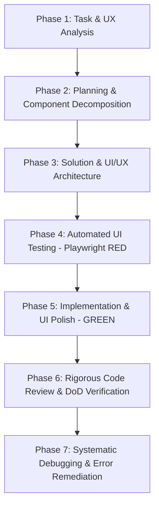

# 🎨 Enterprise Frontend Engineering Lifecycle (SmartFeed Studio)

A comprehensive, full-cycle frontend engineering skill for **SmartFeed Studio**. It orchestrates UI/UX standards, design system harmony, network efficiency, 100% bilingual localization, and resilient automated testing across the 7-phase frontend development lifecycle.

---

## 🧭 1. Orchestrated Skills & Rules Architecture

This skill synthesizes and enforces all project frontend rules and specialized skills:

```text
                               ┌────────────────────────────────┐
                               │      frontend (Lifecycle)      │
                               └───────────────┬────────────────┘
          ┌───────────────────────────┬────────┴───────────────────┬───────────────────────────┐
          ▼                           ▼                            ▼                           ▼
┌───────────────────┐       ┌───────────────────┐        ┌───────────────────┐       ┌───────────────────┐
│ UI/UX & Theming   │       │ Network & Perf    │        │ Architecture/i18n │       │ Testing & Quality │
├───────────────────┤       ├───────────────────┤        ├───────────────────┤       ├───────────────────┤
│ ui-ux-pro-max     │       │ frontend-network  │        │ 100% i18n (UA/EN) │       │ playwright-best   │
│ web-design-guides │       │ vercel-react-best │        │ shared contracts  │       │ test-driven-dev   │
│ design_system.md  │       │ useRef dedup      │        │ modularity budget │       │ condition-waiting │
│ shadcn / Tailwind │       │ lean useCallback  │        │ zero God-files    │       │ testing-anti-patt │
└───────────────────┘       └───────────────────┘        └───────────────────┘       └───────────────────┘
```

### 💎 Iron Laws of Frontend Engineering

1. **Component Modularity Budget (<250–300 lines)**: Monolithic components (500–1000+ lines) are strictly prohibited. Every screen must be decomposed into modular subcomponents (`*Dialog.tsx`, `*Header.tsx`, `*Table.tsx`, `*Row.tsx`, `*Toolbar.tsx`, `use*Hook.ts`).
2. **100% Solid Sticky Headers & Modals**: Sticky table headers (`thead.sticky.top-0`), modal headers/footers, and action bars **MUST ALWAYS use 100% solid, opaque backgrounds** (`bg-card`, `bg-muted`, `bg-background` with solid borders). Semi-transparent (`bg-*/40`, `bg-*/50`) sticky headers are strictly prohibited.
3. **Zero Off-Scheme Palette Colors**: Hardcoded palette colors (`purple-*`, `violet-*`, `fuchsia-*`, `pink-*`) are strictly prohibited. Use only semantic tokens: `primary`, `border`, `card`, `muted`, `background`, `destructive`.
4. **Zero Duplicate Action / CTA Buttons**: Never duplicate primary action buttons. If an empty state card contains a CTA (e.g. "Create Feed"), do not duplicate it in the header/toolbar simultaneously.
5. **Zero Duplicate API Requests**: Context providers and hooks must use `useRef` guards (`isFetchingRef`, `lastFetchedTokenRef`) to prevent duplicate in-flight network requests. No `React.StrictMode` double-mounting in dev.
6. **100% Bilingual Internationalization (i18n)**: Zero hardcoded strings. Every label, toast, modal, tooltip, placeholder, and HTML title (`title={t('...')}`) must exist in both `locales/uk/*.json` and `locales/en/*.json`.
7. **No Arbitrary Timeouts**: Playwright tests must use condition-based waiting (`waitForResponse`, `waitForSelector`, `expect.poll`).

---

## 🔄 2. The 7-Stage Frontend Development Workflow



---

### 🔍 Phase 1: Аналіз задачі (Task & UX Analysis)

Before writing any component or markup, analyze user journeys, layout states, and platform constraints:

1. **Target Application & Runtime**:
   - Is this Web Admin Portal (`apps/admin-portal` Next.js 14) or Desktop Client (`apps/desktop` Tauri v2)?
   - Desktop: Check if operation interacts with local SQLite/Rust commands (`isTauri()`) or remote cloud API.
2. **5 Mandatory UI States**:
   - **Loading State**: Skeleton loaders (`<Skeleton />`), not bare spinners that shift layout.
   - **Empty State**: Friendly illustration/icon, clear explanation, single centered CTA.
   - **Data State**: Clean table, grid, or list with proper pagination and sorting.
   - **Error State**: User-friendly message, retry button, localized via `getErrorMessage(err, t)`.
   - **Success / Feedback State**: Toast notifications (`toast.success()`), inline badges, optimistic updates.
3. **Bilingual Mapping (i18n)**:
   - Identify all strings: titles, subtitles, placeholders, tooltips, buttons, confirm modals, error toasts.
   - Prepare key structure in `locales/uk/` and `locales/en/`.
4. **Actor Permissions & Access**:
   - Which roles (`SUPER_ADMIN`, `ADMIN`, `USER`) can view or edit this screen?
   - Disabled states vs hidden elements based on role or license tier.

> **Gate 1 Check**: Are target app, all 5 UI states, i18n keys, and actor permissions identified?

---

### 📋 Phase 2: Планування задачі (Planning & Component Decomposition)

_Refer to [.agents/rules/plans_lifecycle.md](file:///.agents/rules/plans_lifecycle.md) and [.agents/rules/engineering_discipline_and_planning.md](file:///.agents/rules/engineering_discipline_and_planning.md)_

1. **Component Modularity Budgeting**:
   - Plan decomposition immediately. No file may exceed **250–300 lines**.
   - Standard decomposition pattern:
     ```text
     features/<feature-name>/
     ├── <Feature>View.tsx          # Main orchestrator (<200 lines)
     ├── <Feature>Header.tsx        # Title, breadcrumbs, search (<150 lines)
     ├── <Feature>Table.tsx         # Data display with solid sticky header (<250 lines)
     ├── <Feature>Row.tsx           # Individual item row & action menu (<150 lines)
     ├── <Feature>Dialog.tsx        # Create/Edit modal with form validation (<250 lines)
     ├── <Feature>EmptyState.tsx    # Dedicated empty state card (<100 lines)
     └── use<Feature>.ts            # Data fetching, useRef dedup, mutation state (<200 lines)
     ```
2. **Shared Contracts Synchronization**:
   - Ensure DTOs, response types, and enums exist in `packages/shared`.
   - Run `pnpm --filter @smartfeed/shared build`. Never declare ad-hoc inline types.
3. **Plan Artifact Creation**:
   - Create plan in `plans/active/<feature_name>.md` with component tree, test assertions, and i18n keys.
   - **Strict Rule**: Await explicit user approval before writing code.

> **Gate 2 Check**: Is the plan saved in `plans/active/`, component modularity planned (<250 lines/file), and user approval received?

---

### 🎨 Phase 3: Пошук найкращого рішення (Solution & UI/UX Architecture)

_Refer to [references/ui-ux-design-system.md](file:///references/ui-ux-design-system.md) and [.agents/rules/design_system_and_theming.md](file:///.agents/rules/design_system_and_theming.md)_

Design the UI architecture with visual excellence and performance:

1. **Design System & Semantic Tokens**:
   - Strictly use theme CSS variables: `bg-background`, `bg-card`, `text-foreground`, `text-muted-foreground`, `border-border`, `bg-primary`, `text-primary-foreground`.
   - **Zero Off-Scheme Palette Colors**: NEVER use hardcoded purple/pink/violet (`bg-purple-600`, `text-pink-500`).
2. **100% Solid Sticky Headers & Overlays**:
   - Any sticky header (`thead.sticky.top-0`, sticky toolbar, modal header/footer) MUST have a solid opaque background:
     ```tsx
     <thead className="sticky top-0 z-10 bg-card border-b border-border">
     ```
   - Never use semi-transparent `backdrop-blur` or `bg-*/50` on scrolling tables — text will show through and bleed.
3. **Zero Duplicate Action Buttons**:
   - If the page has an empty state card with a CTA button (e.g. "Add Feed"), **HIDE** the top header/toolbar CTA button until items exist.
4. **Network Deduplication Architecture (`useRef`)**:
   - In context providers and custom hooks, guard against redundant or concurrent fetches:
     ```typescript
     const isFetchingRef = useRef<boolean>(false);
     const lastTokenRef = useRef<string | null>(null);
     ```
   - Never trigger cascaded `/auth/me` on login/register (profile is already in the auth response).
   - Lean `useCallback` dependency arrays: never place `locale`, `theme`, or `isUk` in data-fetching dependency arrays.
5. **Shadcn UI Component Composition**:
   - Reuse standardized primitives: `Card`, `Button`, `Badge`, `Dialog`, `DropdownMenu`, `Table`, `Input`, `Tooltip`.
   - Always merge Tailwind classes using `cn()`.
6. **Web Interface Guidelines Compliance (`web-design-guidelines`)**:
   - **Semantic HTML First**: `<button>` for actions, `<a>`/`<Link>` for navigation (NEVER `<div onClick>`).
   - **Accessible Controls**: Icon-only buttons MUST have `aria-label`. Decorative icons MUST have `aria-hidden="true"`.
   - **Visible Focus States**: `focus-visible:ring-2 focus-visible:ring-primary` (NEVER bare `outline-none`).
   - **Forms UX**: Meaningful `name`, `type`, `autocomplete`. Clickable labels (`htmlFor`). Never block paste (`preventDefault` on paste prohibited). Focus first invalid field on error.
   - **Typography & Layout**: `tabular-nums` for numbers/counters. Truncated flex children MUST have `min-w-0` to allow truncation. Loading states use `…` (ellipsis symbol), e.g. `"Loading…"`.
   - **Animation**: Animate `opacity`/`transform` only. Respect `prefers-reduced-motion` (no `transition: all`).

> **Gate 3 Check**: Are semantic tokens verified, solid sticky headers ensured, duplicate CTAs eliminated, network dedup planned, and Web Interface Guidelines respected?

---

### 🧪 Phase 4: Написання автотесту для нового функціоналу (Playwright TDD - RED Phase)

_Refer to [references/playwright-testing.md](file:///references/playwright-testing.md) and [.agents/rules/commands.md](file:///.agents/rules/commands.md)_

> [!WARNING]
> **Zero Token Waste Policy**:
> NEVER call `browser_subagent` or `open_browser_url`. Always execute tests via direct npm scripts: `pnpm test:desktop` or `pnpm test:admin`.

1. **Playwright Test Architecture**:
   - Location: `apps/desktop/tests/` or `apps/admin-portal/tests/`.
   - Use Page Object Model (POM) and resilient `data-testid` selectors.
2. **Mandatory Test Coverage**:
   - **Render & 5 States**: Test loading skeleton, empty state card, table with data, error state.
   - **Dedicated Bilingual Test (UA ⇄ EN)**: Explicitly switch language and assert that all headings, table headers, buttons, and badges dynamically translate.
   - **Network Deduplication Assertion**: Assert that API endpoints are called strictly **1 time** on page load:
     ```typescript
     let requestCount = 0;
     page.on('request', (req) => {
       if (req.url().includes('/api/target')) requestCount++;
     });
     await page.goto('/target-page');
     expect(requestCount).toBe(1);
     ```
   - **Dialog & Form Validation**: Test invalid inputs show localized field errors; valid submission triggers success toast.
3. **Test Isolation**:
   - Clear `localStorage`, `sessionStorage`, cookies, and mock routes before/after each test.
4. **Execute & Verify RED**:
   - Run: `pnpm --filter @smartfeed/desktop test:e2e -- <feature>.spec.ts` (or admin equivalent).
   - **Verify**: The test fails with the expected failure message (element not found or missing translation).

> **Gate 4 Check**: Has the Playwright test been written and executed, and does it fail for the exact expected functional reason?

---

### 💻 Phase 5: Написання коду під тести (Implementation & UI Polish - GREEN Phase)

_Refer to [.agents/skills/shadcn/SKILL.md](file:///.agents/skills/shadcn/SKILL.md) and [.agents/skills/ui-ux-pro-max/SKILL.md](file:///.agents/skills/ui-ux-pro-max/SKILL.md)_

Implement the minimum code to turn the Playwright tests green:

1. **Decomposed Subcomponents**:
   - Write cleanly separated files matching the planned modularity budget (<250 lines).
2. **100% Internationalization Completeness**:
   - Add all translation keys to both:
     - `locales/uk/<namespace>.json`
     - `locales/en/<namespace>.json`
   - Use `const { t } = useTranslation('<namespace>')`.
   - Metric formatting: format percentages cleanly (`Math.round(percent)`), never raw floats (`33.33333333333333%`).
   - HTML title attributes: `title={t('common:edit')}`, never hardcoded English.
3. **Backend Error Translation**:
   - Map API errors using `getErrorMessage(err, t)` to guarantee no raw English server errors leak into Ukrainian UI.
4. **Web Interface Guidelines & Micro-interactions**:
   - Smooth hover transitions (`transition-colors duration-150`).
   - Accessible ARIA labels (`aria-label` on icon-only buttons, `aria-expanded`, `aria-hidden="true"` on decorative icons).
   - High contrast ratios in both light and dark themes.
   - `tabular-nums` on table numbers, flex children with `min-w-0` for truncation.
   - Never block paste (`onPaste` + `preventDefault` prohibited).
5. **Verify GREEN**:
   - Run: `pnpm test:desktop` or `pnpm test:admin`.
   - **Verify**: All tests pass cleanly.

> **Gate 5 Check**: Do all components pass Playwright tests, adhere to <250 lines, comply with Web Interface Guidelines, and have 100% translation coverage?

---

### 🔍 Phase 6: Рев'ю коду та верифікація (Rigorous Code Review & DoD Verification)

_Refer to [references/checklist.md](file:///references/checklist.md) and [.agents/rules/code_review_and_skills.md](file:///.agents/rules/code_review_and_skills.md)_

Execute the mandatory **12-Point Frontend Quality Checklist**:

| #   | Check Item                                | Verification Method                                                                       |
| --- | ----------------------------------------- | ----------------------------------------------------------------------------------------- |
| 1   | **Component Modularity (<250-300 lines)** | No God-components. Every screen decomposed into subcomponents and hooks.                  |
| 2   | **100% Solid Sticky Headers**             | `thead.sticky`, modal headers/footers use solid `bg-card`/`bg-background`. 0 text bleed.  |
| 3   | **Zero Off-Scheme Colors**                | 0 hardcoded `purple-*`, `pink-*`, `violet-*`. Strictly semantic theme tokens.             |
| 4   | **Zero Duplicate Action Buttons**         | CTA hidden from header/toolbar when empty state card provides it.                         |
| 5   | **Zero Duplicate Network Calls**          | `useRef` guards active; single-request test asserts `requestCount === 1`.                 |
| 6   | **100% Bilingual i18n**                   | All keys present in both `uk` and `en` locale dictionaries. 0 raw text strings.           |
| 7   | **Web Interface & Accessibility (A11y)**  | Icon buttons have `aria-label`; visible `focus-visible:ring-2`; `tabular-nums`; paste ok. |
| 8   | **Zero Dead Code**                        | 0 unused imports (lucide icons, hooks, types). Clean ESLint.                              |
| 9   | **Zero Silent Failures**                  | 0 empty `catch {}`. Errors surfaced via localized toasts or error banners.                |
| 10  | **Test Isolation**                        | Browser storage and state cleanly reset before and after test cases.                      |
| 11  | **Static Typecheck**                      | `tsc --noEmit` exits with **0 errors** in desktop and admin-portal packages.              |
| 12  | **Code Formatting**                       | `pnpm format` executed cleanly.                                                           |

#### Complete Feature Lifecycle:

1. Run full test suite: `pnpm test:desktop` / `pnpm test:admin`.
2. Move plan from `plans/active/<feature>.md` to `plans/completed/<feature>.md` with status `✅ Реалізовано та протестовано`.
3. Update `plans/README.md` registry.

> **Gate 6 Check**: Are all 12 checklist points verified, typechecks passing, and plans registered in `completed/`?

---

### 🛠️ Phase 7: Виправлення помилок (Systematic Debugging & Error Remediation)

_Refer to [.agents/skills/systematic-debugging/SKILL.md](file:///.agents/skills/systematic-debugging/SKILL.md) and [.agents/skills/root-cause-tracing/SKILL.md](file:///.agents/skills/root-cause-tracing/SKILL.md)_

When any Playwright test fails, layout breaks, or UI exception occurs:

```text
NO FIXES WITHOUT ROOT CAUSE INVESTIGATION FIRST
```

#### The 4-Phase Frontend Debugging Process:

1. **Root Cause Investigation**:
   - Inspect browser console logs and Playwright trace viewer.
   - Differentiate: Is it a CSS stacking issue (`z-index`), React re-render loop, stale closure in `useEffect`, or network failure?
   - Trace state mutation backward to where bad state originates.
2. **Pattern Analysis**:
   - Compare with stable working components in `apps/desktop/src/pages/` or `apps/admin-portal/src/`.
3. **Hypothesis & Minimal Test**:
   - Formulate hypothesis: _"I think the table overflows because parent container lacks min-w-0."_
   - Test with smallest possible CSS or state change.
4. **Implementation & Verification**:
   - Fix at root cause.
   - Verify Playwright test passes consistently (at least 3 consecutive runs).

#### 🚨 Circuit Breaker (3-Fix Rule):

- If **3 or more fixes fail**: STOP.
- Signals architectural flaw (excessive component coupling or improper state hoisting).
- Refactor state management or component boundaries with user alignment.

---

## 📚 Bundled References

- [references/checklist.md](file:///references/checklist.md) — Pre-commit Frontend & UI/UX Checklist.
- [references/ui-ux-design-system.md](file:///references/ui-ux-design-system.md) — Semantic tokens, solid headers, zero duplicate CTAs, and modularity.
- [references/playwright-testing.md](file:///references/playwright-testing.md) — Playwright POM, bilingual testing, and network deduplication tests.
- [../web-design-guidelines/SKILL.md](file:///.agents/skills/web-design-guidelines/SKILL.md) — Vercel Web Interface Guidelines audit and compliance.
