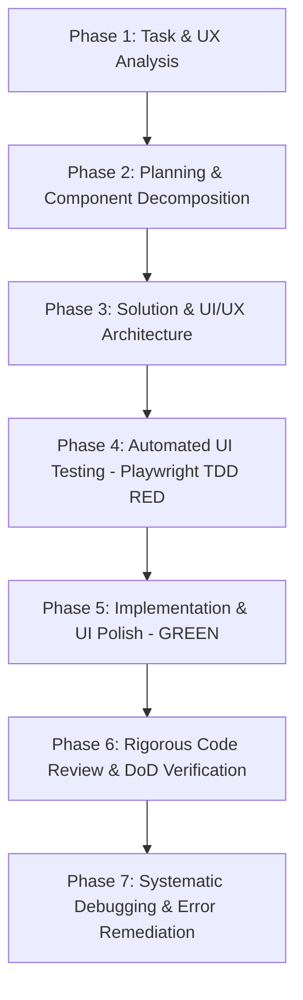

# 🎨 Enterprise Frontend Engineering Lifecycle (SmartFeed Studio)

A comprehensive, full-cycle frontend engineering **master skill** for SmartFeed Studio. It consolidates ALL frontend-related specialized skills, project rules, design systems, planning methodology, and review protocols.

---

## 🧭 1. Consolidated Skills Architecture

This master skill synthesizes and enforces ALL project frontend skills and rules:

```text
                               ┌────────────────────────────────────┐
                               │       frontend (Master Skill)      │
                               └───────────────┬────────────────────┘
     ┌──────────────┬──────────────┬───────────┴────────┬────────────────┬────────────────┐
     ▼              ▼              ▼                     ▼                ▼                ▼
┌──────────┐ ┌──────────┐ ┌──────────────┐     ┌──────────────┐ ┌──────────────┐ ┌──────────────┐
│Design &  │ │Perf &    │ │Architecture  │     │Planning &    │ │Testing &     │ │Review &      │
│Visual    │ │Network   │ │& i18n        │     │Execution     │ │Quality       │ │Feedback      │
├──────────┤ ├──────────┤ ├──────────────┤     ├──────────────┤ ├──────────────┤ ├──────────────┤
│ui-ux-    │ │vercel-   │ │100% i18n     │     │writing-plans │ │playwright-   │ │requesting-   │
│pro-max   │ │react-bp  │ │shared cntrct │     │executing-    │ │best-pract    │ │code-review   │
│beautiful-│ │frontend- │ │modularity    │     │plans         │ │test-driven   │ │code-review-  │
│desing    │ │network   │ │zero God-files│     │subagent-     │ │testing-anti  │ │reception     │
│frontend- │ │useRef    │ │rules.md      │     │driven-dev    │ │condition-    │ │verification- │
│design    │ │dedup     │ │eng-disc.md   │     │dispatching-  │ │based-waiting │ │before-compl  │
│design-   │ │lean deps │ │design_sys.md │     │parallel-agts │ │systematic-   │ │fullstack-    │
│taste-fe  │ │no StrictM│ │network-dedup │     │              │ │debugging     │ │code-review   │
│shadcn    │ │          │ │              │     │              │ │root-cause    │ │              │
│modern-   │ │          │ │              │     │              │ │tracing       │ │              │
│web-guide │ │          │ │              │     │              │ │              │ │              │
│web-desig-│ │          │ │              │     │              │ │              │ │              │
│guidelines│ │          │ │              │     │              │ │              │ │              │
│integrate-│ │          │ │              │     │              │ │              │ │              │
│backend   │ │          │ │              │     │              │ │              │ │              │
└──────────┘ └──────────┘ └──────────────┘     └──────────────┘ └──────────────┘ └──────────────┘
```

### 💎 Iron Laws of Frontend Engineering

1. **Component Modularity Budget (<250–300 lines)**: Monolithic components (500–1000+ lines) are strictly prohibited. Decompose into `*View.tsx`, `*Header.tsx`, `*Table.tsx`, `*Row.tsx`, `*Dialog.tsx`, `*EmptyState.tsx`, `use*.ts`.
2. **100% Solid Sticky Headers & Modals**: Sticky headers, modal headers/footers **MUST** use `bg-card`, `bg-muted`, `bg-background` — never semi-transparent `bg-*/40`, `bg-*/50`.
3. **Zero Off-Scheme Palette Colors**: NEVER `purple-*`, `violet-*`, `fuchsia-*`, `pink-*`. Only semantic tokens: `primary`, `border`, `card`, `muted`, `background`, `destructive`.
4. **Zero Duplicate Action / CTA Buttons**: Empty state CTA = hidden header CTA. Never both simultaneously.
5. **Zero Duplicate API Requests**: `useRef` guards (`isFetchingRef`, `lastFetchedTokenRef`). No `React.StrictMode` double-mounting.
6. **100% Bilingual Internationalization (i18n)**: Zero hardcoded strings. All labels, toasts, modals, tooltips, placeholders, HTML titles (`title={t('...')}`) in both `locales/uk/*.json` and `locales/en/*.json`.
7. **No Arbitrary Timeouts**: Playwright tests use condition-based waiting (`waitForResponse`, `waitForSelector`, `expect.poll`).
8. **Architecture > Speed**: Correct modular design from day one. "Working" is not enough.

---

## 🔌 2. MCP Research Tools — Use During Development

Бери ці інструменти **проактивно** під час написання коду — не чекай запиту від користувача.

### 📚 context7 — Документація бібліотек

Використовуй для отримання **актуальної документації** будь-якої бібліотеки перед написанням коду:

```
# Крок 1: Знайти ID бібліотеки
call_mcp_tool(ServerName: "context7", ToolName: "resolve-library-id",
  Arguments: { libraryName: "shadcn/ui" })

# Крок 2: Отримати документацію
call_mcp_tool(ServerName: "context7", ToolName: "query-docs",
  Arguments: { context7CompatibleLibraryID: "/shadcn-ui/ui",
               topic: "Dialog component props" })
```

**Коли використовувати**:

- Перед використанням нового shadcn компонента → документація API і props
- Next.js 14 App Router patterns → актуальні server/client component правила
- Tailwind CSS v3/v4 → нові утиліти та синтаксис
- React 18/19 нові хуки (`useTransition`, `use`, `useOptimistic`)
- `i18next`, `react-i18next` → namespace та interpolation синтаксис
- Tauri v2 API → Rust command signatures та JS bindings

### 🔥 firecrawl — Пошук & Аналіз Сайтів

Використовуй для **пошуку best practices**, аналізу конкурентів, дослідження UI patterns:

```
# Пошук документації / best practices
call_mcp_tool(ServerName: "firecrawl", ToolName: "firecrawl_search",
  Arguments: { query: "Next.js 14 sticky table header with solid background",
               limit: 5 })

# Скрапінг конкретної сторінки документації
call_mcp_tool(ServerName: "firecrawl", ToolName: "firecrawl_scrape",
  Arguments: { url: "https://ui.shadcn.com/docs/components/dialog" })

# Дослідження UI патернів
call_mcp_tool(ServerName: "firecrawl", ToolName: "firecrawl_search",
  Arguments: { query: "React data table empty state UX patterns 2024" })
```

**Коли використовувати**:

- Пошук оптимального CSS pattern для складного layout
- Дослідження UX best practices для специфічного компонента
- Аналіз офіційної документації (Vercel, shadcn, Tailwind)
- Пошук вирішення нестандартних Playwright проблем
- Дослідження accessibility patterns (WCAG, ARIA)

### 🎭 playwright MCP — Браузерна Інспекція

**ЗАМІСТЬ** `browser_subagent` (який завжди падає на macOS ARM64) використовуй:

```
# Навігація на сторінку
call_mcp_tool(ServerName: "playwright", ToolName: "browser_navigate",
  Arguments: { url: "http://localhost:3000/dashboard" })

# Скриншот для візуальної перевірки
call_mcp_tool(ServerName: "playwright", ToolName: "browser_take_screenshot",
  Arguments: {})

# DOM snapshot для інспекції структури
call_mcp_tool(ServerName: "playwright", ToolName: "browser_snapshot",
  Arguments: {})

# Клік по елементу
call_mcp_tool(ServerName: "playwright", ToolName: "browser_click",
  Arguments: { selector: "[data-testid='create-btn']" })

# Заповнення форми
call_mcp_tool(ServerName: "playwright", ToolName: "browser_fill_form",
  Arguments: { fields: { "[name='email']": "test@test.com" } })
```

**Коли використовувати**:

- Візуальна перевірка UI після змін (скриншот + порівняння)
- Інспекція DOM для дебагу selector issues
- Перевірка що sticky header справді solid (не transparent)
- Верифікація що переклади відображаються правильно
- Тестування responsive поведінки
- Логін та навігація для перевірки auth flows

---

## 🎨 3. Design System & Visual Excellence

_Read [references/ui-ux-design-system.md](references/ui-ux-design-system.md) for full design token reference._

### Anti-Templated Design Philosophy (`design-taste-frontend`, `beautiful-desing`, `frontend-design`)

Before writing a single component, determine the **design direction**:

- What visual identity does this screen need? (Data-dense admin? Marketing landing? Onboarding wizard?)
- What typography conveys the right tone? (Inter for admin; display fonts for landing pages)
- Is this a redesign (audit-first) or greenfield (direction-first)?

### Key Design Principles

1. **Editorial Quality**: High-contrast hierarchy. No gray soup. Every element either signals something important or is removed.
2. **Typography First**: Use `Inter` (admin/data), `Outfit` (onboarding), `DM Mono` (code). Never browser defaults.
3. **Semantic Color Tokens Only**: `bg-background`, `bg-card`, `text-foreground`, `text-muted-foreground`, `border-border`, `bg-primary`, `text-primary-foreground`.
4. **Micro-interactions**: Animate `opacity`/`transform` only. Smooth hover transitions (`transition-colors duration-150`). Respect `prefers-reduced-motion`.
5. **Shadcn/ui Composition**: Reuse `Card`, `Button`, `Badge`, `Dialog`, `DropdownMenu`, `Table`, `Input`, `Tooltip`. Always merge classes via `cn()`.
6. **Modern Web APIs** (`modern-web-guidance`): Before using a polyfill or library, check if native browser API exists. Use `:has()`, `container queries`, `@layer`, `text-wrap: balance` where available.

---

## 🔄 4. The 7-Stage Frontend Development Workflow



---

### 🔍 Phase 1: Task & UX Analysis

> 💡 **MCP at this phase**: Use `firecrawl_search` to research UI patterns for this feature type before designing.

Before writing any component, analyze user journeys, layout states, and platform constraints:

1. **Target Application & Runtime**:
   - Web Admin Portal (`apps/admin-portal` Next.js 14) or Desktop (`apps/desktop` Tauri v2)?
   - Desktop: Does it interact with local SQLite/Rust commands (`isTauri()`) or remote cloud API?
2. **5 Mandatory UI States**:
   - **Loading**: Skeleton loaders (`<Skeleton />`), not bare spinners.
   - **Empty**: Friendly icon, clear explanation, single centered CTA.
   - **Data**: Clean table/grid/list with pagination and sorting.
   - **Error**: Localized message via `getErrorMessage(err, t)`, retry button.
   - **Success**: Toast (`toast.success()`), inline badges, optimistic updates.
3. **Bilingual Mapping (i18n)**: Identify ALL strings — titles, subtitles, placeholders, tooltips, buttons, confirm modals, error toasts. Prepare key structure in both locales.
4. **Actor Permissions**: Which roles (`SUPER_ADMIN`, `ADMIN`, `USER`) can view/edit? Disabled vs hidden based on role or license tier.
5. **Design Direction** (`design-taste-frontend`): Audit existing screens first on redesigns. Determine visual identity before writing markup.
6. **Modern Web Guidance**: Check `modern-web-guidance` for relevant modern CSS/JS APIs before reaching for libraries.

> **Gate 1**: Target app, all 5 UI states, i18n keys, actor permissions, and design direction identified?

---

### 📋 Phase 2: Planning & Component Decomposition

> 💡 **MCP at this phase**: Use `context7` to verify latest shadcn/Next.js/Tailwind API before planning component structure.

_Rules: [plans_lifecycle.md](../../rules/plans_lifecycle.md) · [engineering_discipline_and_planning.md](../../rules/engineering_discipline_and_planning.md)_
_Skills: [writing-plans](../writing-plans/SKILL.md) · [executing-plans](../executing-plans/SKILL.md) · [dispatching-parallel-agents](../dispatching-parallel-agents/SKILL.md) · [subagent-driven-development](../subagent-driven-development/SKILL.md)_

1. **Component Modularity Budgeting**: Plan decomposition immediately. No file > **250–300 lines**.
   ```text
   features/<feature-name>/
   ├── <Feature>View.tsx          # Main orchestrator (<200 lines)
   ├── <Feature>Header.tsx        # Title, breadcrumbs, search (<150 lines)
   ├── <Feature>Table.tsx         # Data display with solid sticky header (<250 lines)
   ├── <Feature>Row.tsx           # Individual item row & action menu (<150 lines)
   ├── <Feature>Dialog.tsx        # Create/Edit modal with form validation (<250 lines)
   ├── <Feature>EmptyState.tsx    # Dedicated empty state card (<100 lines)
   └── use<Feature>.ts            # Data fetching, useRef dedup, mutation state (<200 lines)
   ```
2. **Shared Contracts**: Ensure DTOs, response types, and enums exist in `packages/shared`. Run `pnpm build:shared`. Never declare ad-hoc inline types.
3. **Execution Strategy**: For complex features, use `subagent-driven-development` (one subagent per task) or `dispatching-parallel-agents` (independent parallel tasks).
4. **Plan Artifact**: Create `plans/active/<feature_name>.md` with component tree, test assertions, and i18n keys. **Await explicit user approval before coding.**

> **Gate 2**: Plan in `plans/active/`, modularity planned, shared contracts built, user approval received?

---

### 🎨 Phase 3: Solution & UI/UX Architecture

> 💡 **MCP at this phase**: Use `context7` for shadcn component API docs. Use `firecrawl_search` for accessibility pattern research. Use `playwright` MCP to inspect existing UI for reference.

_Read [references/ui-ux-design-system.md](references/ui-ux-design-system.md) · Rules: [design_system_and_theming.md](../../rules/design_system_and_theming.md)_

1. **Design System & Semantic Tokens**: Only `bg-background`, `bg-card`, `text-foreground`, `text-muted-foreground`, `border-border`, `bg-primary`. **NEVER** hardcoded palette colors.
2. **100% Solid Sticky Headers**: `thead.sticky.top-0` and modal headers MUST have solid opaque bg:
   ```tsx
   <thead className="sticky top-0 z-10 bg-card border-b border-border">
   ```
3. **Zero Duplicate Action Buttons**: Hide header/toolbar CTA when empty state card provides it.
4. **Network Deduplication (`integrate-backend` + `vercel-react-best-practices`)**:
   ```typescript
   const isFetchingRef = useRef<boolean>(false);
   const lastTokenRef = useRef<string | null>(null);
   ```
   - Never cascade `/auth/me` on login/register (profile already in auth response).
   - Lean `useCallback` deps: never put `locale`, `theme`, `isUk` in data-fetching deps.
5. **Shadcn Composition**: `Card`, `Button`, `Badge`, `Dialog`, `DropdownMenu`, `Table`, `Input`, `Tooltip`. Always `cn()` for class merging.
6. **Web Interface Guidelines (`web-design-guidelines`)**:
   - `<button>` for actions, `<a>/<Link>` for navigation (NEVER `<div onClick>`).
   - Icon-only buttons: `aria-label`. Decorative icons: `aria-hidden="true"`.
   - Visible focus: `focus-visible:ring-2 focus-visible:ring-primary` (NEVER bare `outline-none`).
   - Forms: `name`, `type`, `autocomplete`. Clickable labels (`htmlFor`). Never block paste.
   - `tabular-nums` for numbers/counters. Flex children with `min-w-0` for truncation.

> **Gate 3**: Semantic tokens, solid sticky headers, zero duplicate CTAs, network dedup, Web Guidelines respected?

---

### 🧪 Phase 4: Playwright TDD — RED Phase

_Read [references/playwright-testing.md](references/playwright-testing.md) · Skill: [playwright-best-practices](../playwright-best-practices/SKILL.md)_

> [!WARNING]
> **NEVER** call `browser_subagent` or `open_browser_url`. Always use:
> `pnpm test:desktop` / `pnpm test:admin` (or headed/UI variants)

1. **Playwright Architecture**: POM + resilient `data-testid` selectors. Location: `apps/desktop/tests/` or `apps/admin-portal/tests/`.
2. **Mandatory Coverage**:
   - **5 UI States**: Loading skeleton, empty state, data table, error state, success feedback.
   - **Bilingual Test (UA⇄EN)**: Switch language, assert all headings/buttons/badges translate.
   - **Network Dedup Assertion**: Each API endpoint called exactly **1 time** on page load.
   - **Dialog & Form Validation**: Invalid inputs → localized errors; valid submission → success toast.
3. **Test Isolation**: Clear `localStorage`, `sessionStorage`, cookies, and route mocks before/after each test.
4. **Condition-Based Waiting**: `waitForResponse`, `waitForSelector`, `expect.poll` — never `sleep()`.
5. **Execute RED**: `pnpm test:desktop -- <feature>.spec.ts`. Verify test fails for the **expected functional reason**.

> **Gate 4**: Playwright test written, executed, failing for the exact expected functional reason?

---

### 💻 Phase 5: Implementation & UI Polish — GREEN Phase

> 💡 **MCP at this phase**: Use `playwright` MCP (`browser_take_screenshot`, `browser_snapshot`) to visually verify UI after implementation before running full test suite.

_Skills: [shadcn](../shadcn/SKILL.md) · [ui-ux-pro-max](../ui-ux-pro-max/SKILL.md) · [beautiful-desing](../beautiful-desing/SKILL.md)_

1. **Decomposed Subcomponents**: Each file within modularity budget (<250 lines).
2. **100% i18n Completeness**: Keys in both `locales/uk/<ns>.json` and `locales/en/<ns>.json`. Use `const { t } = useTranslation('<namespace>')`. Format percentages cleanly (`Math.round(percent)`). HTML titles: `title={t('common:edit')}`.
3. **Backend Error Translation**: `getErrorMessage(err, t)` — no raw English server errors in Ukrainian UI.
4. **Web Interface Guidelines & Micro-interactions**:
   - Hover transitions (`transition-colors duration-150`), ARIA labels, high contrast.
   - `tabular-nums`, `min-w-0` on flex children. Never block paste.
5. **Visual Polish** (`beautiful-desing`): Editorial hierarchy, smooth animations on `opacity`/`transform`, premium feel without generic templates.
6. **Verify GREEN**: `pnpm test:desktop` / `pnpm test:admin` — all tests pass cleanly.

> **Gate 5**: All components pass Playwright tests, <250 lines, Web Guidelines compliant, 100% i18n?

---

### 🔍 Phase 6: Code Review & DoD Verification

_Read [references/checklist.md](references/checklist.md) · Skills: [requesting-code-review](../requesting-code-review/SKILL.md) · [code-review-reception](../code-review-reception/SKILL.md) · [verification-before-completion](../verification-before-completion/SKILL.md)_

**Step 1 — Dispatch Self-Review** (`requesting-code-review`): Before claiming complete, dispatch a review subagent against the implementation.

**Step 2 — 12-Point Frontend Quality Checklist**:

| #   | Check Item                                | Verification Method                                                 |
| --- | ----------------------------------------- | ------------------------------------------------------------------- |
| 1   | **Component Modularity (<250-300 lines)** | No God-components. Every screen decomposed.                         |
| 2   | **100% Solid Sticky Headers**             | `thead.sticky` + solid `bg-card`/`bg-background`. 0 text bleed.     |
| 3   | **Zero Off-Scheme Colors**                | 0 hardcoded `purple-*`, `pink-*`, `violet-*`.                       |
| 4   | **Zero Duplicate Action Buttons**         | CTA hidden from header when empty state provides it.                |
| 5   | **Zero Duplicate Network Calls**          | `useRef` guards active; `requestCount === 1` asserted.              |
| 6   | **100% Bilingual i18n**                   | All keys in both `uk` and `en` locale files. 0 raw strings.         |
| 7   | **Web Interface & A11y**                  | `aria-label` on icon buttons; `focus-visible:ring-2`; paste ok.     |
| 8   | **Zero Dead Code**                        | 0 unused imports (lucide, hooks, types). Clean ESLint.              |
| 9   | **Zero Silent Failures**                  | 0 empty `catch {}`. Errors via localized toasts or banners.         |
| 10  | **Test Isolation**                        | Browser storage reset before/after each test.                       |
| 11  | **Static Typecheck**                      | `tsc --noEmit` exits with **0 errors** in desktop and admin-portal. |
| 12  | **Code Formatting**                       | `pnpm format` executed cleanly.                                     |

**Step 3 — Receive Review Feedback** (`code-review-reception`): Evaluate each finding with technical rigor. Verify every fix individually. Never implement blindly.

**Step 4 — Lifecycle Close**:

1. Move `plans/active/<feature>.md` → `plans/completed/<feature>.md` with `✅ Реалізовано та протестовано`.
2. Update `plans/README.md` registry.

> **Gate 6**: All 12 checks verified, typechecks passing, plans registered in `completed/`?

---

### 🛠️ Phase 7: Systematic Debugging & Error Remediation

_Skills: [systematic-debugging](../systematic-debugging/SKILL.md) · [root-cause-tracing](../root-cause-tracing/SKILL.md)_

```text
NO FIXES WITHOUT ROOT CAUSE INVESTIGATION FIRST
```

**4-Phase Debugging Process**:

1. **Root Cause**: Inspect browser console + Playwright trace. CSS stacking, React re-render loop, stale closure, or network failure?
2. **Pattern Analysis**: Compare with stable working components in `apps/desktop/src/pages/` or `apps/admin-portal/src/`.
3. **Hypothesis & Minimal Test**: _"I think X fails because Y."_ Test smallest possible change.
4. **Implementation & Verification**: Fix at root cause. Verify Playwright passes ≥3 consecutive runs.

**🚨 Circuit Breaker (3-Fix Rule)**: If 3+ fixes fail → STOP. Signals architectural flaw. Refactor with user alignment.

---

## 📚 Bundled References

| File                                                                   | Purpose                                                      |
| ---------------------------------------------------------------------- | ------------------------------------------------------------ |
| [references/checklist.md](references/checklist.md)                     | Pre-commit Frontend & UI/UX Checklist                        |
| [references/ui-ux-design-system.md](references/ui-ux-design-system.md) | Semantic tokens, solid headers, modularity                   |
| [references/playwright-testing.md](references/playwright-testing.md)   | POM, bilingual tests, network dedup assertions               |
| [references/design-patterns.md](references/design-patterns.md)         | Anti-templated design, editorial hierarchy, micro-animations |

**Related Project Rules** (always active):

- [design_system_and_theming.md](../../rules/design_system_and_theming.md) — 100% theme harmony
- [frontend_network_dedup.md](../../rules/frontend_network_dedup.md) — Zero duplicate API calls
- [engineering_discipline_and_planning.md](../../rules/engineering_discipline_and_planning.md) — Architecture > Speed
- [plans_lifecycle.md](../../rules/plans_lifecycle.md) — Plans lifecycle management
- [testing_and_quality.md](../../rules/testing_and_quality.md) — i18n testing, teardown policy
