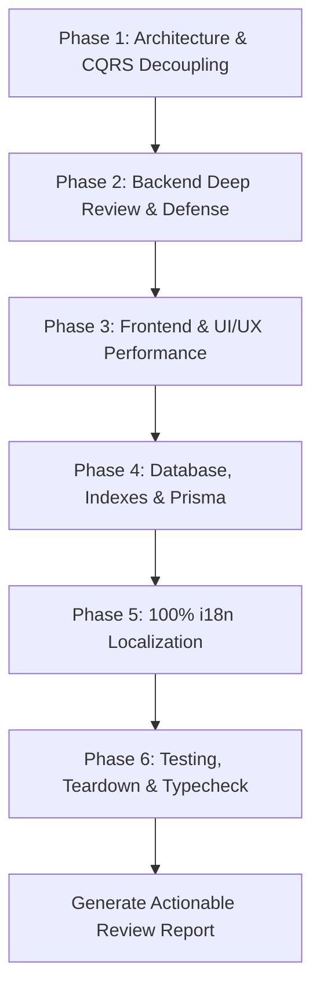

# 🕵️ Full-Stack Code Review Engine (SmartFeed Studio)

An elite, multi-layer code review skill for **SmartFeed Studio** monorepo that inspects and enforces best practices across backend, frontend, database, shared contracts, and automated tests.

---

## 🧭 1. Orchestrated Skills Matrix

This skill orchestrates and systematically cross-references the project's specialized skill library:

```text
                                 ┌──────────────────────────────┐
                                 │   fullstack-code-review      │
                                 └──────────────┬───────────────┘
                     ┌──────────────────────────┼──────────────────────────┐
                     ▼                          ▼                          ▼
        ┌─────────────────────────┐┌─────────────────────────┐┌─────────────────────────┐
        │  Backend & CQRS Layer   ││ Frontend & UI/UX Layer  ││ Database & Data Layer   │
        ├─────────────────────────┤├─────────────────────────┤├─────────────────────────┤
        │ nestjs-best-practices   ││ vercel-react-best-pract ││ supabase-postgres-best  │
        │ backend-development     ││ ui-ux-pro-max           ││ prisma-postgres         │
        │ defense-in-depth-valid  ││ shadcn                  ││ prisma-client-api       │
        │ sentry-backend-bugs     ││ frontend-design         ││ prisma-cli              │
        │ subscription-lifecycle  ││ integrate-backend       ││ postgres_skills.md      │
        └─────────────────────────┘└─────────────────────────┘└─────────────────────────┘
                     │                          │                          │
                     └──────────────────────────┼──────────────────────────┘
                                                ▼
                                   ┌─────────────────────────┐
                                   │ Testing, QA & Security  │
                                   ├─────────────────────────┤
                                   │ playwright-best-pract   │
                                   │ test-driven-development │
                                   │ testing-anti-patterns   │
                                   │ condition-based-waiting │
                                   │ verification-before-com │
                                   └─────────────────────────┘
```

---

## 🔍 2. Review Protocol & Execution Workflow

> [!WARNING]
> **STRICT READ-ONLY & ZERO DATA DELETION POLICY**:
> When acting under this skill, you are operating in a **review-only** capacity. You **MUST NOT** delete any data, configuration, or code unless explicitly instructed by the user to apply fixes. Your primary role is to verify, analyze, and report.

When reviewing code (diffs, pull requests, modified files, or new features), execute the review across **6 Systematic Phases**:



---

## 🏛 3. Phase-by-Phase Review Criteria

### ⚙️ Phase 1: Architecture & CQRS Decoupling

_Refer to [references/backend-review-matrix.md](file:///.agents/skills/fullstack-code-review/references/backend-review-matrix.md)_

1. **Strict CQRS Boundaries**:
   - `UsersModule` contains **ONLY** database operations via Prisma. Never import JWT, tokens, Passport, or auth controllers into `UsersModule`.
   - `AuthModule` communicates with `UsersModule` **strictly** via `CommandBus` (`CreateUserCommand`) and `QueryBus` (`GetUserByEmailQuery`, `GetUserByIdQuery`).
   - `LicensesModule` listens to `UserCreatedEvent` on `EventBus` to auto-provision default licenses.
   - `StorageModule` generates S3 Presigned URLs using `@aws-sdk/s3-request-presigner`. Heavy uploads must never pass through NestJS server memory.
2. **Shared Contracts Single Source of Truth (`packages/shared`)**:
   - Shared DTOs, Zod schemas, CQRS interfaces, and enums must reside in `@smartfeed/shared`.
   - Verify `pnpm build:shared` compiles cleanly.

---

### 🛡️ Phase 2: Backend Deep Review & 4-Layer Defense

_Refer to [references/backend-review-matrix.md](file:///.agents/skills/fullstack-code-review/references/backend-review-matrix.md)_

1. **4-Layer Defense-in-Depth Validation**:
   - **Layer 1 (DTO/Zod/Pipes)**: `ValidationPipe({ whitelist: true, forbidNonWhitelisted: true })` or Zod parse on API inputs.
   - **Layer 2 (Domain/Quota Validation)**: Explicit business logic checks (e.g. `isSupplierLimitReached`, `ONLY_OWNER_CAN_CHANGE_PLAN`).
   - **Layer 3 (Guards & Auth)**: `@UseGuards(JwtAuthGuard, RequireActiveLicenseGuard, RolesGuard)`.
   - **Layer 4 (Database Constraints)**: Foreign keys with `ON DELETE CASCADE/RESTRICT`, unique constraints, atomic transactions.
2. **Sentry Backend Bug Prevention**:
   - **Zero Unhandled Rejections**: Wrap async handlers in try/catch or ensure `GlobalHttpExceptionFilter` catches domain exceptions.
   - **No Stream Leaks**: XML/CSV streaming parsers (e.g. `saxy`, `csv-parse`) must properly close file descriptors and abort on error.
   - **Short Transactions**: Never wrap external HTTP calls (S3, Mailpit, Stripe/WayForPay) inside `$transaction()`.

---

### 💻 Phase 3: Frontend & UI/UX Performance

_Refer to [references/frontend-review-matrix.md](file:///.agents/skills/fullstack-code-review/references/frontend-review-matrix.md)_

1. **Zero-Duplicate Network Calls & `useRef` Guarding**:
   - No `React.StrictMode` double mounting in development (`next.config.mjs: reactStrictMode: false`, omit `React.StrictMode` from desktop `main.tsx`).
   - Context providers and hooks must use `isFetchingRef` and `lastFetchedTokenRef` to guard against duplicate parallel fetches.
   - Never place UI-only state (`theme`, `language`, `isUk`) inside data-fetching `useCallback` dependency arrays.
   - No cascaded `/auth/me` on login/register (user profile is already in the auth response).
2. **Component Modularity & Single Responsibility**:
   - React components must stay compact (recommended max ~250–300 lines). Monolithic components (700–1000+ lines) are strictly prohibited.
   - Decompose into dedicated subcomponents (`*Dialog.tsx`, `*List.tsx`, `*Row.tsx`, `*Toolbar.tsx`, custom hooks).
3. **100% Solid Sticky Headers & Dialogs**:
   - Sticky table headers (`thead.sticky.top-0`), modal headers/footers, and action bars **MUST ALWAYS have 100% solid, opaque backgrounds** (`bg-card`, `bg-muted`, `bg-background` with `z-10` and solid borders). Semi-transparent (`bg-*/40`, `bg-*/50`) sticky headers are **strictly prohibited** to prevent text overlap during scrolling.
4. **Zero Dead Code & Unused Imports**:
   - Eliminate all unreferenced imports (from `lucide-react`, DTOs, React hooks), unused variables, types, and unreachable branches.

---

### 🐘 Phase 4: Database, Indexes & Prisma

_Refer to [references/database-review-matrix.md](file:///.agents/skills/fullstack-code-review/references/database-review-matrix.md)_

1. **100% Foreign Key Indexes**:
   - Every FK column in `schema.prisma` must have an explicit `@@index([fkColumn])` (PostgreSQL does not auto-index FKs).
2. **Snake_Case & Timestamptz**:
   - All models use `@@map("snake_case")` and columns use `@map("column_name")`.
   - All timestamp fields are `DateTime` mapped to `timestamptz` (timezone-aware).
3. **High-Performance Query Patterns**:
   - No `OFFSET` pagination on large catalogs; use cursor-based pagination (`WHERE createdAt < cursor LIMIT N`).
   - Zero N+1 queries (use `findMany({ where: { id: { in: ids } } })` or `include`).
   - GIN indexes with `gin_trgm_ops` for `ILIKE '%term%'` text searches on users/products.
   - Connection pooling active via `@prisma/adapter-pg` with `pg.Pool`.

---

### 🌐 Phase 5: 100% i18n Localization & Zero Untranslated Keys

_Refer to [references/frontend-review-matrix.md](file:///.agents/skills/fullstack-code-review/references/frontend-review-matrix.md)_

1. **Zero Hardcoded Strings in UI**:
   - All buttons, labels, titles, descriptions, placeholders, toasts, tooltips, dialogs, and HTML titles (`title={t('...')}`) must use `t('namespace:key')` or `t('key')`.
   - No raw English fallback strings leaking into Ukrainian UI.
2. **Dictionary Completeness Verification**:
   - Verify that every key called in code exists in both `locales/uk/*.json` and `locales/en/*.json`.
   - Verify proper metric percentage formatting (`Math.round(percent)` or `Number(percent.toFixed(1))`), never rendering raw floating point numbers (`33.33333333333333%`).
3. **Backend Error Localization**:
   - API error responses must be translated via `getErrorMessage` or localized error helpers.

---

### 🧪 Phase 6: Testing, Teardown & Quality Verification

_Refer to [references/testing-review-matrix.md](file:///.agents/skills/fullstack-code-review/references/testing-review-matrix.md)_

1. **Zero Test Data Leftovers (Teardown Policy)**:
   - All backend Jest E2E tests (`*.e2e-spec.ts`) must use centralized `cleanDatabase` in both `beforeAll` and `afterAll`.
   - Teardown follows FK-safe hierarchy: `Snapshot`/`ProductImage` → `OrganizationInvitation` → `OrganizationMember` → `License` → `Organization` → `User` → `TariffPlan`/`NavigationItem`.
   - Frontend Playwright tests (`*.spec.ts`) must clear `localStorage`, `sessionStorage`, cookies, and route mocks before/after each test.
2. **Dedicated UI Localization Tests**:
   - Every view must include Playwright tests asserting dynamic translation UA ⇄ EN.
3. **Static Typecheck & Compilation**:
   - Backend API: `pnpm --filter @smartfeed/backend-api exec tsc --noEmit`
   - Shared contracts: `pnpm --filter @smartfeed/shared build`
   - Desktop App: `pnpm --filter @smartfeed/desktop exec tsc --noEmit`
   - Admin Web Portal: `pnpm --filter admin-portal exec tsc --noEmit`
   - Must compile with **exit code 0** and **zero type errors**.
4. **Auto-Formatting**:
   - Run `pnpm format` (Prettier) across all modified files.

---

## 📋 4. Review Report Format

Always output review results using the standardized template in [references/review-output-template.md](file:///.agents/skills/fullstack-code-review/references/review-output-template.md):

```markdown
# 🔍 Full-Stack Code Review Report

## 📊 Summary & Score

- **Overall Status**: ✅ APPROVED / ⚠️ CHANGES REQUIRED / 🚨 BLOCKED
- **Backend Quality**: ⭐⭐⭐⭐⭐ (5/5)
- **Frontend & UI/UX**: ⭐⭐⭐⭐⭐ (5/5)
- **Database & Performance**: ⭐⭐⭐⭐⭐ (5/5)
- **i18n & Localization**: ⭐⭐⭐⭐⭐ (5/5)
- **Testing & Isolation**: ⭐⭐⭐⭐⭐ (5/5)

---

## 🚨 Critical Issues (Must Fix Immediately)

_(Items that break architecture, security, data integrity, or cause runtime errors)_

## ⚠️ Warnings & Improvements (Recommended)

_(Performance optimizations, modularity, missing edge cases, micro-interactions)_

## ✅ Strengths & Best Practices Applied

_(Good architectural decisions, clean patterns, solid test coverage)_

---

## 🛠 Actionable Fixes & Code Diffs
```
