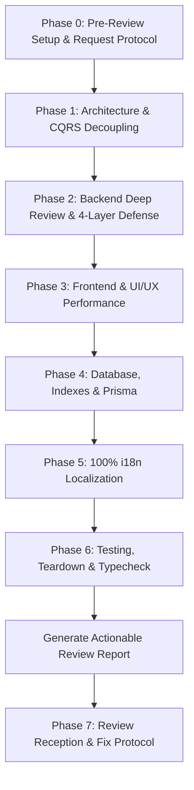

# 🕵️ Full-Stack Code Review Engine (SmartFeed Studio)

An elite, multi-layer code review master skill for **SmartFeed Studio** monorepo that consolidates ALL review-related skills and enforces ALL project rules across backend, frontend, database, shared contracts, and automated tests.

---

## 🧭 1. Consolidated Skills Matrix

```text
                                 ┌──────────────────────────────────┐
                                 │  fullstack-code-review (Master)  │
                                 └──────────────┬───────────────────┘
          ┌────────────────┬──────────────────┬─┴──────────────┬────────────────┬────────────────┐
          ▼                ▼                  ▼                ▼                ▼                ▼
┌──────────────┐ ┌──────────────┐ ┌──────────────┐ ┌──────────────┐ ┌──────────────┐ ┌──────────────┐
│Backend &     │ │Frontend &    │ │Database &    │ │Testing & QA  │ │Security &    │ │Review        │
│CQRS Layer    │ │UI/UX Layer   │ │Prisma Layer  │ │              │ │Business      │ │Protocol      │
├──────────────┤ ├──────────────┤ ├──────────────┤ ├──────────────┤ ├──────────────┤ ├──────────────┤
│nestjs-best-  │ │vercel-react  │ │supabase-     │ │playwright-   │ │defense-in-   │ │requesting-   │
│practices     │ │-best-pract   │ │postgres-bp   │ │best-pract    │ │depth-valid   │ │code-review   │
│backend-      │ │ui-ux-pro-max │ │prisma-client │ │test-driven-  │ │sentry-       │ │code-review-  │
│development   │ │shadcn        │ │-api          │ │dev (TDD)     │ │backend-bugs  │ │reception     │
│backend-      │ │frontend-     │ │prisma-cli    │ │testing-anti  │ │subscription- │ │verification- │
│patterns      │ │design        │ │prisma-       │ │patterns      │ │lifecycle     │ │before-compl  │
│              │ │integrate-    │ │postgres      │ │condition-    │ │OWASP Top 10  │ │              │
│              │ │backend       │ │prisma-       │ │based-waiting │ │CWE-78        │ │              │
│              │ │web-design-   │ │upgrade-v7    │ │              │ │              │ │              │
│              │ │guidelines    │ │              │ │              │ │              │ │              │
└──────────────┘ └──────────────┘ └──────────────┘ └──────────────┘ └──────────────┘ └──────────────┘

All 10 Project Rules Files:
rules.md · code_review_and_skills.md · testing_and_quality.md · plans_lifecycle.md ·
wiki_and_documentation.md · postgres_skills.md · frontend_network_dedup.md ·
commands.md · design_system_and_theming.md · engineering_discipline_and_planning.md
```

---

## 🔌 2. MCP Research Tools — Use During Code Review

Бери ці інструменти **проактивно** під час review — для верифікації домінних знань і перевірки live сервісу.

### 📚 context7 — Верифікація документації

Під час review — перевіряй чи відповідає код актуальному API бібліотек:

```
# Перевірка Prisma API (findMany options, $transaction isolation)
call_mcp_tool(ServerName: "context7", ToolName: "resolve-library-id",
  Arguments: { libraryName: "prisma" })
call_mcp_tool(ServerName: "context7", ToolName: "query-docs",
  Arguments: { context7CompatibleLibraryID: "/prisma/prisma",
               topic: "findMany cursor pagination" })

# Перевірка NestJS ValidationPipe options
call_mcp_tool(ServerName: "context7", ToolName: "query-docs",
  Arguments: { context7CompatibleLibraryID: "/nestjs/nest",
               topic: "ValidationPipe whitelist forbidNonWhitelisted" })

# Перевірка shadcn Dialog API
call_mcp_tool(ServerName: "context7", ToolName: "query-docs",
  Arguments: { context7CompatibleLibraryID: "/shadcn-ui/ui",
               topic: "Dialog onOpenChange controlled state" })
```

**Коли використовувати під час review**:

- Перевірка чи правильно використовується Prisma query API (застарілий vs актуальний синтаксис)
- Верифікація ValidationPipe опцій для DTO review
- Перевірка BullMQ job options для правильності retry logic
- Верифікація React 18/19 hook behavior

### 🔥 firecrawl — Дослідження Security & Best Practices

Під час review — досліджуй реальні стандарти безпеки та кращі патерни:

```
# OWASP вразливості
call_mcp_tool(ServerName: "firecrawl", ToolName: "firecrawl_search",
  Arguments: { query: "OWASP Top 10 2024 broken access control mitigation" })

# PostgreSQL індекс strategies
call_mcp_tool(ServerName: "firecrawl", ToolName: "firecrawl_search",
  Arguments: { query: "PostgreSQL GIN trgm index performance ILIKE search" })

# React продуктивність анти-патерни
call_mcp_tool(ServerName: "firecrawl", ToolName: "firecrawl_search",
  Arguments: { query: "React useEffect cleanup memory leak prevention patterns" })
```

**Коли використовувати під час review**:

- Перевірка OWASP/CVE патернів в коді
- Дослідження PostgreSQL index strategies для конкретних запитів
- React анти-патерни (memory leaks, closure issues)
- Нестандартні випадки під час review (хца зрозуміти в чому проблема)

### 🎭 playwright MCP — Live App Інспекція

Під час review — інспекція live додатку для візуальної перевірки:

```
# Перевірка sticky headers (solid vs transparent)
call_mcp_tool(ServerName: "playwright", ToolName: "browser_navigate",
  Arguments: { url: "http://localhost:3000/users" })
call_mcp_tool(ServerName: "playwright", ToolName: "browser_take_screenshot", Arguments: {})

# Перевірка i18n перекладів
call_mcp_tool(ServerName: "playwright", ToolName: "browser_click",
  Arguments: { selector: "[data-testid='lang-en']" })
call_mcp_tool(ServerName: "playwright", ToolName: "browser_snapshot", Arguments: {})

# Swagger API перевірка
call_mcp_tool(ServerName: "playwright", ToolName: "browser_navigate",
  Arguments: { url: "http://localhost:4000/api/docs" })
call_mcp_tool(ServerName: "playwright", ToolName: "browser_snapshot", Arguments: {})
```

**Коли використовувати під час review**:

- Візуальна перевірка sticky headers (solid? чи transparent?)
- Інспекція DOM для перевірки ARIA labels
- Дублювання CTA кнопок (чи дійсно одна CTA?)
- Перевірка Swagger документації нових ендпоінтів
- Перевірка перекладів live

---

## 🔍 3. Review Protocol & Execution Workflow

> [!WARNING]
> **STRICT READ-ONLY & ZERO DATA DELETION POLICY**:
> Operating in **review-only** capacity. **DO NOT** delete data, configuration, or code unless explicitly instructed to apply fixes. Primary role: verify, analyze, and report.



---

## 📋 3. Phase-by-Phase Review Criteria

### 🚀 Phase 0: Pre-Review Setup

_Skills: [requesting-code-review](../requesting-code-review/SKILL.md) · [verification-before-completion](../verification-before-completion/SKILL.md)_

Before reviewing, establish scope:

1. **What changed?** Identify modified files: `git diff --name-only HEAD~1`.
2. **Review type**: Self-review before commit? PR review? Architectural audit? Full monorepo scan?
3. **Verification commands ready**:
   ```bash
   pnpm --filter @smartfeed/backend-api exec tsc --noEmit
   pnpm --filter @smartfeed/shared build
   pnpm --filter @smartfeed/desktop exec tsc --noEmit
   pnpm --filter admin-portal exec tsc --noEmit
   pnpm format
   ```

---

### ⚙️ Phase 1: Architecture & CQRS Decoupling

_Read [references/backend-review-matrix.md](references/backend-review-matrix.md)_
_Skills: [nestjs-best-practices](../nestjs-best-practices/SKILL.md) · [backend-patterns](../backend-patterns/SKILL.md)_

1. **Strict CQRS Boundaries**:
   - `UsersModule`: **ONLY** database ops via Prisma. Never import JWT, Passport, or auth controllers.
   - `AuthModule`: Communicates via `CommandBus` (`CreateUserCommand`) and `QueryBus` only.
   - `LicensesModule`: Listens to `UserCreatedEvent` on `EventBus` for auto-provisioning.
   - `StorageModule`: Presigned S3 URLs via `@aws-sdk/s3-request-presigner`. Never stream through NestJS RAM.
2. **Shared Contracts Single Source of Truth**:
   - DTOs, Zod schemas, CQRS interfaces, and enums in `@smartfeed/shared`.
   - Verify `pnpm build:shared` compiles cleanly.
   - Zero inline/ad-hoc types duplicated between backend and client.
3. **Zero Circular Imports**: NestJS modules import via module boundaries, not direct service-to-service.
4. **DI Singletons**: Services registered as `@Injectable()` singletons — never instantiated manually.

---

### 🛡️ Phase 2: Backend Deep Review & 4-Layer Defense

_Read [references/backend-review-matrix.md](references/backend-review-matrix.md)_
_Skills: [defense-in-depth-validation](../defense-in-depth-validation/SKILL.md) · [sentry-backend-bugs](../sentry-backend-bugs/SKILL.md) · [subscription-lifecycle](../subscription-lifecycle/SKILL.md) · [backend-development](../backend-development/SKILL.md)_

1. **4-Layer Defense-in-Depth**:
   - **Layer 1 (DTO/Zod/Pipes)**: `ValidationPipe({ whitelist: true, forbidNonWhitelisted: true })`. Every DTO property has `class-validator` decorator.
   - **Layer 2 (Domain/Quota)**: Explicit business logic checks (`isSupplierLimitReached`, `ONLY_OWNER_CAN_CHANGE_PLAN`). Subscription quota enforcement (seats, SKUs, storage, AI credits).
   - **Layer 3 (Guards & Auth)**: `@UseGuards(JwtAuthGuard, RequireActiveLicenseGuard, RolesGuard)`. Tenant `organizationId` scoping.
   - **Layer 4 (DB Constraints)**: FKs with `ON DELETE CASCADE/RESTRICT`, unique constraints, atomic `$transaction()`.
2. **Sentry Bug Prevention** (`sentry-backend-bugs`):
   - ✅ Zero unhandled rejections — async handlers wrapped in try/catch or `GlobalHttpExceptionFilter`.
   - ✅ No stream leaks — XML/CSV parsers properly close file descriptors and abort on error.
   - ✅ Short transactions — never wrap S3, email, Stripe/WayForPay inside `$transaction()`.
   - ✅ No null-access on relations — `organization`, `members` always null-checked before access.
3. **Subscription Lifecycle** (`subscription-lifecycle`): Dynamic expiration, grace periods, automatic downgrade fallbacks correctly implemented.
4. **Security Checklist** (`backend-development`):
   - Zero plain-text passwords (Argon2id or bcrypt only).
   - Zero `exec` with string interpolation (CWE-78) — always `execFile(binary, [args], { shell: false })`.
   - Zero secret leaks — no `passwordHash` in responses; use `@Exclude()` or DTO mappers.
   - `ThrottlerGuard` on public auth endpoints.
5. **Modularity Check**: Every file (controller, handler, service, repository) < **250–300 lines**. Flag any God-files.
6. **Zero Silent Failures**: 0 empty `catch {}`. Every catch must: log structured error, show localized toast, or throw domain exception.
7. **Zero `as any`**: No unsafe type bypasses. Use type guards, `unknown`, or expand `@smartfeed/shared` types.

---

### 💻 Phase 3: Frontend & UI/UX Performance

_Read [references/frontend-review-matrix.md](references/frontend-review-matrix.md)_
_Skills: [vercel-react-best-practices](../vercel-react-best-practices/SKILL.md) · [ui-ux-pro-max](../ui-ux-pro-max/SKILL.md) · [integrate-backend](../integrate-backend/SKILL.md) · [web-design-guidelines](../web-design-guidelines/SKILL.md)_

1. **Zero-Duplicate Network Calls** (`vercel-react-best-practices`):
   - No `React.StrictMode` double mounting (`next.config.mjs: reactStrictMode: false`).
   - Context providers use `isFetchingRef` and `lastFetchedTokenRef` guards.
   - No cascaded `/auth/me` on login/register (profile already in auth response).
   - UI-only state (`theme`, `language`, `isUk`) NOT in data-fetching `useCallback` dependency arrays.
2. **Component Modularity & Single Responsibility**:
   - React components < ~250–300 lines. Flag 700–1000+ line God-components.
   - Decomposed into `*Dialog.tsx`, `*List.tsx`, `*Row.tsx`, `*Toolbar.tsx`, custom hooks.
3. **100% Solid Sticky Headers & Dialogs** (`ui-ux-pro-max`):
   - `thead.sticky.top-0` and modal headers/footers MUST have solid `bg-card`/`bg-muted`/`bg-background` + `z-10`.
   - Zero semi-transparent `bg-*/40`, `bg-*/50` on scrolling tables.
4. **Zero Off-Scheme Palette Colors**:
   - Zero hardcoded `purple-*`, `pink-*`, `violet-*`, `fuchsia-*`. Only semantic design tokens.
5. **Zero Duplicate Action/CTA Buttons**:
   - If empty state card has a CTA button, the header/toolbar CTA is hidden.
6. **Web Interface Guidelines** (`web-design-guidelines`):
   - `<button>` for actions, `<a>/<Link>` for navigation. NEVER `<div onClick>`.
   - Icon-only buttons: `aria-label`. Decorative icons: `aria-hidden="true"`.
   - Visible focus: `focus-visible:ring-2 focus-visible:ring-primary`. NEVER bare `outline-none`.
   - Forms: `name`, `type`, `autocomplete`. Never block paste (`onPaste` + `preventDefault` prohibited).
   - `tabular-nums` on table numbers. Flex children with `min-w-0` for truncation.
7. **API Integration** (`integrate-backend`):
   - TypeScript DTO contracts strictly followed. No `any` in API response handlers.
   - In-flight deduplication with `useRef`. Localized error toasts via `getErrorMessage(err, t)`.
8. **Zero Dead Code**: Eliminate unused imports (`lucide-react`, hooks, DTOs), unused variables, unreachable branches.

---

### 🐘 Phase 4: Database, Indexes & Prisma

_Read [references/database-review-matrix.md](references/database-review-matrix.md)_
_Skills: [supabase-postgres-best-practices](../supabase-postgres-best-practices/SKILL.md) · [prisma-client-api](../prisma-client-api/SKILL.md)_

1. **100% Foreign Key Indexes**: Every FK column in `schema.prisma` has `@@index([fkColumn])`.
2. **Snake_case & Timestamptz**: `@@map("snake_case")`, `@map("column_name")`, all timestamps `DateTime` → `timestamptz`.
3. **High-Performance Query Patterns**:
   - No `OFFSET` on large catalogs → cursor-based pagination (`WHERE createdAt < cursor LIMIT N`).
   - Zero N+1 → `findMany({ where: { id: { in: ids } } })` or `include`.
   - GIN indexes with `gin_trgm_ops` for `ILIKE '%term%'` text searches.
   - Connection pooling active via `@prisma/adapter-pg` with `pg.Pool`.
4. **Short Transactions**: `$transaction()` wraps only DB queries. Never external HTTP calls, S3, emails.
5. **Prisma Schema Compliance** (`prisma-client-api`): Correct use of `findMany`, `findFirst`, `upsert`, `$transaction`. Verify v7 compatibility (`prisma-upgrade-v7`) if applicable.

---

### 🌐 Phase 5: 100% i18n Localization & Zero Untranslated Keys

_Read [references/frontend-review-matrix.md](references/frontend-review-matrix.md)_

1. **Zero Hardcoded Strings**: All buttons, labels, titles, descriptions, placeholders, toasts, tooltips, dialogs, HTML titles (`title={t('...')}`) use `t('namespace:key')`.
2. **Dictionary Completeness**: Every key called in code exists in BOTH `locales/uk/*.json` AND `locales/en/*.json`. Zero raw key strings appearing in UI (e.g. `common:edit` never shown literally).
3. **Metric Formatting**: `Math.round(percent)` or `Number(percent.toFixed(1))`. Never raw floats (`33.33333333333333%`).
4. **Backend Error Localization**: API errors translated via `getErrorMessage` or localized error helpers. Zero raw English server errors in Ukrainian UI.

---

### 🧪 Phase 6: Testing, Teardown & Quality Verification

_Read [references/testing-review-matrix.md](references/testing-review-matrix.md)_
_Skills: [testing-anti-patterns](../testing-anti-patterns/SKILL.md) · [condition-based-waiting](../condition-based-waiting/SKILL.md) · [playwright-best-practices](../playwright-best-practices/SKILL.md) · [verification-before-completion](../verification-before-completion/SKILL.md)_

1. **Zero Test Data Leftovers (Backend)**:
   - All `*.e2e-spec.ts` use `cleanDatabase` in BOTH `beforeAll` AND `afterAll`.
   - FK-safe teardown order: `Snapshot`/`ProductImage` → `OrganizationInvitation` → `OrganizationMember` → `License` → `Organization` → `User` → `TariffPlan`/`NavigationItem`.
2. **Frontend Test Isolation**: `*.spec.ts` clear `localStorage`, `sessionStorage`, cookies, route mocks before/after each test.
3. **Testing Anti-Patterns Check** (`testing-anti-patterns`):
   - ❌ No tests of mock behavior or mock existence.
   - ❌ No test-only methods on production classes.
   - ❌ No incomplete mocks.
   - ❌ No arbitrary `sleep()` — condition polling only (`condition-based-waiting`).
4. **Dedicated Bilingual Tests**: Every view has Playwright tests asserting dynamic UA⇄EN translation.
5. **Static Typecheck & Compilation** (`verification-before-completion`):
   ```bash
   pnpm --filter @smartfeed/backend-api exec tsc --noEmit   # 0 errors
   pnpm --filter @smartfeed/shared build                     # 0 errors
   pnpm --filter @smartfeed/desktop exec tsc --noEmit        # 0 errors
   pnpm --filter admin-portal exec tsc --noEmit              # 0 errors
   pnpm format                                               # Prettier clean
   ```
6. **E2E Tests Pass**:
   ```bash
   pnpm --filter @smartfeed/backend-api test:e2e
   pnpm test:admin
   pnpm test:desktop
   ```

---

### 📨 Phase 7: Review Reception & Fix Protocol

_Skills: [code-review-reception](../code-review-reception/SKILL.md)_

After generating the review report, if applying fixes:

1. **Technical Rigor, Not Blind Agreement**: Evaluate each finding against actual codebase reality. Push back with evidence if a finding is incorrect.
2. **Verify Each Fix Individually**: Never batch-apply all review findings without testing each one.
3. **No Performative Agreement**: "You're right, I'll fix it" without actual analysis is banned. State WHY the fix is correct.
4. **Fix Priority**:
   - 🚨 **Critical** (fix immediately): Security vulnerabilities, data integrity issues, runtime crashes, missing FK indexes.
   - ⚠️ **Warning** (fix before merge): Performance issues, modularity violations, missing i18n keys.
   - 💡 **Suggestion** (optional): Code style, naming, micro-optimizations.

---

## 📋 4. Review Report Format

_Template: [references/review-output-template.md](references/review-output-template.md)_

```markdown
# 🔍 Full-Stack Code Review Report

## 📊 Summary & Score

- **Overall Status**: ✅ APPROVED / ⚠️ CHANGES REQUIRED / 🚨 BLOCKED
- **Backend Quality**: ⭐⭐⭐⭐⭐ (5/5)
- **Frontend & UI/UX**: ⭐⭐⭐⭐⭐ (5/5)
- **Database & Performance**: ⭐⭐⭐⭐⭐ (5/5)
- **i18n & Localization**: ⭐⭐⭐⭐⭐ (5/5)
- **Testing & Isolation**: ⭐⭐⭐⭐⭐ (5/5)
- **Security & Architecture**: ⭐⭐⭐⭐⭐ (5/5)

---

## 🚨 Critical Issues (Must Fix Immediately)

_(Architecture violations, security gaps, data integrity issues, runtime errors)_

## ⚠️ Warnings & Improvements (Recommended)

_(Performance, modularity, missing edge cases, i18n gaps, test anti-patterns)_

## ✅ Strengths & Best Practices Applied

_(Good architectural decisions, clean patterns, solid test coverage)_

---

## 🛠 Actionable Fixes & Code Diffs
```

---

## 📚 Bundled References

| File                                                                         | Purpose                                   |
| ---------------------------------------------------------------------------- | ----------------------------------------- |
| [references/backend-review-matrix.md](references/backend-review-matrix.md)   | Backend CQRS & defense review checklist   |
| [references/frontend-review-matrix.md](references/frontend-review-matrix.md) | Frontend UI/UX & network review checklist |
| [references/database-review-matrix.md](references/database-review-matrix.md) | PostgreSQL schema, indexes & query review |
| [references/testing-review-matrix.md](references/testing-review-matrix.md)   | Test teardown, anti-patterns, typecheck   |
| [references/review-output-template.md](references/review-output-template.md) | Standardized review report template       |

**All 10 Project Rules** (always enforced):

- [rules.md](../../../rules/rules.md) · [code_review_and_skills.md](../../../rules/code_review_and_skills.md) · [testing_and_quality.md](../../../rules/testing_and_quality.md)
- [plans_lifecycle.md](../../../rules/plans_lifecycle.md) · [wiki_and_documentation.md](../../../rules/wiki_and_documentation.md) · [postgres_skills.md](../../../rules/postgres_skills.md)
- [frontend_network_dedup.md](../../../rules/frontend_network_dedup.md) · [commands.md](../../../rules/commands.md)
- [design_system_and_theming.md](../../../rules/design_system_and_theming.md) · [engineering_discipline_and_planning.md](../../../rules/engineering_discipline_and_planning.md)
