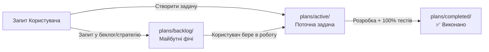

# 📋 SmartFeed Studio — Плани Фіч та Дорожні Карти (Feature Plans)

Ласкаво просимо до центрального репозиторію планів та технічних специфікацій SmartFeed Studio!

---

## 🏛 Регламент роботи з планами (Залізне правило для Агента)

1. **Поточні задачі (`plans/active/`)**:
   - Коли користувач ставить задачу на реалізацію, план створюється у папці `plans/active/<feature_name>.md`.
   - **Заборона передчасного виконання**: Агент **НЕ МАЄ ПРАВА** починати писати код чи змінювати БД без явної команди користувача (наприклад: _"починай"_, _"виконуй"_, _"реалізовуй план"_).
2. **Беклог та ідеї на майбутнє (`plans/backlog/`)**:
   - Якщо користувач просить описати ідею на майбутнє або пише "створи в беклог" — план створюється у папці `plans/backlog/<feature_name>.md`.
3. **Завершені плани (`plans/completed/`)**:
   - Як тільки задача повністю реалізована, протестована (100% тестів пройдено) і верифікована, файл плану **автоматично переноситься** з `plans/active/` у `plans/completed/<feature_name>.md` з оновленням статусу на `✅ Реалізовано`.
4. **Реєстр `plans/README.md`**:
   - Завжди містить актуальний структурований огляд усіх трьох папок.

---

## 🚀 1. Активні задачі в роботі (`plans/active/`)

> _Наразі активних задач немає. Готові до планування наступної фічі._

| Файл | Опис                                       | Статус    |
| :--- | :----------------------------------------- | :-------- |
| —    | _Папка очікує нову задачу від користувача_ | ⏳ Вільна |

---

## 📋 2. Беклог та майбутні фічі (`plans/backlog/`)

| Файл                                                                                                                                            | Опис                                                                                                                                       |  Пріоритет  |
| :---------------------------------------------------------------------------------------------------------------------------------------------- | :----------------------------------------------------------------------------------------------------------------------------------------- | :---------: |
| [`team_cloud_sync_and_shared_catalogs.md`](file:///Users/oleg/AQA/SmartFeedStudio/plans/backlog/team_cloud_sync_and_shared_catalogs.md)         | Командна синхронізація каталогів через S3 (Cloudflare R2), версійність знімків, Push/Pull оновлення та запобігання конфліктам (Сценарій А) | 🥇 Високий  |
| [`project_optimization_and_future_roadmap.md`](file:///Users/oleg/AQA/SmartFeedStudio/plans/backlog/project_optimization_and_future_roadmap.md) | Стратегічний план оптимізації продуктивності, безпеки, Rust рушія фідів, AI збагачення, віртуалізації та DevOps                            | 🥇 Високий  |
| [`tariff_strategy.md`](file:///Users/oleg/AQA/SmartFeedStudio/plans/backlog/tariff_strategy.md)                                                 | 4-рівнева комерційна стратегія тарифів (Starter, Growth, Pro, Enterprise), аналіз ринку, квоти, дорожня карта                              | 🥈 Середній |

---

## ✅ 3. Завершені та протестовані плани (`plans/completed/`)

| Файл                                                                                                                                                                          | Опис                                                                                                                                                |   Результат    |
| :---------------------------------------------------------------------------------------------------------------------------------------------------------------------------- | :-------------------------------------------------------------------------------------------------------------------------------------------------- | :------------: |
| [`frontend_admin_and_desktop_review_and_hardening.md`](file:///Users/oleg/AQA/SmartFeedStudio/plans/completed/frontend_admin_and_desktop_review_and_hardening.md)             | Комплексне рев'ю фронтенду: модульність, реактивність, i18n словники, Error Boundaries, усунення `any`, оптимізація запитів та E2E тести            | ✅ 100% Тестів |
| [`backend_security_access_control_and_release_readiness.md`](file:///Users/oleg/AQA/SmartFeedStudio/plans/completed/backend_security_access_control_and_release_readiness.md) | Комплексний аудит безпеки бекенду, контроль доступів (RBAC/ABAC), запобігання витоку даних, Rate Limiting, Helmet, санітизація помилок та E2E тести | ✅ 100% Тестів |
| [`hierarchical_users_management_and_actions.md`](file:///Users/oleg/AQA/SmartFeedStudio/plans/completed/hierarchical_users_management_and_actions.md)                         | Ієрархічний вивід користувачів (Власник + розгортання запрошених), модалка команди, меню дій 3 крапки (призупинення/видалення) та CQRS              | ✅ 100% Тестів |
| [`admin_create_user_modal.md`](file:///Users/oleg/AQA/SmartFeedStudio/plans/completed/admin_create_user_modal.md)                                                             | Модальне створення користувача в адмінці (всі ролі: Admin, Owner компанії, Member запрошений)                                                       | ✅ 100% Тестів |
| [`dynamic_admin_navigation_reorder.md`](file:///Users/oleg/AQA/SmartFeedStudio/plans/completed/dynamic_admin_navigation_reorder.md)                                           | Динамічна зміна позицій пунктів меню Admin Portal у базі даних (вкладка Admin, reorder, динамічний сайдбар як у користувача)                        | ✅ 100% Тестів |
| [`standardize_admin_pages_design.md`](file:///Users/oleg/AQA/SmartFeedStudio/plans/completed/standardize_admin_pages_design.md)                                               | Стандартизація дизайну сторінок Admin Portal (стиль Користувачі, іконки в шапках, видалення дублікатів з Ліцензій)                                  | ✅ 100% Тестів |
| [`build_verification_and_docker_ci_hardening.md`](file:///Users/oleg/AQA/SmartFeedStudio/plans/completed/build_verification_and_docker_ci_hardening.md)                       | Алгоритм перевірки збірки перед білдом (4 рівні захисту), Node 22 LTS, фікс Prisma Docker build та Git pre-push hook                                | ✅ 100% Тестів |
| [`modern_minimalist_users_filter_concept.md`](file:///Users/oleg/AQA/SmartFeedStudio/plans/completed/modern_minimalist_users_filter_concept.md)                               | Сучасна лаконічна фільтрація користувачів (IDE / Linear / shadcn), видалення емодзі, єдиний контейнер без зайвих рамок                              | ✅ 100% Тестів |
| [`license_status_actions_and_highlight.md`](file:///Users/oleg/AQA/SmartFeedStudio/plans/completed/license_status_actions_and_highlight.md)                                   | Підсвічування діючої ліцензії, 3-крапки меню дій (Призупинити / Видалити), CQRS ендпоінти бекенду, TDD тести та Playwright E2E                      | ✅ 100% Тестів |
| [`team_roles_and_admin_hierarchy.md`](file:///Users/oleg/AQA/SmartFeedStudio/plans/completed/team_roles_and_admin_hierarchy.md)                                               | Диференціація ролей у команді (Власник vs Запрошений), приховування тарифів для Member, ієрархія та фільтри в адмінці                               | ✅ 100% Тестів |
| [`team_invitations_and_mail_service.md`](file:///Users/oleg/AQA/SmartFeedStudio/plans/completed/team_invitations_and_mail_service.md)                                         | Запрошення в команду (Invite Link + Mail Service), життєвий цикл інвайтів, Mailpit у Docker, 100% i18n та тести                                     | ✅ 100% Тестів |
| [`rbac_and_multitenancy_hardening.md`](file:///Users/oleg/AQA/SmartFeedStudio/plans/completed/rbac_and_multitenancy_hardening.md)                                             | Повний аудит RBAC та мульти-тенантності, закриття вразливості доступу в UsersController, захист адмінки та дефолтний Super Admin                    | ✅ 100% Тестів |
| [`admin_portal_comprehensive_review_and_hardening.md`](file:///Users/oleg/AQA/SmartFeedStudio/plans/completed/admin_portal_comprehensive_review_and_hardening.md)             | Архітектурне рев'ю Admin Portal: модульність, реактивність, стабільність, 100% i18n та повне покриття реальними Playwright E2E тестами              | ✅ 100% Тестів |
| [`admin_portal_licenses_filters.md`](file:///Users/oleg/AQA/SmartFeedStudio/plans/completed/admin_portal_licenses_filters.md)                                                 | Розширена фільтрація та вибірки в таблиці ліцензій (shadcn Data Table Toolbar, Faceted Filters, Sort)                                               | ✅ 100% Тестів |
| [`admin_portal_plans_and_licenses_split.md`](file:///Users/oleg/AQA/SmartFeedStudio/plans/completed/admin_portal_plans_and_licenses_split.md)                                 | Розділення Тарифів і Ліцензій на окремі сторінки та створення підменю Налаштувань у сайдбарі                                                        | ✅ 100% Тестів |
| [`company_registration_and_team_access.md`](file:///Users/oleg/AQA/SmartFeedStudio/plans/completed/company_registration_and_team_access.md)                                   | Реєстрація компанії на фронтенді, корпоративна ліцензія, роздача доступів команді та контроль квот                                                  | ✅ 100% Тестів |
| [`prisma_7_upgrade_migration.md`](file:///Users/oleg/AQA/SmartFeedStudio/plans/completed/prisma_7_upgrade_migration.md)                                                       | Оновлення до Prisma 7 (`7.10.0`), Driver Adapters (`@prisma/adapter-pg`), WebAssembly рушій, `prisma.config.ts`                                     | ✅ 100% Тестів |
| [`organizations_and_team_seats.md`](file:///Users/oleg/AQA/SmartFeedStudio/plans/completed/organizations_and_team_seats.md)                                                   | Архітектура Організацій, поле `companyName`, командні місця (`maxTeamSeats`), інвайти та TDD тести                                                  | ✅ 100% Тестів |
