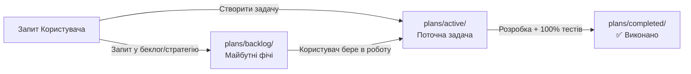

# 📋 SmartFeed Studio — Плани Фіч та Дорожні Карти (Feature Plans)

Ласкаво просимо до центрального репозиторію планів та технічних специфікацій SmartFeed Studio!

---

## 🏛 Регламент роботи з планами (Залізне правило для Агента)

1. **Поточні задачі (`plans/active/`)**:
   - Коли користувач ставить задачу на реалізацію, план створюється у папці `plans/active/<feature_name>.md`.
   - **Заборона передчасного виконання**: Агент **НЕ МАЄ ПРАВА** починати писати код чи змінювати БД без явної команди користувача (наприклад: _"починай"_, _"виконуй"_, _"реалізовуй план"_).
2. **Беклог та ідеї на майбутнє (`plans/backlog/`)**:
   - Якщо користувач просить описати ідею на майбутнє або пише "створи в беклог" — план створюється у папці `plans/backlog/<feature_name>.md`.
3. **Завершені плани (`plans/completed/`)**:
   - Як тільки задача повністю реалізована, протестована (100% тестів пройдено) і верифікована, файл плану **автоматично переноситься** з `plans/active/` у `plans/completed/<feature_name>.md` з оновленням статусу на `✅ Реалізовано`.
4. **Реєстр `plans/README.md`**:
   - Завжди містить актуальний структурований огляд усіх трьох папок.

---

## 🚀 1. Активні задачі в роботі (`plans/active/`)

### 🌟 Головний модуль: Каталоги, Товари, Постачальники та Обробка Фідів (Products, Catalogs & Ingestion)

| Файл плану                                                                                              | Призначення та ключові теми                                                                 |      Рівень       |
| :------------------------------------------------------------------------------------------------------ | :------------------------------------------------------------------------------------------ | :---------------: |
| [`00_master_products_and_catalogs_plan.md`](active/00_master_products_and_catalogs_plan.md)             | **Головний Генеральний План**: архітектура, візія, зв'язки модулів, дорожня карта 4 релізів |  🌐 Master Plan   |
| [`01_suppliers_and_database_architecture.md`](active/01_suppliers_and_database_architecture.md)         | **Архітектура БД & Постачальники**: схема PostgreSQL, Prisma, SQLCipher у Tauri, CQRS       |  🏗️ Backend & DB  |
| [`03_image_storage_and_cdn_strategy.md`](active/03_image_storage_and_cdn_strategy.md)                   | **Стратегія фотографій**: хмарний S3/MinIO пайплайн (WebP Sharp) vs Прямі посилання + кеш   |  🖼️ Media & CDN   |
| [`05_product_card_and_manual_creation_module.md`](active/05_product_card_and_manual_creation_module.md) | **Картка товару та ручне створення**: Drawer з 5 вкладками, чернетки, генератор SKU         |   🗂️ UI & Logic   |
| [`06_roadmap_releases_and_testing_strategy.md`](active/06_roadmap_releases_and_testing_strategy.md)     | **Дорожня карта релізів (1-4) & QA**: критерії готовності (DoD), Jest E2E, Playwright       |  🚀 Roadmap & QA  |
| [`07_tasks_execution_checklist.md`](active/07_tasks_execution_checklist.md)                             | **Чеклист виконання задач**: структурований перелік задач з відмітками `[x]` / `[ ]`        | 📋 Task Execution |
| [`csv_websklad_import_fix.md`](active/csv_websklad_import_fix.md)                                       | **Виправлення CSV парсингу (Websklad)**: RFC 4180 токенізатор, фікс категорій та цін        |  ⚡ Parser & Fix  |

---

## 📋 2. Беклог та майбутні фічі (`plans/backlog/`)

| Файл                                                                                               | Опис                                                                                                                                       |  Пріоритет  |
| :------------------------------------------------------------------------------------------------- | :----------------------------------------------------------------------------------------------------------------------------------------- | :---------: |
| [`team_cloud_sync_and_shared_catalogs.md`](backlog/team_cloud_sync_and_shared_catalogs.md)         | Командна синхронізація каталогів через S3 (Cloudflare R2), версійність знімків, Push/Pull оновлення та запобігання конфліктам (Сценарій А) | 🥇 Високий  |
| [`project_optimization_and_future_roadmap.md`](backlog/project_optimization_and_future_roadmap.md) | Стратегічний план оптимізації продуктивності, безпеки, Rust рушія фідів, AI збагачення, віртуалізації та DevOps                            | 🥇 Високий  |
| [`tariff_strategy.md`](backlog/tariff_strategy.md)                                                 | 4-рівнева комерційна стратегія тарифів (Starter, Growth, Pro, Enterprise), аналіз ринку, квоти, дорожня карта                              | 🥈 Середній |

---

## ✅ 3. Завершені та протестовані плани (`plans/completed/`)

| Файл                                                                                                                                                         | Опис                                                                                                                                                                                                                                                                                                        |        Результат         |
| :----------------------------------------------------------------------------------------------------------------------------------------------------------- | :---------------------------------------------------------------------------------------------------------------------------------------------------------------------------------------------------------------------------------------------------------------------------------------------------------- | :----------------------: |
| [`dynamic_growth_showcase_charts.md`](completed/dynamic_growth_showcase_charts.md)                                                                           | **Динамічні діаграми успіху клієнта та AI Автопілот**: ізольований модуль `@/modules/growth-showcase`, shadcn/ui Recharts AreaChart, динамічний KPI лічильник (+430% чистий прибуток), 3D AI асистент, 3-етапна воронка, live стрічка замовлень, 100vh нуль скролу, 100% тестів PASS                        |   ✅ 100% тестів (8/8)   |
| [`legal_pages_cms_and_auth_viewport_cleanup.md`](completed/legal_pages_cms_and_auth_viewport_cleanup.md)                                                     | **Модальні вікна юридичних документів, CMS в адмінці та 100% Viewport Fit**: ліквідація кнопки Demo Admin, усунення вертикального скролу на /auth/login та /auth/register, інтерактивне вікно LegalDocumentModal замість битих посилань, повноцінне редагування документів в адмінці (/legal) та NestJS API |   ✅ 100% тестів (7/7)   |
| [`modern_split_auth_redesign.md`](completed/modern_split_auth_redesign.md)                                                                                   | **Модернізація сторінок входу та реєстрації**: 2-колонковий преміальний split-лейкаут, Live Feed Pipeline, висока конверсія реєстрації (тариф Free, Rust швидкість, 100% приватність), перемикачі видимості пароля, 100% E2E тестів PASS                                                                    |   ✅ 100% тестів (6/6)   |
| [`suppliers_page_compact_clean_redesign.md`](completed/suppliers_page_compact_clean_redesign.md)                                                             | **Компактне компонування сторінки постачальників**: ліквідація подвійних відступів, усунення вертикального скролу, очищення строкатих фонів карток, ліквідація дублю кнопки підключення фіду в тулбарі, 100% Playwright тестів PASS                                                                         |   ✅ 100% тестів (6/6)   |
| [`header_and_typography_optimization.md`](completed/header_and_typography_optimization.md)                                                                   | **Оптимізація шапки, аватар-меню та уніфікація типографіки**: вилучення зайвих блоків з Header, перенесення в профіль, клікабельний аватар у правому куті з випадаючим меню, шкала шрифтів `text-xs py-1.5` для меню дій, 95/95 desktop E2E тестів PASS                                                     |  ✅ 100% тестів (95/95)  |
| [`desktop_user_cabinet_optimization.md`](completed/desktop_user_cabinet_optimization.md)                                                                     | **Комплексна оптимізація кабінету користувача**: монохромна тема Zinc, ліміт <250 рядків, ліквідація silent failures, 100% E2E тестів PASS                                                                                                                                                                  |  ✅ 100% тестів (94/94)  |
| [`streamline_plans_page_and_quota_visibility.md`](completed/streamline_plans_page_and_quota_visibility.md)                                                   | **Очищення сторінки тарифів та видимість квот**: видалення надлишкового банера активної підписки, адаптивні бейджі квот (100% без обрізання SKU, коректні «Безліміт / 15 каналів», «Соло / 10 місць»), 94/94 desktop E2E тестів PASS                                                                        |  ✅ 100% тестів (94/94)  |
| [`separate_profile_and_settings_architecture.md`](completed/separate_profile_and_settings_architecture.md)                                                   | **Розділення «Профілю» та «Налаштувань» (Desktop & Admin)**: виділення `/profile` та `/settings`, оновлення меню користувача, 160/160 E2E тестів PASS (66 admin + 94 desktop)                                                                                                                               | ✅ 100% тестів (160/160) |
| [`header_minimalist_search_and_clean_breadcrumbs.md`](completed/header_minimalist_search_and_clean_breadcrumbs.md)                                           | **Лаконічний пошук-іконка та очищення хлібних крихт (Header Refinement)**: видалення дублюючого "SmartFeed" з хлібних крихт, компактна іконка пошуку праворуч, плаваючий віджет `[ 🔍 Search.... ESC ]` під шапкою, 159/159 E2E тестів PASS (66 admin + 93 desktop)                                         | ✅ 100% тестів (159/159) |
| [`shadcn_dashboard_01_global_design_system.md`](completed/shadcn_dashboard_01_global_design_system.md)                                                       | **Стандартизація дизайну під shadcn dashboard-01 (Admin & Desktop)**: повна ліквідація надлишкових банерів, компактні хлібні крихти, точна типографіка New York v4 (`text-2xl font-bold tracking-tight tabular-nums`), 159/159 E2E тестів PASS (66 admin + 93 desktop)                                      | ✅ 100% тестів (159/159) |
| [`ui_unified_dropdowns_and_minimalist_refinement.md`](completed/ui_unified_dropdowns_and_minimalist_refinement.md)                                           | **Уніфікація випадаючих списків (shadcn Select), деклоттеринг тулбарів та естетика навігації**: ліквідація темного системного селектора в світлій темі, деклоттеринг фільтрів, sidebar `text-xs rounded-lg` за еталоном симулятора меню, 159/159 E2E тестів PASS                                            | ✅ 100% тестів (159/159) |
| [`audit_and_optimize_agent_skills_system.md`](completed/audit_and_optimize_agent_skills_system.md)                                                           | **Оптимізація агентів та системи написання коду**: консолідація 127 скілів у 42 нативних, Addy Osmani пайплайн, зняття ліміту контексту IDE, правило Zero File Dumping у чаті                                                                                                                               |      ✅ 100% тестів      |
| [`mcp_and_skills_gap_closure.md`](completed/mcp_and_skills_gap_closure.md)                                                                                   | **Закриття прогалин MCP та скілів**: Playwright `browser-debugging`, 3 нових MCP (postgres, redis, github), Keychain для Firecrawl, 4 нових скіли (`i18n-localization`, `rust-native-backend`, `mock-real-parity`, `bullmq-jobs`), Sentry NestJS                                                            |      ✅ 100% тестів      |
| [`skills_rollout_plan.md`](completed/skills_rollout_plan.md)                                                                                                 | **Встановлення 20 скілів та гардрайлів**: 20/20 скілів, супровідні задачі (0 відносних імпортів, декомпозиція 20 файлів, `allowEmptyCatch: false`, 100% валідацій)                                                                                                                                          |      ✅ 100% тестів      |
| [`decompose_files_over_300_lines_and_enforce_guardrails.md`](completed/decompose_files_over_300_lines_and_enforce_guardrails.md)                             | **Декомпозиція 20 файлів >300 рядків та ввімкнення `max-lines: error`**: повна декомпозиція всіх вихідних файлів, сідера та E2E тестів до ліміту <300 рядків, 0 ESLint помилок, 0 TS помилок                                                                                                                |      ✅ 100% тестів      |
| [`eliminate_relative_imports_and_enforce_guardrails.md`](completed/eliminate_relative_imports_and_enforce_guardrails.md)                                     | **100% ліквідація 728 відносних імпортів (`../`) та ввімкнення `no-restricted-imports: error`**: налаштування `@/`, `@e2e/`, `@test/`, міграція 252 файлів, 0 TS помилок, 0 порушень правил імпортів                                                                                                        |      ✅ 100% тестів      |
| [`remediation_feed_url_fetching_and_sync.md`](completed/remediation_feed_url_fetching_and_sync.md)                                                           | **Завантаження фідів за URL та синхронізація залишків і цін**: ліквідація CORS у десктопі, CQRS релей у NestJS, SSRF-захист, реальне оновлення цін/залишків у SQLite, 100% тестів PASS                                                                                                                      |      ✅ 100% тестів      |
| [`user_isolated_local_db_fix.md`](completed/user_isolated_local_db_fix.md)                                                                                   | **Ізоляція локальної БД (Web/Mock) за User ID**: динамічний префікс `smartfeed_mock_db_${userId}`, очищення legacy-сховища, скидання стану при реєстрації та виході, 100% чистий старт для нових акаунтів, 0 TS помилок                                                                                     |      ✅ 100% тестів      |
| [`remediation_network_and_query_optimization.md`](completed/remediation_network_and_query_optimization.md)                                                   | **Комплексна оптимізація мережі та БД**: ліквідація дублів запитів, in-flight дедуплікація, SQL-агрегації замість OOM `findMany`, Redis-кешування, неблокуючий I/O, 100% тестів PASS                                                                                                                        |      ✅ 100% тестів      |
| [`dashboard_redesign_shadcn_01.md`](completed/dashboard_redesign_shadcn_01.md)                                                                               | **Редизайн Дашборду та Налаштувань (shadcn dashboard-01)**: реальні дані без моків, ліквідація верхнього банера, оптимізація таблиці, видалення карток інфраструктури та ID користувача                                                                                                                     |      ✅ 100% тестів      |
| [`production_docker_setup_and_deployment.md`](completed/production_docker_setup_and_deployment.md)                                                           | **Production Docker & Розгортання**: багатоконтейнерний Docker Compose стек (NestJS API + Admin Portal + PG + Redis + MinIO + Mailpit), токен Railway, здоров'я сервісів                                                                                                                                    |      ✅ 100% тестів      |
| [`user_and_admin_avatars_storage.md`](completed/user_and_admin_avatars_storage.md)                                                                           | **Аватари для Користувачів та Адміна**: хмарна БД PostgreSQL для адміна, локальне сховище SQLite для користувача, підтримка видалення, Radix Avatar                                                                                                                                                         |      ✅ 100% тестів      |
| [`dashboard_01_inset_layout_and_clean_sidebar.md`](completed/dashboard_01_inset_layout_and_clean_sidebar.md)                                                 | **Впровадження Inset-макету та безшовного сайдбара shadcn `dashboard-01`**: ліквідація перетину ліній, виділена плаваюча робоча область `SidebarInset`, чистий сайдбар без рамок під брендом/профілем у Desktop та Admin                                                                                    |      ✅ 100% тестів      |
| [`dashboard_01_shadcn_ui_integration.md`](completed/dashboard_01_shadcn_ui_integration.md)                                                                   | **Інтеграція дизайну та компонентів shadcn `dashboard-01`**: естетика KPI карток з градієнтом, моноширинні Tabular Nums, інтерактивні графіки активності на базі `recharts`, оновлення дашбордів Desktop та Admin Portal                                                                                    |      ✅ 100% тестів      |
| [`remediation_frontend_ux_and_architecture.md`](completed/remediation_frontend_ux_and_architecture.md)                                                       | **Комплексний UI/UX, шрифтовий та архітектурний аудит фронтенду (Desktop & Admin)**: виправлення Empty State каталогу, шрифти Inter + Tabular Nums, Solid Sticky Headers (`h-16`), нуль каскадних дублів, 100% i18n                                                                                         |      ✅ 100% тестів      |
| [`remediation_backend_audit.md`](completed/remediation_backend_audit.md)                                                                                     | **Аудит та ремедіація бекенду (`agents_backend`)**: ліквідація P0 обходу автентифікації інвайтів, очищення CQRS меж у Payments, транзакції $transaction у створенні юзерів, м'ютекси ліцензій, модульні DTO сховища                                                                                         |      ✅ 100% тестів      |
| [`owner_super_admin_role_and_exclusion_fix.md`](completed/owner_super_admin_role_and_exclusion_fix.md)                                                       | **Роль Власника (SUPER_ADMIN)**: повне виключення Власника зі списків комерційних ліцензій та клієнтів, розмежування ролей «Власник платформи» vs «Власник компанії», 100% E2E тестів PASS                                                                                                                  |      ✅ 100% тестів      |
| [`12_desktop_sentry_integration.md`](completed/12_desktop_sentry_integration.md)                                                                             | **Інтеграція Sentry SDK у Десктоп**: перехоплення винятків навігації, сітки товарів та UI, автоматичний збір стеків, 100% тестів PASS                                                                                                                                                                       |      ✅ 100% тестів      |
| [`remediation_autotests.md`](completed/remediation_autotests.md)                                                                                             | **Комплексне усунення дефектів Автотестів**: стабілізація Playwright (`workers: 1`), Zero `any` у тестах, сьют `export-channels.spec.ts`, Adversarial race-condition тест, фікс `organizations.e2e-spec.ts`                                                                                                 |      ✅ 100% тестів      |
| [`remediation_backend.md`](completed/remediation_backend.md)                                                                                                 | **Комплексне усунення дефектів Backend**: узгодження контрактів помилок, Zero `any`, PostgreSQL snake_case, усунення CWE-78 (execFile), декомпозиція `workspace-utils.ts`, Swagger DTO                                                                                                                      |      ✅ 100% тестів      |
| [`remediation_frontend.md`](completed/remediation_frontend.md)                                                                                               | **Комплексне усунення дефектів Frontend**: 100% ліквідація off-scheme кольорів, декомпозиція 6 God-файлів (<250-300 рядків), 0 мовчазних catch {}, 100% i18n експорту, усунення дублів CTA                                                                                                                  |      ✅ 100% тестів      |
| [`15_cascade_feed_deletion_and_quota_cleanup.md`](completed/15_cascade_feed_deletion_and_quota_cleanup.md)                                                   | **Каскадне видалення товарів та фото при видаленні фіду**: усунення витоку SKU, спільний ID, очищення фото, синхронізація квот, 16/16 тестів PASS                                                                                                                                                           |      ✅ 100% тестів      |
| [`14_feed_preview_images_streaming_and_feedback.md`](completed/14_feed_preview_images_streaming_and_feedback.md)                                             | **Миттєве завантаження фото прев'ю товарів & статусний фідбек**: завантаження перших 5 фото, скелетон, бейдж готовності, модалка фото, решта у фоні, 6/6 тестів PASS                                                                                                                                        |      ✅ 100% тестів      |
| [`13_modular_local_db_mock_refactor.md`](completed/13_modular_local_db_mock_refactor.md)                                                                     | **Декомпозиція та рефакторинг `mock-driver.ts` (Zero God-Files)**: ліквідація моноліту (з 1021 до 276 рядків), поділ на 7 доменних підмодулів у `mock/` (<185 рядків кожен), 13/13 тестів PASS                                                                                                              |      ✅ 100% тестів      |
| [`12_local_product_images_storage_and_management.md`](completed/12_local_product_images_storage_and_management.md)                                           | **Локальні фото товарів, фоновий завантажувач & каскадне видалення**: черга Tokio, 2-рівневе шардування, дедуплікація SHA-256, 100% S3-ready, модальна галерея, 9/9 тестів PASS                                                                                                                             |      ✅ 100% тестів      |
| [`18_sidebar_navigation_and_upsell_refinement.md`](completed/18_sidebar_navigation_and_upsell_refinement.md)                                                 | **Очищення бейджів меню та редизайн блоку «Розширити можливості»**: видалення сирих бейджів `GROWTH`/`PRO` з активних пунктів, маркетинговий заголовок `Розширити можливості` зі `Sparkles`, 17/17 тестів PASS                                                                                              |      ✅ 100% тестів      |
| [`desktop_api_modularization.md`](completed/desktop_api_modularization.md)                                                                                   | **Декомпозиція та оптимізація `api.ts`**: розбиття God-модуля (1,704 рядки) на 9 доменних підмодулів (<350 рядків), фасадний ре-експорт, 100% збереження сумісності                                                                                                                                         |    ✅ 100% перевірок     |
| [`fullstack_code_quality_refactor.md`](completed/fullstack_code_quality_refactor.md)                                                                         | **Комплексний рефакторинг якості коду Full-Stack**: закриття Command Injection (CWE-78), 31 порожній catch замінено на логування, видалення `any`, декомпозиція UI-компонентів, 4-шарова DTO валідація, типізація                                                                                           |    ✅ 100% перевірок     |
| [`unified_border_radius_system.md`](completed/unified_border_radius_system.md)                                                                               | **Єдина система радіусів заокруглення (Border Radius Token)**: мультиплікативне масштабування Tailwind, токен `--radius`, перемикач стилю 0px/4px/8px/12px в Налаштуваннях, 5/5 тестів PASS                                                                                                                 |      ✅ 100% тестів      |
| [`17_feature_gate_and_upsell_teaser_module.md`](completed/17_feature_gate_and_upsell_teaser_module.md)                                                       | **Модуль Feature Gate & Upsell Teaser (PLG)**: окремий блок меню, захисний шлюз, інтерактивна пісочниця ролей, калькулятор ROI, 100% Solid Sticky CTA, 16/16 тестів PASS                                                                                                                                    |      ✅ 100% тестів      |
| [`16_frontend_import_wizard_and_products_grid.md`](completed/16_frontend_import_wizard_and_products_grid.md)                                                 | **Віртуалізована таблиця товарів (Products Grid)**: 100% Solid Sticky Header, фасетні фільтри, бейджі маржі, масові дії, висувна картка товару Drawer, 274/274 тести PASS                                                                                                                                   |      ✅ 100% тестів      |
| [`15_feed_ingestion_and_parsing_engine.md`](completed/15_feed_ingestion_and_parsing_engine.md)                                                               | **Двигун обробки фідів**: стрімінговий парсинг XML/CSV/XLSX, евристичний авто-мапінг, розрахунок націнок, пакетне збереження в локальну БД, 269/269 тестів PASS                                                                                                                                             |      ✅ 100% тестів      |
| [`13_local_database_desktop_service_architecture.md`](completed/13_local_database_desktop_service_architecture.md)                                           | **Сервіс локальної БД**: модульна архітектура (`src/services/local-db/`), доменні сервіси, універсальний IPC / In-Memory диспетчер, гібридний роутинг у `api.ts`, 264/264 тести PASS                                                                                                                        |      ✅ 100% тестів      |
| [`12_clean_and_decouple_backend_database_architecture.md`](completed/12_clean_and_decouple_backend_database_architecture.md)                                 | **Розділення та очищення БД**: Local-First Desktop (Tauri + SQLCipher) + Cloud SaaS Gatekeeper (PostgreSQL 10 SaaS-моделей), видалення важких каталогів з Postgres, 264/264 тести PASS                                                                                                                      |      ✅ 100% тестів      |
| [`11_backend_comprehensive_architecture_and_security_review.md`](completed/11_backend_comprehensive_architecture_and_security_review.md)                     | **Комплексне рев'ю та безпека бекенду**: динамічний підрахунок квот каналів, multi-tenancy scoping, видалення `any`, Prisma Where типізація, `@CurrentUser`, безпечний catch `unknown`                                                                                                                      |      ✅ 100% тестів      |
| [`10_frontend_comprehensive_code_review_and_hardening.md`](completed/10_frontend_comprehensive_code_review_and_hardening.md)                                 | **Комплексне рев'ю та декомпозиція фронтенду**: розбиття компонентів (<300 рядків), 100% solid sticky headers, видалення `any`, Vercel React Best Practices, 100% i18n                                                                                                                                      |      ✅ 100% тестів      |
| [`09_pricing_rules_and_marketplace_reverse_margin_engine.md`](completed/09_pricing_rules_and_marketplace_reverse_margin_engine.md)                           | **Багаторівневі націнки та зворотня маржа маркетплейсів**: правила категорій та цінових діапазонів, Reverse Margin Engine (Rozetka, Prom, Epicentr), живий симулятор прибутку, Live XML/CSV фіди                                                                                                            |      ✅ 100% тестів      |
| [`10_local_database_workspace_selection_and_storage_management.md`](completed/10_local_database_workspace_selection_and_storage_management.md)               | **Локальна зашифрована БД (SQLCipher)**: вибір робочої папки (Onboarding), налаштування сховища, метрики дисків, бекапи та перенесення даних                                                                                                                                                                |      ✅ 100% тестів      |
| [`14_import_wizard_expanded_modal_and_proactive_sku_limit_enforcement.md`](completed/14_import_wizard_expanded_modal_and_proactive_sku_limit_enforcement.md) | **Розширене вікно імпорту та блокування переліміту SKU**: модалка 95vw, блокування кнопки імпорту при переліміті та динамічне розблокування при знятті категорій                                                                                                                                            |      ✅ 100% тестів      |
| [`13_unified_reactive_counters_and_data_sync_system.md`](completed/13_unified_reactive_counters_and_data_sync_system.md)                                     | **Єдина система реактивної синхронізації лічильників (`DataSync`)**: авто-оновлення квот у шапці, карток постачальників, підключених фідів та списків без перезавантаження сторінки                                                                                                                         |      ✅ 100% тестів      |
| [`12_feed_to_product_isolation_and_proactive_limits_blocking.md`](completed/12_feed_to_product_isolation_and_proactive_limits_blocking.md)                   | **Ізоляція товарів за фідами, блокування кнопок при переліміті та переклади**: точкове видалення товарів фіду, disabled стан кнопок додавання, ConfirmDeleteDialog, i18n                                                                                                                                    |      ✅ 100% тестів      |
| [`11_plan_downgrade_excess_reconciliation_and_realtime_quotas.md`](completed/11_plan_downgrade_excess_reconciliation_and_realtime_quotas.md)                 | Узгодження надлишку даних при переході на нижчий тариф (Downgrade Reconciliation), видалення фідів/категорій/постачальників з товарами та живий перерахунок квот (0 мс)                                                                                                                                     |      ✅ 100% тестів      |
| [`10_feed_async_import_queues_and_category_filtering.md`](completed/10_feed_async_import_queues_and_category_filtering.md)                                   | Асинхронні фонові черги BullMQ + Redis, вибірковий імпорт категорій з підрахунком SKU та лімітів квоти, плаваючий віджет прогресу та модалка підключених фідів постачальника                                                                                                                                |      ✅ 100% тестів      |
| [`sidebar_and_header_ui_cleanup.md`](completed/sidebar_and_header_ui_cleanup.md)                                                                             | Редизайн шапки та сайдбару: усунення дублів назви та кнопок згортання, виправлення обрізання тексту, віджет активного тарифу та днів у шапці                                                                                                                                                                |      ✅ 100% тестів      |
| [`frontend_code_review_and_decomposition.md`](completed/frontend_code_review_and_decomposition.md)                                                           | Повне код-ревʼю фронтенду: декомпозиція монолітних компонентів (>300 рядків) на модульні підкомпоненти та хуки, усунення `any`, перевірка реактивності та 100% тестів                                                                                                                                       |      ✅ 100% тестів      |
| [`backend_deep_architecture_security_review.md`](completed/backend_deep_architecture_security_review.md)                                                     | Комплексний архітектурний, безпековий (OWASP) та швидкісний аудит бекенду: захист інвайтів, атомарні транзакції, миттєве блокування деактивованих юзерів, захист S3 та ідемпотентність вебхуків                                                                                                             |      ✅ 100% тестів      |
| [`table_pagination_monorepo.md`](completed/table_pagination_monorepo.md)                                                                                     | Уніфікована лаконічна пагінація таблиць (Admin Portal & Desktop) зі збереженням глобальної фільтрації та пошуку по всій вибірці даних (100%)                                                                                                                                                                |      ✅ 100% тестів      |
| [`trial_and_license_enforcement.md`](completed/trial_and_license_enforcement.md)                                                                             | 7-денний пробний період «Старт» (1 раз при реєстрації, далі 299 грн/міс) та глобальне блокування доступу без активної ліцензії (UI пейвол + захист)                                                                                                                                                         |      ✅ 100% тестів      |
| [`desktop_user_checkout_and_access_provisioning.md`](completed/desktop_user_checkout_and_access_provisioning.md)                                             | Інтеграція оплат у кабінеті користувача (Checkout Modal, WayForPay Sandbox/Live, авто-розблокування доступу при Approved та захист блокування при Declined)                                                                                                                                                 |      ✅ 100% Тестів      |
| [`wayforpay_integration_and_transactions_system.md`](completed/wayforpay_integration_and_transactions_system.md)                                             | Інтеграція WayForPay (Sandbox / Live), модуль транзакцій, Webhook-автоматизація ліцензій, налаштування шлюзів та фінансова аналітика в адмінці                                                                                                                                                              |      ✅ 100% Тестів      |
| [`billing_interval_switcher_and_checkout_flow.md`](completed/billing_interval_switcher_and_checkout_flow.md)                                                 | Перемикач періоду підписки (Щомісяця / Щороку зі знижкою 20%), динамічний перерахунок цін та підготовка кнопок до інтеграції платіжних посилань/шлюзу                                                                                                                                                       |      ✅ 100% Тестів      |
| [`desktop_plans_and_comparison_matrix.md`](completed/desktop_plans_and_comparison_matrix.md)                                                                 | Перенесення тарифної сітки та порівняльної матриці в десктопний додаток клієнта 1-в-1 з адмінкою, динамічна синхронізація та кнопки вибору тарифу                                                                                                                                                           |      ✅ 100% Тестів      |
| [`tariff_plans_limits_and_comparison_matrix.md`](completed/tariff_plans_limits_and_comparison_matrix.md)                                                     | Тарифна сітка, квоти та обмеження (вхідні/вихідні канали), порівняльна матриця з 4 категоріями, картки та динамічний редактор у кабінеті адміна                                                                                                                                                             |      ✅ 100% Тестів      |
| [`frontend_admin_and_desktop_review_and_hardening.md`](completed/frontend_admin_and_desktop_review_and_hardening.md)                                         | Комплексне рев'ю фронтенду: модульність, реактивність, i18n словники, Error Boundaries, усунення `any`, оптимізація запитів та E2E тести                                                                                                                                                                    |      ✅ 100% Тестів      |
| [`backend_security_access_control_and_release_readiness.md`](completed/backend_security_access_control_and_release_readiness.md)                             | Комплексний аудит безпеки бекенду, контроль доступів (RBAC/ABAC), запобігання витоку даних, Rate Limiting, Helmet, санітизація помилок та E2E тести                                                                                                                                                         |      ✅ 100% Тестів      |
| [`hierarchical_users_management_and_actions.md`](completed/hierarchical_users_management_and_actions.md)                                                     | Ієрархічний вивід користувачів (Власник + розгортання запрошених), модалка команди, меню дій 3 крапки (призупинення/видалення) та CQRS                                                                                                                                                                      |      ✅ 100% Тестів      |
| [`admin_create_user_modal.md`](completed/admin_create_user_modal.md)                                                                                         | Модальне створення користувача в адмінці (всі ролі: Admin, Owner компанії, Member запрошений)                                                                                                                                                                                                               |      ✅ 100% Тестів      |
| [`dynamic_admin_navigation_reorder.md`](completed/dynamic_admin_navigation_reorder.md)                                                                       | Динамічна зміна позицій пунктів меню Admin Portal у базі даних (вкладка Admin, reorder, динамічний сайдбар як у користувача)                                                                                                                                                                                |      ✅ 100% Тестів      |
| [`standardize_admin_pages_design.md`](completed/standardize_admin_pages_design.md)                                                                           | Стандартизація дизайну сторінок Admin Portal (стиль Користувачі, іконки в шапках, видалення дублікатів з Ліцензій)                                                                                                                                                                                          |      ✅ 100% Тестів      |
| [`build_verification_and_docker_ci_hardening.md`](completed/build_verification_and_docker_ci_hardening.md)                                                   | Алгоритм перевірки збірки перед білдом (4 рівні захисту), Node 22 LTS, фікс Prisma Docker build та Git pre-push hook                                                                                                                                                                                        |      ✅ 100% Тестів      |
| [`modern_minimalist_users_filter_concept.md`](completed/modern_minimalist_users_filter_concept.md)                                                           | Сучасна лаконічна фільтрація користувачів (IDE / Linear / shadcn), видалення емодзі, єдиний контейнер без зайвих рамок                                                                                                                                                                                      |      ✅ 100% Тестів      |
| [`license_status_actions_and_highlight.md`](completed/license_status_actions_and_highlight.md)                                                               | Підсвічування діючої ліцензії, 3-крапки меню дій (Призупинити / Видалити), CQRS ендпоінти бекенду, TDD тести та Playwright E2E                                                                                                                                                                              |      ✅ 100% Тестів      |
| [`team_roles_and_admin_hierarchy.md`](completed/team_roles_and_admin_hierarchy.md)                                                                           | Диференціація ролей у команді (Власник vs Запрошений), приховування тарифів для Member, ієрархія та фільтри в адмінці                                                                                                                                                                                       |      ✅ 100% Тестів      |
| [`team_invitations_and_mail_service.md`](completed/team_invitations_and_mail_service.md)                                                                     | Запрошення в команду (Invite Link + Mail Service), життєвий цикл інвайтів, Mailpit у Docker, 100% i18n та тести                                                                                                                                                                                             |      ✅ 100% Тестів      |
| [`rbac_and_multitenancy_hardening.md`](completed/rbac_and_multitenancy_hardening.md)                                                                         | Повний аудит RBAC та мульти-тенантності, закриття вразливості доступу в UsersController, захист адмінки та дефолтний Super Admin                                                                                                                                                                            |      ✅ 100% Тестів      |
| [`admin_portal_comprehensive_review_and_hardening.md`](completed/admin_portal_comprehensive_review_and_hardening.md)                                         | Архітектурне рев'ю Admin Portal: модульність, реактивність, стабільність, 100% i18n та повне покриття реальними Playwright E2E тестами                                                                                                                                                                      |      ✅ 100% Тестів      |
| [`admin_portal_licenses_filters.md`](completed/admin_portal_licenses_filters.md)                                                                             | Розширена фільтрація та вибірки в таблиці ліцензій (shadcn Data Table Toolbar, Faceted Filters, Sort)                                                                                                                                                                                                       |      ✅ 100% Тестів      |
| [`admin_portal_plans_and_licenses_split.md`](completed/admin_portal_plans_and_licenses_split.md)                                                             | Розділення Тарифів і Ліцензій на окремі сторінки та створення підменю Налаштувань у сайдбарі                                                                                                                                                                                                                |      ✅ 100% Тестів      |
| [`company_registration_and_team_access.md`](completed/company_registration_and_team_access.md)                                                               | Реєстрація компанії на фронтенді, корпоративна ліцензія, роздача доступів команді та контроль квот                                                                                                                                                                                                          |      ✅ 100% Тестів      |
| [`prisma_7_upgrade_migration.md`](completed/prisma_7_upgrade_migration.md)                                                                                   | Оновлення до Prisma 7 (`7.10.0`), Driver Adapters (`@prisma/adapter-pg`), WebAssembly рушій, `prisma.config.ts`                                                                                                                                                                                             |      ✅ 100% Тестів      |
| [`organizations_and_team_seats.md`](completed/organizations_and_team_seats.md)                                                                               | Архітектура Організацій, поле `companyName`, командні місця (`maxTeamSeats`), інвайти та TDD тести                                                                                                                                                                                                          |      ✅ 100% Тестів      |
