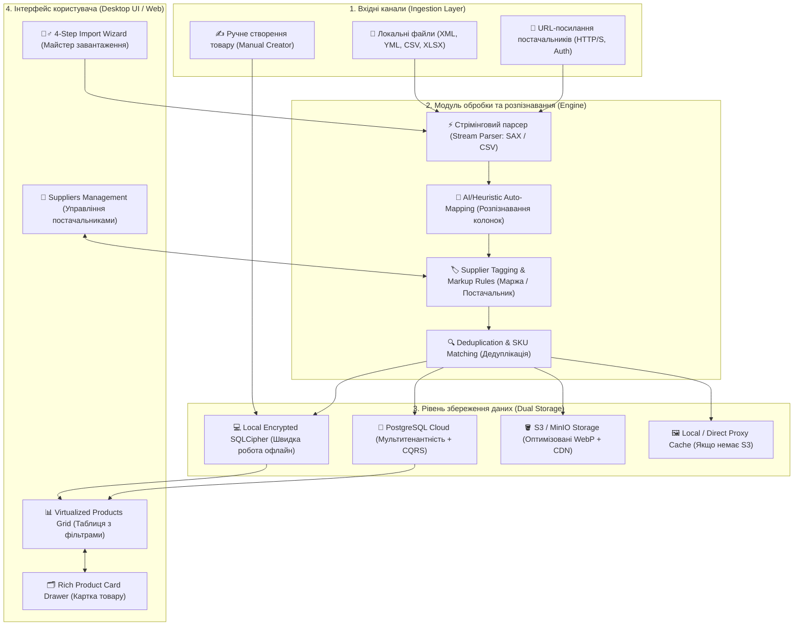

# 🌐 SmartFeed Studio — Головний Генеральний План: Каталоги, Товари, Постачальники та Обробка Фідів (Master Plan)

> **Статус:** 📋 **В процесі планування та погодження (Planning / Active)**  
> **Категорія:** `plans/active/`  
> **Версія:** 1.0.0  
> **Дата створення:** 29.08.2026  
> **Відповідальні модулі:** `apps/desktop`, `apps/admin-portal`, `services/backend-api`, `packages/shared`

---

## 🧭 1. Візія та Загальна Архітектура Системи

SmartFeed Studio — це високопродуктивна система для управління великими каталогами товарів (від 1 000 до 500 000+ SKU), автоматизації імпорту від десятків постачальників (URL-фіди, файли XML/YML/CSV/XLSX), локальної швидкої обробки на клієнті (Tauri + SQLCipher), синхронізації з хмарою (PostgreSQL + S3/MinIO), інтелектуального мапінгу та створення товарів вручну.

---

## 📑 2. Структура Детальних Підпланів (Sub-Plans Registry)

Кожен аспект системи винесено в окремий детальний технічний план з чітко розписаними задачами, контрактами та тестами:

| №      | Файл плану                                                                                                                                             | Призначення та ключові теми                                                                                                 |       Рівень       |
| :----- | :----------------------------------------------------------------------------------------------------------------------------------------------------- | :-------------------------------------------------------------------------------------------------------------------------- | :----------------: |
| **01** | [`01_suppliers_and_database_architecture.md`](file:///Users/oleg/AQA/SmartFeedStudio/plans/active/01_suppliers_and_database_architecture.md)           | **Бекенд-схема PostgreSQL, мультитенантність, сутність Постачальник, зв'язки товарів, локальний SQLCipher у Tauri**         |  🏗️ Backend / DB   |
| **02** | [`02_feed_ingestion_and_parsing_engine.md`](file:///Users/oleg/AQA/SmartFeedStudio/plans/active/02_feed_ingestion_and_parsing_engine.md)               | **Стрімінговий парсинг великих файлів (50k+ XML/CSV), авто-розпізнавання структури, мапінг полів, прив'язка постачальника** | ⚙️ Backend Engine  |
| **03** | [`03_image_storage_and_cdn_strategy.md`](file:///Users/oleg/AQA/SmartFeedStudio/plans/active/03_image_storage_and_cdn_strategy.md)                     | **Стратегія збереження фото: коли є S3/MinIO vs коли немає S3 (прямі посилання, локальний кеш, прев'ю, WebP)**              | 🖼️ Storage / Media |
| **04** | [`04_frontend_import_wizard_and_products_grid.md`](file:///Users/oleg/AQA/SmartFeedStudio/plans/active/04_frontend_import_wizard_and_products_grid.md) | **UI: Покроковий майстер імпорту, віртуалізована таблиця товарів, кастомні колонки, фільтри за постачальником/ціною**       |   💻 Frontend UI   |
| **05** | [`05_product_card_and_manual_creation_module.md`](file:///Users/oleg/AQA/SmartFeedStudio/plans/active/05_product_card_and_manual_creation_module.md)   | **Інтерактивна картка товару (drawer/tabs) та модуль ручного створення товару з динамічними характеристиками**              |   💻 UI & Logic    |
| **06** | [`06_roadmap_releases_and_testing_strategy.md`](file:///Users/oleg/AQA/SmartFeedStudio/plans/active/06_roadmap_releases_and_testing_strategy.md)       | **Розподіл на 4 релізи (MVP → Full Sync), критерії готовності (DoD), Jest E2E та Playwright тести**                         |  🚀 Roadmap & QA   |

---

## 🎯 3. Поетапний розподіл на релізи (Release Roadmap)

### 🔹 Реліз 1: Фундамент даних, Постачальники та Базовий Парсер (Core Ingestion MVP)

- **Бекенд / БД**: Моделі `Supplier`, `FeedSource`, `ProductCatalog`, `Product`, `ProductCategory`, `ProductImage`, `ProductAttribute` в PostgreSQL та SQLCipher.
- **Двигун обробки**: Стрімінговий парсер XML (Rozetka/Prom/Google), CSV, XLSX з прив'язкою до обраного `SupplierId`.
- **Фронтенд**: Сторінка управління постачальниками (CRUD + націнки), базовий імпорт файлу/посилання, відображення таблиці завантажених товарів.

### 🔹 Реліз 2: Інтерактивна Таблиця, Фільтрація та Картка Товару (UI Excellence & Product Card)

- **Таблиця товарів**: Віртуалізована таблиця (`@tanstack/react-table` + віртуалізація), миттєвий пошук, фільтрація за постачальником, категорією, наявністю, діапазоном цін.
- **Картка товару (Product Card)**: Висувна панель (Drawer) з табами: Загальне, Ціни/Маржа, Динамічні характеристики, Галерея фото, Сирі дані фіду.
- **Стратегія фото**: Відображення прямих посилань + fallback плейсхолдери + кешування в локальній файловій системі.

### 🔹 Реліз 3: Розумний Майстер Імпорту (Import Wizard) та S3 Медіа-Пайплайн

- **Майстер імпорту (4 кроки)**: Вибір постачальника → Автоматичне розпізнавання колонок з можливістю ручного перевизначення → Прев'ю валідації вибірки → Фоновий прогрес.
- **Медіа S3/MinIO**: Асинхронна черга (BullMQ) для оптимізації та завантаження фото в S3 (генерація WebP thumbnails 150x150, 600x600, original).
- **Автоматична синхронізація URL**: Фонове опитування фідів постачальників за розкладом (кожні N годин), оновлення залишків і цін.

### 🔹 Реліз 4: Модуль Ручного Створення Товару (Manual Creator) та Експорт

- **Ручне створення товару**: Повнофункціональна форма додавання товару з нуля, генератор артикулів/штрихкодів, конструктор характеристик, завантаження власних фото.
- **Масові операції**: Групова зміна цін, переприв'язка постачальника, масове видалення, експорт у готовий Rozetka XML / Prom YML / CSV.

---

## 🔒 4. Головні архітектурні принципи

1. **Мультитенантність та ізоляція постачальників**:
   - Кожен товар жорстко прив'язаний до `organizationId` (або `userId`) та конкретного `supplierId`.
   - Товари одного постачальника ніколи не перезаписують товари іншого, навіть якщо артикули збігаються (використовується складений унікальний ключ або префіксація постачальника).
2. **Dual-Speed Storage Architecture**:
   - **Tauri SQLCipher / SQLite**: Миттєва локальна фільтрація, сортування 50k+ товарів без мережевих затримок (0ms response).
   - **PostgreSQL CQRS**: Централізоване надійне збереження для командного доступу та синхронізації.
3. **Гібридне управління фотографіями**:
   - Працює ідеально **як з підключеним S3**, так і **повністю без S3** (через CDN-посилання постачальника + локальне дискове кешування).
4. **100% Локалізація (UA ⇄ EN)**:
   - Всі назви полів мапінгу, повідомлення про помилки парсингу, статуси та підказки перекладені в `locales/uk/*.json` та `locales/en/*.json`.
