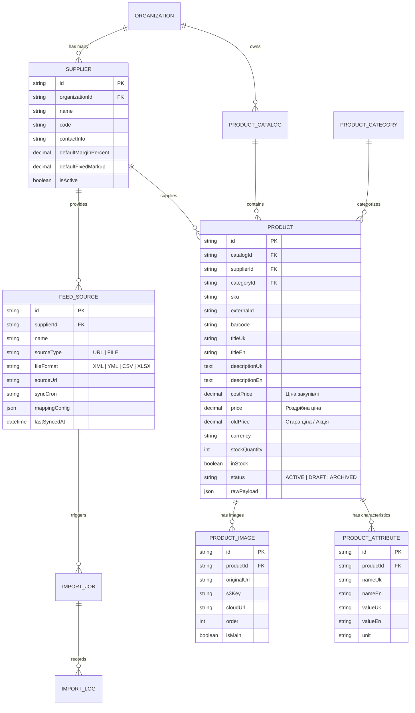

# 🏗️ Підплан 1: Архітектура Бази Даних, Постачальники та Зв'язки Товарів (Database & Suppliers Schema)

> **Статус:** 📋 **В процесі планування та погодження (Planning / Active)**  
> **Категорія:** `plans/active/`  
> **Батьківський план:** [`00_master_products_and_catalogs_plan.md`](00_master_products_and_catalogs_plan.md)  
> **Ціль:** Створити надійну, масштабовану та оптимізовану схему бази даних (PostgreSQL у хмарі + SQLCipher на клієнті), яка забезпечить повну ізоляцію даних за тенантами (організаціями) та постачальниками.

---

## 🧭 1. Концептуальна модель даних

Кожен каталог товарів складається з товарів, що належать конкретній організації або користувачу, та імпортовані або створені від імені певного **Постачальника (Supplier)**.



---

## 🗄️ 2. PostgreSQL Prisma Schema (`services/backend-api/prisma/schema.prisma`)

Відповідно до правил проекту ([`postgres_skills.md`](../../.agents/rules/postgres_skills.md)), схема містить:

1. **100% індексів зовнішніх ключів (`@@index([fkColumn])`)**.
2. **`timestamptz`** для всіх дат (`DateTime`).
3. **`@@map()`** та **`@map()`** у snake_case.
4. **GIN індекси з `pg_trgm`** для повнотекстового пошуку по назві, SKU та штрихкоду.
5. **Складені індекси** для швидкої фільтрації по `(supplierId, inStock, status)` та `(catalogId, price)`.

```prisma
// --- ENUMS ДЛЯ ТОВАРІВ ТА ФІДІВ ---

enum FeedSourceType {
  URL
  FILE
}

enum FeedFormat {
  XML_ROZETKA
  YML_PROM
  XML_GOOGLE
  XML_GENERIC
  CSV
  XLSX
}

enum ProductStatus {
  ACTIVE
  DRAFT
  ARCHIVED
}

enum ImportJobStatus {
  PENDING
  DOWNLOADING
  PARSING
  MAPPING
  SAVING
  COMPLETED
  FAILED
}

// --- СУТНІСТЬ: ПОСТАЧАЛЬНИК (SUPPLIER) ---
model Supplier {
  id                     String         @id @default(cuid())
  organizationId         String?        @map("organization_id")
  organization           Organization?  @relation(fields: [organizationId], references: [id], onDelete: Cascade)
  userId                 String         @map("user_id")
  user                   User           @relation(fields: [userId], references: [id], onDelete: Cascade)
  name                   String
  code                   String         // Унікальний код / префікс постачальника (напр. "SUP-01")
  contactPhone           String?        @map("contact_phone")
  contactEmail           String?        @map("contact_email")
  website                String?
  notes                  String?
  defaultMarginPercent   Decimal        @default(0) @db.Decimal(5, 2) @map("default_margin_percent")
  defaultFixedMarkup     Decimal        @default(0) @db.Decimal(10, 2) @map("default_fixed_markup")
  isActive               Boolean        @default(true) @map("is_active")
  createdAt              DateTime       @default(now()) @map("created_at")
  updatedAt              DateTime       @updatedAt @map("updated_at")

  feedSources            FeedSource[]
  products               Product[]

  @@unique([userId, code])
  @@index([organizationId])
  @@index([userId])
  @@index([isActive])
  @@index([name(ops: raw("gin_trgm_ops"))], type: Gin)
  @@map("suppliers")
}

// --- СУТНІСТЬ: ДЖЕРЕЛО ФІДУ (FEED SOURCE) ---
model FeedSource {
  id                     String         @id @default(cuid())
  supplierId             String         @map("supplier_id")
  supplier               Supplier       @relation(fields: [supplierId], references: [id], onDelete: Cascade)
  name                   String
  sourceType             FeedSourceType @default(URL) @map("source_type")
  fileFormat             FeedFormat     @default(XML_ROZETKA) @map("file_format")
  sourceUrl              String?        @map("source_url")
  s3FileKey              String?        @map("s3_file_key")
  authHeaderName         String?        @map("auth_header_name")
  authHeaderValue        String?        @map("auth_header_value")
  syncIntervalHours      Int            @default(0) @map("sync_interval_hours") // 0 = тільки вручну
  autoUpdatePrices       Boolean        @default(true) @map("auto_update_prices")
  autoUpdateStocks       Boolean        @default(true) @map("auto_update_stocks")
  autoCreateNewProducts  Boolean        @default(true) @map("auto_create_new_products")
  mappingRules           Json?          @map("mapping_rules") // Збережений шаблон мапінгу колонок
  lastSyncedAt           DateTime?      @map("last_synced_at")
  lastSyncStatus         String?        @map("last_sync_status")
  createdAt              DateTime       @default(now()) @map("created_at")
  updatedAt              DateTime       @updatedAt @map("updated_at")

  importJobs             ImportJob[]

  @@index([supplierId])
  @@index([sourceType])
  @@map("feed_sources")
}

// --- СУТНІСТЬ: КАТАЛОГ ТОВАРІВ (PRODUCT CATALOG) ---
model ProductCatalog {
  id             String         @id @default(cuid())
  organizationId String?        @map("organization_id")
  organization   Organization?  @relation(fields: [organizationId], references: [id], onDelete: Cascade)
  userId         String         @map("user_id")
  user           User           @relation(fields: [userId], references: [id], onDelete: Cascade)
  name           String
  description    String?
  isDefault      Boolean        @default(false) @map("is_default")
  createdAt      DateTime       @default(now()) @map("created_at")
  updatedAt      DateTime       @updatedAt @map("updated_at")

  products       Product[]
  categories     ProductCategory[]

  @@index([organizationId])
  @@index([userId])
  @@map("product_catalogs")
}

// --- СУТНІСТЬ: КАТЕГОРІЯ ТОВАРУ (PRODUCT CATEGORY) ---
model ProductCategory {
  id             String            @id @default(cuid())
  catalogId      String            @map("catalog_id")
  catalog        ProductCatalog    @relation(fields: [catalogId], references: [id], onDelete: Cascade)
  externalId     String?           @map("external_id") // ID категорії у фіді постачальника
  parentId       String?           @map("parent_id")
  parent         ProductCategory?  @relation("CategoryHierarchy", fields: [parentId], references: [id], onDelete: SetNull)
  children       ProductCategory[] @relation("CategoryHierarchy")
  nameUk         String            @map("name_uk")
  nameEn         String?           @map("name_en")
  order          Int               @default(0)
  createdAt      DateTime          @default(now()) @map("created_at")
  updatedAt      DateTime          @updatedAt @map("updated_at")

  products       Product[]

  @@index([catalogId])
  @@index([parentId])
  @@index([nameUk(ops: raw("gin_trgm_ops"))], type: Gin)
  @@map("product_categories")
}

// --- СУТНІСТЬ: ТОВАР (PRODUCT) ---
model Product {
  id             String            @id @default(cuid())
  catalogId      String            @map("catalog_id")
  catalog        ProductCatalog    @relation(fields: [catalogId], references: [id], onDelete: Cascade)
  supplierId     String            @map("supplier_id")
  supplier       Supplier          @relation(fields: [supplierId], references: [id], onDelete: Cascade)
  categoryId     String?           @map("category_id")
  category       ProductCategory?  @relation(fields: [categoryId], references: [id], onDelete: SetNull)

  sku            String            // Артикул товару
  externalId     String?           @map("external_id") // ID з файлу постачальника
  barcode        String?           // Штрихкод (EAN-13, UPC)
  vendorCode     String?           @map("vendor_code") // Артикул виробника

  titleUk        String            @map("title_uk")
  titleEn        String?           @map("title_en")
  descriptionUk  String?           @db.Text @map("description_uk")
  descriptionEn  String?           @db.Text @map("description_en")
  vendor         String?           // Бренд / Виробник

  costPrice      Decimal           @default(0) @db.Decimal(12, 2) @map("cost_price") // Закупівельна ціна
  price          Decimal           @default(0) @db.Decimal(12, 2) // Роздрібна ціна
  oldPrice       Decimal?          @db.Decimal(12, 2) @map("old_price") // Стара ціна для акцій
  currency       String            @default("UAH")

  stockQuantity  Int               @default(0) @map("stock_quantity")
  inStock        Boolean           @default(true) @map("in_stock")
  status         ProductStatus     @default(ACTIVE)

  rawPayload     Json?             @map("raw_payload") // Збережений оригінальний об'єкт з фіду
  createdAt      DateTime          @default(now()) @map("created_at")
  updatedAt      DateTime          @updatedAt @map("updated_at")

  images         ProductImage[]
  attributes     ProductAttribute[]

  @@unique([catalogId, supplierId, sku])
  @@index([catalogId])
  @@index([supplierId])
  @@index([categoryId])
  @@index([sku])
  @@index([barcode])
  @@index([inStock, status])
  @@index([price])
  @@index([createdAt])
  @@index([titleUk(ops: raw("gin_trgm_ops"))], type: Gin)
  @@index([sku(ops: raw("gin_trgm_ops"))], type: Gin)
  @@map("products")
}

// --- СУТНІСТЬ: ЗОБРАЖЕННЯ ТОВАРУ (PRODUCT IMAGE) ---
model ProductImage {
  id             String         @id @default(cuid())
  productId      String         @map("product_id")
  product        Product        @relation(fields: [productId], references: [id], onDelete: Cascade)
  originalUrl    String         @map("original_url") // Пряме посилання з фіду
  cloudUrl       String?        @map("cloud_url")    // S3/Cloudflare R2 URL (якщо S3 підключено)
  s3Key          String?        @map("s3_key")
  thumbnailUrl   String?        @map("thumbnail_url")
  order          Int            @default(0)
  isMain         Boolean        @default(false) @map("is_main")
  createdAt      DateTime       @default(now()) @map("created_at")

  @@index([productId])
  @@index([isMain])
  @@map("product_images_v2")
}

// --- СУТНІСТЬ: ХАРАКТЕРИСТИКА / АТРИБУТ ТОВАРУ (PRODUCT ATTRIBUTE) ---
model ProductAttribute {
  id             String         @id @default(cuid())
  productId      String         @map("product_id")
  product        Product        @relation(fields: [productId], references: [id], onDelete: Cascade)
  nameUk         String         @map("name_uk")
  nameEn         String?        @map("name_en")
  valueUk        String         @map("value_uk")
  valueEn        String?        @map("value_en")
  unit           String?        // Одиниця виміру (напр. "см", "кг", "W")
  order          Int            @default(0)

  @@index([productId])
  @@index([nameUk])
  @@map("product_attributes")
}

// --- СУТНІСТЬ: ЗАВДАННЯ ІМПОРТУ (IMPORT JOB) ---
model ImportJob {
  id             String          @id @default(cuid())
  feedSourceId   String          @map("feed_source_id")
  feedSource     FeedSource      @relation(fields: [feedSourceId], references: [id], onDelete: Cascade)
  status         ImportJobStatus @default(PENDING)
  totalItems     Int             @default(0) @map("total_items")
  processedItems Int             @default(0) @map("processed_items")
  createdItems   Int             @default(0) @map("created_items")
  updatedItems   Int             @default(0) @map("updated_items")
  failedItems    Int             @default(0) @map("failed_items")
  errorLogs      Json?           @map("error_logs")
  startedAt      DateTime?       @map("started_at")
  completedAt    DateTime?       @map("completed_at")
  createdAt      DateTime        @default(now()) @map("created_at")

  @@index([feedSourceId])
  @@index([status])
  @@index([createdAt])
  @@map("import_jobs")
}
```

---

## 💻 3. Локальна схема SQLCipher у клієнті Desktop (`rusqlite`)

Для забезпечення миттєвої фільтрації (0ms response) та роботи без інтернету, Desktop-клієнт створює ідентичну структуру в зашифрованій базі SQLite:

```sql
CREATE TABLE IF NOT EXISTS suppliers (
    id TEXT PRIMARY KEY,
    name TEXT NOT NULL,
    code TEXT NOT NULL,
    default_margin_percent REAL DEFAULT 0,
    default_fixed_markup REAL DEFAULT 0,
    is_active INTEGER DEFAULT 1,
    created_at TEXT NOT NULL
);

CREATE TABLE IF NOT EXISTS products (
    id TEXT PRIMARY KEY,
    catalog_id TEXT NOT NULL,
    supplier_id TEXT NOT NULL,
    category_id TEXT,
    sku TEXT NOT NULL,
    external_id TEXT,
    barcode TEXT,
    vendor_code TEXT,
    title_uk TEXT NOT NULL,
    title_en TEXT,
    description_uk TEXT,
    cost_price REAL DEFAULT 0,
    price REAL DEFAULT 0,
    old_price REAL,
    currency TEXT DEFAULT 'UAH',
    stock_quantity INTEGER DEFAULT 0,
    in_stock INTEGER DEFAULT 1,
    status TEXT DEFAULT 'ACTIVE',
    raw_payload TEXT,
    created_at TEXT NOT NULL,
    updated_at TEXT NOT NULL,
    FOREIGN KEY(supplier_id) REFERENCES suppliers(id)
);

CREATE INDEX IF NOT EXISTS idx_products_sku ON products(sku);
CREATE INDEX IF NOT EXISTS idx_products_supplier_stock ON products(supplier_id, in_stock);
CREATE INDEX IF NOT EXISTS idx_products_price ON products(price);
```

---

## 🏛 4. CQRS Архітектура бекенду (`services/backend-api/src/modules/`)

Створюємо два нові ізольовані CQRS модулі:

1. **`SuppliersModule`**:
   - Commands: `CreateSupplierCommand`, `UpdateSupplierCommand`, `DeleteSupplierCommand`, `ToggleSupplierStatusCommand`.
   - Queries: `GetSuppliersQuery`, `GetSupplierByIdQuery`, `GetSupplierStatsQuery`.
2. **`ProductsModule`**:
   - Commands: `CreateProductCommand`, `UpdateProductCommand`, `DeleteProductCommand`, `BulkUpdateProductsPriceCommand`, `BulkDeleteProductsCommand`.
   - Queries: `GetProductsQuery` (з пагінацією, GIN-пошуком, фільтром по постачальнику, ціні, категорії), `GetProductByIdQuery`, `GetProductStatsQuery`.
