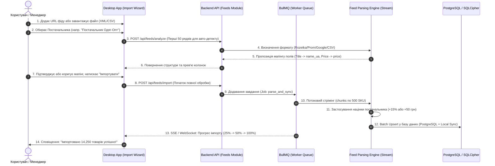

# ⚙️ Підплан 2: Двигун Обробки Фідів, Стрімінговий Парсинг та Розпізнавання Структури (Feed Ingestion & Parsing Engine)

> **Статус:** 📋 **В процесі планування та погодження (Planning / Active)**  
> **Категорія:** `plans/active/`  
> **Батьківський план:** [`00_master_products_and_catalogs_plan.md`](file:///Users/oleg/AQA/SmartFeedStudio/plans/active/00_master_products_and_catalogs_plan.md)  
> **Ціль:** Створити високопродуктивний асинхронний стрімінговий рушій для обробки та розпізнавання фідів будь-яких розмірів (від 100 до 100 000+ SKU) у форматах XML (Rozetka, Prom, Google Merchant), CSV, XLSX без переповнення пам'яті (OOM) та з автоматичним мапінгом колонок.

---

## 🧭 1. Архітектурний Пайплайн Обробки (Ingestion Pipeline)



---

## 🔍 2. Детектор Форматів та Автоматичне Розпізнавання (Smart Auto-Mapping)

Двигун автоматично аналізує структуру вхідного документа та визначає відповідність полів за евристичними словниками синонімів:

### Таблиця розпізнавання стандартних схем:

| Цільове поле (`Product`)        | Rozetka XML (`offer`)                 | Prom YML (`offer`)              | Google Merchant (`item`)                      | CSV / Excel типові заголовки                         |
| :------------------------------ | :------------------------------------ | :------------------------------ | :-------------------------------------------- | :--------------------------------------------------- |
| **`sku`** / Артикул             | `offer.vendorCode`, `offer.@id`       | `offer.vendorCode`, `offer.@id` | `g:id`, `g:mpn`                               | `Артикул`, `Код товару`, `SKU`, `Code`, `id`         |
| **`titleUk`** / Назва           | `offer.name`, `offer.name_ua`         | `offer.name`, `offer.name_ua`   | `g:title`                                     | `Назва`, `Найменування`, `Title`, `Name`, `Товар`    |
| **`price`** / Ціна              | `offer.price`                         | `offer.price`                   | `g:price`                                     | `Ціна`, `Ціна роздрібна`, `Price`, `Cost`            |
| **`costPrice`** / Закупівля     | `offer.price_cost`, `offer.cost`      | `offer.price_cost`              | `g:cost_of_goods_sold`                        | `Закупівля`, `Ціна входу`, `Опт`, `Wholesale`        |
| **`stockQuantity`** / Кількість | `offer.quantity`                      | `offer.quantity`                | `g:quantity`                                  | `Кількість`, `Залишок`, `Stock`, `Qty`, `Остаток`    |
| **`inStock`** / Наявність       | `offer.@available` ("true"/"false")   | `offer.@available`              | `g:availability` ("in_stock")                 | `Наявність`, `Статус`, `Доступний`, `Status`         |
| **`categoryId`** / Категорія    | `offer.categoryId` → `category.@id`   | `offer.categoryId`              | `g:product_type`, `g:google_product_category` | `Категорія`, `Розділ`, `Category`, `Група`           |
| **`vendor`** / Бренд            | `offer.vendor`                        | `offer.vendor`                  | `g:brand`                                     | `Бренд`, `Виробник`, `Brand`, `Manufacturer`         |
| **`barcode`** / Штрихкод        | `offer.barcode`                       | `offer.barcode`                 | `g:gtin`                                      | `Штрихкод`, `EAN`, `Barcode`, `GTIN`, `UPC`          |
| **`descriptionUk`** / Опис      | `offer.description`, `description_ua` | `offer.description`             | `g:description`                               | `Опис`, `Характеристики`, `Description`, `Text`      |
| **`images`** / Фотографії       | `offer.picture` (масив URL)           | `offer.picture` (масив URL)     | `g:image_link`, `g:additional_image_link`     | `Фото`, `Зображення`, `Images`, `Picture`, `Image 1` |
| **`attributes`** / Параметри    | `offer.param` (`@name` + значення)    | `offer.param`                   | Всі додаткові теги                            | Окремі колонки або колонка `Характеристики`          |

---

## ⚡ 3. Стрімінгова обробка файлів (Stream Parsers Architecture)

Для запобігання падінню пам'яті Node.js при файлах розміром 100MB – 1GB, використовуються виключно стрімінгові парсери:

1. **XML / YML (Streaming SAX Parser)**:
   - Бібліотека: `sax-ts` або `fast-xml-parser` у режимі стрімінгу через `createReadStream`.
   - Читання тегів `<category>` для побудови дерева категорій у пам'яті.
   - Читання кожного окремого вузла `<offer>` або `<item>`, нормалізація та скидання в буфер розміром 500 товарів.
2. **CSV (Stream Parser)**:
   - Бібліотека: `csv-parser` або `@fast-csv/parse` з автоматичним визначенням роздільника (`,`, `;`, `\t`, `|`).
   - Автоматичне виявлення кодування (`UTF-8`, `Windows-1251`).
3. **XLSX (Exceljs / xlsx-stream-reader)**:
   - Порядковий стрім рядків з листа без завантаження всієї таблиці в оперативну пам'ять.

---

## 🏷️ 4. Логіка Прив'язки Постачальника, Націнки та Дедуплікації

### 1. Ізоляція за постачальником:

- Кожен імпортований товар отримує обов'язкове поле `supplierId`.
- Унікальність формується як `(catalogId, supplierId, sku)`. Це гарантує:
  - Постачальник А з товаром `SKU-100` не затирає товар `SKU-100` від Постачальника Б.
  - У таблиці товарів користувач бачить бейджі постачальників: `[Одяг-Опт] Футболка біла` та `[Fashion-Hub] Футболка біла`.

### 2. Автоматичний розрахунок цін (Markup Engine):

- Якщо у постачальника налаштована націнка:
  - `defaultMarginPercent`: наприклад, `20%`
  - `defaultFixedMarkup`: наприклад, `50 UAH`
- При імпорті:
  ```typescript
  // Ціна з фіду стає собівартістю (закупівлею)
  product.costPrice = parsedPriceFromFeed;

  // Роздрібна ціна розраховується за правилом
  product.price =
    product.costPrice * (1 + supplier.defaultMarginPercent / 100) + supplier.defaultFixedMarkup;

  // Округлення до цілого або до красивих закінчень (напр. 99 грн)
  product.price = Math.round(product.price);
  ```

---

## 📋 5. Життєвий Цикл Завдання Імпорту (Import Job Lifecycle)

Кожен запуск імпорту створює запис у таблиці `ImportJob` зі станами:

1. `DOWNLOADING` — завантаження файлу за URL у тимчасове сховище або S3.
2. `PARSING` — стрімінговий аналіз та валідація рядків.
3. `MAPPING` — трансформація колонок за обраним конфігом.
4. `SAVING` — пакетний запис (Batch Upsert) у базу (по 500 записів в транзакції).
5. `COMPLETED` — успішне завершення зі звітом:
   - Скільки всього знайдено в файлі (`totalItems`).
   - Скільки нових створено (`createdItems`).
   - Скільки існуючих оновлено (`updatedItems` — ціни/залишки).
   - Скільки рядків пропущено через помилки (`failedItems` + журнал `errorLogs`).
