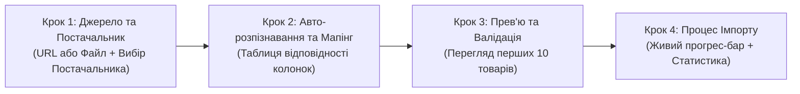

# 💻 Підплан 4: Інтерфейс Майстра Імпорту та Віртуалізована Таблиця Товарів (Frontend Import Wizard & Products Grid)

> **Статус:** 📋 **В процесі планування та погодження (Planning / Active)**  
> **Категорія:** `plans/active/`  
> **Батьківський план:** [`00_master_products_and_catalogs_plan.md`](file:///Users/oleg/AQA/SmartFeedStudio/plans/active/00_master_products_and_catalogs_plan.md)  
> **Ціль:** Створити преміальний, зручний та блискавичний користувацький інтерфейс (`apps/desktop` та `apps/admin-portal`) для покрокового імпорту фідів, детального мапінгу колонок, віртуалізованого перегляду 50k+ товарів та гнучкої фільтрації.

---

## 🧙‍♂️ 1. Покроковий Майстер Імпорту (4-Step Import Wizard)

Майстер імпорту реалізовано як повнорозмірне модальне вікно або майстер-екран із покроковою навігацією (Stepper):



### 🔹 Крок 1: Вибір Джерела та Постачальника (`StepSourceAndSupplier.tsx`)

- **Вибір постачальника**: Селектор із випадаючим списком існуючих постачальників + кнопка `+ Додати постачальника` на льоту.
- **Вкладки типу джерела**:
  - **📁 Завантажити файл**: Drag & Drop зона для файлів XML, YML, CSV, XLSX з індикатором розміру та валідацією формату.
  - **🔗 Посилання на фід (URL)**: Поле введення URL-посилання з можливістю налаштування HTTP-заголовків (напр. Bearer Token, Basic Auth).
- **Кнопка переходу**: «Аналізувати структуру фідy →» (викликає бекенд-аналізатор).

### 🔹 Крок 2: Інтелектуальний Мапінг Полів (`StepColumnMapping.tsx`)

- **Індикатор впевненості розпізнавання**: Система показує бейдж: `🟢 Розпізнано автоматично (98% збіг)` для Rozetka/Prom/Google схем.
- **Таблиця зіставлення колонок**:
  | Цільове поле товару     | Колонка у вашому файлі                         | Приклад значення з файлу       |     Статус      |
  | :---------------------- | :--------------------------------------------- | :----------------------------- | :-------------: |
  | **Артикул (SKU)** `*`   | `vendorCode` ▾                                 | `TSHIRT-WHITE-L`               | ✅ Обов'язкове  |
  | **Назва товару** `*`    | `name_ua` ▾                                    | `Футболка бавовняна біла`      | ✅ Обов'язкове  |
  | **Ціна закупівлі**      | `price` ▾                                      | `250.00`                       |    ⚡ З фіду    |
  | **Ціна роздрібна**      | _Розрахувати за націнкою постачальника (+20%)_ | `300.00`                       |     🧮 Авто     |
  | **Наявність / Залишок** | `available` / `quantity` ▾                     | `true` (В наявності)           |     ✅ Збіг     |
  | **Категорія**           | `category_name` ▾                              | `Чоловічий одяг`               |    📁 Дерево    |
  | **Фотографії**          | `picture` (масив) ▾                            | `https://cdn.../1.jpg`         |    🖼️ 4 фото    |
  | **Характеристики**      | `param` (теги) ▾                               | `Розмір: L, Матеріал: Бавовна` | 🏷️ 6 параметрів |
- Можливість зберегти цей мапінг як **шаблон для повторного використання**.

### 🔹 Крок 3: Прев'ю та Попередня Валідація (`StepDataPreview.tsx`)

- Таблиця реального попереднього перегляду перших 10 товарів у тому вигляді, як вони будуть створені в системі.
- Валідаційні підказки:
  - 🟢 _Всі обов'язкові поля заповнені._
  - ⚠️ _У 2 товарах відсутній опис (буде згенеровано заголовок)._
  - ⚠️ _Ціна розрахована з урахуванням націнки постачальника «Одяг-Опт» (+20% = +50 грн)._

### 🔹 Крок 4: Запуск Імпорту та Живий Прогрес (`StepImportProgress.tsx`)

- Анімований радіальний або лінійний прогрес-бар (0% → 100%).
- Лічильники реального часу: `Оброблено: 12,450 / 14,250`, `Створено: 11,200`, `Оновлено: 1,250`, `Помилок: 0`.
- Кнопка: `Перейти до каталогу товарів` після завершення.

---

## 📊 2. Віртуалізована Таблиця Товарів (Products Grid)

Для роботи з каталогами на 10 000 – 100 000+ SKU використовується віртуалізація рядків (`@tanstack/react-table` + `@tanstack/react-virtual`), що рендерить лише видимі на екрані 20-30 рядків, забезпечуючи 60 FPS при скролі.

### 🎨 Анатомія Таблиці Товарів:

```text
┌──────────────────────────────────────────────────────────────────────────────────────────────────┐
│ [🔍 Пошук за назвою, SKU, штрихкодом...] [🏷️ Всі постачальники ▾] [📁 Категорії ▾] [💰 Ціна ▾]   │
├──────────────────────────────────────────────────────────────────────────────────────────────────┤
│ ☑️ [Дії з вибраними (12):  [Змінити ціну]  [Переприв'язати постачальника]  [Експорт]  [Видалити]] │
├─────┬──────────┬──────────────┬──────────────────┬──────────────┬────────┬────────┬───────┬──────────┤
│ [ ] │ Фото     │ SKU / Код    │ Назва товару     │ Постачальник │ Закуп. │ Роздр. │ Склад │ Дії      │
├─────┼──────────┼──────────────┼──────────────────┼──────────────┼────────┼────────┼───────┼──────────┤
│ [x] │ 🖼️ [img] │ TSHIRT-01    │ Футболка бавовна │ [Одяг-Опт]   │ 250 ₴  │ 350 ₴  │ 🟢 42 │ [👁️] [✏️]│
│ [ ] │ 🖼️ [img] │ SHOE-992     │ Кросівки Sport   │ [Nike-Distr] │ 1800 ₴ │ 2499 ₴ │ 🟢 8  │ [👁️] [✏️]│
│ [ ] │ 🖼️ [img] │ CAP-102      │ Кепка літня      │ [Одяг-Опт]   │ 120 ₴  │ 199 ₴  │ 🔴 0  │ [👁️] [✏️]│
└─────┴──────────┴──────────────┴──────────────────┴──────────────┴────────┴────────┴───────┴──────────┘
```

### 🔹 Ключові функціональні колонки:

1. **Чекбокс вибору (`Selection`)**: Одиничний вибір або вибір усіх (Select All).
2. **Мініатюра фото (`Image`)**: Легке прев'ю 40x40px з hover-збільшенням та підтримкою плейсхолдера.
3. **Артикул та Код (`SKU & Barcode`)**: Моноширинний шрифт, копіювання в буфер в один клік.
4. **Назва та Категорія (`Title & Category`)**: Назва товару з підсвіткою пошукових збігів + бейдж категорії.
5. **Бейдж Постачальника (`Supplier Badge`)**: Кольоровий фірмовий бейдж постачальника (напр. `[Одяг-Опт]`, `[Rozetka-Feed]`).
6. **Ціновий блок (`Cost / Retail / Margin`)**:
   - Закупівельна ціна (собівартість).
   - Роздрібна ціна (зі статусом знижки/акції).
   - Індикатор маржинальності (`+40% / +100 ₴`).
7. **Залишок та Наявність (`Stock`)**:
   - `🟢 В наявності (42 шт.)`
   - `🟡 Закінчується (2 шт.)`
   - `🔴 Немає в наявності (0 шт.)`
8. **Швидкі дії (`Actions`)**: Клік по рядку відкриває висувну картку товару (Drawer), кнопка редагування, дублювання, видалення.

---

## 🎛️ 3. Панель Швидких Фільтрів (Faceted Filter Toolbar)

- **Повнотекстовий пошук (GIN trgm)**: Миттєва фільтрація без очікування перезавантаження сторінки.
- **Фільтр за постачальниками**: Випадаючий мульти-селект із бейджами та кількістю товарів по кожному постачальнику.
- **Фільтр за категоріями**: Каскадне дерево категорій (Category Tree Picker).
- **Слайдер діапазону цін**: Вибір мінімальної та максимальної ціни (Min — Max ₴).
- **Фільтр наявності**: `Всі`, `Тільки в наявності`, `Немає в наявності`, `Закінчуються (< 5)`.
- **Налаштування колонок (Column Visibility)**: Дропдаун, що дозволяє приховувати або показувати будь-які колонки (наприклад: Barcode, Vendor, Old Price, Created At).
