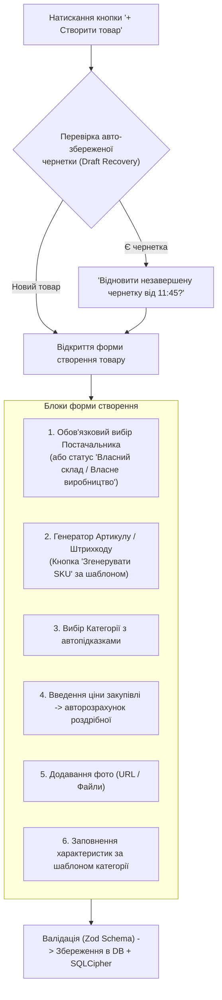

# 🗂️ Підплан 5: Картка Товару та Модуль Ручного Створення (Product Card & Manual Creator Module)

> **Статус:** 📋 **В процесі планування та погодження (Planning / Active)**  
> **Категорія:** `plans/active/`  
> **Батьківський план:** [`00_master_products_and_catalogs_plan.md`](00_master_products_and_catalogs_plan.md)  
> **Ціль:** Створити багатофункціональну інтерактивну картку перегляду/редагування товару (Drawer/Modal) та повноцінний автономний модуль створення товару вручну з підтримкою динамічних характеристик, генерації артикулів та мультиязичності.

---

## 🗂️ 1. Інтерактивна Картка Товару (Product Details Drawer)

Картка товару відкривається як елегантна бічна панель (Sheet / Drawer) праворуч при кліку на будь-який рядок у таблиці товарів:

```text
┌─────────────────────────────────────────────────────────────────────────────┐
│ [← Назад до списку]    Картка товару: SKU-10492             [Зберегти] [✕] │
├─────────────────────────────────────────────────────────────────────────────┤
│ 🏷️ [Одяг-Опт]   🟢 В наявності (42 шт.)   💰 350.00 ₴ (Маржа: +100 ₴ / 40%) │
├─────────────────────────────────────────────────────────────────────────────┤
│ [📝 Загальне]  [💰 Ціни та Маржа]  [🏷️ Характеристики]  [🖼️ Фото (4)]  [⚙️ Фід] │
├─────────────────────────────────────────────────────────────────────────────┤
│ • Назва (UA): [ Футболка бавовняна класична біла                         ]  │
│ • Назва (EN): [ Classic Cotton T-Shirt White                             ]  │
│ • Бренд:      [ Nike                ]   • Штрихкод: [ 4820000000000      ]  │
│ • Категорія:  [ Чоловічий одяг > Футболки та поло                      ▾]  │
│ • Опис (UA):  ┌─────────────────────────────────────────────────────────┐  │
│               │ Високоякісна бавовняна футболка для повсякденного носіння│  │
│               │ [B] [I] [U] [Список]                                    │  │
│               └─────────────────────────────────────────────────────────┘  │
└─────────────────────────────────────────────────────────────────────────────┘
```

### 🔹 Структура Вкладок (Tabs) Картки Товару:

1. **Вкладка «📝 Загальна інформація»**:
   - Назва товару двома мовами (`titleUk`, `titleEn`).
   - Артикул (`sku`), Артикул виробника (`vendorCode`), Штрихкод (`barcode` EAN-13).
   - Бренд / Виробник (`vendor`).
   - Каскадний вибір категорії з хлібними крихтами.
   - Форматований багатий опис (`descriptionUk`, `descriptionEn`) з підтримкою Markdown/HTML.
   - Статус товару (`ACTIVE`, `DRAFT`, `ARCHIVED`).

2. **Вкладка «💰 Ціни, Валюти та Маржа»**:
   - **Закупівельна ціна (Собівартість)**: `costPrice` з фіду постачальника.
   - **Роздрібна ціна**: `price` (можливість зафіксувати ціну вручну або ввімкнути авто-розрахунок).
   - **Стара ціна**: `oldPrice` (для відображення акцій та перекресленої ціни на маркетплейсах).
   - **Калькулятор маржі**:
     - Чистий прибуток: `350 ₴ - 250 ₴ = 100 ₴`.
     - Відсоток націнки: `+40.0%`.
   - **Правило постачальника**: Підказка: _«Застосовано націнку постачальника [Одяг-Опт]: +20% + 50 грн»_.

3. **Вкладка «🏷️ Динамічні Характеристики (Параметри)»**:
   - Таблиця пар `Назва характеристики` — `Значення` — `Одиниця виміру`.
   - Приклади: `Розмір` → `XL`, `Колір` → `Білий`, `Матеріал` → `100% Бавовна`, `Вага` → `200 г`.
   - Кнопка `+ Додати параметр`.
   - Швидкі шаблони за категорією: натискання кнопки «Застосувати шаблон [Одяг]» автоматично додає порожні поля: `Розмір`, `Колір`, `Склад`, `Сезон`, `Стать`.

4. **Вкладка «🖼️ Медіа Галерея»**:
   - Перегляд мініатюр усіх фотографій.
   - Drag & Drop зміна порядку фото (перше фото завжди головне — `isMain`).
   - Додавання нового фото: через URL або завантаження локального файлу з диска.
   - Відображення статусу оптимізації S3 (наявність WebP мініатюри та хмарного посилання).

5. **Вкладка «⚙️ Джерело Фіду та Історія»**:
   - Назва постачальника та посилання на джерело фіду.
   - Дата останньої синхронізації.
   - Перегляд сирого JSON/XML фрагмента оригінального товару з файлу (`rawPayload`).
   - Журнал змін ціни та залишків (Price & Stock Diff History).

---

## ✍️ 2. Модуль Ручного Створення Товару (Manual Product Creator)

Створення товару з нуля — це окремий великий розділ системи, оптимізований для швидкого заповнення без зайвої рутини:



### 🔹 Ключові фічі створення товару:

1. **Захист від втрати даних (Auto-Draft Save)**:
   - Форма автоматично зберігає кожен введений символ у `localStorage/IndexedDB`.
   - Якщо користувач випадково закрив вкладку або браузер, при наступному відкритті з'являється пропозиція: _«Відновити заповнені дані товару?»_.
2. **Розумний Генератор Артикулів (`SKU Generator`)**:
   - Кнопка `[⚡ Згенерувати SKU]`: автоматично формує унікальний код за правилом:  
     `{ПРЕФІКС_ПОСТАЧАЛЬНИКА}-{КОД_КАТЕГОРІЇ}-{НОМЕР}` (наприклад: `SUP01-TSH-00421`).
   - Кнопка `[⚡ Згенерувати EAN-13]`: генерує валідний 13-значний штрихкод із коректною контрольною сумою для внутрішнього маркування.
3. **Прив'язка до Постачальника або Власного Виробництва**:
   - Товар обов'язково прив'язується до постачальника для збереження мультитенантної структури.
   - За замовчуванням доступний системний постачальник: `[Власний склад / SmartFeed]`.
4. **Копіювання та Дублювання («Створити схожий»)**:
   - Кнопка «Дублювати товар»: копіює всі характеристики, категорію, опис та фото, генеруючи новий SKU. Зручно для створення лінійки товарів різних розмірів або кольорів.
