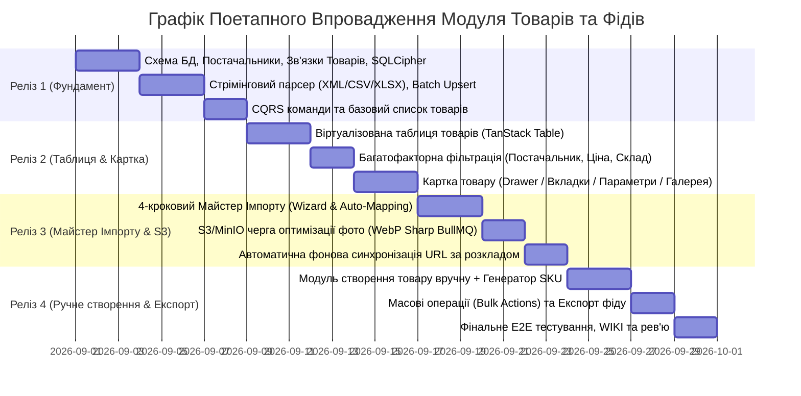

# 🚀 Підплан 6: Поетапна Дорожня Карта Релізів, Критерії Готовності та Стратегія Тестування (Roadmap & QA Strategy)

> **Статус:** 📋 **В процесі планування та погодження (Planning / Active)**  
> **Категорія:** `plans/active/`  
> **Батьківський план:** [`00_master_products_and_catalogs_plan.md`](file:///Users/oleg/AQA/SmartFeedStudio/plans/active/00_master_products_and_catalogs_plan.md)  
> **Ціль:** Структурувати поетапне впровадження функціоналу завантаження, обробки, фільтрації та створення товарів на 4 контрольовані релізи з чіткими критеріями готовності (Definition of Done) та 100% покриттям автоматизованими тестами.

---

## 🎯 1. Детальна Розбивка на 4 Релізи

---

## 📦 2. Детальний Зміст Кожного Релізу

### 🔹 Реліз 1: Фундамент даних, Постачальники та Стрімінговий Парсинг (Core MVP)

1. **База даних (`schema.prisma` + SQLCipher)**:
   - Створення моделей: `Supplier`, `FeedSource`, `ProductCatalog`, `Product`, `ProductCategory`, `ProductImage`, `ProductAttribute`, `ImportJob`.
   - Налаштування 100% FK-індексів, CUID-ідентифікаторів, GIN trgm для швидкого пошуку.
2. **Бекенд CQRS (`SuppliersModule` + `FeedsModule`)**:
   - CRUD для постачальників: створення, редагування правил націнки (% та фіксована сума), статус.
   - Стрімінговий парсер для XML (Rozetka, Prom, Google), CSV та XLSX без OOM-падінь.
   - Базовий ендпоінт `POST /api/feeds/import-file` з прив'язкою до `supplierId`.
3. **UI Desktop**:
   - Сторінка «Постачальники» (`SuppliersPage.tsx`): список, додавання постачальника, налаштування націнки.

---

### 🔹 Реліз 2: Інтерактивна Таблиця Товарів, Фільтри та Картка Товару (UI & Card)

1. **Віртуалізована таблиця (`ProductsTable.tsx`)**:
   - Швидкий рендеринг 50k+ записів через `@tanstack/react-virtual`.
   - Бейджі постачальників, собівартість vs роздрібна ціна, індикатор наявності.
   - Налаштування видимості колонок (Column Visibility).
2. **Панель швидкої фільтрації**:
   - Миттєвий пошук, фільтр за постачальниками (Multi-select), деревом категорій, ціною та залишками.
3. **Картка товару (`ProductDrawer.tsx`)**:
   - 5 вкладок: Загальне, Ціни/Маржа, Характеристики, Медіа-галерея, Джерело фіду.
   - Відображення фото за прямими посиланнями + розумний локальний кеш у десктопі.

---

### 🔹 Реліз 3: 4-Кроковий Майстер Імпорту та S3 Медіа-Пайплайн (Smart Import & S3)

1. **Майстер імпорту (`ImportWizardModal.tsx`)**:
   - Крок 1: Вибір джерела (Файл або URL) + Постачальник.
   - Крок 2: Авто-розпізнавання структури та інтерактивний мапінг полів.
   - Крок 3: Прев'ю валідації перших 10 товарів.
   - Крок 4: Живий анімований прогрес-бар імпорту зі статистикою.
2. **Пайплайн обробки фото (S3 / MinIO)**:
   - Фоновий воркер `BullMQ` для конвертації та стиснення фото у формат `WebP` (150x150, 600x600, original).
   - Генерація CDN-посилань.
3. **Автоматична синхронізація за розкладом**:
   - Періодичне опитування URL-фідів кожні N годин для автоматичного оновлення залишків і цін.

---

### 🔹 Реліз 4: Модуль Ручного Створення Товару, Масові Операції та Експорт (Manual & Export)

1. **Форма створення товару вручну (`CreateProductModal.tsx`)**:
   - Авто-збереження чернетки (Draft Recovery).
   - Генератор унікальних SKU за шаблоном та валідатор EAN-13 штрихкодів.
   - Динамічний конструктор параметрів/характеристик за шаблоном категорії.
   - Завантаження власних фотографій та вставка посилань.
2. **Масові дії (Bulk Actions)**:
   - Масова зміна цін / націнки для вибраних товарів.
   - Масове видалення та зміна статусу (Active / Draft).
   - Експорт відфільтрованих товарів у Rozetka XML / Prom YML / CSV.

---

## 🧪 3. Стратегія Тестування та Критерії Готовності (DoD)

Кожен реліз супроводжується повним циклом перевірки якості:

### 1. Backend Jest E2E тести (`services/backend-api/test/`):

- `suppliers.e2e-spec.ts`: Тести створення постачальників, націнок, мультитенантності та доступу за ролями.
- `feeds-parsing.e2e-spec.ts`: Тести стрімінгового парсингу різних форматів (Rozetka XML, Prom YML, CSV, XLSX).
- `products.e2e-spec.ts`: Тести пагінації, GIN-пошуку, розрахунку маржі, створення та оновлення товарів.
- **Обов'язковий `cleanDatabase` teardown**: 100% очищення всіх створених товарів, категорій, постачальників та фідів без залишення сміття в БД.

### 2. Frontend Playwright E2E тести (`apps/desktop/e2e/`, `apps/admin-portal/e2e/`):

- Тести проходження 4-крокового майстра імпорту.
- Тести віртуалізації та скролу великої таблиці товарів (1000+ рядків).
- Тести відкриття картки товару, редагування цін та характеристик.
- Тести створення товару вручну та перевірка відновлення чернетки.
- **Двомовні тести (UA ⇄ EN)**: Перевірка коректного перекладу всіх кнопок, колонок, помилок та підказок при перемиканні мов.
- **Тести запобігання дублюванню запитів**: Перевірка, що ендпоінти списку товарів викликаються суворо 1 раз при переході на сторінку.

### 3. Обов'язковий фінальний протокол:

- `pnpm --filter @smartfeed/backend-api exec tsc --noEmit` → **0 помилок**.
- `pnpm --filter @smartfeed/desktop exec tsc --noEmit` → **0 помилок**.
- `pnpm --filter @smartfeed/shared build` → **Успіх**.
- `pnpm format` → **100% форматування Prettier**.
- Синхронізація документації у `wiki/` та `AGENTS.md`.
