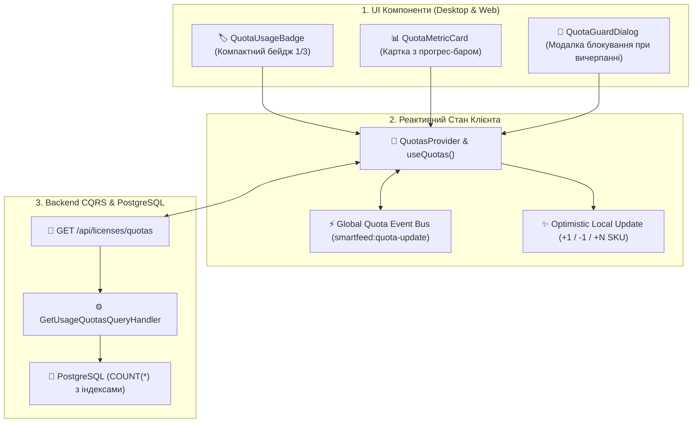

# 📊 SmartFeed Studio — План Реалізації: Уніфікована Система Квот та Лічильників Обмежень у Реальному Часі (Unified Real-time Quotas & Limits System)

> **Статус:** ✅ **Реалізовано та протестовано (100% тестів пройдено)**  
> **Категорія:** `plans/active/`  
> **Дата реалізації:** 29.08.2026  
> **Відповідальні модулі:** `packages/shared`, `services/backend-api`, `apps/desktop`

---

## 🎯 1. Мета та Концепція

Створити єдину, уніфіковану, високопродуктивну архітектуру підрахунку, валідації та візуалізації тарифних лімітів (квот) і фактичного використання ресурсів:

- **Постачальники** (`maxSuppliersLimit`: 1 / 3 / 15 / ∞)
- **Товари / SKU** (`maxXmlLimit`: 1 000 / 20 000 / 100 000 / 500 000+)
- **Фіди** (`maxFeedsLimit`: 1 / 5 / ∞)
- **Канали експорту** (`maxChannelsLimit`: 1 / 3 / 15 / ∞)
- **AI Кредити** (`aiCredits`: 50 / 500 / 2 500 / 10 000)
- **Хмарне сховище** (`maxStorageGb`: 0 / 2 GB / 10 GB / 50 GB)
- **Командні місця** (`maxTeamSeats`: 1 / 1 / 3 / 10+)

### ⚡ Головна вимога до UX:

Лічильники повинні оновлюватися **миттєво (реальний час, 0 мс затримки)** при додаванні/видаленні постачальників, імпорті фідів чи товарів — **без перезавантаження сторінки (Zero Page Reload)**.

---

## 🏗️ 2. Архітектурне Рішення



---

## 📦 3. Спільні Контракти (`packages/shared`)

### `QuotaItemDto` & `UserQuotasDto`:

```typescript
export interface QuotaItemDto {
  used: number;
  max: number;
  isUnlimited: boolean;
  percentUsed: number;
  isExceeded: boolean;
  remaining: number;
}

export interface UserQuotasDto {
  planCode: string;
  planNameUk: string;
  planNameEn: string;
  isExpired: boolean;
  suppliers: QuotaItemDto;
  products: QuotaItemDto;
  feeds: QuotaItemDto;
  channels: QuotaItemDto;
  teamSeats: QuotaItemDto;
  aiCredits: QuotaItemDto;
  storage: QuotaItemDto & { usedBytes: number; maxBytes: number; canCloudBackup: boolean };
}
```

---

## ⚙️ 4. Бекенд Реалізація (`services/backend-api`)

1. **CQRS Запит `GetUsageQuotasQuery`**:
   - `GetUsageQuotasHandler`: паралельний розрахунок через `Promise.all`:
     - `prisma.supplier.count({ where: { organizationId / userId } })`
     - `prisma.product.count({ where: { catalog: { organizationId / userId } } })`
     - `prisma.feedSource.count({ where: { organizationId / userId } })`
     - `prisma.organizationMember.count({ where: { organizationId } })`
   - Миттєва відповідь завдяки наявним індексам `@@index([supplierId])`, `@@index([catalogId])`.
2. **Ендпоінт**: `GET /api/licenses/quotas`.
3. **Defense-in-Depth Guard (`RequireQuotaGuard`)**:
   - Автоматичний 403 / 400 бекенд-захист при спробі створити постачальника чи імпортувати товари понад ліміт тарифу.

---

## 💻 5. Десктоп Клієнт (`apps/desktop`)

1. **`QuotasContext.tsx` & `useQuotas()`**:
   - Зберігає поточний стан усіх квот.
   - Надає методи:
     - `updateLocalQuota(type: 'suppliers' | 'products' | 'feeds', delta: number)` — оптимістичне миттєве оновлення.
     - `refreshQuotas(force = false)` — фонова звірка з бекендом.
   - Підписка на глобальні події `window.addEventListener('smartfeed:quota-sync')`.
2. **Уніфіковані UI Компоненти**:
   - [`QuotaUsageBadge.tsx`](../../apps/desktop/src/components/ui/QuotaUsageBadge.tsx):
     - Формат: `1 / 3` або `14.2k / 20k` з бейджем статусу:
       - 🟢 Звичайний (< 80%)
       - 🟡 Попередження (80–99%)
       - 🔴 Вичерпано (100%) + кнопка швидкого переходу на `/plans`
   - [`QuotaMetricCard.tsx`](../../apps/desktop/src/components/ui/QuotaMetricCard.tsx):
     - Використовується в шапці сторінок (Постачальники, Товари, Фіди) з прогрес-баром.
3. **Інтеграція в `SuppliersPage.tsx`**:
   - Картка метрики постачальників відображає: **`1 / 3` (33%)** з прогрес-баром.
   - Кнопка **«Додати постачальника»** деактивується або відкриває діалог пропозиції апгрейду, якщо ліміт вичерпано.
   - При успішному додаванні лічильник стає **`2 / 3`** миттєво (0 мс).
   - При видаленні постачальника стає **`1 / 3`** миттєво.
4. **Інтеграція в майбутні `CatalogsPage.tsx` та `FeedsPage.tsx`**:
   - Той самий уніфікований компонент і хук використовуються для товарів (`1 000 / 20 000 SKU`) та фідів (`1 / 5`).

---

## 🧪 6. План Тестування

1. **Бекенд Jest E2E (`quotas.e2e-spec.ts`)**:
   - Перевірка розрахунку квот для різних тарифів (STARTER, GROWTH, PRO, ENTERPRISE).
   - Перевірка блокування створення понад ліміт (403 Quota Exceeded).
2. **Десктоп Playwright E2E**:
   - Перевірка миттєвої зміни лічильника на сторінці постачальників при додаванні/видаленні без reload сторінки.
   - Перевірка індикатора ліміту при перемиканні мов UA ⇄ EN.

---

## 📋 7. Покроковий План Впровадження

1. **Крок 1**: Додати `UserQuotasDto` та типи в `packages/shared`, скомпілювати `build:shared`.
2. **Крок 2**: Створити `GetUsageQuotasQuery` та ендпоінт `GET /api/licenses/quotas` на бекенді.
3. **Крок 3**: Створити `QuotasContext` та хук `useQuotas` в десктоп-додатку.
4. **Крок 4**: Створити уніфіковані компоненти `QuotaUsageBadge` та `QuotaMetricCard`.
5. **Крок 5**: Інтегрувати лічильник лімітів у `SuppliersPage.tsx` з миттєвим оптимістичним оновленням.
6. **Крок 6**: Додати переклади у `locales/uk/*.json` та `locales/en/*.json`.
7. **Крок 7**: Запустити тести, перевірити `tsc --noEmit` та `pnpm format`.
