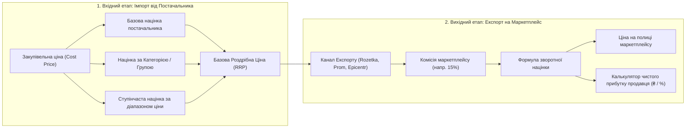

# 💰 SmartFeed Studio — План Реалізації: Гнучкі Правила Націнки, Комісії Маркетплейсів та Зворотній Розрахунок Прибутку (Pricing & Reverse Margin Engine)

> **Статус:** 📋 **В процесі планування (Planning / Active)**  
> **Категорія:** `plans/active/`  
> **Дата створення:** 29.08.2026  
> **Відповідальні модулі:** `packages/shared`, `services/backend-api`, `apps/desktop`

---

## 🎯 1. Концепція та Бізнес-Логіка Ціноутворення

Користувачу потрібна гнучка система ціноутворення, яка розділена на два ключові етапи:



---

## 📐 2. Математична Модель Розрахунків

### A. Вхідна націнка на товари (Базова, Категорії, Діапазони):

1. **Базова націнка постачальника**:
   $$\text{Price} = \text{CostPrice} \times \left(1 + \frac{\text{Margin}\%}{100}\right) + \text{FixedMarkup}$$
2. **Націнка за категорією** (наприклад, "Одяг" +30%, "Аксесуари" +50%):
   - Перевизначає або додається до базової націнки постачальника.
3. **Ступінчаста націнка за ціновими діапазонами (Price Brackets)**:
   - Від 0 до 300 ₴ ➡️ `+50 ₴` (фіксовано, щоб не продавати дрібниці в мінус)
   - Від 300 до 1 000 ₴ ➡️ `+30%`
   - Від 1 000 до 5 000 ₴ ➡️ `+20%`
   - Від 5 000 ₴ ➡️ `+15%`

---

### B. Зворотна націнка під комісію маркетплейсу (Marketplace Reverse Margin):

Маркетплейс бере свій відсоток від **фінальної ціни продажу на сайті** (а не від собівартості).

Якщо продавець хоче отримати бажану виручку $P_{\text{base}}$ після вирахування комісії маркетплейсу $C_{\text{market}}\%$ та додаткових витрат $E_{\text{fixed}}$ (упаковка, доставка):

$$\text{Ціна на полиці маркетплейсу} = \frac{P_{\text{base}} + E_{\text{fixed}}}{1 - \frac{C_{\text{market}}}{100}}$$

#### 💡 Приклад:

- Закупівельна ціна: **1 000 ₴**
- Бажана базова ціна з націнкою: **1 300 ₴** (бажаний дохід продавця)
- Комісія Rozetka: **15%** ($0.15$)
- Витрати на упаковку: **20 ₴**
- **Розрахунок фінальної ціни для фіду Rozetka**:
  $$\text{Ціна для Rozetka} = \frac{1300 + 20}{1 - 0.15} = \frac{1320}{0.85} \approx \mathbf{1553\text{ ₴}}$$
- **Перевірка прибутку**:
  - Клієнт купує за: **1 553 ₴**
  - Rozetka забирає 15%: $1553 \times 0.15 = \mathbf{233\text{ ₴}}$
  - Продавець отримує на руки: $1553 - 233 = \mathbf{1320\text{ ₴}}$
  - Мінус упаковка (20 ₴): **1 300 ₴**
  - **Чистий заробіток продавця**: $1300 - 1000 (\text{закупка}) = \mathbf{+300\text{ ₴}}$ (рівно стільки, скільки планувалося!).

---

## 🏛️ 3. Архітектурні Сутності БД

### 1. `SupplierPricingRule` (Правила для груп товарів постачальника):

```prisma
model SupplierPricingRule {
  id                 String           @id @default(cuid())
  supplierId         String           @map("supplier_id")
  supplier           Supplier         @relation(fields: [supplierId], references: [id], onDelete: Cascade)

  categoryId         String?          @map("category_id") // Опціональна прив'язка до категорії
  category           ProductCategory? @relation(fields: [categoryId], references: [id], onDelete: Cascade)

  minPrice           Decimal?         @db.Decimal(12, 2) @map("min_price") // Діапазон "від"
  maxPrice           Decimal?         @db.Decimal(12, 2) @map("max_price") // Діапазон "до"

  marginPercent      Decimal          @default(0) @db.Decimal(5, 2) @map("margin_percent")
  fixedMarkup        Decimal          @default(0) @db.Decimal(12, 2) @map("fixed_markup")

  priority           Int              @default(0) @map("priority") // Пріоритет правила
  isActive           Boolean          @default(true) @map("is_active")

  createdAt          DateTime         @default(now()) @map("created_at")
  updatedAt          DateTime         @updatedAt @map("updated_at")

  @@index([supplierId])
  @@index([categoryId])
  @@map("supplier_pricing_rules")
}
```

### 2. `ExportChannel` (Канали експорту та налаштування маркетплейсів):

```prisma
model ExportChannel {
  id                 String          @id @default(cuid())
  organizationId     String?         @map("organization_id")
  userId             String          @map("user_id")

  name               String          // напр. "Rozetka Одяг", "Prom Основний"
  marketplaceCode    String          // ROZETKA, PROM, EPICENTR, KASTA, CUSTOM
  feedFormat         FeedFormat      // XML_ROZETKA, YML_PROM, CSV

  commissionPercent  Decimal         @default(0) @db.Decimal(5, 2) @map("commission_percent")
  extraFixedCost     Decimal         @default(0) @db.Decimal(12, 2) @map("extra_fixed_cost")
  applyReverseMarkup Boolean         @default(true) @map("apply_reverse_markup")

  slug               String          @unique // Публічне посилання для маркетплейсу: /api/export/feed/:slug
  isActive           Boolean         @default(true) @map("is_active")

  createdAt          DateTime        @default(now()) @map("created_at")
  updatedAt          DateTime        @updatedAt @map("updated_at")

  @@index([userId])
  @@map("export_channels")
}
```

---

## 💻 4. UI/UX Інтерфейс у Десктоп-Клієнті

1. **Вкладка «Правила націнки» в діалозі постачальника**:
   - Базова націнка постачальника за замовчуванням.
   - Таблиця правил для категорій (додати правило: категорія ➡️ відсоток / фіксована сума).
   - Таблиця цінових діапазонів (наприклад: до 500 ₴ ➡️ +40%).

2. **Розділ «Канали Експорту» (`/channels`)**:
   - Створення каналу експорту під потрібний маркетплейс (Rozetka, Prom, Epicentr).
   - Введення відсотка комісії маркетплейсу.
   - Інтерактивний **Live-калькулятор маржі**:
     - Вводимо тестову собівартість (напр. `1 000 ₴`) ➡️ Бачимо: Ціну на полиці `1 553 ₴`, Комісію маркетплейсу `233 ₴`, Ваш чистий прибуток `+300 ₴ (30%)`.
   - Отримання готового постійного посилання на фід для підключення в особистий кабінет маркетплейсу.
