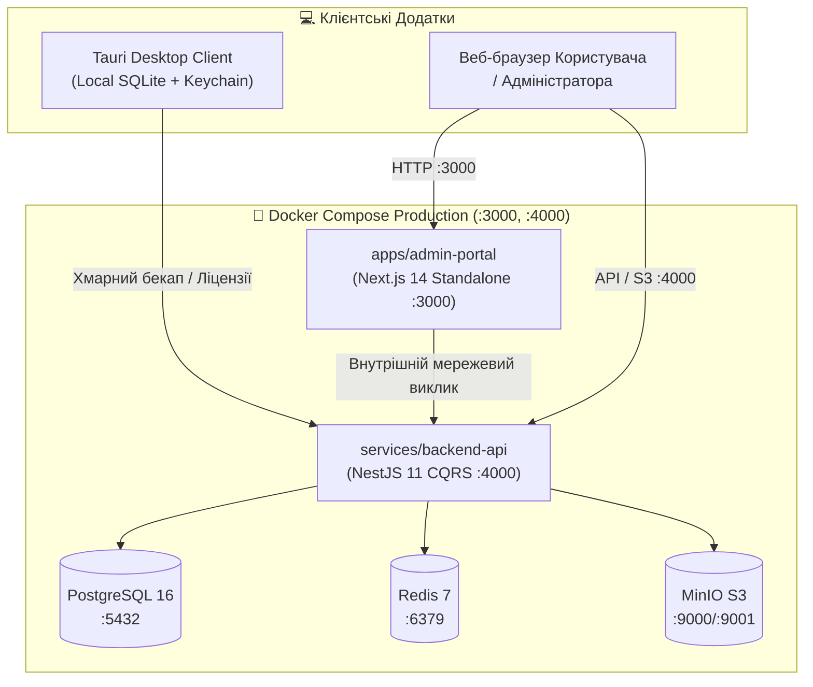

# 📋 SmartFeed Studio — Налаштування Production Docker & Розгортання (Docker Compose & Railway)

> **Статус:** 🟡 **Активний план на узгодженні (Awaiting User Approval)**  
> **Дата створення:** 27.09.2026  
> **Аудитор & Архітектор:** `agents_backend` & `agents_frontend`  
> **Цільові сервіси:** `docker-compose.prod.yml`, `services/backend-api/Dockerfile`, `apps/admin-portal/Dockerfile`, `railway.json`, `apps/desktop`  
> **Відповідність стандартам:** [`.agents/rules/plans_lifecycle.md`](../../.agents/rules/plans_lifecycle.md), [`.agents/rules/engineering_discipline_and_planning.md`](../../.agents/rules/engineering_discipline_and_planning.md), [`.agents/rules/commands.md`](../../.agents/rules/commands.md)

---

## 🎯 1. Мета та Архітектура Продакшн-Збірки

Створити повноцінне, ізольоване та надійне продакшн-середовище на базі Docker Compose та Railway:

1. **Багатоконтейнерний продакшн-стек (`docker-compose.prod.yml`)**:
   - `smartfeed-postgres`: PostgreSQL 16 Alpine з персистентним томом, healthcheck та оптимізованими лімітами.
   - `smartfeed-redis`: Redis 7 Alpine з кешуванням та BullMQ чергами.
   - `smartfeed-minio`: S3-сумісне сховище для фідового кешу та медіа з авто-створенням бакета `smartfeed-storage`.
   - `smartfeed-backend-api`: NestJS 11 CQRS бекенд на порту 4000 (Multi-stage build, non-root user `nestjs`, авто-синхронізація схеми БД при старті).
   - `smartfeed-admin-portal`: Next.js 14 Standalone веб-портал на порту 3000 (Multi-stage build, non-root user `nextjs`, вшиті статичні ассети).
2. **Railway Cloud Інтеграція (`railway.json`)**:
   - Налаштування деплою в підключений проект Railway (`insightful-tranquility`, Workspace: `Oleg's Projects`).
   - Підтримка збірки бекенду та адмінки через Railway CLI (`railway up`).
3. **Desktop Client Продакшн-Збірка (`apps/desktop`)**:
   - Компіляція оптимізованого продакшн веб-бандлу через `pnpm --filter @smartfeed/desktop build`.
   - Інструкція нативної бінарної збірки через Tauri CLI (`pnpm tauri build`).

---

## 📐 2. Обов'язкові Архітектурні Пункти (Quality Over Speed)

### 1. Спільні контракти (Shared Contracts First)

- Продакшн Dockerfile використовує `packages/shared` як спільний внутрішній npm-пакет у monorepo.
- `pnpm --filter @smartfeed/shared build` обов'язково виконується перед збіркою сервісів.
- Заборонено хардкодити типи чи інтерфейси всередині контейнерів.

### 2. 4-Рівнева модель валідації (Defense-in-Depth)

- **Рівень 1 (DTO)**: Перевірка всіх вхідних параметрів `class-validator` у `backend-api` з `whitelist: true`.
- **Рівень 2 (Environment)**: Валідація наявності всіх обов'язкових змінних середовища (`DATABASE_URL`, `JWT_SECRET`, `REDIS_HOST`, `MINIO_*`) при старті сервісу.
- **Рівень 3 (Security & Non-Root Execution)**: Контейнери запускаються під непривілейованими користувачами (`nextjs:nodejs` з UID 1001, `nestjs:nodejs` з UID 1001) без доступу до root-прав.
- **Рівень 4 (Database & Network Isolation)**: База даних та Redis доступні всередині ізольованої Docker-мережі `smartfeed-network`, зовні відкриваються лише необхідні порти.

### 3. Бюджет модульності та чистота файлів

- Всі Docker-конфігурації розділені за призначенням:
  - `docker-compose.yml`: локальна розробка допоміжної інфраструктури (Postgres, Redis, MinIO, Mailpit).
  - `docker-compose.prod.yml`: повноцінний автономний продакшн-стек із додатками.
  - `.env.production.example`: канонічний зразок продакшн-змінних.
  - `railway.json`: маніфест хмарного розгортання.

### 4. Моделювання відмов (Failure Modes & Edge Cases)

- **База даних ще не готова при старті бекенду**:
  - `backend-api` має умову `depends_on: postgres: condition: service_healthy` та вбудований скрипт очікування з'єднання.
  - Автоматичне виконання `prisma migrate deploy` або `prisma db push` при ініціалізації контейнера.
- **MinIO сховище ще не створило бакет**:
  - Служба `minio-init` гарантує створення бакета `smartfeed-storage` до початку обробки файлів.
- **Next.js API запити**:
  - `NEXT_PUBLIC_API_URL` передається як build-аргумент (`ARG`) та рантайм-змінна для коректної маршрутизації клієнтських запитів.

---

## 🛠 3. Поетапний План Реалізації

### Етап 1: Створення `docker-compose.prod.yml`

1. Описати повний виробничий стек:
   - Сервіс `postgres` (healthcheck `pg_isready`).
   - Сервіс `redis` (healthcheck `redis-cli ping`).
   - Сервіс `minio` + `minio-init` (автоматичне створення бакету `smartfeed-storage`).
   - Сервіс `backend-api` (контекст `.` з файлом `services/backend-api/Dockerfile`).
   - Сервіс `admin-portal` (контекст `.` з файлом `apps/admin-portal/Dockerfile`).
2. Налаштувати внутрішню ізольовану мережу `smartfeed-network` та іменовані томи (`postgres_prod_data`, `redis_prod_data`, `minio_prod_data`).

### Етап 2: Оптимізація та гартування Dockerfiles

1. **`services/backend-api/Dockerfile`**:
   - Перевірити build context, мінімізувати розмір фінального шару Alpine.
   - Додати скрипт `docker-entrypoint.sh` для автоматичного `prisma migrate deploy` або `prisma db push` перед стартом додатку.
2. **`apps/admin-portal/Dockerfile`**:
   - Перевірити прокидання `ARG NEXT_PUBLIC_API_URL`.
   - Забезпечити копіювання `.next/standalone` та `.next/static`.

### Етап 3: Додавання команд у кореневий `package.json`

1. Додати зручні скрипти життєвого циклу:
   - `"docker:prod:build": "docker compose -f docker-compose.prod.yml build"`
   - `"docker:prod:up": "docker compose -f docker-compose.prod.yml up -d"`
   - `"docker:prod:down": "docker compose -f docker-compose.prod.yml down"`
   - `"docker:prod:logs": "docker compose -f docker-compose.prod.yml logs -f"`

### Етап 4: Шаблон продакшн-конфігурації (`.env.production.example`)

1. Створити вичерпний шаблон з усіма змінними для самостійного або хмарного запуску (Postgres, Redis, MinIO, JWT, Cors, Port).

### Етап 5: Конфігурація для Railway Cloud Deployment

1. Створити файл `railway.json` з налаштуваннями сервісів для швидкого розгортання через CLI.
2. Оновити документацію в `wiki/02-tech-stack/infrastructure-docker.md` та `.agents/rules/commands.md`.

### Етап 6: Верифікація та Тестування

1. Тестова збірка `docker compose -f docker-compose.prod.yml build`.
2. Запуск контейнерів у фоні та перевірка healthcheck статусів (`docker compose -f docker-compose.prod.yml ps`).
3. Перевірка відповіді `GET http://localhost:4000/api/docs` та `GET http://localhost:3000`.
4. Безпечне зупинення та очищення тестових контейнерів.

---

## 🔒 4. Протокол безпеки та життєвого циклу (Strict Hold)

Згідно з регламентом [`.agents/rules/plans_lifecycle.md`](../../.agents/rules/plans_lifecycle.md):  
**Агент ЗУПИНЯЄТЬСЯ і НЕ розпочинає створення та зміну конфігурацій до отримання явної команди користувача на виконання плану (наприклад: "виконуй", "роби", "починай").**
