# 🚀 Комплексний план оптимізації та розвитку SmartFeed Studio (Strategic Roadmap)

> **Статус:** 📋 **Складено стратегічний план (Очікує розгляду та пріоритизації)**  
> **Дата складання:** 28.08.2026  
> **Ціль:** Визначити ключові вектори оптимізації продуктивності, безпеки, масштабованості, штучного інтелекту та користувацького досвіду для перетворення SmartFeed Studio на беззаперечного лідера серед платформ обробки e-commerce фідів.

---

## 🧭 Стратегічні напрямки оптимізації та розвитку

```mermaid
graph TD
    A[SmartFeed Studio Core] --> B[1. Рушій обробки фідів & Rust]
    A --> C[2. AI Збагачення & Асинхронні черги]
    A --> D[3. Безпека, Аудит & Enterprise]
    A --> E[4. UX, Віртуалізація & Офлайн]
    A --> F[5. DevOps, Кешування & Моніторинг]

    B --> B1[Стрімінговий XML/CSV парсер]
    B --> B2[Rust quick-xml + Multi-threading]
    B --> B3[Диференційні фіди Smart Diff]

    C --> C1[BullMQ черги для AI генерації]
    C --> C2[Taxonomy Mapping Rozetka/Prom/Google]
    C --> C3[Vision AI оптимізація зображень]

    D --> D1[Audit Logs аудит дій]
    D --> D2[2FA / TOTP авторизація]
    D --> D3[Ізольоване шифрування ключів]

    E --> E1[Віртуалізація таблиць 100k+ SKU]
    E --> E2[Offline-First Sync Черга]
    E --> E3[Tauri v2 Auto-Updater]

    F --> F1[Redis кешування планів/прав]
    F --> F2[Sentry + OpenTelemetry трейсинг]
    F --> F3[k6 навантажувальне тестування]
```

---

## ⚡ Напрямок 1: Високопродуктивний рушій обробки фідів (High-Scale Feed Engine)

### Проблема:

Обробка e-commerce каталогів на 100,000–500,000+ товарів у форматі XML/CSV вимагає великого обсягу пам'яті (RAM) та може блокувати UI потік, якщо виконується в JavaScript.

### Кроки оптимізації:

1. **Стрімінговий парсинг (SAX/StAX / `quick-xml` у Rust)**:
   - Перенесення парсингу великих XML файлів на рівень Tauri v2 (Rust) з використанням бібліотеки `quick-xml` або `csv`.
   - Потокове читання з диска/мережі частинами (chunks по 1,000 товарів) без завантаження всього DOM дерева в пам'ять.
2. **Диференційний рушій (Smart Feed Diff Engine)**:
   - Порівняння попередньої версії каталогу з новою версією за хешами полів (MD5/SHA-256 від `price`, `stock`, `description`).
   - Синхронізація лише дельти (змінених товарів) замість перезапису 500,000 рядків у базі даних.
3. **Пакетний запис в SQLite (SQLCipher Bulk Transactions)**:
   - Використання підготовлених виразів (`Prepared Statements`) та транзакційного батчінгу (`INSERT INTO items VALUES (...)`) по 5,000 рядків у SQLite. Швидкість імпорту зростає з хвилин до 2–3 секунд.

---

## 🤖 Напрямок 2: AI збагачення товарів та автоматизація (AI Product Pipeline)

### Можливості:

Створення потужної конкурентної переваги завдяки глибокій автоматизації каталогу.

### Кроки оптимізації:

1. **Асинхронний пайплайн на базі BullMQ (Redis Queues)**:
   - Розподіл завдань AI збагачення (переклад назв, покращення описів, генерація SEO-тегів) на фонові воркери.
   - Покроковий прогрес-бар для користувача в реальному часі через Server-Sent Events (SSE) або WebSockets.
2. **Розумний маппінг категорій (Smart Category Mapping)**:
   - Автоматичне співставлення категорій постачальника з класифікаторами маркетплейсів (Rozetka, Prom.ua, Google Merchant Center, Epicentr) за допомогою LLM векторних ембеддінгів.
3. **Vision AI для медіа**:
   - Автоматичне видалення фону, перевірка роздільної здатності зображень та накладання водяних знаків перед відвантаженням в S3 / MinIO.
4. **Контроль витрат та квотування токенів (AI Token Ledger)**:
   - Детальний білінг витрачених токенів на рівні кожного товару та організації з попередженням про вичерпання кредитів.

---

## 🔒 Напрямок 3: Безпека корпоративного рівня та аудит (Enterprise Security & Compliance)

### Потреби:

Великі компанії та інтернет-магазини вимагають гарантій незмінності даних та контролю дій персоналу.

### Кроки оптимізації:

1. **Журнал аудиту дій (Enterprise Audit Log)**:
   - Фіксація всіх критичних операцій: хто змінив тарифний план, хто видалив співробітника, хто згенерував новий S3 Presigned URL, хто експортував базу.
   - Таблиця `audit_logs` у PostgreSQL з незмінними записами (append-only) та перегляд у розділі "Аудит" адмін-панелі.
2. **Двофакторна автентифікація (2FA / TOTP)**:
   - Підтримка Google Authenticator / Apple Passkeys для захисту облікових записів Super Admin та Власників організацій.
3. **Ротація API-ключів та безпечне зберігання конфігурацій**:
   - Автоматична ротація JWT ключів без розриву активних сесій.
   - Захищене шифрування ключів інтеграцій (Prom API key, Rozetka API token) за допомогою AES-256-GCM.

---

## 💻 Напрямок 4: Продуктивність інтерфейсу та Офлайн-робота (UI/UX & Client Performance)

### Мета:

Миттєвий відгук інтерфейсу навіть при відкритті каталогів на 100,000 позицій.

### Кроки оптимізації:

1. **Віртуалізація таблиць (`@tanstack/react-virtual`)**:
   - Віртуалізація рендерингу рядків у Desktop додатку та Admin Portal — у DOM дереві рендеряться тільки ті 20–30 рядків, які видимі на екрані.
   - Миттєва прокрутка без затримок та 60 FPS навіть на слабких ноутбуках.
2. **Офлайн-черга синхронізації (Offline-First Sync Queue)**:
   - Користувач може редагувати ціни, статуси та категорії у літаку чи без інтернету. Зміни записуються в локальний SQLCipher.
   - При появі мережі спрацьовує фоновий синхронізатор (Outbox Pattern), який надсилає зміни на сервер без конфліктів.
3. **Автоматичні оновлення Desktop додатку (Tauri v2 Updater)**:
   - Інтеграція `tauri-plugin-updater` з криптографічним підписом релізів (Ed25519).
   - Безшовне оновлення клієнта у фоновому режимі з повідомленням "Доступна нова версія SmartFeed Studio".

---

## ⚙️ Напрямок 5: DevOps, Кешування та Надійність (DevOps, Caching & Telemetry)

### Потреби:

Забезпечити безвідмовну роботу при зростанні бази клієнтів до сотень тисяч запитів на добу.

### Кроки оптимізації:

1. **Багаторівневе кешування Redis (Multi-Tier Caching)**:
   - Кешування публічних тарифних планів (`/api/plans`), структури навігації (`/api/navigation`) та квот ліцензій у пам'яті Redis.
   - Автоматична інвалідація кешу за подіями `PlanUpdatedEvent` / `LicenseUpdatedEvent`.
2. **Розподілена телеметрія та моніторинг (Sentry + OpenTelemetry + Prometheus)**:
   - Підключення Sentry для автоматичного відлову необроблених помилок на бекенді та десктопі.
   - Експорт метрик продуктивності (час відповіді DB, зайнятість черг BullMQ, використання RAM) у Grafana.
3. **Навантажувальне тестування (k6 / Artillery Stress Testing)**:
   - Створення сценаріїв тестування під навантаженням: 5,000 одночасних користувачів, 1,000 паралельних запитів на отримання ліцензії та генерацію S3 URL.
   - Тюнінг пулу з'єднань PostgreSQL (`@prisma/adapter-pg` pool max) та оптимізація індексів.

---

## 📊 Матриця пріоритизації завдань (Impact vs Effort)

| Ініціатива                                                    |    Вплив на бізнес (Impact)    | Складність (Effort)  | Рекомендований пріоритет |
| :------------------------------------------------------------ | :----------------------------: | :------------------: | :----------------------: |
| **Віртуалізація таблиць товарів (`@tanstack/react-virtual`)** |      🟢 Дуже високий (UX)      | 🟡 Середня (2-3 дні) |    🥇 **Пріоритет 1**    |
| **Стрімінговий XML/CSV парсер на Rust (`quick-xml`)**         |   🟢 Критичний для масштабів   | 🔴 Висока (4-5 днів) |    🥇 **Пріоритет 1**    |
| **Багаторівневий Redis кеш планів та ліцензій**               |   🟢 Високий (Швидкість API)   | 🟢 Низька (1-2 дні)  |    🥈 **Пріоритет 2**    |
| **Журнал аудиту дій (Enterprise Audit Logs)**                 |    🟢 Високий (Безпека B2B)    | 🟡 Середня (2-3 дні) |    🥈 **Пріоритет 2**    |
| **AI Batch Queue (BullMQ) + Прогрес-бар збагачення**          |  🟢 Високий (Унікальна фіча)   | 🟡 Середня (3-4 дні) |    🥈 **Пріоритет 2**    |
| **Двофакторна автентифікація (2FA / TOTP)**                   |  🟡 Середній (Захист адмінки)  |  🟡 Середня (2 дні)  |    🥉 **Пріоритет 3**    |
| **Tauri v2 Auto-Updater (Автооновлення клієнта)**             | 🟢 Високий (Зручність релізів) |  🟡 Середня (2 дні)  |    🥉 **Пріоритет 3**    |
| **Навантажувальні тести k6 (5000 RPS)**                       |   🟡 Середній (Впевненість)    | 🟢 Низька (1-2 дні)  |    🥉 **Пріоритет 3**    |

---

## 🎯 Резюме та подальші кроки

Проект **SmartFeed Studio** вже має міцний корпоративний фундамент: строгий CQRS бекенд, надійну багаторівневу безпеку, 100% покриття тестами (209/209) та двомовний UI.

Наступним якісним стрибком є **активація ядра обробки великих фідів (Rust Quick-XML)**, **віртуалізація списків товарів** та **інтеграція реального AI збагачення через черги BullMQ**.
