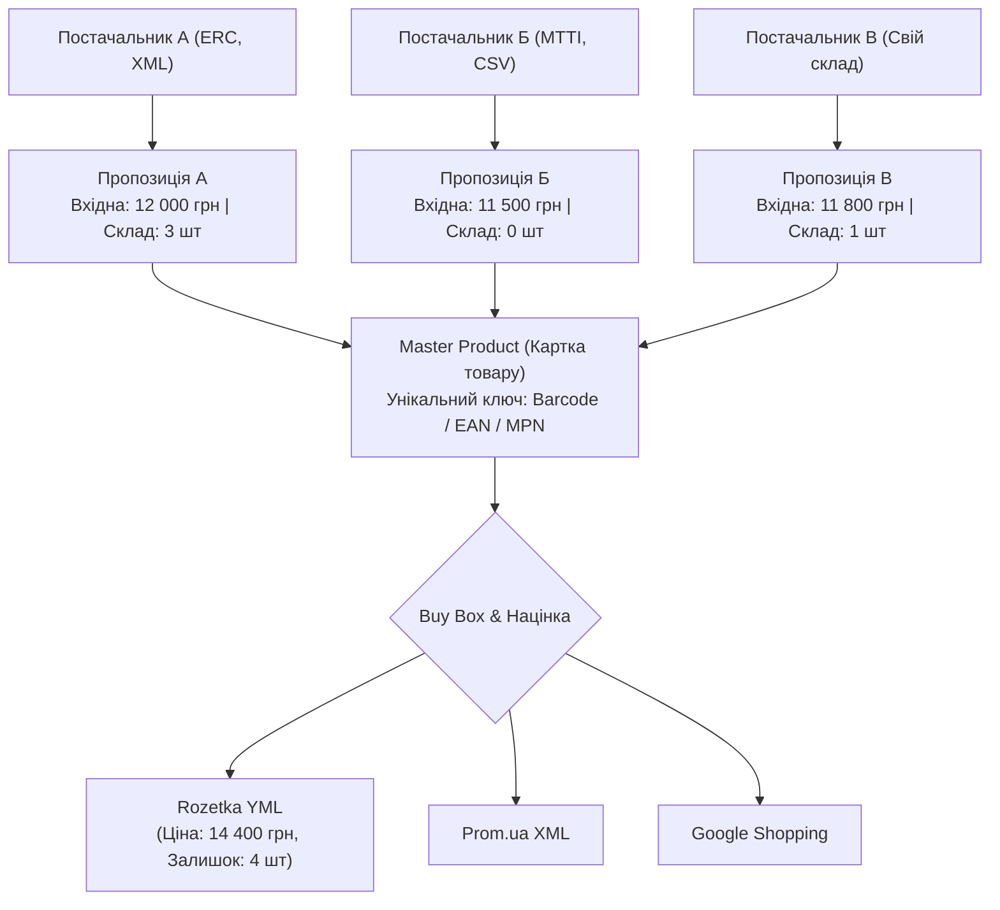

# 💎 SmartFeed Studio — Стратегія Тарифних Планів

> **Мета документа:** Визначити 4 комерційні тарифи з чіткими межами доступу до функціоналу, сформувати маркетингову цінову шкалу та окреслити дорожню карту розвитку продукту.

---

## 📊 Аналіз Конкурентів

Перед тим як формувати тарифи, проаналізовано ключових конкурентів на ринку:

| Продукт           | Модель              | Сильна сторона               | Слабка сторона           | Ціна                |
| :---------------- | :------------------ | :--------------------------- | :----------------------- | :------------------ |
| **DataFeedWatch** | SaaS Self-Service   | Прозоре ціноутворення по SKU | Немає AI-збагачення      | $64–$449/міс        |
| **Channable**     | SaaS + PPC          | 2500+ маркетплейсів          | Складний UX              | $99–$1,500/міс      |
| **Feedonomics**   | Managed Enterprise  | 24/7 команда підтримки       | Дорого (кастомний прайс) | $1,000–$10,000+/міс |
| **Productsup**    | Enterprise PIM+Feed | AI-ready signals для LLM     | Надто складний для SMB   | Кастом              |
| **GoDataFeed**    | SaaS Self-Service   | Простота налаштування        | Мало каналів             | $39–$249/міс        |

### 🎯 Наша Ніша та Диференціатори:

1. **🔒 Приватність та Безпека**: Encrypted SQLite (SQLCipher), OS Keychain — унікально для desktop-first рішення.
2. **🤖 Вбудований AI** прямо в десктопному клієнті без додаткових SaaS підписок.
3. **📱 Desktop-First**: Нативна продуктивність замість важкого браузерного інтерфейсу.
4. **🇺🇦 Локальний Ринок**: Підтримка форматів Rozetka, Prom.ua, Hotline «з коробки» — конкурент цього не має.
5. **☁️ Гнучкість Бекапу**: Власне MinIO або Cloudflare R2 (жодного vendor lock-in до конкретного Cloud).

---

## 🏷 Чотири Тарифних Плани

### Маркетингова Філософія Найменувань

| Tier | Назва (UK)     | Назва (EN)     | Код          | Позиціонування                       |
| :--: | :------------- | :------------- | :----------- | :----------------------------------- |
|  0   | **Старт**      | **Starter**    | `STARTER`    | Спробуй безкоштовно, без карти       |
|  1   | **Зріст**      | **Growth**     | `GROWTH`     | Для активних продавців-одинаків      |
|  2   | **Про**        | **Pro**        | `PRO`        | Для команд та агентств ⭐ Популярний |
|  3   | **Корпоратив** | **Enterprise** | `ENTERPRISE` | Для великих мереж та ритейлерів      |

---

## 🔍 Детальна Матриця Доступів

### 1. 🆓 STARTER — «Старт» (Безкоштовно)

**Цільова аудиторія**: Мікро-продавці, студенти, тестування платформи  
**Слоган**: _"Запусти перший фід за 5 хвилин — безкоштовно назавжди"_  
**Модель**: Freemium з обмеженнями (безстроковий після закінчення тріалу — 1 active feed, або 7-денний повний тріал → автоматичний downgrade)

| **Параметр**           | Значення                                   |
| :--------------------- | :----------------------------------------- |
| **Ціна**               | $0 / назавжди                              |
| **Тривалість**         | 7 днів повного тріалу → Freemium           |
| **Товари (SKU)**       | до **500 SKU**                             |
| **XML/CSV Фіди**       | **1 активний фід**                         |
| **Постачальники**      | **1 постачальник** (без мульти-складу)     |
| **Канали виводу**      | тільки **1** (наприклад, Rozetka або файл) |
| **Оновлення Фіду**     | вручну (без розкладу)                      |
| **AI Кредити**         | **0** (тільки перегляд)                    |
| **Хмарний Бекап**      | ❌                                         |
| **Зашифрована SQLite** | ✅ (локальне кешування)                    |
| **Формати**            | XML, CSV (import only)                     |
| **Підтримка**          | FAQ документація                           |
| **Командні Місця**     | 1 користувач                               |

**Мета**: Дати відчути product value. Юзер бачить функціонал, але стикається з лімітами → конвертується в Growth.

---

### 2. 🚀 GROWTH — «Зріст» ($29/міс або $290/рік)

**Цільова аудиторія**: Активні одиночні продавці, власники малого e-commerce  
**Слоган**: _"Автоматизуй фіди та зосередься на продажах"_  
**Конкурентна перевага**: Дешевше GoDataFeed ($39) з кращим AI та підтримкою укр. маркетплейсів

| **Параметр**            | Значення                                           |
| :---------------------- | :------------------------------------------------- |
| **Ціна**                | $29/міс або **$290/рік** (2 міс знижка)            |
| **Тривалість**          | 30 днів на цикл (авто-поновлення)                  |
| **Товари (SKU)**        | до **10,000 SKU**                                  |
| **XML/CSV Фіди**        | **5 активних фідів**                               |
| **Постачальники**       | до **3 постачальників** (ручне зіставлення)        |
| **Канали виводу**       | до **3** (Rozetka, Prom.ua, Google Merchant)       |
| **Оновлення Фіду**      | **Авто-оновлення** (1 раз на добу)                 |
| **AI Кредити**          | **50 кредитів/міс** (генерація описів, заголовків) |
| **Хмарний Бекап**       | ✅ (1 GB, ручний snapshot)                         |
| **Зашифрована SQLite**  | ✅                                                 |
| **Формати**             | XML, YML, CSV (import + export)                    |
| **Трансформація Даних** | Базові правила (rename fields, find-replace)       |
| **Фільтрація Товарів**  | ✅ за категорією та ціною                          |
| **Підтримка**           | Email, відповідь до 48 год                         |
| **Командні Місця**      | 1 користувач                                       |

---

### 3. ⭐ PRO — «Про» ($79/міс або $790/рік) — _ПОПУЛЯРНИЙ_

**Цільова аудиторія**: Середні e-commerce компанії, маркетингові команди, невеликі агентства  
**Слоган**: _"Повна автоматизація фідів з AI — для команд, що масштабуються"_  
**Конкурентна перевага**: DataFeedWatch коштує $129/міс за той самий об'єм без AI

| **Параметр**               | Значення                                                        |
| :------------------------- | :-------------------------------------------------------------- |
| **Ціна**                   | $79/міс або **$790/рік** (2 міс знижка)                         |
| **Тривалість**             | 30 днів (авто-поновлення)                                       |
| **Товари (SKU)**           | до **100,000 SKU**                                              |
| **XML/CSV Фіди**           | **Необмежено фідів**                                            |
| **Постачальники**          | до **15 постачальників** (авто-зіставлення за EAN/артикулом)    |
| **Канали виводу**          | до **15** (+ Hotline, Price.ua, Leroy Merlin, Facebook Catalog) |
| **Оновлення Фіду**         | **Кожні 4 години** (6 разів/добу)                               |
| **AI Кредити**             | **500 кредитів/міс** (опис, SEO-заголовки, категоризація)       |
| **Хмарний Бекап**          | ✅ **10 GB**, авто-snapshot (щодня)                             |
| **Зашифрована SQLite**     | ✅                                                              |
| **Формати**                | XML, YML, CSV, JSON feed                                        |
| **Трансформація Даних**    | Розширені правила + if/then умови                               |
| **Фільтрація Товарів**     | ✅ розширена (залишок, ціна, категорія, атрибути)               |
| **Мульти-склад / Buy Box** | ✅ (авто-вибір кращої ціни, сумування залишків)                 |
| **Дублювання Фідів**       | ✅ (clone & adapt per channel)                                  |
| **Порівняння Версій Фіду** | ✅ (diff між двома snapshots)                                   |
| **API Доступ**             | ✅ REST API для зовнішньої інтеграції                           |
| **Підтримка**              | Email + Live Chat, відповідь до 8 год                           |
| **Командні Місця**         | **3 користувачі**                                               |
| **Брендована Панель**      | ❌                                                              |

---

### 4. 🏢 ENTERPRISE — «Корпоратив» ($249/міс або $2,490/рік)

**Цільова аудиторія**: Великі ритейлери, мережі магазинів, мультибрендові платформи, агентства  
**Слоган**: _"Корпоративна потужність без enterprise-ціни конкурентів"_  
**Конкурентна перевага**: Feedonomics та Productsup коштують $1,000–$10,000/міс. Ми пропонуємо 80% функціоналу за 25% ціни.

| **Параметр**               | Значення                                             |
| :------------------------- | :--------------------------------------------------- |
| **Ціна**                   | $249/міс або **$2,490/рік** (2 міс знижка)           |
| **Тривалість**             | 365 днів (річна ліцензія)                            |
| **Товари (SKU)**           | **Необмежено**                                       |
| **XML/CSV Фіди**           | **Необмежено**                                       |
| **Постачальники**          | **Необмежено** (+ прямі API конектори до дилерів)    |
| **Канали виводу**          | **Необмежено** (+ кастомні ендпоінти)                |
| **Оновлення Фіду**         | **В реальному часі** (webhook/cron, кожні 30 хв)     |
| **AI Кредити**             | **5,000 кредитів/міс** + пріоритетна черга           |
| **Хмарний Бекап**          | ✅ **Необмежений** (власний S3/MinIO ендпоінт)       |
| **Зашифрована SQLite**     | ✅                                                   |
| **Формати**                | XML, YML, CSV, JSON, GraphQL feed                    |
| **Трансформація Даних**    | Повний скриптинг (Lua/JS правила)                    |
| **Фільтрація Товарів**     | ✅ необмежені умови + ML-фільтрація                  |
| **Мульти-склад / Buy Box** | ✅ (кастомні формули пріоритетів, РРЦ захист)        |
| **Дублювання Фідів**       | ✅ + workspace ізоляція                              |
| **Порівняння Версій Фіду** | ✅ + автоматичний alert про зміни                    |
| **API Доступ**             | ✅ REST + Webhook Integration                        |
| **White-label Звіти**      | ✅ Брендований PDF звіт для клієнта                  |
| **SSO / SAML**             | ✅ (Google Workspace, Okta)                          |
| **Аудит Лог**              | ✅ (хто, що, коли змінив у фіді)                     |
| **Підтримка**              | Пріоритетна підтримка + Telegram, відповідь до 2 год |
| **Командні Місця**         | **Необмежено**                                       |
| **Виділений Менеджер**     | ✅ (Customer Success Manager)                        |
| **SLA**                    | 99.9% uptime guarantee                               |

---

## 📋 Зведена Таблиця Порівняння

| Функціонал              | Starter |  Growth   | Pro ⭐  |  Enterprise  |
| :---------------------- | :-----: | :-------: | :-----: | :----------: |
| **Ціна/міс**            |   $0    |    $29    |   $79   |     $249     |
| **Ціна/рік**            |   $0    |   $290    |  $790   |    $2,490    |
| **Товари (SKU)**        |   500   |  10,000   | 100,000 |      ∞       |
| **Активних Фідів**      |    1    |     5     |    ∞    |      ∞       |
| **Постачальники**       |    1    |     3     |   15    |      ∞       |
| **Канали виводу**       |    1    |     3     |   15    |      ∞       |
| **Авто-оновлення**      |   ❌    |  1x/добу  | 6x/добу | Реальний час |
| **AI Кредити/міс**      |    0    |    50     |   500   |    5,000     |
| **Хмарний Бекап**       |   ❌    |   1 GB    |  10 GB  |      ∞       |
| **Мульти-склад/BuyBox** |   ❌    |    ❌     |   ✅    |      ✅      |
| **Snapshot Diff**       |   ❌    |    ❌     |   ✅    |      ✅      |
| **API Доступ**          |   ❌    |    ❌     |   ✅    |      ✅      |
| **Командні Місця**      |    1    |     1     |    3    |      ∞       |
| **White-label**         |   ❌    |    ❌     |   ❌    |      ✅      |
| **SSO / SAML**          |   ❌    |    ❌     |   ❌    |      ✅      |
| **Аудит Лог**           |   ❌    |    ❌     |   ❌    |      ✅      |
| **SLA Uptime**          |   ❌    |    ❌     |   ❌    |    99.9%     |
| **Підтримка**           |   FAQ   | Email 48h | Chat 8h | Priority 2h  |

---

## 🏢 Архітектурна Модель: Мультипостачальницький Каталог та Buy Box

Коли один і той самий товар постачається кількома дистриб'юторами або дропшиперами, система використовує патерн **Master Product + Supplier Offers**:



### 🎯 Ключові Можливості для Продавця:

1. **Зведення дублікатів**: автоматичне об'єднання за штрих-кодом (EAN-13/UPC) або комбінацією «Бренд + Артикул виробника». У маркетплейс вивантажується єдина картка товару без ризику бану за дублювання.
2. **Правила Buy Box (Вибір кращої пропозиції)**:
   - _Найнижча ціна в наявності_: брати ціну постачальника, у якого товар реально є на складі (`stock > 0`).
   - _Пріоритет складу_: спочатку розпродувати власний склад (пріоритет 1); якщо залишок = 0 — автоматично перемикати на склад дропшипера (пріоритет 2).
3. **Сумування залишків**: об'єднання кількості товару з різних складів (наприклад: 1 шт + 3 шт = 4 шт у вихідному каналі).
4. **Індивідуальні правила націнки за постачальником**:
   - `Ціна_виводу = Ціна_закупівлі * (1 + Margin_Supplier / 100) + Фіксована_доставка`.
5. **Захист від демпінгу (Контроль РРЦ/МРЦ)**: блокування зниження роздрібної ціни нижче рекомендованої постачальником.

## 🗺 Дорожня Карта Продукту (Feature Roadmap)

Нижче — функціонал, що відповідає тарифним обмеженням та обґрунтовує їх цінність. Розбито по фазах:

### Фаза 1 — MVP ✅ (Реалізовано)

- [x] Авторизація (JWT, Refresh, Keychain)
- [x] Динамічні тарифні плани з `durationDays`
- [x] `RequireActiveLicenseGuard` (блокування при закінченні терміну)
- [x] Хмарний бекап через S3 Presigned URL
- [x] Динамічна навігація (RBAC + Plan)
- [x] Зашифрована SQLite (SQLCipher)
- [x] 100% двомовний інтерфейс (uk ⇄ en)

### Фаза 2 — Ключові Продуктові Функції 🔧 (Наступний пріоритет)

- [ ] **Імпорт XML/CSV Фідів** (парсинг, маппінг полів, попередній перегляд)
- [ ] **Трансформація Даних** (if/then правила, перейменування, заміна)
- [ ] **Фільтрація Товарів** (за ціною, категорією, залишком)
- [ ] **Канали Виводу** (Rozetka YML, Prom.ua XML, Google Shopping, Facebook Catalog)
- [ ] **Авто-оновлення за Розкладом** (cron на рівні Tauri/Backend)

### Фаза 2 — Ключові Продуктові Функції 🔧 (Наступний пріоритет)

- [ ] **Імпорт XML/CSV Фідів** (парсинг, маппінг полів, попередній перегляд)
- [ ] **Модуль Постачальників (Suppliers)** (керування прайсами дистриб'юторів, націнками, графіками оновлення)
- [ ] **Мульти-склад та Buy Box** (автоматичне об'єднання за EAN/артикулом, сумування залишків, вибір кращої ціни)
- [ ] **Трансформація Даних** (if/then правила, перейменування, заміна)
- [ ] **Фільтрація Товарів** (за ціною, категорією, залишком)
- [ ] **Канали Виводу** (Rozetka YML, Prom.ua XML, Google Shopping, Facebook Catalog)
- [ ] **Авто-оновлення за Розкладом** (cron на рівні Tauri/Backend)

### Фаза 3 — AI Функціонал 🤖 (Висока цінність для монетизації)

- [ ] **AI Генерація SEO-Описів** (батчева обробка, лімітована кредитами)
- [ ] **AI Категоризація Товарів** (автоматичне визначення категорії)
- [ ] **AI Заповнення Атрибутів** (вага, колір, матеріал з назви та фото)
- [ ] **Виявлення Дублікатів** (fuzzy match по назві/артикулу між різними постачальниками)
- [ ] **Аналіз Якості Фіду** (score card: completeness, errors, recommendations)

### Фаза 4 — Командна та API Робота 👥 (Pro/Enterprise)

- [ ] **Командні Місця** (Invite Users, ролі всередині workspace)
- [ ] **REST API** (програмний доступ до фідів, тригери оновлення)
- [ ] **Webhook Відправка** (push на URL при оновленні фіду)
- [ ] **Snapshot Diff** (порівняння двох версій фіду: додані/видалені/змінені)
- [ ] **Шаблони Трансформацій** (збереження та повторне використання правил)

### Фаза 5 — Enterprise та White-label 🏢 (Максимальна монетизація)

- [ ] **SSO / SAML** (Google Workspace, Okta, Azure AD)
- [ ] **Аудит Лог** (повна історія дій кожного користувача)
- [ ] **White-label PDF Звіти** (брендовані звіти для агентств)
- [ ] **Кастомний S3 Ендпоінт** (бекап на власне сховище клієнта)
- [ ] **Multi-workspace** (один акаунт → кілька клієнтів для агентств)
- [ ] **Пріоритетна Черга AI** (Enterprise-запити оброблюються першими)

---

## 💡 Ключові Конверсійні Блокери для Апгрейду

Нижче — осмислені обмеження, що «штовхають» користувача до наступного тарифу:

| Тригер для Апгрейду          | Starter → Growth | Growth → Pro  | Pro → Enterprise   |
| :--------------------------- | :--------------- | :------------ | :----------------- |
| **Ліміт SKU досягнуто**      | 500 SKU          | 10,000 SKU    | 100,000 SKU        |
| **Ліміт фідів**              | 1 фід            | 5 фідів       | —                  |
| **Ліміт постачальників**     | 1 постачальник   | 3 постачальн. | 15 постачальн. → ∞ |
| **Потрібен Buy Box / Склад** | ❌               | ❌            | ✅ Pro             |
| **Потрібно авто-оновлення**  | ❌               | ✅ Growth     | —                  |
| **Потрібен AI**              | ❌               | 50 кред.      | 500 кред.          |
| **Потрібна команда**         | —                | —             | 3 місця → ∞        |
| **Потрібен API**             | —                | —             | ✅ Pro             |

---

## 🧮 Технічні Поля для Реалізації в `TariffPlan`

Нові поля, які потрібно **додати до схеми Prisma** для повноцінної реалізації:

```prisma
model TariffPlan {
  // ... існуючі поля ...

  // Нові поля для Фази 2+
  maxFeedsLimit      Int     @default(1)      // Кількість активних фідів
  maxSuppliersLimit  Int     @default(1)      // Кількість підключених постачальників
  maxChannelsLimit   Int     @default(1)      // Кількість каналів виводу
  syncFrequencyHours Int     @default(0)      // 0 = ручний, 24 = 1/добу, 4 = 6/добу, 0.5 = реальний час
  maxStorageGb       Float   @default(0)      // Ліміт хмарного сховища в GB, 0 = вимкнено
  maxTeamSeats       Int     @default(1)      // Кількість місць у команді
  hasApiAccess       Boolean @default(false)  // Доступ до REST API
  hasWebhooks        Boolean @default(false)  // Відправка webhook
  hasFeedDiff        Boolean @default(false)  // Порівняння версій фідів
  hasWhiteLabel      Boolean @default(false)  // White-label звіти
  hasSso             Boolean @default(false)  // SSO / SAML
  hasAuditLog        Boolean @default(false)  // Журнал аудиту
  hasCustomS3        Boolean @default(false)  // Кастомний S3 endpoint
  hasPriorityAi      Boolean @default(false)  // Пріоритетна AI черга
  slaUptimePercent   Float?                   // null = без SLA, 99.9 = Enterprise
}

// Моделі для мультипостачальництва (Фаза 2)
model Supplier {
  id                   String          @id @default(uuid())
  userId               String
  name                 String
  feedUrl              String?
  feedType             String          @default("XML") // XML, CSV, GOOGLE_SHEET
  defaultMarginPercent Float           @default(15.0)
  priority             Int             @default(1)
  deliveryDays         Int             @default(1)
  currency             String          @default("UAH")
  isActive             Boolean         @default(true)
  offers               SupplierOffer[]
  createdAt            DateTime        @default(now())
  updatedAt            DateTime        @updatedAt
}

model SupplierOffer {
  id           String    @id @default(uuid())
  supplierId   String
  supplier     Supplier  @relation(fields: [supplierId], references: [id], onDelete: Cascade)
  supplierSku  String
  barcode      String?
  costPrice    Float
  stock        Int       @default(0)
  inStock      Boolean   @default(true)
  updatedAt    DateTime  @updatedAt
}
```

---

## 📌 Рекомендований Шлях Реалізації

1. **Крок 1** — Оновити схему Prisma: додати нові поля `maxFeedsLimit`, `maxSuppliersLimit`, `maxChannelsLimit`, `syncFrequencyHours`, `maxTeamSeats`, etc.
2. **Крок 2** — Засіяти нові плани (Starter, Growth, Pro, Enterprise) з реальними значеннями.
3. **Крок 3** — Оновити Shared DTO в `@smartfeed/shared` (додати нові поля до `TariffPlanDtoSchema`).
4. **Крок 4** — Реалізувати `FeedLimitGuard`, `SupplierLimitGuard` та `ChannelLimitGuard` за аналогією до `RequireActiveLicenseGuard`.
5. **Крок 5** — Реалізувати Фазу 2 (Імпорт XML/CSV, Модуль Постачальників, Buy Box, Трансформація, Авто-оновлення).
6. **Крок 6** — Реалізувати Фазу 3 (AI Credits Engine).
7. **Крок 7** — Реалізувати Фазу 4 (Team Seats, API, Webhooks).
