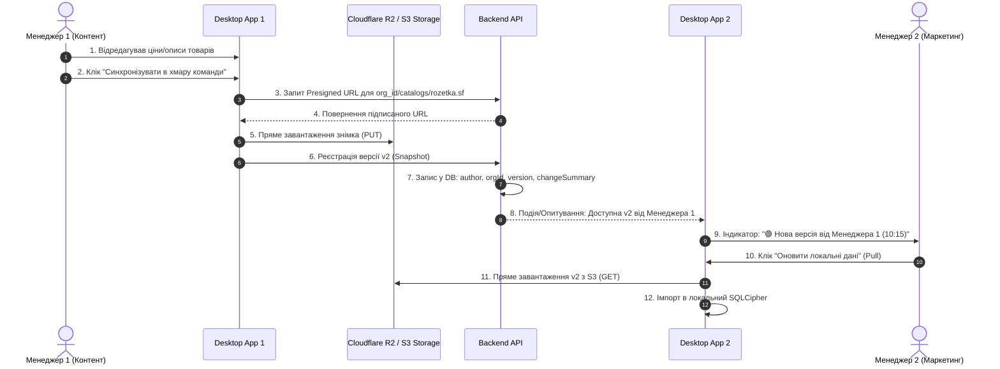

# 👥 Командна синхронізація та спільні каталоги в хмарі S3 (Team Cloud Sync & Shared Catalogs)

> **Статус:** 📋 **Беклог (Заплановано на майбутній реліз)**  
> **Категорія:** `plans/backlog/`  
> **Дата створення:** 28.08.2026  
> **Ціль:** Реалізувати модель спільного доступу до каталогів товарів (Сценарій А) між учасниками однієї організації: синхронізація знімків фіду в S3 (Cloudflare R2), сповіщення про нові версії від колег, блокування конфліктів та вивантаження актуальних даних у локальний SQLite (SQLCipher).

---

## 🧭 1. Архітектурна модель (Сценарій А: Hub & Spoke Cloud Sync)



---

## 🛠 2. Ключові етапи реалізації

### 🔹 Етап 1: Прив'язка знімків до Організації (`schema.prisma` & CQRS)

1. **Зміни у Prisma**:
   - Додати зв'язок `Snapshot` з `Organization`:
     ```prisma
     model Snapshot {
       id             String        @id @default(cuid())
       organizationId String?       @map("organization_id")
       organization   Organization? @relation(fields: [organizationId], references: [id], onDelete: Cascade)
       userId         String        @map("user_id")
       user           User          @relation(fields: [userId], references: [id], onDelete: Cascade)
       snapshotName   String        @map("snapshot_name")
       s3Key          String        @map("s3_key")
       sizeBytes      BigInt        @map("size_bytes")
       version        Int           @default(1)
       changeSummary  String?       @map("change_summary")
       createdAt      DateTime      @default(now()) @map("created_at")

       @@index([organizationId])
       @@index([userId])
       @@map("snapshots")
     }
     ```
2. **CQRS ендпоінти**:
   - `GET /api/organizations/:id/snapshots` — список спільних знімків каталогів організації.
   - `POST /api/organizations/:id/snapshots` — реєстрація нового знімка каталогу від члена команди.
   - `POST /api/storage/presigned-url` — генерація захищеного S3 URL з шляхом `organizations/{orgId}/catalogs/{catalogId}/{version}.sf`.

---

### 🔹 Етап 2: Інтерфейс у Desktop App (`CloudSyncPage.tsx`)

1. **Список командних каталогів (Shared Workspaces)**:
   - Відображення списку спільних фідів компанії (наприклад: _Rozetka Main_, _Prom.ua Fashion_, _Google Shopping_).
   - Інформація по кожному каталогу:
     - Поточна локальна версія vs Свіжа версія в хмарі.
     - Автор останніх змін (ім'я та email колеги).
     - Час останнього оновлення.
2. **Кнопки дій**:
   - **`Вивантажити в хмару (Push)`**: Зберігає поточний стан локальної бази в S3 як нову версію.
   - **`Оновити з хмари (Pull)`**: Завантажує останній знімок із хмари та оновлює локальну таблицю.
   - **`Історія версій (Rollback)`**: Можливість відкотити каталог на будь-яку з попередніх версій за останні 30 днів.

---

### 🔹 Етап 3: Захист від конфліктів одночасного редагування (Optimistic Locking)

1. **Попередження про зміни**:
   - Якщо Менеджер 2 намагається зробити `Push`, але з моменту його останнього `Pull` Менеджер 1 вже вивантажив новішу версію:
   - Система показує діалогове вікно попередження:
     > ⚠️ **Конфлікт версій каталогу**  
     > Менеджер _Іван Петренко_ вивантажив нову версію 15 хвилин тому.  
     > **Варіанти:**
     >
     > 1. _Оновити свої дані з хмари_ (рекомендовано).
     > 2. _Зберегти як окрему копію фіду_ (наприклад, `Rozetka (копія)`).
     > 3. _Примусово перезаписати_ (Force Push).

---

## 🔒 3. Безпека та Ізоляція

- Усі S3 Presigned URLs генеруються тільки після перевірки ролі в `OrganizationMemberGuard`.
- Запрошені співробітники (`MEMBER`) можуть завантажувати та оновлювати каталоги, але видалення архівних версій доступне лише `OWNER` або `ADMIN`.

---

## 🧪 4. План тестування (DoD)

1. **Backend Jest E2E**:
   - Тест створення командного знімка від імені `MEMBER`.
   - Тест перегляду списку знімків іншим учасником тієї ж організації.
   - Тест 403 Forbidden при спробі доступу користувача з іншої організації.
2. **Desktop Playwright E2E**:
   - Тест відображення списку командних каталогів на `CloudSyncPage`.
   - Тест процесу Push/Pull та оновлення статусних бейджів.
   - Двомовне тестування UA ⇄ EN.
