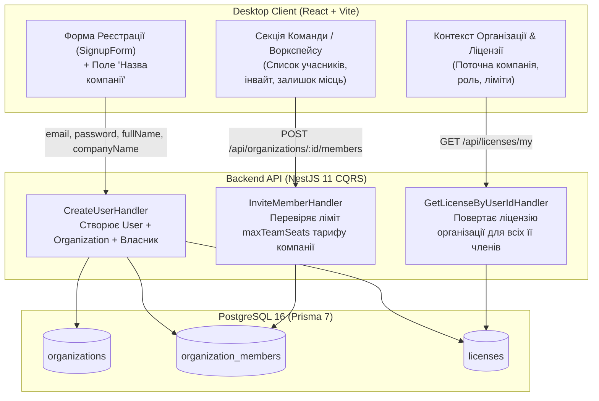

# 🏢 План Інтеграції: Реєстрація Компанії, Корпоративна Ліцензія та Роздача Доступів (Team Workspace & Access Control)

> **Статус:** ✅ Реалізовано  
> **Зв'язані документи:**
>
> - [`plans/tariff_strategy.md`](file:///Users/oleg/AQA/SmartFeedStudio/plans/tariff_strategy.md) (4-рівнева модель тарифів)
> - [`plans/organizations_and_team_seats.md`](file:///Users/oleg/AQA/SmartFeedStudio/plans/organizations_and_team_seats.md) (Модель БД організацій)

---

## 🎯 1. Головна Мета

Реалізувати наскрізну роботу корпоративної моделі (B2B SaaS Workspace), де:

1. **При реєстрації користувача на фронтенді (Desktop App)** вказується **«Назва компанії»** (`companyName`).
2. Користувач стає **Власником (`OWNER`)** новоствореної Компанії/Організації.
3. **Ліцензія та тариф видаються на Компанію (`organizationId`)**:
   - Всі права, квоти (товари, фіди, канали, AI-кредити, хмарний бекап) та термін дії визначаються тарифом компанії.
   - Будь-який запрошений співробітник (`MEMBER` / `ADMIN`) автоматично **успадковує ліцензію та можливості тарифу компанії**.
4. **Контроль командних місць (`maxTeamSeats`)**:
   - `STARTER` (1 місце — тільки власник)
   - `GROWTH` (1 місце — тільки власник)
   - `PRO` (до 3 місць — власник + 2 співробітники)
   - `ENTERPRISE` (безліміт місць — ∞)
   - При спробі додати користувача понад ліміт — блокування з інформуванням про необхідність підвищення тарифу.

---

## 🏛 2. Архітектурні Зміни по Шарах

---

## 📋 3. Поетапний План Реалізації

### Етап 1. Спільні Контракти (`packages/shared`)

- [x] Поле `companyName?: string` у `RegisterDtoSchema`.
- [ ] Оновити `UserProfile` / `AuthResponseDto`: додати дані поточної організації `organization?: { id: string; name: string; role: MemberRole }`.
- [ ] Оновити `LicenseEntity`: додати `organizationId?: string | null` та `organizationName?: string | null`.
- [ ] Виконати `pnpm --filter @smartfeed/shared build`.

---

### Етап 2. Бекенд API (`services/backend-api`)

1. **Успадкування ліцензії в `GetLicenseByUserIdHandler`**:
   - Якщо у користувача немає персональної активної ліцензії, шукати ліцензію організації, в якій користувач є учасником (`OrganizationMember`).
   - Завдяки цьому будь-який запрошений співробітник одразу отримує активний статус та можливості тарифу компанії.
2. **Збагачення відповіді профілю `/api/auth/me` та `/api/auth/login`**:
   - Повертати інформацію про активну компанію користувача та його роль (`OWNER` / `ADMIN` / `MEMBER`).
3. **Блокування та перевірка доступів до каталогів**:
   - Якщо тариф компанії завершився або заблокований — доступ блокується для всіх членів команди.
4. **Тестування**:
   - Додати тести в `licenses.e2e-spec.ts` та `organizations.e2e-spec.ts`, що перевіряють:
     - Співробітник без власної ліцензії успадковує тариф компанії.
     - Додавання співробітника збільшує `usedTeamSeats`.
     - Заборона перевищення ліміту `maxTeamSeats`.

---

### Етап 3. Фронтенд Desktop-клієнта (`apps/desktop`)

1. **Типи та API-клієнт ([apps/desktop/src/lib/api.ts](file:///Users/oleg/AQA/SmartFeedStudio/apps/desktop/src/lib/api.ts))**:
   - Додати `companyName?: string` в `RegisterCredentials`.
   - Додати методи отримання поточної організації та запрошення учасника (`inviteOrganizationMember`, `removeOrganizationMember`).
2. **Форма реєстрації ([apps/desktop/src/components/signup-form.tsx](file:///Users/oleg/AQA/SmartFeedStudio/apps/desktop/src/components/signup-form.tsx))**:
   - Додати інпут `companyName` («Назва компанії / магазину») з валідацією, іконкою `Building2` та плейсхолдером.
3. **Двомовна локалізація (i18n)**:
   - Оновити [locales/uk/auth.json](file:///Users/oleg/AQA/SmartFeedStudio/apps/desktop/src/i18n/locales/uk/auth.json) та [locales/en/auth.json](file:///Users/oleg/AQA/SmartFeedStudio/apps/desktop/src/i18n/locales/en/auth.json):
     - `companyNameLabel`: "Назва компанії / організації" / "Company / Store name"
     - `companyNamePlaceholder`: "Наприклад, Rozetka Store або ТОВ Смарт" / "e.g., Rozetka Store or Smart LLC"
     - `companyNameNote`: "До цієї компанії буде прив'язано вашу ліцензію та командні місця" / "Your license and team seats will be tied to this company"
4. **Сайдбар та відображення Компанії**:
   - У верхній частині сайдбару поруч з профілем відображати назву поточної компанії та бейдж ролі (`Власник`, `Учасник`).
5. **Вкладка/Секція «Команда та Ліцензія» в Налаштуваннях або Тарифах**:
   - Відображення індикатора місць: `1 / 1` (Starter/Growth), `1 / 3` (Pro), `1 / ∞` (Enterprise).
   - Список учасників організації.
   - Кнопка «Запросити колегу» (якщо ліміт дозволяє, або блокування з підказкою апгрейду на PRO/Enterprise).

---

### Етап 4. Автоматизоване Тестування (Playwright & Jest)

1. **Desktop E2E Playwright Tests**:
   - Тест реєстрації з вказанням назви компанії: перевірка створення та переходу в додаток.
   - Тест локалізації форми реєстрації (UA ⇄ EN) для поля компанії.
   - Тест відображення назви компанії та квоти командних місць.
2. **Повне очищення тестових даних (Zero Leftovers)**:
   - Всі створені під час тестів компанії та інвайти видаляються в `afterAll`.

---

## 🛡️ Контроль Якості (Definition of Done)

- [ ] Всі 4 пакети монорепозиторію проходять перевірку `tsc --noEmit` з кодом 0 (нуль помилок).
- [ ] Всі 100% тестів бекенду, десктопу та адмін-порталу проходять успішно.
- [ ] Усі рядки перекладено двома мовами (UA / EN).
- [ ] Виконано `pnpm format`.
- [ ] Оновлено WIKI та архітектурну документацію.
