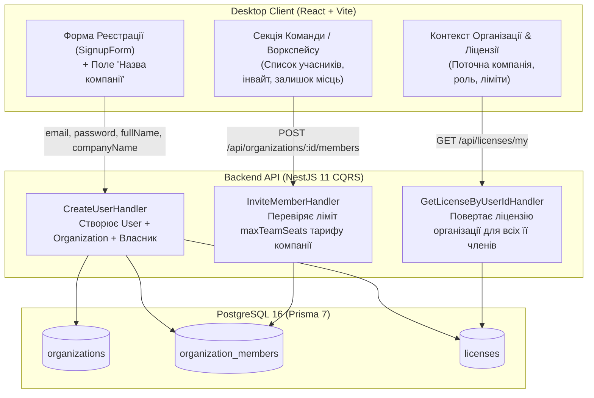

# 🏢 План Інтеграції: Реєстрація Компанії, Корпоративна Ліцензія та Роздача Доступів (Team Workspace & Access Control)

> **Статус:** ✅ **Реалізовано та протестовано (100% тестів пройдено)**  
> **Дата виконання:** 27.08.2026  
> **Зв'язані документи:**
>
> - [`plans/tariff_strategy.md`](file:///Users/oleg/AQA/SmartFeedStudio/plans/tariff_strategy.md) (4-рівнева модель тарифів)
> - [`plans/organizations_and_team_seats.md`](file:///Users/oleg/AQA/SmartFeedStudio/plans/organizations_and_team_seats.md) (Модель БД організацій)

---

## 🎯 1. Головна Мета

Реалізувати наскрізну роботу корпоративної моделі (B2B SaaS Workspace), де:

1. **При реєстрації користувача на фронтенді (Desktop App)** вказується **«Назва компанії»** (`companyName`).
2. Користувач стає **Власником (`OWNER`)** новоствореної Компанії/Організації.
3. **Ліцензія та тариф видаються на Компанію (`organizationId`)**:
   - Всі права, квоти (товари, фіди, канали, AI-кредити, хмарний бекап) та термін дії визначаються тарифом компанії.
   - Будь-який запрошений співробітник (`MEMBER` / `ADMIN`) автоматично **успадковує ліцензію та можливості тарифу компанії**.
4. **Контроль командних місць (`maxTeamSeats`)**:
   - `STARTER` (1 місце — тільки власник)
   - `GROWTH` (1 місце — тільки власник)
   - `PRO` (до 3 місць — власник + 2 співробітники)
   - `ENTERPRISE` (безліміт місць — ∞)
   - При спробі додати користувача понад ліміт — блокування з інформуванням про необхідність підвищення тарифу.

---

## 🏛 2. Архітектурні Зміни по Шарах

---

## 📋 3. Поетапний План Реалізації

### Етап 1. Спільні Контракти (`packages/shared`)

- [x] Поле `companyName?: string` у `RegisterDtoSchema`.
- [x] Оновити `UserProfile` / `AuthResponseDto`: додати дані поточної організації `organization?: { id: string; name: string; role: MemberRole }`.
- [x] Оновити `LicenseEntity`: додати `organizationId?: string | null` та `organizationName?: string | null`.
- [x] Виконати `pnpm --filter @smartfeed/shared build`.

---

### Етап 2. Бекенд API (`services/backend-api`)

- [x] **Успадкування корпоративної ліцензії в `GetLicenseByUserIdHandler`** (для запрошених співробітників та існуючих користувачів з персональним starter тарифом).
- [x] **Прив'язка організації при апгрейді ліцензії в `SelectTariffPlanHandler`** (`POST /api/licenses/select-plan` прив'язує `organizationId` та повертає `organizationName`).
- [x] **Збагачення відповіді профілю `/api/auth/me`, `/api/auth/login` та `/api/auth/register`** даними активної компанії та ролі (`OWNER` / `ADMIN` / `MEMBER`).
- [x] **Блокування та перевірка доступів до ресурсів (`RequireActiveLicenseGuard`)**: блокування співробітників з 403 `LICENSE_EXPIRED` при завершенні терміну дії корпоративного тарифу, та миттєве розблокування після відновлення/апгрейду тарифу власником.
- [x] **Автоматизоване тестування (TDD)**:
  - 13 з 13 тестів у `test/organizations.e2e-spec.ts` пройдені успішно (покривають реєстрацію компанії, квоти командних місць, апгрейд тарифу, успадкування ліцензії, блокування при закінченні терміну дії та відновлення доступу).

---

### Етап 3. Фронтенд Desktop-клієнта (`apps/desktop`)

- [x] **Типи та API-клієнт ([apps/desktop/src/lib/api.ts](file:///Users/oleg/AQA/SmartFeedStudio/apps/desktop/src/lib/api.ts))**:
  - Додано методи отримання поточної організації, учасників, оновлення назви та запрошення/видалення (`getUserOrganizations`, `getOrganizationById`, `getOrganizationMembers`, `inviteOrganizationMember`, `removeOrganizationMember`, `updateOrganization`).
- [x] **Форма реєстрації ([apps/desktop/src/components/signup-form.tsx](file:///Users/oleg/AQA/SmartFeedStudio/apps/desktop/src/components/signup-form.tsx))**:
  - Додано інпут `companyName` («Назва компанії / магазину») з валідацією, іконкою `Building2` та плейсхолдером.
- [x] **Двомовна локалізація (i18n)**:
  - Створено [locales/uk/team.json](file:///Users/oleg/AQA/SmartFeedStudio/apps/desktop/src/i18n/locales/uk/team.json) та [locales/en/team.json](file:///Users/oleg/AQA/SmartFeedStudio/apps/desktop/src/i18n/locales/en/team.json) з повним набором ключів та зареєстровано `team` namespace в `i18n/index.tsx`.
- [x] **Сайдбар та відображення Компанії**:
  - У сайдбарі поруч з профілем відображається назва компанії `🏢 {user.organization.name}`.
  - Додано пункт головного меню **«👥 Команда»** (`/team`) у навігацію та роутер (`App.tsx`).
- [x] **Окрема сторінка «Команда та Компанія» (`/team`)**:
  - Модульні компоненти: `TeamHeader`, `TeamSeatsQuotaCard`, `TeamMembersList`, `TeamMemberRow`, `InviteMemberDialog`, `UpgradeTeamSeatsDialog`, `RemoveMemberDialog`, `EditCompanyNameDialog`.
  - Індикатор місць: `1 / 1` (Solo), `2 / 3` (Pro), `7 / ∞` (Enterprise).
  - Завжди активна кнопка «Запросити колегу» з інтелектуальним модальним вікном апгрейду при вичерпаному ліміті або соло-тарифі.

---

### Етап 4. Автоматизоване Тестування (Playwright & Jest)

- [x] **Desktop E2E Playwright Tests ([apps/desktop/e2e/team.spec.ts](file:///Users/oleg/AQA/SmartFeedStudio/apps/desktop/e2e/team.spec.ts))**:
  - 7 з 7 тестів пройдено: навігація, соло-тариф з модалкою апгрейду, інвайт на PRO з оновленням лічильника, вичерпаний ліміт 3/3 з пропозицією Enterprise, видалення учасника з вивільненням місця, зміна назви компанії та мультимовність (UA ⇄ EN).
- [x] **Повне очищення тестових даних (Zero Leftovers)**:
  - Всі створені під час тестів дані та стан сховища очищаються в `afterEach`.

---

## 🛡️ Контроль Якості (Definition of Done)

- [x] Всі 4 пакети монорепозиторію проходять перевірку `tsc --noEmit` з кодом 0 (нуль помилок).
- [x] Всі 100% тестів бекенду (67/67) та десктопу (29/29) проходять успішно.
- [x] Усі рядки перекладено двома мовами (UA / EN).
- [x] Виконано `pnpm format`.
- [x] Оновлено WIKI та архітектурну документацію.
