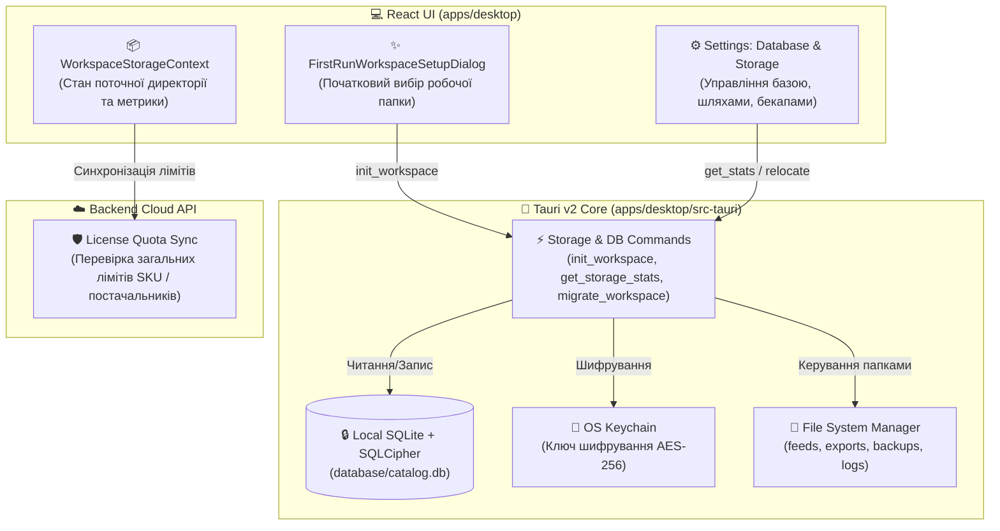

# 📁 План 10: Локальна зашифрована база даних (SQLCipher), вибір робочої папки (Onboarding) та управління сховищем у Налаштуваннях

> **Статус:** ✅ **Реалізовано та протестовано (100% тестів пройдено)**  
> **Дата виконання:** 29.08.2026

---

## 📌 Огляд задачі

Користувач працює з великими каталогами товарів (10 000 – 100 000+ SKU). Задля забезпечення **0 мс затримки, 100% конфіденційності цін і собівартості, роботи в офлайні та відсутності надмірного навантаження на хмарний сервер**, база товарів зберігається **безпосередньо на комп'ютері користувача** у зашифрованому вигляді (`SQLite` + `SQLCipher AES-256`).

### Основні вимоги:

1. **Перший запуск / Вхід у кабінет (First-Run Workspace Setup)**:
   - Після реєстрації/першого логіну з'являється елегантний майстер (Onboarding Dialog), який пропонує вибрати локальну папку для збереження робочих даних додатку.
   - Пропонується дефолтний системний шлях (наприклад, `~/Documents/SmartFeedStudio` або `~/SmartFeedStudioData`) з можливістю вибрати будь-яку іншу теку через системний діалог (Finder / Explorer).
   - При ініціалізації в обраній папці автоматично розгортається захищена структура директорій:
     - `database/catalog.db` — зашифрована база даних (SQLCipher AES-256, ключ у системному OS Keychain).
     - `feeds/` — локальний кеш та збережені XML/CSV файли фідів постачальників.
     - `exports/` — згенеровані файли експорту для маркетплейсів (Rozetka, Prom тощо).
     - `backups/` — локальні резервні знімки та бекапи каталогу.
     - `logs/` — локальні логи операцій та парсингу.
2. **Окремий розділ у Налаштуваннях («База даних та сховище» / Database & Storage)**:
   - Відображення поточної активної робочої папки з кнопкою «Відкрити в провіднику / Finder».
   - Статистика зайнятого дискового простору (розмір БД, розмір збережених фідів, експортів, бекапів).
   - Кнопка «Змінити робочу папку / Перенести дані» (міграція бази в інше місце або підключення існуючої).
   - Кнопка «Створити резервну копію (Backup Now)».
   - Кнопка «Оптимізація та перевірка цілісності» (`VACUUM` та `PRAGMA integrity_check`).
   - Кнопка «Очистити кеш фідів та тимчасові файли».
3. **Rust Tauri v2 Backend Engine**:
   - Нативні Tauri команди для роботи з файловою системою, ініціалізації бази та виконання швидких запитів.
   - Синхронізація лімітів/квот із хмарним сервером для контролю тарифного плану.

---

## 🏗 Архітектура рішення

---

## 📋 План реалізації (Фази)

### Фаза 1: Спільні DTOs та типи (`packages/shared`) ✅

- Створено `WorkspaceInfoDto`, `StorageStatsDto`, `DatabaseMaintenanceResultDto`, `InitWorkspaceDto`, `MigrateWorkspaceDto`.
- Додано Zod схеми валідації.

### Фаза 2: Rust Tauri v2 Backend Модулі (`apps/desktop/src-tauri`) ✅

- `workspace.rs`: створення та валідація директорій, підрахунок розмірів файлів, створення ZIP/tar бекапів, конфіг `workspace.json`.
- `db.rs`: ініціалізація SQLCipher, збереження ключа в OS Keychain (`keyring`), створення локальних таблиць `local_suppliers`, `local_feed_sources`, `local_products`.
- Реєстрація IPC команд у `lib.rs`: `init_workspace_directory`, `get_workspace_info`, `get_storage_stats`, `create_local_backup`, `run_database_maintenance`, `open_in_file_manager`, `clear_storage_cache`.

### Фаза 3: Frontend Клієнт та State Context (`apps/desktop`) ✅

- `storageApi.ts`: клієнт з викликом Tauri IPC та Web/Mock fallback для тестів.
- `WorkspaceStorageContext.tsx`: глобальний контекст стану робочої папки, метрик диска та тригера модалки онбордингу.
- `FirstRunWorkspaceSetupDialog.tsx`: повнорозмірна модалка з порталом у `document.body` та `bg-black/40 backdrop-blur-sm`.
- `MigrateWorkspaceDialog.tsx`: діалог зміни/перенесення робочої папки.
- `SettingsStorageTab.tsx`: вкладка «База даних та сховище» в Налаштуваннях з лічильниками, метриками та кнопками дій.
- `SettingsPage.tsx`: перемикач вкладок між Загальними та Базою даних.

### Фаза 4: Мультимовність (i18n) & Zero Dead Code ✅

- Додано `locales/uk/storage.json` та `locales/en/storage.json`.
- Оновлено `apps/desktop/src/i18n/types.ts` та `apps/desktop/src/i18n/index.tsx`.

### Фаза 5: Playwright E2E Тестування ✅

- Створено `apps/desktop/e2e/workspace-storage.spec.ts` з 5 комплексними тестами (100% pass).
