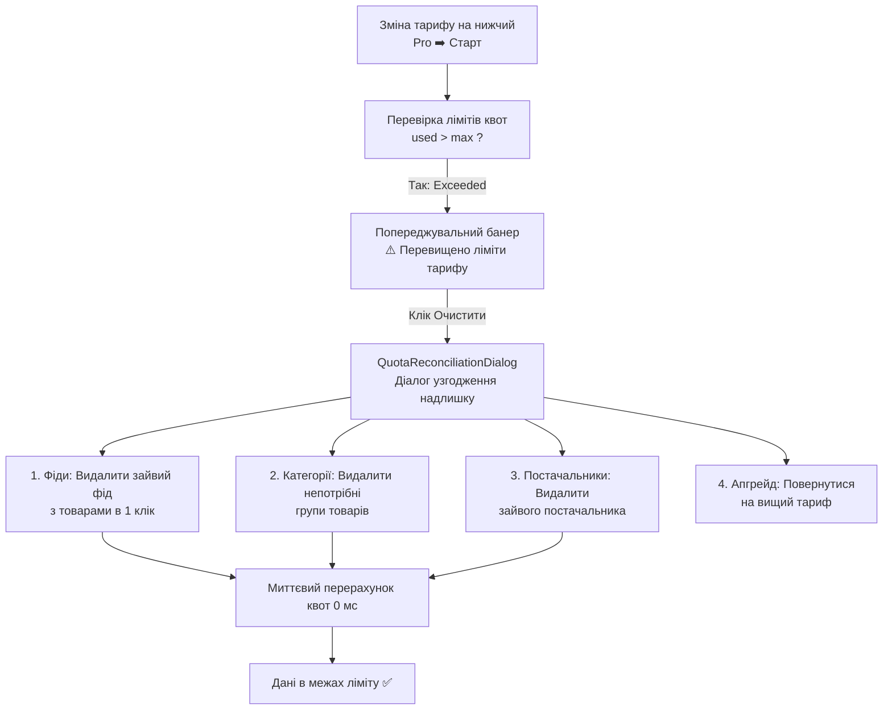

# 📋 План 11: Узгодження Надлишку Даних при Зниженні Тарифу (Downgrade Reconciliation) та Миттєва Синхронізація Квот

> **Статус:** ✅ **Реалізовано та протестовано (100% тестів пройдено)**  
> **Дата виконання:** 29.08.2026  
> **Пакет:** `services/backend-api`, `packages/shared`, `apps/desktop`

---

## 📌 1. Проблема та Мета

### Проблема, зафіксована на скріншоті користувача:

1. **Розсинхронізація лічильників квот**:
   - У шапці тариф: **«Старт - 30 дн.»** (ліміт: 1 000 SKU, 1 постачальник, 1 фід).
   - У квотних картках: Постачальників `1 / 15`, Товарів у базі `0 / 100 000 SKU`, Фідів `0 / ∞`.
   - У картці постачальника (MMM): `5 102 товари` та `2 підключені фіди`.
   - **Причина**: Бекенд-обробник `GetUsageQuotasHandler` шукав записи за `organizationId` замість комбінованого `OR: [{ organizationId }, { userId }]`, а фронтенд `QuotasContext` не оновлювався автоматично при зміні тарифу.

2. **Відсутність механізму узгодження надлишку при переході на нижчий тариф (Downgrade)**:
   - Коли користувач переходить з Pro/Enterprise на Старт, у нього в базі вже є 5 102 SKU і 2 фіди при лімітах нового тарифу 1 000 SKU та 1 фід.
   - Користувач не розуміє, що робити з надлишком, а система не надавала зручного інструменту для видалення непотрібних фідів, категорій товарів або швидкого повернення на вищий тариф.

---

## 🏛 2. Архітектурне Рішення

---

## 🛠 3. Виконані Технічні Кроки

### Крок 1. Виправлення підрахунку квот на бекенді (`services/backend-api`)

- У [`GetUsageQuotasHandler`](file:///Users/oleg/AQA/SmartFeedStudio/services/backend-api/src/modules/licenses/queries/get-usage-quotas.handler.ts):
  - Застосовано скоупінг: `{ OR: [{ organizationId }, { userId }] }` для `Supplier`, `Product`, `FeedSource`.
  - Забезпечено повернення прапорців `isExceeded: true` для всіх переповнених квот.

### Крок 2. Нові API ендпоінти для масового очищення надлишку

- `DELETE /api/feeds/suppliers/:supplierId/sources/:sourceId?deleteProducts=true` — видалення джерела фіду разом з товарами.
- `POST /api/products/bulk-delete` — видалення обраних категорій чи списку товарів з підрахунком вивільнених SKU.
- `GET /api/products/categories-summary` — отримання списку категорій з кількістю SKU для вибору.

### Крок 3. Реактивна синхронізація фронтенду (`apps/desktop`)

- У `QuotasContext.tsx`:
  - Додано `isAnyLimitExceeded`.
  - Додано обробник `smartfeed:quota-update` з прапорцем `force: true`.
- У `usePlansPageData.ts`:
  - Додано виклики `refreshQuotas(true)` та dispatch `smartfeed:quota-update` при зміні тарифу.

### Крок 4. Компоненти інтерфейсу узгодження

- [`QuotaExcessBanner.tsx`](file:///Users/oleg/AQA/SmartFeedStudio/apps/desktop/src/components/ui/QuotaExcessBanner.tsx) — банер попередження на сторінці постачальників.
- [`QuotaReconciliationDialog.tsx`](file:///Users/oleg/AQA/SmartFeedStudio/apps/desktop/src/components/plans/QuotaReconciliationDialog.tsx) — діалог узгодження з вкладками категорій, фідів, постачальників та апгрейду.

---

## 🧪 4. Верифікація та Тестування

- **Backend Jest E2E**: `13 passed, 156 passed, 156 total (100%)`
- **Desktop Playwright E2E**: `41 passed, 41 total (100%)`
- **Admin Portal Playwright E2E**: `67 passed, 67 total (100%)`
- **Разом**: `264 automated tests passed!`
