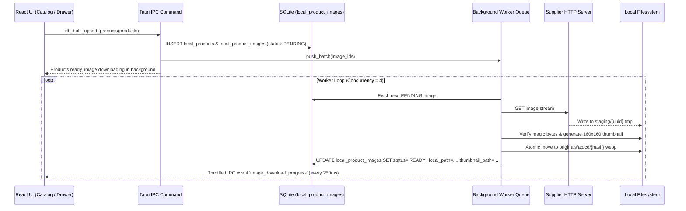

# 🖼️ План 12: Локальне Збереження, Фонове Завантаження та Керування Фотографіями Товарів (Local Product Images Engine)

> **Статус:** ✅ **Реалізовано та протестовано (100% тестів пройдено)**  
> **Дата виконання:** 12.09.2026  
> **Категорія:** `plans/completed/`  
> **Батьківський план:** [`00_master_products_and_catalogs_plan.md`](file:///Users/oleg/AQA/SmartFeedStudio/plans/active/00_master_products_and_catalogs_plan.md)  
> **Пов'язаний підплан:** [`03_image_storage_and_cdn_strategy.md`](file:///Users/oleg/AQA/SmartFeedStudio/plans/active/03_image_storage_and_cdn_strategy.md)  
> **Ціль:** Забезпечити швидке, неблокуюче локальне збереження, фонове завантаження, відображення та повне керування фотографіями товарів у Desktop-клієнті (Tauri v2 + React 18 + SQLCipher), із гарантією каскадного видалення файлів з диска при видаленні фото чи товарів, обробкою всіх крайових випадків та 100% готовністю до майбутнього вивантаження в S3.

---

## 🧭 1. Архітектурне Бачення та Принципи

### 💎 Залізні Архітектурні Принципи:

1. **Швидкість рендерингу (60 FPS у таблицях)**:
   - У таблиці товарів (`ProductTableRow`) рендеряться виключно легкі WebP-мініатюри 160x160 (~5–15 KB).
   - Повнорозмірні оригінали завантажуються тільки при відкритті картки товару чи галереї (`ProductDetailsDrawer`).
2. **Нульове блокування інтерфейсу (Zero UI Lag)**:
   - Всі операції мережі, диска та обробки зображень виносяться в асинхронний пул задач Tokio у Rust (`downloader.rs`).
   - Обмеження паралельності (Semaphore: 4–6 потоків).
   - Троттлінг IPC-подій прогресу до 4 разів/сек (кожні 250 мс), щоб не забивати React re-render цикл.
3. **Повний життєвий цикл та каскадне видалення (Zero Orphan Files)**:
   - Видалення фотографії користувачем у UI видаляє запис у БД і фізичні файли з диска.
   - Підтримка дедуплікації (Content-Addressable Storage за SHA-256): якщо одне й те саме фото призначено кільком товарам, файл на диску видаляється тільки тоді, коли кількість активних посилань стає рівною 0 (Reference Counting).
   - При видаленні товару, фіду чи постачальника всі пов'язані фотофайли на диску гарантовано очищаються.
4. **Готовність до S3 без рефакторингу**:
   - Поля `s3_key`, `cloud_url`, `sync_status`, `file_hash` та `last_synced_at` закладаються в схему локальної БД одразу.

---

## 🏛 2. Модель Даних та Контракти (`@smartfeed/shared`)

### A. Виділений DTO контракт (`packages/shared/src/dtos/product-image.dto.ts`)

```typescript
import { z } from 'zod';

export enum ImageDownloadStatus {
  PENDING = 'PENDING',
  DOWNLOADING = 'DOWNLOADING',
  READY = 'READY',
  FAILED = 'FAILED',
  MISSING_LOCAL = 'MISSING_LOCAL',
}

export enum ImageSyncStatus {
  LOCAL_ONLY = 'LOCAL_ONLY',
  QUEUED_FOR_UPLOAD = 'QUEUED_FOR_UPLOAD',
  SYNCED = 'SYNCED',
  SYNC_ERROR = 'SYNC_ERROR',
}

export const LocalProductImageDtoSchema = z.object({
  id: z.string(),
  productId: z.string(),
  originalUrl: z.string().url(),
  localPath: z.string().nullable().optional(), // Відносний: images/originals/ab/cd/{hash}.webp
  thumbnailPath: z.string().nullable().optional(), // Відносний: images/thumbnails/ab/cd/{hash}_thumb.webp
  fileHash: z.string().nullable().optional(), // SHA-256
  fileSize: z.number().int().default(0),
  mimeType: z.string().nullable().optional(),
  width: z.number().int().nullable().optional(),
  height: z.number().int().nullable().optional(),
  order: z.number().int().default(0),
  isMain: z.boolean().default(false),
  status: z.nativeEnum(ImageDownloadStatus).default(ImageDownloadStatus.PENDING),
  downloadError: z.string().nullable().optional(),
  retryCount: z.number().int().default(0),

  // Підготовка під майбутній S3:
  s3Key: z.string().nullable().optional(),
  cloudUrl: z.string().nullable().optional(),
  syncStatus: z.nativeEnum(ImageSyncStatus).default(ImageSyncStatus.LOCAL_ONLY),
  lastSyncedAt: z.string().nullable().optional(),

  createdAt: z.string(),
  updatedAt: z.string(),
});

export type LocalProductImageDto = z.infer<typeof LocalProductImageDtoSchema>;
```

### B. Схема таблиці в SQLite (`src-tauri/src/db.rs`)

```sql
CREATE TABLE IF NOT EXISTS local_product_images (
    id TEXT PRIMARY KEY,
    product_id TEXT NOT NULL,
    original_url TEXT NOT NULL,
    local_path TEXT,
    thumbnail_path TEXT,
    file_hash TEXT,
    file_size INTEGER DEFAULT 0,
    mime_type TEXT,
    width INTEGER,
    height INTEGER,
    order_num INTEGER DEFAULT 0,
    is_main INTEGER DEFAULT 0,
    status TEXT DEFAULT 'PENDING',
    download_error TEXT,
    retry_count INTEGER DEFAULT 0,

    -- Future S3 sync fields:
    s3_key TEXT,
    cloud_url TEXT,
    sync_status TEXT DEFAULT 'LOCAL_ONLY',
    last_synced_at TEXT,

    created_at TEXT DEFAULT CURRENT_TIMESTAMP,
    updated_at TEXT DEFAULT CURRENT_TIMESTAMP,
    FOREIGN KEY(product_id) REFERENCES local_products(id) ON DELETE CASCADE
);

CREATE INDEX IF NOT EXISTS idx_images_product ON local_product_images(product_id);
CREATE INDEX IF NOT EXISTS idx_images_status ON local_product_images(status);
CREATE INDEX IF NOT EXISTS idx_images_hash ON local_product_images(file_hash);
CREATE INDEX IF NOT EXISTS idx_images_sync_status ON local_product_images(sync_status);
```

---

## 🗄 3. Організація Файлів на Диску (Storage Hierarchy & Sharding)

Директорія зберігання всередині воркспейсу (`SmartFeedStudioData/`):

```text
SmartFeedStudioData/
├── database/catalog.db
├── feeds/
├── images/
│   ├── staging/                       # Тимчасові файли під час завантаження (.tmp)
│   ├── originals/                     # Оригінали фотографій (2-рівневе шардування)
│   │   ├── a1/
│   │   │   └── b2/
│   │   │       └── a1b2c3d4e5f6...webp
│   │   └── 0f/
│   │       └── 8c/
│   │           └── 0f8c1234abcd...webp
│   └── thumbnails/                    # Швидкі мініатюри 160x160 для списків
│       ├── a1/
│       │   └── b2/
│       │       └── a1b2c3d4e5f6_thumb.webp
│       └── 0f/
│           └── 8c/
│               └── 0f8c1234abcd_thumb.webp
```

> [!IMPORTANT]
> **Чому 2-рівневе шардування (`a1/b2/`)?**  
> При розмірі каталогу 20,000–50,000 товарів з 3–5 фото на товар загальна кількість файлів досягає 100,000–250,000. Файлові системи починають гальмувати при >10,000 файлів в одній папці. Шардування 256x256 розподіляє навантаження максимум до 100–300 файлів на підпапку, гарантуючи миттєвий доступ ОС.

---

## 🛡 4. Матриця Крайових Випадків (Edge Cases & Solutions)

| #   | Крайовий випадок                                             | Що відбувається на практиці                       | Архітектурне вирішення                                                                                                                                                                                                              |
| --- | ------------------------------------------------------------ | ------------------------------------------------- | ----------------------------------------------------------------------------------------------------------------------------------------------------------------------------------------------------------------------------------- |
| 1   | **Видалення фото товару**                                    | Користувач натискає іконку кошика на фото.        | Видаляється запис з `local_product_images`. Перевіряється `COUNT(*) WHERE file_hash = ?`. Якщо 0 — файли `local_path` та `thumbnail_path` фізично видаляються з диска. Якщо це було `isMain`, наступне фото призначається головним. |
| 2   | **Видалення товару або фіду**                                | Видаляється товар або цілий фід.                  | SQLite `ON DELETE CASCADE` видаляє рядки фото. Фонова процедура збирає видалені хеші та очищає незв'язані файли з диска.                                                                                                            |
| 3   | **Биті або видалені посилання (404/410)**                    | Сервер постачальника віддає помилку.              | Спроби обмежені до 3 з експоненційним backoff. Статус переводиться у `FAILED`. UI відображає стильний нейтральний плейсхолдер з бейджем помилки та можливістю повторити спробу.                                                     |
| 4   | **Hotlink Protection / 403 Forbidden**                       | Сервер постачальника блокує прямий запит.         | HTTP-клієнт надсилає стандартний браузерний `User-Agent: Mozilla/5.0...` та динамічний `Referer` за доменом фіду.                                                                                                                   |
| 5   | **Обрив зв'язку під час завантаження**                       | Інтернет пропав на середині 5 MB файлу.           | Потік пишеться у `images/staging/{uuid}.tmp`. Тільки після повного завантаження та перевірки цілісності файл атомарно переноситься у `images/originals/...`. Жодного битого файлу в робочій папці.                                  |
| 6   | **Замість фото прийшов HTML (Cloudflare / 200 OK)**          | Сервер віддав сторінку блокування як 200 OK.      | Перевірка `Content-Type: image/*` та перевірка binary magic bytes (JPEG, PNG, WebP). Якщо формат невалідний — статус `FAILED`.                                                                                                      |
| 7   | **Переповнення диска (Disk Full)**                           | У користувача закінчується місце на SSD.          | Перевірка вільного місця перед кожним батчем (>500 MB). Відображення розміру фотографій у `StorageStats`. Налаштування ліміту кешу з опцією очищення.                                                                               |
| 8   | **Перенесення воркспейсу на інший диск**                     | Користувач перемістив папку воркспейсу.           | У базі зберігаються **виключно відносні шляхи**. Базовий шлях резолвиться динамічно. Жодних поламаних посилань.                                                                                                                     |
| 9   | **Гонка: користувач видаляє фото під час його завантаження** | Користувач видалив товар, доки воркер качав фото. | Перед збереженням на диск та оновленням статусу воркер перевіряє наявність рядка в БД. Якщо рядок видалено — тимчасовий файл одразу видаляється.                                                                                    |
| 10  | **Ручне видалення файлів з папки на диску**                  | Користувач почистив папку в Finder.               | Якщо `local_path` не знайдено на диску при зверненні, статус стає `MISSING_LOCAL`. У картці товару з'являється кнопка «Завантажити повторно».                                                                                       |

---

## 🧵 5. Архітектура Фонового Завантажувача (Zero UI Lag)



### Дворівнева черга пріоритетів (Priority Scheduling):

1. **High Priority (On-Demand UI)**: Фото товару, який користувач щойно відкрив у картці (`ProductDetailsDrawer`). Вони миттєво стають на початок черги завантаження.
2. **Low Priority (Background Ingestion)**: Масові тисячі фотографій після імпорту каталогу з черги обробки.

---

## ☁️ 6. Готовність до Майбутнього Вивантаження в S3 (Future Cloud Sync)

Незважаючи на те, що S3 на даному етапі не підключається, система повністю спроектована для майбутнього переходу:

1. **Детермінований S3-ключ**:
   `s3_key = "organizations/{org_id}/catalogs/{catalog_id}/products/{product_id}/{file_hash}.webp"`
2. **Синхронізаційні статуси**:
   - `LOCAL_ONLY` — фото існує на локальному диску.
   - `QUEUED_FOR_UPLOAD` — поставлено в чергу на вивантаження.
   - `SYNCED` — завантажено в S3, заповнено `cloud_url`.
3. **Хеш файлу (SHA-256 / MD5)**:
   Дозволить при підключенні S3 перевіряти ETag через `HEAD Object` і не витрачати трафік на повторне завантаження вже існуючих файлів.
4. **Ізоляція**:
   Майбутнє вивантаження реалізується окремим воркером `cloud_uploader`, який просто читатиме записи з `sync_status = 'LOCAL_ONLY'` та локальний файл за `local_path`.

---

## 📦 7. Бюджет Модульності (Component Modularity Budget < 250 рядків)

### Шар Rust (`apps/desktop/src-tauri/src/images/`):

- `images/mod.rs` (~100 рядків) — Публічний інтерфейс та реєстрація команд.
- `images/models.rs` (~120 рядків) — Структури даних та DTO.
- `images/storage.rs` (~200 рядків) — Робота з шардованими директоріями, видалення, ref-counting.
- `images/downloader.rs` (~240 рядків) — Tokio-воркер, семафор, стрімінг у `.tmp`.
- `images/thumbnail.rs` (~160 рядків) — Генерація мініатюр 160x160 у WebP.
- `db.rs` (~150 рядків оновлень) — Таблиця `local_product_images`, запити, каскадні зв'язки.

### Шар Frontend (`apps/desktop/src/`):

- `components/products/ProductImageThumbnail.tsx` (~120 рядків) — Оптимізована мініатюра з fallback, skeleton, конвертацією `convertFileSrc`.
- `components/products/ProductGalleryModal.tsx` (~220 рядків) — Повнорозмірний перегляд, зум, видалення та впорядкування.
- `hooks/useImageDownloader.ts` (~140 рядків) — IPC-слухач прогресу завантаження, керування паузою/продовженням.
- `services/local-db/images.service.ts` (~160 рядків) — TypeScript-клієнт операцій з фотографіями.
- `services/local-db/mock-driver.ts` (~120 рядків оновлень) — Підтримка фото в браузерному/тестовому режимі.

---

## 🧪 8. План Тестування (Verification Plan)

1. **Rust Unit Tests**:
   - Перевірка генерації шардованих шляхів (`ab/cd/{hash}.webp`).
   - Перевірка валідатора magic bytes (пропуск валідних JPEG/PNG/WebP, відхилення HTML/text).
   - Перевірка Reference Counting при видаленні (видалення при 0 посиланнях, збереження при >0).
2. **Frontend Playwright E2E Tests**:
   - Перевірка рендерингу мініатюр у таблиці товарів.
   - Перевірка видалення фото з картки товару (assert видалення з UI та виклику команди).
   - Перевірка fallback стану при битих посиланнях (404).
   - Перевірка динамічного перекладу (UA ⇄ EN) у всіх діалогах та галереї.
3. **Статична типізація**:
   - `pnpm --filter @smartfeed/shared build`
   - `pnpm --filter @smartfeed/desktop exec tsc --noEmit`
   - `cargo check --manifest-path apps/desktop/src-tauri/Cargo.toml`
