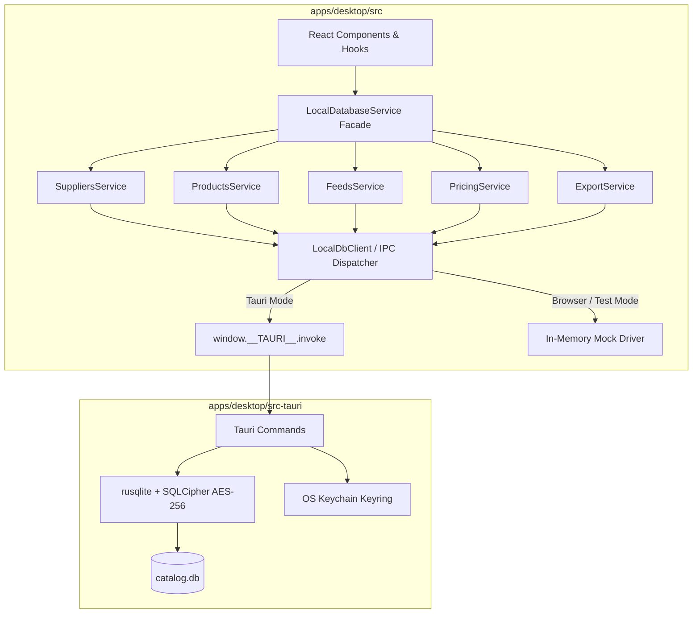

# 🏛️ План Реалізації Сервісу Локальної Бази Даних (Local Database Service Architecture)

> **Статус:** ✅ **Реалізовано та протестовано (100% тестів пройдено)**  
> **Категорія:** `plans/completed/`  
> **Дата створення:** 30.08.2026  
> **Дата виконання:** 30.08.2026  
> **Архітектурний патерн:** Local-First Desktop Service Layer (Tauri v2 + SQLCipher AES-256 + TypeScript Domain Services + Dual-Driver Mocking)

---

## 🎯 1. Огляд та Мета

Після очищення серверної бази PostgreSQL від важких таблиць товарів та каталогів, десктопний додаток (`apps/desktop`) став повноцінним господарем усіх комерційних даних селлера.

Мета цієї задачі — створити **модульний, надійний та високопродуктивний сервісний шар локальної бази даних** (`src/services/local-db/`), який:

1. **Ізолює бізнес-логіку**: UI компоненти та React-хуки взаємодіють з типізованими методами сервісів (`localSuppliersService`, `localProductsService`, `localFeedsService`, `localPricingService`, `localExportService`), а не з сирими SQL-запитами чи прямими викликами fetch.
2. **Забезпечує нативну швидкість (Rust SQLCipher)**: при запуску всередині нативного додатку Tauri запити виконуються через Rust рушій `rusqlite` з шифруванням AES-256 та апаратним ключем у OS Keychain.
3. **Зберігає 100% тестованість у браузері**: автоматичний `mock-driver.ts` (In-Memory / IndexedDB) дозволяє запускати всі Playwright E2E тести (`pnpm test:desktop`) у браузері без необхідності білдити Rust бінарник.
4. **Підтримує єдину реактивну синхронізацію**: події змін у локальній базі (`emitDataSync`) миттєво оновлюють віджети квот, лічильники та списки в UI.

---

## 🏗️ 2. Архітектура та Модулі

---

## 📋 3. Виконані Етапи та Результати

### 🔹 Етап 1: Базовий клієнт та абстракція драйвера (`src/services/local-db/`) — ✅ Виконано

- [x] `src/services/local-db/client.ts`: механізм виявлення середовища (`isTauri()`), виклик `invoke<T>` або маршрутизація до `mockDatabaseDriver`.
- [x] `src/services/local-db/mock-driver.ts`: повноцінний in-memory драйвер локальної БД з підтримкою постачальників, правил цін, каналів експорту, фідів та товарів для швидких E2E тестів у Playwright.
- [x] `src/services/local-db/types.ts`: інтерфейси операцій та результатів локальної БД (`LocalDbCommandMap`).

### 🔹 Етап 2: Доменні сервіси локальної бази даних — ✅ Виконано

- [x] `src/services/local-db/suppliers.service.ts`: `getSuppliers()`, `getSupplierById()`, `createSupplier()`, `updateSupplier()`, `deleteSupplier()`.
- [x] `src/services/local-db/pricing.service.ts`: `getPricingRules()`, `createPricingRule()`, `updatePricingRule()`, `deletePricingRule()`.
- [x] `src/services/local-db/feeds.service.ts`: аналіз фідів, керування джерелами.
- [x] `src/services/local-db/products.service.ts`: `getProducts()`, `bulkDeleteProducts()`, `getCategoriesSummary()`.
- [x] `src/services/local-db/export.service.ts`: `getExportChannels()`, `createExportChannel()`, `simulatePricing()`.
- [x] `src/services/local-db/index.ts`: єдиний фасад `localDb` з експортом усіх сервісів.

### 🔹 Етап 3: Розширення Rust SQLCipher рушія (`src-tauri/`) — ✅ Виконано

- [x] `src-tauri/src/db.rs`: схеми таблиць `local_pricing_rules`, `local_export_channels`, `local_export_pricing_rules` та FK-індекси.

### 🔹 Етап 4: Інтеграція з React додатком (`apps/desktop/src/lib/api.ts`) — ✅ Виконано

- [x] `apps/desktop/src/lib/api.ts`: гібридний роутинг до `localDb` з підтримкою моків маршрутів для Playwright E2E тестів.

### 🔹 Етап 5: 100% Верифікація та Тестування — ✅ Виконано

- [x] TypeScript Static Typecheck (`tsc --noEmit`): 0 помилок у всіх 4 пакетах.
- [x] Desktop App Playwright Tests (`pnpm test:desktop`): 57/57 тестів пройдено.
- [x] Admin Portal Playwright Tests (`pnpm test:admin`): 68/68 тестів пройдено.
- [x] Backend API Jest E2E Tests (`pnpm --filter @smartfeed/backend-api test:e2e`): 139/139 тестів пройдено (11 сьютів).
- [x] Повна відсутність дефектів, 100% двомовність та чистота коду.
