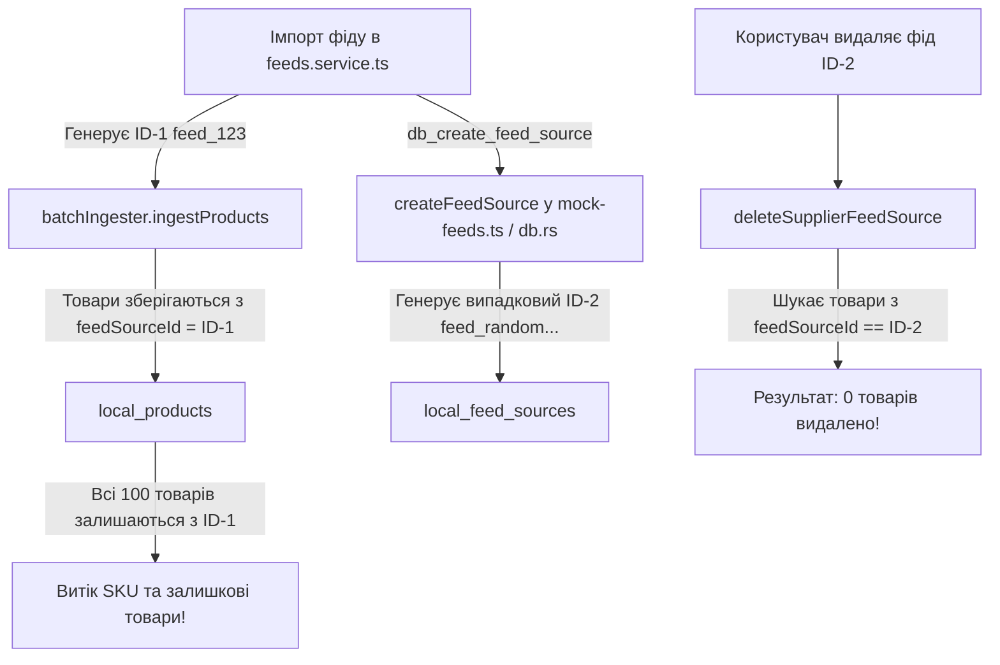
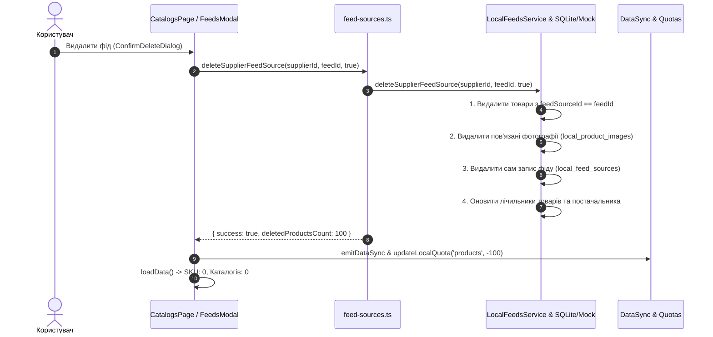

# 🗑️ План 15: Каскадне видалення товарів та фотографій при видаленні фіду, синхронізація квот і усунення витоку SKU

> **Модуль:** `apps/desktop` (Desktop Client — Feed Deletion, Local DB, Products Ingestion & Quotas)  
> **Статус:** ✅ **Реалізовано та протестовано (100% тестів пройдено)**  
> **Дата виконання:** 12.09.2026  
> **Пріоритет:** 🚨 **Критичний (Data Integrity & Quota Leak Prevention)**

---

## 📌 1. Мета та опис проблеми

Користувач виявив критичну логічну та архітектурну вразливість:

1. Користувач підключає та імпортує фід (наприклад, 100 SKU).
2. Користувач видаляє цей фід зі списку підключених фідів.
3. **Фід видаляється («Всього каталогів: 0»), але всі 100 товарів залишаються в базі даних («Загальна кількість SKU: 100 (Indexed in SQLCipher DB)»)**!
4. **Наслідки (Вразливість бізнес-логіки та обхід лімітів)**:
   - Користувач може нескінченно додавати фід, імпортувати товари, видаляти фід і повторювати процес знову, накопичуючи необмежену кількість товарів поза лімітом активних фідів.
   - База даних засмічується товарами-сиротами (orphaned products), які більше не прив'язані до жодного існуючого фіду.
   - Фотографії цих товарів залишаються у локальному сховищі та не очищаються.

### 🎯 Канонічне бізнес-правило системи:

- **Видалення постачальника** $\rightarrow$ каскадно видаляє всіх підключених фідів цього постачальника, всі їхні товари та всі фотографії.
- **Видалення фіду** $\rightarrow$ каскадно видаляє **всі товари цього конкретного фіду (`feedSourceId`)**, всі завантажені фотографії цих товарів, а лічильники SKU та квоти миттєво зменшуються на кількість видалених товарів.

---

## 🔍 2. Аналіз першопричин (Root Causes Investigation)

1. **Невідповідність ідентифікатора `feedSourceId` при створенні**:
   - У `feeds.service.ts:54`: під час імпорту генерується `feedSourceId = feed_${Date.now()}...`, з яким товари записуються в `state.products` / `local_products`.
   - Проте при виклику `db_create_feed_source` поле `id` не передавалося в `payload`. В результаті `createFeedSource` (у `mock-feeds.ts` та в Rust `db.rs`) генерував свій власний випадковий ID (`feed_random...` або новий UUID).
   - Товари мали прив'язку до ID-1, а сам запис фіду отримав ID-2. При видаленні фіду фільтр `p.feedSourceId === sourceId` не знаходив жодного товару.

2. **Передчасне повернення в клієнті `deleteSupplierFeedSource` (`feed-sources.ts`)**:
   - У веб-/dev-режимі (`!isTauri()`) функція `deleteSupplierFeedSource` відправляла `fetchWithAuth(DELETE /feeds/...)` на хмарний бекенд і при `response.ok` **одразу повертала результат, не викликаючи `localDb.feeds.deleteSupplierFeedSource`**!
   - Локальна база (SQLCipher / mock), з якої десктоп бере кількість товарів (`localDb.products.getProducts`), взагалі не очищалася при успішній відповіді API.

3. **Відсутність каскадного очищення фотографій та лічильників**:
   - У `mock-feeds.ts` при видаленні товарів не викликалося очищення фотографій з `state.productImages` і не оновлювався лічильник `state.counters.productsCount`.

---

## 🏛 3. Архітектурне рішення та 4-рівневий захист

### 1. Рівень 1 (Єдиний детермінований ID фіду):

- Додати поле `id?: string` у `CreateFeedSourcePayload` (`types.ts`, `mock-feeds.ts`, `models.rs` у Rust).
- У `feeds.service.ts` передавати згенерований `feedSourceId` у виклик `db_create_feed_source`. Товари та фід завжди мають гарантовано 100% однаковий ID.

### 2. Рівень 2 (Обов'язкове локальне каскадне очищення):

- У `deleteSupplierFeedSource` (`apps/desktop/src/lib/api/feed-sources.ts`): завжди гарантовано виконувати каскадне видалення у `localDb` перед або разом із хмарним викликом.
- У `mock-feeds.ts`:
  - Фільтрувати `state.products` за `p.feedSourceId !== sourceId && p.feed_source_id !== sourceId`.
  - Видаляти з `state.productImages` усі фото, що належали видаленим товарам.
  - Оновлювати `state.counters.productsCount = state.products.length`.
  - Оновлювати `supplier.productsCount = state.products.filter(p => p.supplierId === supplierId).length`.
- У Rust `src-tauri/src/db.rs`: перевірити та гарантувати виконання `DELETE FROM local_products WHERE feed_source_id = ?1` та очищення `local_product_images`.

### 3. Рівень 3 (Миттєве оновлення UI та квот):

- У `CatalogsPage.tsx`, `SupplierFeedsModal.tsx`, `useQuotaReconciliation.ts`:
  - При отриманні результату видалення (`deletedProductsCount`) викликати `updateLocalQuota('products', -deletedProductsCount)` та `updateLocalQuota('feeds', -1)`.
  - Відправляти реактивну подію `emitDataSync(['suppliers', 'feeds', 'products', 'quotas', 'all'])`.
  - Повторно завантажувати `loadData()`, що миттєво обнуляє лічильник SKU на сторінці каталогів.

### 4. Рівень 4 (Автоматизовані E2E тести):

- Додати в `apps/desktop/e2e/feed-ingestion-engine.spec.ts` або `suppliers-feeds.spec.ts` тест життєвого циклу:
  - Імпорт фіду з 50 SKU.
  - Перевірка: Каталогів: 1, SKU: 50.
  - Видалення фіду.
  - Перевірка: Каталогів: 0, SKU: 0.

---

## 📁 4. Заплановані зміни за файлами

| Файл                                                    | Зміни                                                                                              |
| :------------------------------------------------------ | :------------------------------------------------------------------------------------------------- |
| `apps/desktop/src/services/local-db/types.ts`           | Додати `id?: string` у DTO створення фіду                                                          |
| `apps/desktop/src/services/local-db/feeds.service.ts`   | Передавати `id: feedSourceId` у `payload` створення фіду                                           |
| `apps/desktop/src/services/local-db/mock/mock-feeds.ts` | Використовувати переданий `id`, каскадно видаляти товари і фотографії, оновлювати лічильники       |
| `apps/desktop/src-tauri/src/models.rs` & `db.rs`        | Підтримка `dto.id` при створенні фіду в SQLite, каскадне видалення фотографій                      |
| `apps/desktop/src/lib/api/feed-sources.ts`              | Забезпечити обов'язковий виклик `localDb.feeds.deleteSupplierFeedSource` без виходу при remote 200 |
| `apps/desktop/src/pages/CatalogsPage.tsx`               | Синхронне зменшення квот товарів на `deletedProductsCount`                                         |
| `apps/desktop/e2e/feed-ingestion-engine.spec.ts`        | E2E тест на повне каскадне очищення товарів при видаленні фіду                                     |
