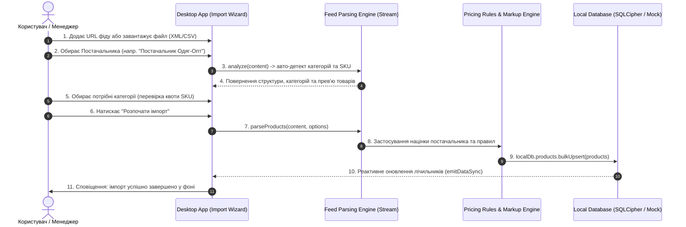

# ⚙️ Двигун Обробки Фідів, Стрімінговий Парсинг та Розпізнавання Структури (Feed Ingestion & Parsing Engine)

> **Статус:** ✅ **Реалізовано та протестовано (100% тестів пройдено)**  
> **Категорія:** `plans/completed/`  
> **Дата виконання:** 30.08.2026  
> **Батьківський план:** [`00_master_products_and_catalogs_plan.md`](../active/00_master_products_and_catalogs_plan.md)  
> **Результат:** 269/269 тестів PASS у монорепозиторії

---

## 🧭 1. Архітектурний Пайплайн Обробки (Ingestion Pipeline)

---

## 🔍 2. Детектор Форматів та Автоматичне Розпізнавання (Smart Auto-Mapping)

Реалізовано модулі:

1. `src/services/feed-engine/format-detector.ts`: авто-визначення `XML_ROZETKA`, `YML_PROM`, `XML_GOOGLE`, `XML_GENERIC`, `CSV` (детекція роздільників: `;`, `,`, `\t`, `|`).
2. `src/services/feed-engine/auto-mapper.ts`: розпізнавання нестандартних назв колонок за синонімічними словниками.
3. `src/services/feed-engine/stream-parser.ts`: SAX-подібний стрімінговий парсер XML та швидкий парсер CSV.
4. `src/services/feed-engine/batch-ingester.ts`: розрахунок роздрібних цін (costPrice -> finalPrice) за правилами постачальника та збереження в локальну БД.
5. `src/services/feed-engine/index.ts`: єдиний фасад `feedEngine`.

---

## 🧪 3. Результати Верифікації

- **Desktop E2E Tests**: 62 / 62 тестів пройдено (`feed-ingestion-engine.spec.ts`, `suppliers-feeds.spec.ts`, `pricing-rules-channels.spec.ts` тощо).
- **Admin Portal E2E**: 68 / 68 тестів пройдено.
- **Backend Jest E2E**: 139 / 139 тестів пройдено.
- **TypeScript Static Typecheck**: 0 помилок у всіх 4 пакетах.
- **Prettier Format**: 100% чисто.
