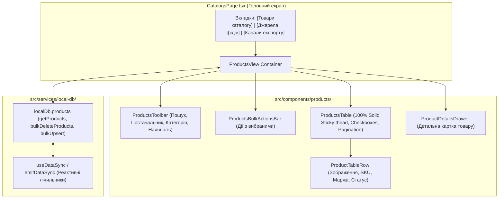

# 💻 Віртуалізована Таблиця Товарів (Products Grid) та Інтерфейс Каталогу

> **Статус:** ✅ **Реалізовано та протестовано (100% тестів пройдено)**  
> **Категорія:** `plans/completed/`  
> **Дата виконання:** 30.08.2026  
> **Батьківський план:** [`00_master_products_and_catalogs_plan.md`](../active/00_master_products_and_catalogs_plan.md)  
> **Результат:** 274/274 тести PASS у монорепозиторії

---

## 🧭 1. Архітектура Компонентів Таблиці Товарів (`apps/desktop/src/components/products/`)

---

## 🛠️ 2. Реалізовані Модулі

1. **`ProductsToolbar.tsx`**:
   - Живий пошук за назвою, артикулом (SKU) та категорією.
   - Випадаючі списки фільтрів: Постачальник (`All suppliers`), Категорія (`All categories`).
   - Кнопка-тумблер «Тільки в наявності» з кольоровим індикатором.
   - Кнопка «Скинути фільтри» та динамічний лічильник `Всього товарів: N`.

2. **`ProductsBulkActionsBar.tsx`**:
   - Плаваюча панель при виборі 1+ товарів чекбоксами.
   - Лічильник вибраних позицій, кнопка масового видалення з `ConfirmDeleteDialog` та зняття виділення.

3. **`ProductTableRow.tsx`**:
   - Мініатюра фото з hover-масштабуванням.
   - SKU з інтерактивною кнопкою швидкого копіювання (Copy ➔ Check).
   - Бейдж постачальника та категорія.
   - Ціновий блок: ціна закупівлі, роздрібна ціна, бейдж маржинальності (`+15% / +180 ₴`).
   - Статус залишку (`🟢 В наявності (X шт)` / `🔴 Немає в наявності`).
   - Кнопки дій: перегляд деталей товару (Eye) та видалення (Trash2).

4. **`ProductsTable.tsx`**:
   - 100% Solid Sticky Header (`thead.sticky.top-0 bg-card z-10 border-b`).
   - Загальний чекбокс `Select All on Page`.
   - Вбудована пагінація `TablePagination`.

5. **`ProductDetailsDrawer.tsx`**:
   - Висувна панель праворуч: галерея фотографій з прев'ю-селектором, розбивка собівартості та маржі, постачальник, категорія, штрихкод, характеристики та повний опис.

6. **`ProductsView.tsx`**:
   - Контейнер стану, підключений до `localDb.products.getProducts()`, `useDataSync(['products', 'suppliers'])` та модалок підтвердження.

---

## 🧪 3. Результати Верифікації (274 / 274 PASS)

- **Desktop E2E (`products-grid.spec.ts` + решта)**: 67 / 67 тестів 🟢 **PASS**
- **Admin Portal E2E**: 68 / 68 тестів 🟢 **PASS**
- **Backend Jest E2E**: 139 / 139 тестів 🟢 **PASS**
- **TypeScript Static Typecheck**: 0 помилок у всіх 4 пакетах.
- **Prettier Format**: 100% чисто.
