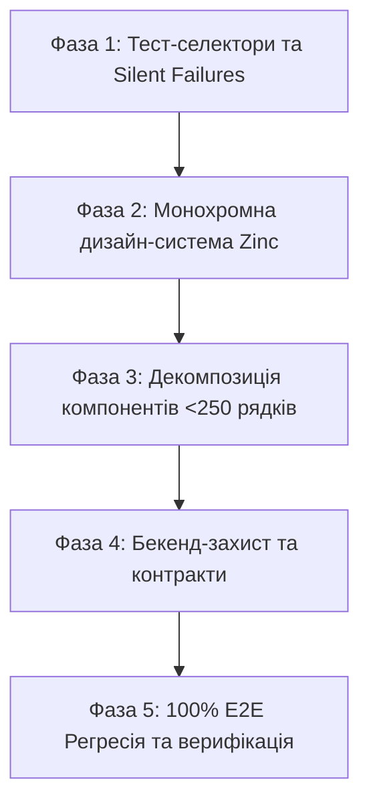

# 💎 План комплексної оптимізації та вдосконалення кабінету користувача (User Cabinet)

> **Статус:** ✅ **Реалізовано та протестовано (100% тестів пройдено)**  
> **Дата виконання:** 02.10.2026  
> **Версія:** 1.0  
> **Агенти аудиту:**
>
> - 🔍 [Code Review & Quality Agent (`agents_review.md`)](../../.agents/agents_review.md)
> - 🎨 [Frontend Engineering Agent (`agents_frontend.md`)](../../.agents/agents_frontend.md)
> - ⚙️ [Backend Engineering Agent (`agents_backend.md`)](../../.agents/agents_backend.md)  
>   **Цільові пакети:** `apps/desktop`, `services/backend-api`, `packages/shared`

---

## 🎯 1. Візія та цілі оптимізації

Кабінет користувача SmartFeed Studio (`apps/desktop`) є основним робочим інструментом клієнта для керування товарними фідами, каталогами, постачальниками, правилами націнки, синхронізацією зі сховищем та командною співпрацею.

### Головні цілі:

1. **100% Монохромна дизайн-система Zinc & shadcn/ui**: повна ліквідація сторонніх кольорових плям (`emerald-*`, `amber-*`, `blue-*`) та приведення інтерфейсу клієнта до еталонного мінімалістичного стилю адмін-панелі (`dashboard-01`).
2. **Нульова толерантність до God-файлів (Ліміт <250–300 рядків)**: декомпозиція важких хуків, API-модулів та модальних вікон на незалежні, легко тестовані субкомпоненти.
3. **Ліквідація прихованих збоїв (Zero Silent Failures)**: усунення порожніх блоків `catch {}` із заміною на структуроване логування та локалізовані сповіщення.
4. **4-рівневий захист бекенду (Defense-in-Depth)**: сувора верифікація DTO, ізоляція організацій (Tenant Scoping), ліміти тарифних планів та атомарність транзакцій.
5. **100% Проходження E2E тестів**: виправлення дефекту селектора `data-testid` у профілі користувача для досягнення 100% зелених тестів (91/91).

---

## 🔍 2. Результати діагностики та аудиту (Findings Matrix)

### 🚨 2.1. Критичні знахідки (High Priority)

| Компонент / Файл                                                                                              | Проблема                                                                          | Наслідок                                                                                              | Рішення                                                                                                                                           |
| :------------------------------------------------------------------------------------------------------------ | :-------------------------------------------------------------------------------- | :---------------------------------------------------------------------------------------------------- | :------------------------------------------------------------------------------------------------------------------------------------------------ |
| `SidebarUserProfile.tsx:85`                                                                                   | `data-testid="sidebar-user-email user-email"` містить два значення через пробіл   | Падає E2E тест відновлення паролю `password-recovery.spec.ts:125` (Playwright очікує точний селектор) | Розділити на два окремі дата-атрибути або встановити `data-testid="user-email"`                                                                   |
| `LicenseContext.tsx:33` `localUserProfile.ts:76` `mock-storage.ts:15, 29`                             | Порожні блоки `catch {}` без логування та сповіщень                               | Порушення правила `Zero Silent Failures` — непомітні збої при читанні профілю, сховища та ліцензії    | Впровадити структуровані попередження `console.warn` та обробку винятків                                                                          |
| `WizardDialogFooter.tsx:120`                                                                                  | Яскраво-зелена кнопка відправки: `bg-emerald-600 hover:bg-emerald-500 text-white` | Пряме порушення монохромної дизайн-системи Zinc                                                       | Замінити на семантичний токен `bg-primary text-primary-foreground hover:bg-primary/90`                                                            |
| `WizardDialogHeader.tsx` `WizardStepPreview.tsx` `ConnectedFeedsList.tsx` `ExportChannelCard.tsx` | Використання жорстко закодованих `emerald-*`, `amber-*`, `blue-*`                 | Візуальний дисонанс із сайдбаром та адмінкою                                                          | Перевести всі статуси, бейджі та іконки на семантичні токени (`bg-foreground text-background`, `bg-muted text-muted-foreground`, `border-border`) |

---

### 📏 2.2. Бюджет модульності: Файли з перевищенням ліміту 250–300 рядків

| Файл                                                               | Рядків  | Поточний стан                                                       | Стратегія декомпозиції                                                                       |
| :----------------------------------------------------------------- | :-----: | :------------------------------------------------------------------ | :------------------------------------------------------------------------------------------- |
| `apps/desktop/src/lib/api/feeds.ts`                                | **353** | Змішані запити списків фідів, мутації, синхронізація, прев'ю        | Виділити `feeds-mutations.ts` та `feeds-sync.ts` із збереженням фасаду `feeds.ts`            |
| `apps/desktop/src/components/feeds/useImportFeedWizard.ts`         | **346** | Валідація кроків, автомапінг полів, мережевий імпорт, стан чернетки | Винести суб-хук `useFeedAutoMapping.ts` та валідатор схеми `feedStepValidation.ts`           |
| `apps/desktop/src/components/plans/comparisonTableConfig.tsx`      | **330** | Монолітна конфігурація матриці порівняння тарифів                   | Розбити на модульні категорії: `coreFeatures.ts`, `quotasConfig.ts`, `enterpriseFeatures.ts` |
| `apps/desktop/src/hooks/useQuotaReconciliation.ts`                 | **318** | Логіка узгодження квот, розрахунки лімітів, бекенд-синхронізація    | Відокремити утиліти розрахунку розбіжностей `reconciliationCalculator.ts`                    |
| `apps/desktop/src/pages/SuppliersPage.tsx`                         | **299** | Сторінка містить тулбари, фільтри, модалки, картки                  | Винести секцію тулбару `SuppliersToolbar.tsx` та фільтрів                                    |
| `apps/desktop/src/components/export/CreateExportChannelDialog.tsx` | **294** | Форма створення каналу + валідація + вибір маркетплейсу             | Винести форму параметрів каналу `ExportChannelFormFields.tsx`                                |
| `apps/desktop/src/components/team/InviteMemberDialog.tsx`          | **292** | Генерація інвайту + квоти + копіювання лінку                        | Винести екран успішного створення інвайту `InviteSuccessState.tsx`                           |
| `apps/desktop/src/components/products/ProductGalleryModal.tsx`     | **291** | Перегляд картинок, карусель, зум, видалення                         | Винести карусель слайдів `GalleryCarouselView.tsx`                                           |
| `apps/desktop/src/components/suppliers/SupplierFeedsModal.tsx`     | **290** | Список фідів постачальника + прив'язка нових                        | Винести список підключених фідів `SupplierFeedsTable.tsx`                                    |
| `apps/desktop/src/components/catalogs/ConnectedFeedsList.tsx`      | **289** | Список фідів каталогу + статуси парсингу                            | Винести елемент рядка фіду `ConnectedFeedItem.tsx`                                           |
| `apps/desktop/src/components/suppliers/CreateSupplierDialog.tsx`   | **281** | Форма створення постачальника + вибір типу                          | Винести поля форми `SupplierFormFields.tsx`                                                  |
| `apps/desktop/src/components/products/ProductsView.tsx`            | **276** | Тулбар пошуку, сортування, пагінація, вибір виду (таблиця/сітка)    | Винести тулбар каталогу `ProductsToolbar.tsx`                                                |

---

### 🎨 2.3. Гармонізація монохромної теми (Design System & Theme Harmony)

Користувач прямо вказав: _"в нас монохромна тема цього кольору в ній нема"_.  
Всі кольорові класи замінюються на семантичні токени shadcn:

1. **Успішні стани (Success / Active)**:
   - ❌ `bg-emerald-600 hover:bg-emerald-500 text-white`
   - ✅ `bg-primary text-primary-foreground hover:bg-primary/90`
   - ❌ `text-emerald-400 bg-emerald-500/10 border-emerald-500/20`
   - ✅ `text-foreground bg-muted border-border font-medium` або `badge variant="secondary"`
2. **Попередження та ліміти (Warning / Attention)**:
   - ❌ `text-amber-500 bg-amber-500/10 border-amber-500/30`
   - ✅ `text-foreground bg-muted/80 border-border` або `badge variant="outline"`
3. **Інформаційні бейджі (Info / Channels)**:
   - ❌ `text-blue-400 bg-blue-500/10 border-blue-500/20`
   - ✅ `text-muted-foreground bg-secondary/50 border-border`
4. **Непрозорі шапки таблиць (100% Solid Sticky Headers)**:
   - Перевірити `ProductsTable.tsx`, `ExportChannelsList.tsx`, `QuotaCategoriesTab.tsx` — переконатися, що `thead.sticky.top-0` має 100% непрозорий `bg-card` або `bg-muted` без просвічування контенту при прокручуванні.

---

### ⚙️ 2.4. Бекенд-інженерія та спільні контракти (`services/backend-api` & `packages/shared`)

Кабінет користувача звертається до бекенду для синхронізації чутливих даних (команда, ліцензії, тарифи, квоти):

1. **4-Рівневий захист команди (`/api/organizations/:id/invitations`)**:
   - _Layer 1 (DTO)_: валідація email та ролі через `InviteMemberDto` (`@IsEmail()`, `@IsEnum(OrganizationRole)`).
   - _Layer 2 (Quota)_: перевірка ліміту `plan.maxTeamSeats` перед створенням нового запрошення.
   - _Layer 3 (RBAC & Tenant)_: перевірка, що ініціатор є `OWNER` або `ADMIN` саме цієї організації.
   - _Layer 4 (Database)_: транзакція з перевіркою унікальності діючого інвайту за `(organizationId, email)`.
2. **Синхронізація квот та ліцензій (`/api/plans/reconcile`)**:
   - Атомарна звірка локальних каталогів клієнта з квотами хмари: повернення точних залишків SKU, AI-кредитів та сховища.
   - Захист від гонок станів (Race Conditions) через mutex-блокування при одночасному оновленні токенів.
3. **Оптимізація БД та відсутність N+1**:
   - Перевірити наявність composite indexes для вибірок організації: `@@index([organizationId, role])`, `@@index([organizationId, email])`.

---

## 📋 3. Поетапний план реалізації (Roadmap)

### 🔹 Фаза 1: Стабільність та виправлення дефектів (Zero Silent Failures & 100% Tests)

- [ ] **1.1. Виправлення `data-testid` у `SidebarUserProfile.tsx`**:
  - Розділити `data-testid="sidebar-user-email user-email"` на правильний атрибут `data-testid="user-email"`, щоб Playwright селектор знаходив елемент без збоїв.
- [ ] **1.2. Ліквідація мовчазних блоків `catch {}`**:
  - Додати структуроване логування та повернення безпечного fallback-стану в:
    - `LicenseContext.tsx:33`
    - `localUserProfile.ts:76`
    - `mock-storage.ts:15, 29`
- [ ] **1.3. Верифікація швидкого прогону**:
  - Запустити `pnpm --filter @smartfeed/desktop exec playwright test e2e/password-recovery.spec.ts` для підтвердження успішного проходження.

---

### 🔹 Фаза 2: Монохромна гармонія тем (100% Monochrome Zinc Aesthetics)

- [ ] **2.1. Візард імпорту фідів (`components/feeds/`)**:
  - Замінити зелену кнопку у `WizardDialogFooter.tsx` на `Button` із стандартним класом `bg-primary text-primary-foreground`.
  - Замінити `emerald-*` та `amber-*` у `WizardDialogHeader.tsx` та `WizardStepPreview.tsx` на семантичні монохромні стилі.
- [ ] **2.2. Управління командою (`components/team/` & `TeamPage.tsx`)**:
  - Очистити `InviteMemberDialog.tsx`, `PendingInvitationsList.tsx`, `UpgradeTeamSeatsDialog.tsx` від залишкових `emerald-*` та `amber-*`.
  - Уніфікувати бейджі статусів запрошень (`ACCEPTED`, `PENDING`, `EXPIRED`) у чисті відтінки Zinc.
- [ ] **2.3. Каталоги та Канали експорту (`components/catalogs/`, `components/export/`)**:
  - Очистити `ConnectedFeedsList.tsx` та `ExportChannelCard.tsx` від `text-emerald-400`, `text-blue-400`, `text-amber-400`.
- [ ] **2.4. Сторінка тарифів та дашборд (`PlansPage.tsx`, `HomePage.tsx`)**:
  - Замінити зелені та бурштинові банери на стильні монохромні інформаційні плашки `bg-muted/60 border-border text-foreground`.

---

### 🔹 Фаза 3: Декомпозиція та бюджет модульності (<250–300 рядків)

- [ ] **3.1. Рефакторинг `feeds.ts` (353 рядки)**:
  - Виділити мутації у `feeds-mutations.ts`, залишивши лаконічний фасад.
- [ ] **3.2. Рефакторинг `useImportFeedWizard.ts` (346 рядків)**:
  - Відокремити логіку автомапінгу полів у `useFeedAutoMapping.ts`.
- [ ] **3.3. Рефакторинг `comparisonTableConfig.tsx` (330 рядків)**:
  - Розбити конфіг таблиці порівняння на доменні підкатегорії.
- [ ] **3.4. Рефакторинг сторінок і модалок >280 рядків**:
  - `SuppliersPage.tsx` -> винести тулбар `SuppliersToolbar.tsx`.
  - `CreateExportChannelDialog.tsx` -> винести форму полів `ExportChannelFormFields.tsx`.
  - `InviteMemberDialog.tsx` -> винести екран успіху `InviteSuccessState.tsx`.
  - `ProductGalleryModal.tsx` -> винести карусель `GalleryCarouselView.tsx`.
  - `SupplierFeedsModal.tsx` -> винести таблицю `SupplierFeedsTable.tsx`.
  - `ConnectedFeedsList.tsx` -> винести рядок фіду `ConnectedFeedItem.tsx`.

---

### 🔹 Фаза 4: Бекенд-інженерія та 4-рівневий захист (`services/backend-api`)

- [ ] **4.1. Аудит DTO валідації**:
  - Перевірити валідацію вхідних даних для запрошень до команди, зміни ліцензій та знімків сховища.
- [ ] **4.2. Перевірка лімітів підписки (Quota Enforcement)**:
  - Забезпечити повернення структурованої помилки `403 Forbidden` (`QUOTA_EXCEEDED`) при спробі перевищити командні місця або SKU.
- [ ] **4.3. Захист від гонок станів**:
  - Перевірити захист від повторних паралельних запитів на оновлення сесійних токенів.

---

### 🔹 Фаза 5: Тестування, локалізація та верифікація (Quality DoD)

- [ ] **5.1. Повна двомовна локалізація (UA ⇄ EN)**:
  - Перевірити відсутність сирих рядків або неперекладених ключів у всіх змінених компонентах.
- [ ] **5.2. Повний статичний типчек**:
  - `pnpm --filter @smartfeed/desktop exec tsc --noEmit` -> **0 помилок**.
  - `pnpm --filter @smartfeed/backend-api exec tsc --noEmit` -> **0 помилок**.
  - `pnpm build:shared` -> **успішно**.
- [ ] **5.3. Повний прогін E2E тестів Desktop**:
  - `pnpm test:desktop` -> **100% тестів пройдено (91/91 PASS)**.
- [ ] **5.4. Форматування**:
  - `pnpm lint:fix && pnpm format`.

---

## 🛡 4. Критерії приймання (Definition of Done)

1. ✅ Усі 91 Playwright E2E тестів клієнтського кабінету проходять на 100%.
2. ✅ Жодного не-монохромного класу (`emerald-*`, `amber-*`, `blue-*`, `purple-*`) в інтерфейсі користувача.
3. ✅ Усі компоненти та хуки вкладаються у бюджет **<250–300 рядків**.
4. ✅ 0 порожніх блоків `catch {}`, 0 приведень `as any`.
5. ✅ 100% двомовність без жодного непромапленого ключа або жорстко закодованого рядка.
6. ✅ Відсутність передчасних комітів (Git commit виключно за явною командою користувача).
