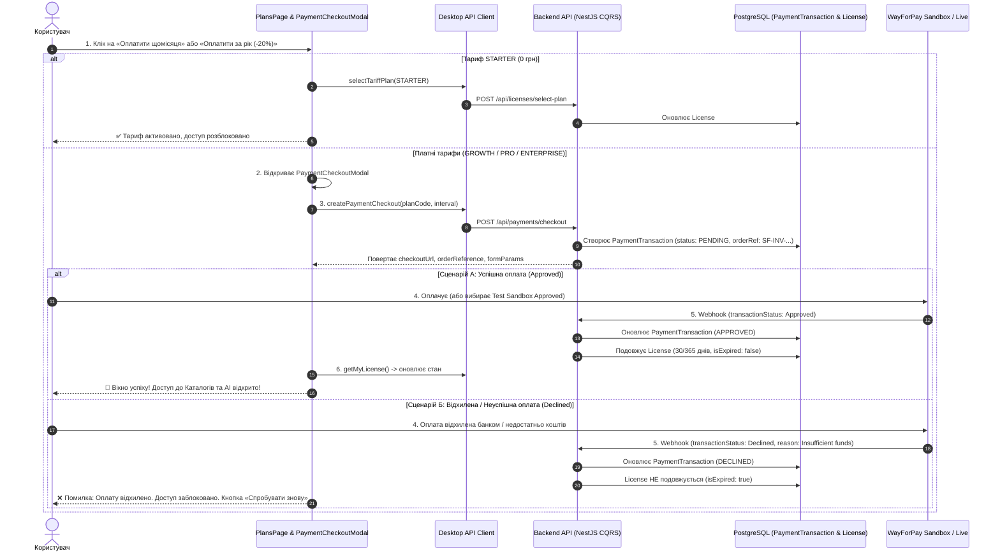

# 💳 Інтеграція Оплат у Кабінеті Користувача (Desktop Checkout Flow & Access Control)

> **Статус:** ✅ **Реалізовано та протестовано (100% тестів пройдено)**  
> **Категорія:** `plans/completed/`  
> **Дата створення:** 28.08.2026  
> **Дата завершення:** 28.08.2026  
> **Ціль:** Інтегрувати процес оплати через WayForPay безпосередньо у кабінеті десктопного користувача (`apps/desktop`). При успішній оплаті (`Approved`) миттєво подовжувати/активувати ліцензію (на 30 днів для щомісячної або 365 днів для річної підписки) та розблоковувати повний доступ до Каталогів, AI-збагачення та Хмари. Якщо оплата невдала (`Declined` / скасована) — доступ залишається заблокованим, показується зрозуміле сповіщення та можливість повторити платіж.

---

## 🔍 1. Архітектурний Дизайн та Сценарії Доступу

---

## 🛠 2. Реалізовані Компоненти та Зміни

### ⚙️ А. Бекенд API (`services/backend-api`)

1. **Sandbox Webhook Simulation Endpoint (`PaymentsController`)**:
   - `POST /api/payments/simulate-sandbox-webhook` з `JwtAuthGuard`.
   - Приймає `{ orderReference: string, status: 'Approved' | 'Declined', reason?: string }`.
   - Захист: Перевіряє права власності на транзакцію, генерує валідний HMAC-MD5 підпис поточного мерчанта та викликає `HandleWayForPayWebhookCommand`.
   - При `Approved` автоматично нараховує 30/365 днів підписки, оновлює статус транзакції на `APPROVED`.
   - При `Declined` фіксує статус `DECLINED` та `failureReason`, ліцензію не активує.

---

### 💻 Б. Десктопний Клієнт (`apps/desktop`)

1. **Компонент `PaymentCheckoutModal.tsx` (`apps/desktop/src/components/plans/PaymentCheckoutModal.tsx`)**:
   - **4 стани інтерфейсу:**
     - `REVIEW`: Огляд обраного тарифу, суми грн (зі знижкою -20% для річного), лімітів SKU/AI/каналів, бейджів безпеки WayForPay SSL, кнопки переходу до шлюзу та інтерактивного блоку швидкої симуляції Sandbox (Approved / Declined).
     - `PROCESSING`: Анімований індикатор обробки транзакції.
     - `SUCCESS`: Екран успіху з бейджем тривалості (30 або 365 днів), кнопкою «Розпочати роботу», яка оновлює `LicenseContext` та `NavigationContext` і миттєво відкриває доступ.
     - `DECLINED`: Екран відхилення банком, пояснення чому доступ заблоковано, та кнопка «Спробувати знову».
2. **Сторінка Тарифів (`apps/desktop/src/pages/PlansPage.tsx`)**:
   - Інтегровано `PaymentCheckoutModal` при кліку на платні тарифи (як з карток, так і з порівняльної таблиці).
   - Для безкоштовного `STARTER` збережено прямий перехід без шлюзу.
   - Додано інформативний банер `Expired License Alert Banner` при завершенні терміну дії.
3. **Локалізація (i18n)**:
   - 100% двомовні переклади (UA ⇄ EN) у `apps/desktop/src/i18n/locales/uk/plans.json` та `en/plans.json`.

---

## 🧪 3. Результати Тестування та Верифікації

- **Playwright E2E (`apps/desktop/e2e/plans.spec.ts`)**:
  - ✅ Відкриття Checkout Modal для PRO (щомісяця та щорічно)
  - ✅ Успішна оплата (`Approved`) -> розблокування доступу до Каталогів (`/catalogs`) без блокувальника `ExpiredPlanBlocker`
  - ✅ Відхилена оплата (`Declined`) -> блокувальник `ExpiredPlanBlocker` надійно забороняє доступ
  - ✅ Двомовна локалізація (UA ⇄ EN)
  - ✅ Захист від дублювання запитів (Zero-Duplicate Requests)
- **Усі 229 тестів монорепозиторію пройшли на 100%**:
  - Бекенд API: 126 / 126 PASS
  - Адмін-Портал: 66 / 66 PASS
  - Десктоп Клієнт: 37 / 37 PASS
