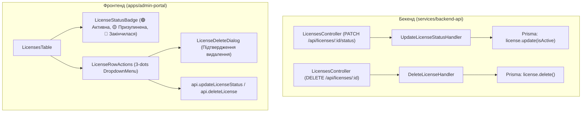

# 📋 План: Підсвічування Діючої Ліцензії, 3-Крапки Меню Дій (Призупинити / Видалити) та Backend CQRS Ендпоінти

> **Статус:** ✅ **Реалізовано та протестовано (100% тестів пройдено)**  
> **Дата виконання:** 27.08.2026

## 📌 Огляд Завдання

Потрібно покращити сторінку виданих ліцензій (`/licenses`) в **Admin Web Portal**:

1. **Візуальне підсвічування**: чітко показувати та підсвічувати діючу ліцензію (🟢 **Активна / Діє**, 🟡 **Призупинена**, 🔴 **Закінчилася**).
2. **Меню дій (3 крапки `...`)**: додати кнопку дій для кожного рядка таблиці ліцензій з опціями:
   - ⏸️ **Призупинити ліцензію** (або ▶️ **Відновити ліцензію**, якщо вона вже призупинена).
   - 🗑️ **Видалити ліцензію** (з модальним вікном підтвердження).
3. **Бекенд CQRS & RBAC**:
   - Перевірити наявність ендпоінтів та статусу в бекенді.
   - Створити `UpdateLicenseStatusCommand` (`PATCH /api/licenses/:id/status`) та `DeleteLicenseCommand` (`DELETE /api/licenses/:id`) з захистом `SUPER_ADMIN` / `ADMIN`.
   - Покрити бекенд Jest E2E тестами (TDD).
4. **Фронтенд та Playwright E2E**:
   - Інтегрувати виклики API, оновити таблицю та додати модульні компоненти.
   - Забезпечити 100% i18n двомовність (UA ⇄ EN).
   - Покрити Playwright E2E тестами.

---

## 🔍 1. Аналіз Поточного Стану Бекенду

- **Prisma Модель `License`**: вже містить поля:
  - `isActive: Boolean @default(true)`
  - `expiresAt: DateTime?`
  - `licenseKey: String @unique`
  - `planType: PlanType`
- **Поточні ендпоінти в `LicensesController`**:
  - `GET /api/licenses/my` — отримання ліцензії поточного користувача.
  - `GET /api/licenses/admin` — список ліцензій для адмінки.
  - `POST /api/licenses/select-plan` — вибір/оновлення тарифу користувачем.
  - `POST /api/licenses/upgrade` — апгрейд тарифу.
  - `POST /api/licenses/assign` — призначення тарифу адміном.
  - ❌ **Ендпоінтів для зміни статусу (призупинення/відновлення) та видалення ліцензії наразі НЕМАЄ**.

---

## 🛠 2. Архітектурний План Реалізації

---

## 📐 3. Етапи Виконання (Strict TDD & Separation of Concerns)

### ⚙️ Етап 1: Бекенд CQRS Команди, Ендпоінти та Jest E2E Тести

1. **CQRS Команда оновлення статусу**:
   - Створити `UpdateLicenseStatusCommand(licenseId: string, isActive: boolean)`.
   - Створити `UpdateLicenseStatusHandler`: знаходить ліцензію за `id`, оновлює `isActive`, кидає `404 NotFoundException` якщо не знайдено.
2. **CQRS Команда видалення ліцензії**:
   - Створити `DeleteLicenseCommand(licenseId: string)`.
   - Створити `DeleteLicenseHandler`: перевіряє існування, видаляє запис з Prisma, кидає `404 NotFoundException` якщо не знайдено.
3. **Ендпоінти в `LicensesController`**:
   - `PATCH /api/licenses/:id/status` — `@UseGuards(JwtAuthGuard, RolesGuard)`, `@Roles(Role.SUPER_ADMIN, Role.ADMIN)`.
   - `DELETE /api/licenses/:id` — `@UseGuards(JwtAuthGuard, RolesGuard)`, `@Roles(Role.SUPER_ADMIN, Role.ADMIN)`.
4. **Реєстрація в `LicensesModule`**:
   - Додати нові хендлери до списку `providers`.
5. **Backend Jest E2E Тести (`test/licenses.e2e-spec.ts`)**:
   - Тест: `PATCH /api/licenses/:id/status` встановлює `isActive: false` (призупинення) та повертає 200.
   - Тест: `PATCH /api/licenses/:id/status` відновлює `isActive: true` та повертає 200.
   - Тест: `DELETE /api/licenses/:id` видаляє ліцензію та повертає 200.
   - Тест: 403 Forbidden при спробі звичайного користувача викликати адмінські ендпоінти.
   - Тест: 404 Not Found для неіснуючого `licenseId`.
   - 100% очищення тестових даних через `cleanDatabase`.

---

### 💻 Етап 2: Фронтенд (Admin Web Portal)

1. **API Клієнт ([api.ts](file:///Users/oleg/AQA/SmartFeedStudio/apps/admin-portal/src/lib/api.ts))**:
   - Додати `updateLicenseStatus(id: string, isActive: boolean): Promise<AdminLicenseItemDto>`.
   - Додати `deleteLicense(id: string): Promise<{ success: boolean }>`.
2. **Модульні компоненти UI**:
   - `LicenseRowActions.tsx`: кнопка `...` (`DropdownMenu`) з діями:
     - `Призупинити ліцензію` / `Відновити ліцензію`.
     - `Видалити ліцензію`.
   - `LicenseDeleteDialog.tsx`: компактний модальний діалог підтвердження видалення із зазначенням ключа ліцензії.
3. **Оновлення [LicensesTable.tsx](file:///Users/oleg/AQA/SmartFeedStudio/apps/admin-portal/src/components/plans/LicensesTable.tsx)**:
   - Додати колонку **`Статус` (Status)**:
     - 🟢 **Активна** (`Active` / `Діє`): `lic.isActive && (!lic.expiresAt || new Date(lic.expiresAt) > now)`.
     - 🟡 **Призупинена** (`Suspended`): `!lic.isActive`.
     - 🔴 **Закінчилася** (`Expired`): `lic.isActive && lic.expiresAt && new Date(lic.expiresAt) <= now`.
   - **Візуальне підсвічування**: підсвічувати рядок діючої ліцензії зеленуватим акцентом / бейджем.
   - Додати колонку **`Дії` (Actions)** з викликом `LicenseRowActions`.
4. **100% Двомовна локалізація (i18n)**:
   - Додати всі ключі у `locales/uk/licenses.json` та `locales/en/licenses.json` (або `plans.json`):
     - `statusActive`, `statusSuspended`, `statusExpired`, `actions`, `suspendLicense`, `resumeLicense`, `deleteLicense`, `deleteLicenseTitle`, `deleteLicenseDesc`, `confirmDelete`, `cancel`, `licenseSuspendedSuccess`, `licenseResumedSuccess`, `licenseDeletedSuccess`.

---

### 🧪 Етап 3: Автоматизовані Тести Playwright & Перевірка

1. **Playwright E2E Тести ([e2e/licenses.spec.ts](file:///Users/oleg/AQA/SmartFeedStudio/apps/admin-portal/e2e/licenses.spec.ts))**:
   - Перевірка рендеру бейджів статусу та підсвічування діючої ліцензії.
   - Перевірка кліку на 3 крапки `...` -> натискання "Призупинити ліцензію" -> оновлення статусу на "Призупинена".
   - Перевірка кліку на 3 крапки `...` -> натискання "Відновити ліцензію" -> оновлення статусу на "Активна".
   - Перевірка кліку на 3 крапки `...` -> відкриття діалогу видалення -> підтвердження -> видалення ліцензії з таблиці.
   - Перевірка динамічного перекладу інтерфейсу при зміні мови (UA ⇄ EN).
2. **Перевірка всього тестового сьюту монорепозиторію**:
   - Бекенд Jest: `pnpm --filter @smartfeed/backend-api test:e2e` (всі 8 сьютів PASS).
   - Адмін-портал Playwright: `pnpm test:admin`.
   - Десктоп Playwright: `pnpm test:desktop`.
   - Статична типізація: `tsc --noEmit` без помилок.

---

## 🛡 4. Чекліст Контролю Якості

- [ ] Бекенд відповідає CQRS та захищений RBAC (`SUPER_ADMIN`, `ADMIN`).
- [ ] 100% очищення тестових даних через `cleanDatabase`.
- [ ] Компоненти модульні (< 250 рядків), без дублювання запитів.
- [ ] Всі тексти перекладені в `uk` та `en`.
- [ ] `tsc --noEmit` проходить з 0 помилок у всіх пакетах.
- [ ] `pnpm format` виконано.
