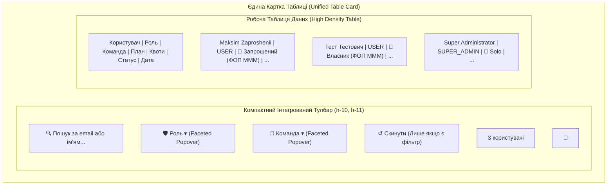

# 🎨 Концепція та План: Сучасна Мінімалістична Фільтрація Користувачів (IDE / Linear / shadcn Style)

> **Статус:** ✅ **Реалізовано та протестовано (100% тестів пройдено)**  
> **Дата виконання:** 27.08.2026  
> **Ціль:** Повна відмова від громіздких окремих блоків, "колхозних" кольорових емодзі, зайвих рамок і заокруглень на користь компактного, естетичного, ультра-лаконічного тулбара в стилі сучасних IDE (JetBrains / VS Code) та інструментів розробників (Linear / GitHub / Supabase / shadcn Data Table).

---

## 🧐 1. Аналіз поточних проблем UI/UX (Problem Statement)

1. **Неефективне використання робочого простору (Висота ~150px замість ~44px)**:
   - Зараз фільтри розміщені в окремій масивній картці `<Card>` над таблицею користувачів.
   - Всередині картки — два поверхи елементів (`flex-col` з розділювачем `border-t`), що зсуває саму робочу таблицю вниз екрана на 150+ пікселів.
2. **"Колхозні" кольорові емодзі (`👑`, `👥`, `👤`)**:
   - Емодзі мають фіксовані кольори операційної системи, які конфліктують як зі світлою, так і з темною темою, мають дешевий вигляд та порушують дизайн-систему корпоративного рівня.
3. **Візуальне перевантаження кнопками (8 окремих плашок-кнопок)**:
   - 4 кнопки для системних ролей (`[Всі] [SUPER_ADMIN] [ADMIN] [USER]`) + 4 кнопки для командних статусів (`[Всі статуси] [Власники] [Запрошені] [Solo]`).
   - Це займає занадто багато горизонтального простору та створює візуальний шум ("button fatigue").
4. **Подвійна вкладеність рамок (Double Card Nesting)**:
   - Окрема рамка із закругленнями для фільтрів, окрема рамка для таблиці — замість єдиного монолітного робочого простору.

---

## 🚀 2. Концепція Сучасного Дизайну (IDE / Linear / shadcn Paradigm)

### 💎 Ключові принципи:

1. **Інтеграція фільтрів у шапку таблиці (Unified Table Container)**:
   - Видаляємо окрему картку фільтрів. Тулбар фільтрації стає **верхньою панеллю самої таблиці** (`border-b border-border bg-card/40`), утворюючи єдиний суцільний блок.
2. **Однорядковий компактний тулбар (Single-Line Bar, h-10/h-11)**:
   - Всі контролери розміщуються в один акуратний горизонтальний рядок:
     - **Поле пошуку (Quick Search)**: компактне (`h-8 text-xs`), з іконкою лупи та кнопкою швидкого очищення `[✕]`.
     - **Фасетний фільтр системних ролей (Role Filter Popover)**: компактна кнопка `[ Shield Роль ▾ ]`, при виборі показує значення бейджем `[ Shield Роль: Admin ✕ ]`.
     - **Фасетний фільтр команд (Team Filter Popover)**: компактна кнопка `[ Users Команда ▾ ]`, випадаючий список з монохромними Lucide іконками (`Crown`, `Users`, `User`), без жодних емодзі.
     - **Кнопка скидання (Reset Button)**: мінімалістична ghost-кнопка `[ RotateCcw Скинути ]`, з'являється динамічно лише якщо активний хоч один фільтр.
     - **Права частина тулбара**: лічильник знайдених рядків (`3 користувачі`) та компактна кнопка швидкого оновлення `[ ↻ ]`.
3. **Естетика та Лаконічність (Minimalist Aesthetic)**:
   - Менше товстих обводок: тонкі напівпрозорі розділювачі `border-border/60`.
   - Зменшений радіус заокруглень: стриманий `rounded-md` / `rounded-lg` замість дутих овальних пігулок.
   - Монохромність та чіткість: шрифти Inter/JetBrains Mono, чисті svg-іконки розміру `size-3.5`, правильні HSL токени shadcn.

---

## 📐 3. Візуальна схема структури (Mermaid Layout)

---

## 🛠 4. План Технічної Реалізації

### Крок 1: Очищення словників локалізації від емодзі

- Файли:
  - [apps/admin-portal/src/i18n/locales/uk/users.json](../../apps/admin-portal/src/i18n/locales/uk/users.json)
  - [apps/admin-portal/src/i18n/locales/en/users.json](../../apps/admin-portal/src/i18n/locales/en/users.json)
- Зміни:
  - `👑 Власники компаній` ➔ `Власники компаній` / `Company Owners`
  - `👥 Запрошені співробітники` ➔ `Запрошені учасники` / `Invited Members`
  - `👤 Solo користувачі` ➔ `Solo (Індивідуальні)` / `Solo Users`

### Крок 2: Створення універсального або адаптація фасетного фільтра `UserFacetedFilter`

- Створити компактний компонент фасетного випадаючого списку (аналогічно до перевіреного [LicensesFacetedFilter.tsx](../../apps/admin-portal/src/components/plans/LicensesFacetedFilter.tsx)):
  - Кнопка зі штриховою або тонкою рамкою `border-dashed border-border/80 hover:border-border`.
  - Всередині випадаючого вікна (`popover`):
    - Список пунктів з чекбоксами або підсвіткою активного.
    - Монохромні іконки Lucide (`Crown`, `Users`, `UserCheck`, `Shield`).
    - Можливість вибору в 1 клік.

### Крок 3: Створення єдиного тулбара `UsersTableToolbar`

- Створити компонент [UsersTableToolbar.tsx](../../apps/admin-portal/src/components/users/UsersTableToolbar.tsx):
  - Пошуковий інпут + очищення.
  - Фасетний фільтр `Роль`.
  - Фасетний фільтр `Команда`.
  - Кнопка швидкого скидання `Скинути фільтри` (якщо є хоч один не-дефолтний фільтр).
  - Права частина: лічильник і кнопка оновлення.

### Крок 4: Рефакторинг `users/page.tsx` та `UsersTable.tsx`

- Видалити окрему верхню картку `<Card>` з фільтрами.
- Інтегрувати `UsersTableToolbar` безпосередньо у верхівку `UsersTable` над `<TableHeader>`.
- Спростити зовнішні відступи сторінки для максимальної робочої висоти таблиці.

### Крок 5: Оновлення Playwright E2E тестів

- Оновити селектори та тести у [apps/admin-portal/e2e/users.spec.ts](../../apps/admin-portal/e2e/users.spec.ts) та POM [apps/admin-portal/e2e/pages/users.page.ts](../../apps/admin-portal/e2e/pages/users.page.ts).
- Перевірити проходження 100% тестів.
- Зробити скріншоти у світлій та темній темах для демонстрації користувачу.

---

## 🛡 5. Критерії Приймання (Definition of Done)

1. ✅ **0 емодзі**: Жодних емодзі у текстах, бейджах або кнопках фільтрації.
2. ✅ **1 суцільний блок**: Жодних подвійних вкладених карток, тулбар є частиною таблиці.
3. ✅ **Економія місця**: Висота шапки зменшена на >100px, максимум простору віддано під таблицю.
4. ✅ **Стиль IDE / Linear**: Тонкі лінії, витримані HSL кольори shadcn, професійний вигляд.
5. ✅ **100% тестів пройдено**: Всі тести `pnpm test:admin` зелені.
