# 🎨 План Стандартизації Дизайну Сторінок Admin Portal (Мінімалізм, Єдина Дизайн-Система, Іконки в Шапках)

> **Статус:** ✅ **Реалізовано та протестовано (100% тестів пройдено)**  
> **Дата виконання:** 27.08.2026  
> **Ціль:** Привести всі сторінки панелі адміністратора (`admin-portal`) до єдиного вивіреного стандарту мінімалізму на базі сторінки "Користувачі": додати гармонійні іконки перед заголовками сторінок, ліквідувати подвійні шапки-дублікати ("колхоз") на сторінці "Ліцензії", прибрати важкі розділювальні лінії (`border-b`) та уніфікувати картки й тулбари таблиць.

---

## 🧐 1. Аналіз поточного стану та проблеми (Problem Statement)

1. **Подвійна вкладеність та дублювання на сторінці Ліцензій ("Колхоз")**:
   - На сторінці `licenses` присутня глобальна шапка сторінки:  
     `🔑 Видані ліцензії / Моніторинг активних підписок, квот, термінів дії та тарифів зареєстрованих клієнтів`
   - Одразу під нею всередині картки таблиці розміщено другий дублюючий заголовок (`<CardHeader>`):  
     `🔑 Видані ліцензійні ключі / Керування та фільтрація ліцензій клієнтів за тарифом, статусом дії та квотами`
   - Це створює візуальне сміття, забирає корисну висоту екрана (~80px) та виглядає перевантажено й непрофесійно.
2. **Важкі розділювальні лінії (`border-b border-border`) під шапками**:
   - На сторінках `licenses` та `plans` шапка відрізана грубою суцільною лінією `border-b pb-4`.
   - На сторінці `users` дизайн відкритий, чистий, легкий і мінімалістичний (без зайвих горизонтальних смуг).
3. **Відсутність іконки перед заголовком на сторінці Користувачів**:
   - На сторінці `licenses` та `navigation` назва має виразну векторну іконку первинного кольору (`size-6 text-primary`), що надає розділу виразності.
   - На сторінках `users` та `settings` іконка відсутня, що створює візуальну асиметрію між розділами.
4. **Різні стилі тулбарів та карток**:
   - `UsersTable` використовує ультра-компактний тулбар у єдиній строчці з напівпрозорим фоном (`border-border/60 bg-card/60 backdrop-blur-sm shadow-sm rounded-lg overflow-hidden`), де пошук, фасетні фільтри, лічильник та кнопка оновлення гармонійно вбудовані.
   - `LicensesTable` має 2-поверховий тулбар, окремі кнопки в шапці (`[Тарифи]`, `[Оновити]`), хоча кнопку оновлення та бейдж кількості значно зручніше тримати безпосередньо в тулбарі самої таблиці.

---

## 💎 2. Концепція Єдиного Стандарту (Unified Minimalist Architecture)

### А. Шапка сторінки (Page Header Standard)

Кожна сторінка має ідентичний патерн розмітки, шрифтів, відступів та кольорів:

```tsx
<div className="flex flex-col sm:flex-row sm:items-center justify-between gap-4">
  <div>
    <h1
      data-testid="{page}-header-title"
      className="text-2xl font-bold tracking-tight text-foreground sm:text-3xl flex items-center gap-2.5"
    >
      <PageIcon className="size-6 text-primary shrink-0" />
      <span>{title}</span>
    </h1>
    <p data-testid="{page}-header-subtitle" className="text-sm text-muted-foreground mt-0.5">
      {subtitle}
    </p>
  </div>

  {/* За наявності додаткових швидких дій (перехід між тарифами/ліцензіями, створення) */}
  {headerActions && <div className="flex items-center gap-2 shrink-0">{headerActions}</div>}
</div>
```

- **Відступи**: Чистий вертикальний `space-y-4` без важких `border-b border-border` розділювачів.
- **Іконки за розділами**:
  - `Користувачі`: `<Users className="size-6 text-primary" />`
  - `Видані ліцензії`: `<KeyRound className="size-6 text-primary" />`
  - `Тарифні плани`: `<Layers className="size-6 text-primary" />`
  - `Навігація сайдбару`: `<Compass className="size-6 text-primary" />`
  - `Налаштування`: `<Settings className="size-6 text-primary" />`

---

### Б. Картка та тулбар таблиць (Data Table Card Standard)

- **Єдиний контейнер без внутрішніх заголовків-дублікатів**:
  - Картка: `border-border/60 bg-card/60 backdrop-blur-sm shadow-sm flex-1 flex flex-col min-h-[580px] rounded-lg overflow-hidden`.
  - Повне видалення внутрішнього `<CardHeader>` з `LicensesTable.tsx` (ліквідація блоку `Видані ліцензійні ключі`).
- **Компактний інтегрований тулбар**:
  - `flex flex-wrap items-center justify-between gap-2.5 p-3 border-b border-border/60 bg-card/40`.
  - **Зліва**: Пошук (`h-8 text-xs`), фасетні фільтри (Тариф, Статус, S3), кнопка скидання (якщо є активні фільтри).
  - **Справа**: Сортування, бейдж знайдених ліцензій (`data-testid="licenses-results-count"`) та компактна іконка оновлення (`data-testid="refresh-licenses-btn"`).

---

## 📐 3. Візуальна схема трансформації сторінки Ліцензій

```mermaid
graph TD
    subgraph "Було (Перевантажений 'колхоз' з дублюванням)"
        OldHeader["🔑 Видані ліцензії + Опис + [Тарифи] + [🔄]"]
        OldBorder["────── Груба лінія border-b ──────"]
        OldCard["Картка Ліцензій"]
        OldInnerHeader["🔑 Видані ліцензійні ключі + Опис (ДУБЛЬ!)"]
        OldToolbar["Двоповерховий тулбар фільтрів"]
        OldTable["Таблиця ліцензій"]
        OldHeader --> OldBorder --> OldCard
        OldCard --> OldInnerHeader --> OldToolbar --> OldTable
    end

    subgraph "Стало (Лаконічний мінімалізм у стилі 'Користувачі')"
        NewHeader["🔑 Видані ліцензії + Опис + [Тарифи]"]
        NewCard["Єдина монолітна картка (Rounded, Backdrop-blur)"]
        NewToolbar["Однорядковий тулбар: Пошук | Тариф | Статус | S3 | Сорт | 1 з 1 ліцензій | 🔄"]
        NewTable["Таблиця ліцензій"]
        NewHeader --> NewCard
        NewCard --> NewToolbar --> NewTable
    end
```



---

## 🛠 4. План Технічних Змін за Файлами

### 1. `apps/admin-portal/src/app/(dashboard)/users/page.tsx`

- Імпортувати `Users` з `lucide-react`.
- Додати `<Users className="size-6 text-primary" />` перед `{t('users', 'title')}`.
- Оновити класи заголовка: `text-2xl font-bold tracking-tight text-foreground sm:text-3xl flex items-center gap-2.5`.

### 2. `apps/admin-portal/src/app/(dashboard)/licenses/page.tsx`

- Прибрати `pb-4 border-b border-border` з шапки.
- Стандартизувати розмір шрифтів шапки:
  - Заголовок: `text-2xl font-bold tracking-tight text-foreground sm:text-3xl flex items-center gap-2.5`
  - Опис: `text-sm text-muted-foreground mt-0.5`
- Залишити кнопку швидкого переходу `[Тарифи]` (`go-to-plans-btn`) праворуч у шапці.
- Прибрати з шапки кнопку `refresh-licenses-btn` (вона буде інтегрована в тулбар таблиці поруч з лічильником, зберігаючи `data-testid="refresh-licenses-btn"`).

### 3. `apps/admin-portal/src/components/plans/LicensesTable.tsx`

- **Видалити `<CardHeader>`** із дублюючими заголовками `licenses-table-title` та описом.
- Оновити стилі картки на `border-border/60 bg-card/60 backdrop-blur-sm shadow-sm flex-1 flex flex-col min-h-[580px] rounded-lg overflow-hidden`.
- Передати `onRefresh` та `isLoading` у `LicensesTableToolbar`.

### 4. `apps/admin-portal/src/components/plans/LicensesTableToolbar.tsx`

- Привести стиль контейнера тулбара до єдиного стандарту: `flex flex-wrap items-center justify-between gap-2.5 p-3 border-b border-border/60 bg-card/40`.
- Розмістити праворуч:
  - Дропдаун сортування (`licenses-sort-select`).
  - Бейдж кількості ліцензій (`data-testid="licenses-results-count"`).
  - Кнопку оновлення (`data-testid="refresh-licenses-btn"`).
- Зберегти всі існуючі `data-testid` для 100% сумісності з Playwright E2E тестами.

### 5. `apps/admin-portal/src/app/(dashboard)/plans/page.tsx`

- Прибрати `pb-4 border-b border-border` з шапки.
- Стандартизувати розміри: `text-2xl font-bold tracking-tight text-foreground sm:text-3xl flex items-center gap-2.5` та опис `text-sm text-muted-foreground mt-0.5`.

### 6. `apps/admin-portal/src/app/(dashboard)/settings/page.tsx`

- Імпортувати `Settings` з `lucide-react`.
- Додати `<Settings className="size-6 text-primary" />` перед назвою.
- Стандартизувати класи заголовка та опису.

### 7. `apps/admin-portal/src/components/navigation/NavigationHeader.tsx`

- Синхронізувати класи заголовка та опис відповідно до єдиного стандарту.

---

## 🧪 5. План Верифікації та Тестування

1. **Статична типізація**:
   ```bash
   pnpm --filter admin-portal exec tsc --noEmit
   ```
2. **Запуск повного набору Playwright E2E тестів Admin Portal**:
   ```bash
   pnpm test:admin
   ```
   - `e2e/licenses.spec.ts` (перевірка фільтрації, лічильника, відсутності зламаних селекторів, поповерів)
   - `e2e/users.spec.ts` (перевірка заголовка з іконкою, фільтрації, бейджів)
   - `e2e/plans.spec.ts` (перевірка тарифів, переходів)
   - `e2e/settings.spec.ts`
   - `e2e/navigation.spec.ts`
3. **Візуальна перевірка**:
   - Перевірка скріншотів у світлій та темній темах.
   - Підтвердження відсутності дублюючих заголовків на сторінці Ліцензій.
   - Підтвердження наявності гармонійних іконок перед заголовками на всіх сторінках.
4. **Форматування**:
   ```bash
   pnpm format
   ```
