# 📊 Порівняння та Затвердження Тарифних Планів та Обмежень SmartFeed Studio (на базі аналізу Horoshop)

> **Статус:** ✅ **Реалізовано та протестовано (100% тестів пройдено)**  
> **Категорія:** `plans/completed/`  
> **Дата створення:** 28.08.2026  
> **Дата виконання:** 28.08.2026  
> **Джерело натхнення & Бенчмарк:** [Horoshop.ua Prices & Matrix](https://horoshop.ua/ua/prices/)  
> **Ціль:** Сформувати, погодити та внести в базу даних чітку 4-рівневу сітку тарифів з вивіреними бізнес-обмеженнями (квоти товарів, експортні маркетплейси, командні місця, S3 бекапи, AI кредити), створити інтерактивну порівняльну матрицю та повнофункціональний редактор у кабінеті адміна.

---

## 🔍 1. Аналіз структури обмежень Horoshop: що ми запозичили

Під час детального аудиту сторінки тарифів Horoshop виділено 5 ключових механік монетизації та обмежень, які впроваджено для **SmartFeed Studio**:

1. **Гнучкість каналів експорту за кількістю (Any Channel by Count)**:
   - На відміну від штучного блокування конкретних майданчиків, ми даємо клієнту повну свободу:
     - `FREE`: **Будь-який 1 канал вивантаження на вибір** (Rozetka, Prom, Google Shopping, Facebook, Hotline або **власний кастомний XML/CSV мапінг під будь-яку індивідуальну платформу/CMS**). Якщо селеру потрібен лише один індивідуальний кастомний фід — він може створити саме його!
     - `GROWTH`: **До 3 каналів одночасно** (наприклад: Rozetka + Prom + Google Merchant або кастомні фіди).
     - `PRO`: **До 15 каналів одночасно** (масштабування на всі майданчики + Kasta, Epicentr, Allo).
     - `ENTERPRISE`: **Необмежена кількість каналів** (+ B2B дилерські мульти-прайси РРЦ/Опт/Дроп, Webhooks, API).
2. **Градація за лімітом товарів (SKU limits)**:
   - `FREE` (1k) → `GROWTH` (20k) → `PRO` (100k) → `ENTERPRISE` (500k+).
3. **Командні місця (Team Seats)**:
   - Solo (1 місце) для `FREE` та `GROWTH` → Команда (3 місця) для `PRO` → Корпорація (10+ місць) для `ENTERPRISE`.
4. **Річна знижка 20% (-20% при оплаті за рік)**:
   - Стимулює річні контракти та забезпечує стабільний Cash Flow.
5. **B2B функції та API доступ**:
   - Відкриття REST API та кастомних дилерських мапінгів лише для високих тарифів (`PRO` / `ENTERPRISE`).
6. **Мульти-постачальники та агрегація залишків (`maxSuppliersLimit`) — _Кілер-фіча SmartFeed Studio_**:
   - `FREE`: 1 постачальник (базовий режим).
   - `GROWTH`: до 3 постачальників (порівняння цін, пріоритет наявності).
   - `PRO`: до 15 постачальників (авто-зіставлення за EAN/артикулом, індивідуальні формули націнок для кожного постачальника).
   - `ENTERPRISE`: Необмежена кількість постачальників (+ пряме API дилерів).

---

## 🔄 2. Концептуальна Архітектурна Модель «Вхід ➔ Обробка ➔ Вихід»

Уся логіка обмежень та монетизації **SmartFeed Studio** базується на прозорій пайплайн-моделі:

```mermaid
flowchart LR
    subgraph IN["📥 ВХІДНІ ЛІМІТИ (Input)"]
        direction TB
        I1["🏭 Постачальники (maxSuppliersLimit)"]
        I2["📄 Вхідні файли/URL (maxFeedsLimit)"]
        I3["🔢 Загальна к-ть SKU (maxXmlLimit)"]
    end

    subgraph ENGINE["⚙️ РУШІЙ ОБРОБКИ (Engine)"]
        direction TB
        E1["🔍 Зіставлення EAN / Артикулів"]
        E2["💰 Вибір кращої ціни + Націнки"]
        E3["🤖 Збагачення AI (aiCredits)"]
        E4["☁️ S3 Бекап (maxStorageGb)"]
    end

    subgraph OUT["📤 ВИХІДНІ ЛІМІТИ (Output)"]
        direction TB
        O1["Rozetka / Prom / Google"]
        O2["Hotline / Kasta / Epicentr"]
        O3["Кастомний XML / CSV"]
        O4["🎯 Канали (maxChannelsLimit)"]
    end

    IN --> ENGINE --> OUT
```

---

### 📥 2.1. Вхідні ліміти (Що заходить у додаток)

| Тарифний план     |  🔢 Товари (`maxXmlLimit`)  | 🏭 Постачальники (`maxSuppliersLimit`) | 📄 Вхідні файли/посилання (`maxFeedsLimit`) |
| :---------------- | :-------------------------: | :------------------------------------: | :-----------------------------------------: |
| **🟢 FREE**       |        **1 000 SKU**        |       **1 постачальник** (Solo)        |              **1 файл / URL**               |
| **🔵 GROWTH**     |       **20 000 SKU**        |        **До 3 постачальників**         |            **До 5 файлів / URL**            |
| **🟡 PRO** ⭐     |       **100 000 SKU**       |        **До 15 постачальників**        |               **Необмежено**                |
| **🟣 ENTERPRISE** | **500 000+ SKU (Безліміт)** |     **Необмежено (+ API дилерів)**     |               **Необмежено**                |

---

### 📤 2.2. Вихідні ліміти (Куди і скільки експортуємо)

| Тарифний план     | 🎯 Канали експорту (`maxChannelsLimit`) | 🌐 Дозволені типи майданчиків / форматів                                                              |
| :---------------- | :-------------------------------------: | :---------------------------------------------------------------------------------------------------- |
| **🟢 FREE**       |    **1 канал** (будь-який на вибір)     | **1 будь-який на вибір:** Rozetka, Prom, Google Shopping, Facebook, Hotline **або Кастомний XML/CSV** |
| **🔵 GROWTH**     |       **До 3 каналів одночасно**        | Будь-які 3 майданчики одночасно (наприклад: _Rozetka + Prom + Google Merchant або кастомний фід_)     |
| **🟡 PRO** ⭐     |       **До 15 каналів одночасно**       | Всі маркетплейси України (_+ Kasta, Epicentr, Allo, кастомні мапінги_)                                |
| **🟣 ENTERPRISE** |    **Необмежена кількість каналів**     | Безліміт каналів + _B2B мульти-прайси (Опт/Дроп/РРЦ) + REST API + Webhooks_                           |

---

### ⚙️ 2.3. Ресурси обробки, команди та хмари

| Тарифний план     | 👥 Місця команди (`maxTeamSeats`) | ☁️ Сховище S3 (`maxStorageGb`) | 🤖 AI Кредити/міс (`aiCredits`) |  ⏱️ Частота авто-оновлення  |
| :---------------- | :-------------------------------: | :----------------------------: | :-----------------------------: | :-------------------------: |
| **🟢 FREE**       |         **1 користувач**          |        ❌ 0 GB (Офлайн)        |           50 пробних            |        Тільки вручну        |
| **🔵 GROWTH**     |         **1 користувач**          |     ✅ 2 GB (до 5 знімків)     |          500 кредитів           |   1 раз на добу (24 год)    |
| **🟡 PRO** ⭐     |         **3 користувачі**         |   ✅ 10 GB + Hub&Spoke Sync    |         2 500 кредитів          |       Кожні 4 години        |
| **🟣 ENTERPRISE** |       **10+ користувачів**        |  ✅ 50 GB + Власний S3 (BYOS)  |  10 000 кредитів (+ Пріоритет)  | Щогодини (1 год) / Webhooks |

---

## 📋 3. Повна зведена таблиця обмежень SmartFeed Studio

| Параметр / Можливість                              |      🟢 FREE (Тест)      |      🔵 GROWTH (Зріст)       |   🟡 PRO (Популярний) ⭐    |    🟣 ENTERPRISE (Корпоратив)     |
| :------------------------------------------------- | :----------------------: | :--------------------------: | :-------------------------: | :-------------------------------: |
| **Ціна щомісячно**                                 |      **0 грн ($0)**      |      **690 грн ($18)**       |     **1 490 грн ($39)**     |        **3 990 грн ($99)**        |
| **Ціна за рік (-20%)**                             |      **0 грн ($0)**      |    **550 грн/міс ($14)**     |   **1 190 грн/міс ($29)**   |      **3 190 грн/міс ($79)**      |
| **Кількість товарів (`maxXmlLimit`)**              |      **1 000 SKU**       |        **20 000 SKU**        |       **100 000 SKU**       |    **500 000+ SKU (Безліміт)**    |
| **Кількість постачальників (`maxSuppliersLimit`)** |    **1 постачальник**    |   **До 3 постачальників**    |  **До 15 постачальників**   |  **Необмежено (+ API дилерів)**   |
| **Командні місця (`maxTeamSeats`)**                |     **1 користувач**     |       **1 користувач**       |      **3 користувачі**      | **10 користувачів (розширювано)** |
| **Активні вхідні фіди (`maxFeedsLimit`)**          |          1 фід           |           5 фідів            |         Необмежено          |            Необмежено             |
| **Канали вивантаження (`maxChannelsLimit`)**       | **1 будь-який на вибір** | **До 3 будь-яких одночасно** | **До 15 каналів одночасно** |            Необмежено             |
| **Хмарне сховище S3 (`maxStorageGb`)**             |     ❌ 0 GB (Офлайн)     |    ✅ 2 GB (до 5 знімків)    |  ✅ 10 GB (до 20 знімків)   |   ✅ 50 GB + Власний S3 (BYOS)    |
| **Спільна синхронізація команди**                  |         ❌ Немає         |           ❌ Немає           |   ✅ Hub & Spoke S3 Sync    |  ✅ Realtime + Конфлікт-менеджер  |
| **AI Кредити/місяць (`aiCredits`)**                |        50 пробних        |         500 кредитів         |       2 500 кредитів        |   10 000 кредитів (+ Пріоритет)   |
| **Частота авто-оновлення фідів**                   |      Тільки вручну       |        Щодня (24 год)        |       Кожні 4 години        |    Щогодини (1 год) / Webhook     |
| ---                                                |           ---            |             ---              |             ---             |                ---                |
| **🏭 Робота з постачальниками (Мульти-склад)**     |                          |                              |                             |                                   |
| • Кількість прайс-листів постачальників            |      1 прайс (Solo)      |         До 3 прайсів         |        До 15 прайсів        |            Необмежено             |
| • Авто-зіставлення за EAN / Артикулом              |            ❌            |         ✅ Включено          |         ✅ Включено         |            ✅ Включено            |
| • Порівняння цін постачальників (Найкраща ціна)    |            ❌            |         ✅ Включено          |         ✅ Включено         |            ✅ Включено            |
| • Індивідуальні націнки по кожному постачальнику   |            ❌            |         ✅ Включено          |         ✅ Включено         |            ✅ Включено            |
| • Пряме API-підключення залишків постачальника     |            ❌            |              ❌              |             ❌              |            ✅ Включено            |
| ---                                                |           ---            |             ---              |             ---             |                ---                |
| **📦 Підтримувані типи експорту**                  |   _(в межах 1 каналу)_   |    _(в межах 3 каналів)_     |   _(в межах 15 каналів)_    |       _(безліміт каналів)_        |
| • Rozetka.ua XML                                   | ✅ Доступно (як 1 канал) |         ✅ Включено          |         ✅ Включено         |            ✅ Включено            |
| • Prom.ua YML & Hotline / Price.ua                 | ✅ Доступно (як 1 канал) |         ✅ Включено          |         ✅ Включено         |            ✅ Включено            |
| • Google Merchant Center (Shopping Feed)           | ✅ Доступно (як 1 канал) |         ✅ Включено          |         ✅ Включено         |            ✅ Включено            |
| • Facebook & Instagram Catalog                     | ✅ Доступно (як 1 канал) |         ✅ Включено          |         ✅ Включено         |            ✅ Включено            |
| • Кастомний XML / CSV (Власний мапінг тегів)       | ✅ Доступно (як 1 канал) |         ✅ Включено          |         ✅ Включено         |            ✅ Включено            |
| • Kasta.ua, Epicentr, Allo                         | ✅ Доступно (як 1 канал) |         ✅ Включено          |         ✅ Включено         |            ✅ Включено            |
| • B2B Дилерські мульти-прайси (РРЦ / Опт / Дроп)   |            ❌            |              ❌              |             ❌              |            ✅ Включено            |
| ---                                                |           ---            |             ---              |             ---             |                ---                |
| **⚙️ Розширений функціонал**                       |                          |                              |                             |                                   |
| • Порівняння версій фіду (Feed Diff)               |            ❌            |              ❌              |         ✅ Включено         |            ✅ Включено            |
| • REST API доступ                                  |            ❌            |              ❌              |         ✅ Включено         |            ✅ Включено            |
| • Webhooks сповіщення                              |            ❌            |              ❌              |             ❌              |            ✅ Включено            |
| • Підключення власного S3 (BYOS)                   |            ❌            |              ❌              |             ❌              |            ✅ Включено            |
| • Журнал аудиту дій (Audit Log)                    |            ❌            |              ❌              |             ❌              |            ✅ Включено            |
| • White-label звіти для клієнтів                   |            ❌            |              ❌              |             ❌              |            ✅ Включено            |
| • Договір, рахунки та акти для юросіб              |            ❌            |              ❌              |         ✅ Включено         |            ✅ Включено            |
| • Рівень підтримки                                 |     FAQ / Спільнота      |      Email (до 48 год)       |    Live Chat (до 8 год)     | Персональний менеджер (до 2 год)  |

---

## 💰 4. Фінансово-економічний аналіз собівартості (AI та Сховище S3)

### 🤖 4.1. Економіка AI Кредитів (OpenAI GPT-4o-mini / Google Gemini Flash)

- **1 AI Кредит** = генерація структурованого HTML-опису товару, SEO Title та характеристик (~500 токенів).
- **Собівартість 1 AI кредиту:** ~$0.000165 (~0.007 грн).

| Тарифний план     |  AI кредитів у пакеті   | Оплата від клієнта | **Собівартість AI для платформи** |  Чистий маржинальний прибуток  |
| :---------------- | :---------------------: | :----------------: | :-------------------------------: | :----------------------------: |
| **🟢 FREE**       |     **50 кредитів**     |     **0 грн**      |      **~$0.008 (~0.35 грн)**      | Інвестиція у залучення клієнта |
| **🔵 GROWTH**     |  **500 кредитів/міс**   |    **690 грн**     |      **~$0.08 (~3.50 грн)**       |        **99.5% маржі**         |
| **🟡 PRO**        | **2 500 кредитів/міс**  |   **1 490 грн**    |      **~$0.41 (~17.00 грн)**      |        **98.8% маржі**         |
| **🟣 ENTERPRISE** | **10 000 кредитів/міс** |   **3 990 грн**    |      **~$1.65 (~68.00 грн)**      |        **98.3% маржі**         |

---

### 💾 4.2. Економіка Хмарного Сховища (Cloudflare R2)

- **Тарифи Cloudflare R2:** 10 GB безкоштовно назавжди, далі $0.015/GB на місяць, 0$ вихідний трафік (Egress).

| Тарифний план     | Квота сховища | Оплата від клієнта |      **Витрати на сховище Cloudflare R2**       |            Окупність сховища             |
| :---------------- | :-----------: | :----------------: | :---------------------------------------------: | :--------------------------------------: |
| **🟢 FREE**       | 0 GB (Офлайн) |       0 грн        |                    **$0.00**                    |                    —                     |
| **🔵 GROWTH**     |     2 GB      |      690 грн       | **$0.00** (Free pool) або **$0.03 (~1.20 грн)** |  **690 грн доходу vs 1.20 грн витрат**   |
| **🟡 PRO**        |     10 GB     |     1 490 грн      |              **$0.15 (~6.00 грн)**              | **1 490 грн доходу vs 6.00 грн витрат**  |
| **🟣 ENTERPRISE** |     50 GB     |     3 990 грн      |             **$0.75 (~31.00 грн)**              | **3 990 грн доходу vs 31.00 грн витрат** |

> **Масштаб на 100 клієнтів (1 ТБ даних):**  
> Дохід платформи: **134 000 грн/міс** | Витрати на Cloudflare R2: **$15/міс (~615 грн)** ➔ **Окупність сховища у 217 разів!**

---

## 🗄️ 5. Технічне відображення в базі даних (`schema.prisma` & `seed.ts`)

Модель `TariffPlan` у PostgreSQL синхронізована та наповнена через `prisma/seed.ts` (4 плани у валюті `UAH` з повними квотами).

---

## 💻 6. Реалізація в Admin Portal (`apps/admin-portal`)

- **Перемикач режимів (Tabs / Segmented Control)**:
  - `Картки тарифів` (`LayoutGrid`)
  - `Порівняльна таблиця` (`TableProperties`)
- **Оновлений `PlanCard.tsx`**:
  - Відображає повні квоти (SKU, постачальники, канали, AI).
  - Секція можливостей розділена на:
    - **Доступно (✅)** — зелені іконки `Check`
    - **Недоступно (❌)** — сірі закреслені іконки `Minus`/`X` (`line-through opacity-60`) для візуального контрасту та мотивації апгрейду.
- **Новий `PlanComparisonTable.tsx`**:
  - Інтерактивна таблиця з 4 блоками:
    1. 📥 Вхідні ліміти (SKU, постачальники, вхідні фіди, авто-зіставлення)
    2. 📤 Вихідні канали (к-ть каналів, маркетплейси, кастомний XML/CSV, B2B)
    3. ⚙️ Ресурси та команда (місця, S3 бекап, Hub&Spoke синхронізація, AI кредити, частота оновлення)
    4. 🛡️ B2B & Розширені можливості (Diff, API, Webhooks, BYOS, Audit, White-label, SLA)
  - Колонка тарифу `PRO` підсвічена як «Хіт продажу».
  - Кнопка «Редагувати» у заголовку кожного стовпчика для швидкої правки.
- **Розширений `PlanDialog.tsx` & `usePlanForm.ts`**:
  - Підтримка редагування всіх квот (`maxSuppliersLimit`, `maxChannelsLimit`, `maxFeedsLimit`, `maxTeamSeats`, `maxStorageGb`, `syncFrequencyHours`, `currency`).
  - Підтримка булевих прапорців (`hasApiAccess`, `hasFeedDiff`, `hasWebhooks`, `hasCustomS3`, `hasAuditLog`, `hasWhiteLabel`, `hasPriorityAi`).
  - Динамічне додавання/видалення пунктів переваг (`featuresUk` / `featuresEn`).
- **100% i18n Локалізація**:
  - Додано неймспейс `plans` у `apps/admin-portal/src/i18n/types.ts`.
  - Створено `locales/uk/plans.json` та `locales/en/plans.json` з усіма назвами категорій, параметрів та підказок.
  - **Жодного хардкоду** в коді.

---

## 🧪 7. Результати тестування:

- `pnpm --filter @smartfeed/shared build`: ✅ Успішно.
- `pnpm prisma:seed`: ✅ 4 плани з лімітами синхронізовано в PostgreSQL.
- `pnpm --filter @smartfeed/backend-api test:e2e`: ✅ 114 з 114 тестів пройдено (100%).
- `pnpm --filter admin-portal exec tsc --noEmit`: ✅ 0 помилок компіляції.
- `pnpm test:admin`: ✅ 62 з 62 тестів пройдено (100%).
