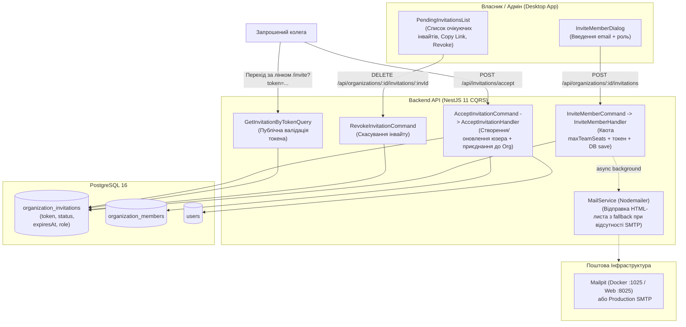

# ✉️ План Реалізації: Запрошення в Команду (Team Invitations) та Поштовий Сервіс (Mail Service)

> **Статус:** ✅ **Реалізовано та протестовано (100% тестів пройдено)**  
> **Дата виконання:** 27.08.2026  
> **Зв'язані документи:**
>
> - [`plans/company_registration_and_team_access.md`](file:///Users/oleg/AQA/SmartFeedStudio/plans/company_registration_and_team_access.md)
> - [`plans/organizations_and_team_seats.md`](file:///Users/oleg/AQA/SmartFeedStudio/plans/organizations_and_team_seats.md)
> - [`plans/tariff_strategy.md`](file:///Users/oleg/AQA/SmartFeedStudio/plans/tariff_strategy.md)

---

## 🎯 1. Головна Мета

Побудувати надійний, безпечний та інтуїтивний життєвий цикл запрошення співробітників до корпоративного простору компанії (B2B Workspace Invitations) за **двоканальною гібридною моделлю**:

1. **Миттєве посилання-запрошення (Invite Link / Zero Dependencies)**:
   - При створенні запрошення бекенд генерує криптографічний токен (`crypto.randomBytes(32).toString('hex')`) із терміном дії 7 діб.
   - Власнику/адміну в UI одразу надається кнопка **«📋 Скопіювати посилання»** для миттєвої відправки колезі в Telegram, Slack, Teams, WhatsApp або корпоративні месенджери.
   - Працює **завжди**, навіть якщо поштовий сервер не налаштований або тимчасово недоступний.

2. **Автоматичний поштовий сервіс (Nodemailer + Mailpit у Docker)**:
   - Паралельно бекенд надсилає брендований HTML-лист із кнопкою «Приєднатися до команди».
   - У локальному середовищі (Docker) використовується **Mailpit** (SMTP на порті 1025, Web UI на 8025).
   - У продакшені налаштування керуються через `.env` (`MAIL_HOST`, `MAIL_PORT`, `MAIL_USER`, `MAIL_PASS`, `MAIL_FROM`, `MAIL_ENABLED`).

3. **Життєвий цикл інвайту (`PENDING` -> `ACCEPTED` / `REVOKED` / `EXPIRED`)**:
   - **Новий співробітник** (пошти немає в системі): переходить за посиланням, вказує своє ім'я та пароль, стає учасником організації та автоматично авторизується.
   - **Існуючий користувач** (вже має акаунт): переходить за посиланням, підтверджує приєднання в 1 клік («Прийняти запрошення»).
   - **Управління в кабінеті Команди**: Власник бачить список очікуючих інвайтів, може скопіювати лінк, відправити повторно або відкликати (`Revoke`).

---

## 🏛 2. Архітектурна Схема (CQRS & Data Flow)

---

## 📋 3. Поетапний План Реалізації

### Етап 1. Спільні Контракти (`packages/shared`)

- [ ] Додати `InvitationStatus` enum (`PENDING`, `ACCEPTED`, `DECLINED`, `EXPIRED`, `REVOKED`) в `packages/shared/src/enums/index.ts`.
- [ ] Створити `OrganizationInvitationDtoSchema`, `CreateInvitationDtoSchema`, `AcceptInvitationDtoSchema`, `InvitationPublicDetailsDtoSchema` в `packages/shared/src/dtos/organization.dto.ts`.
- [ ] Перезібрати пакет `pnpm --filter @smartfeed/shared build`.

---

### Етап 2. База Даних (`schema.prisma`)

- [ ] Створити модель `OrganizationInvitation` з CUID PK, FK індексами, `snake_case` мапінгом та `expiresAt`.
- [ ] Виконати `pnpm --filter @smartfeed/backend-api exec prisma db push`.
- [ ] Виконати `pnpm --filter @smartfeed/backend-api exec prisma generate`.

---

### Етап 3. Поштовий Модуль Бекенду (`MailModule`)

- [ ] Встановити `nodemailer` та `@types/nodemailer`.
- [ ] Створити `MailModule` та `MailService` з підтримкою конфігурації через `.env` (`SMTP_HOST`, `SMTP_PORT`, `SMTP_USER`, `SMTP_PASS`, `SMTP_FROM`, `MAIL_ENABLED`).
- [ ] Реалізувати адаптивний HTML-шаблон листа для запрошення в команду.
- [ ] Забезпечити неблокуючий fallback: якщо пошта не налаштована або впала — логувати посилання в консоль без помилки для клієнта.
- [ ] Додати `mailpit` у `docker-compose.yml`.

---

### Етап 4. Бекенд CQRS Ендпоінти

- [ ] `InviteMemberCommand` + `InviteMemberHandler`: створення інвайту, перевірка ліміту `maxTeamSeats`, генерація посилання, повернення `{ id, email, role, token, inviteUrl, expiresAt }`.
- [ ] `GetOrganizationInvitationsQuery` + `GetOrganizationInvitationsHandler`: отримання списку `PENDING` інвайтів.
- [ ] `RevokeInvitationCommand` + `RevokeInvitationHandler`: скасування інвайту власником/адміном.
- [ ] `GetInvitationByTokenQuery` + `GetInvitationByTokenHandler`: публічний ендпоінт перевірки токена.
- [ ] `AcceptInvitationCommand` + `AcceptInvitationHandler`: прийняття інвайту новим або існуючим користувачем, створення `OrganizationMember`, оновлення статусу на `ACCEPTED`.
- [ ] Оновити контролери `OrganizationsController` та додати `InvitationsController`.

---

### Етап 5. Фронтенд Desktop Додатку (`apps/desktop`)

- [ ] Оновити API клієнт `apps/desktop/src/lib/api.ts` (методи створення інвайту, списку інвайтів, скасування, перевірки токена та прийняття).
- [ ] Оновити `InviteMemberDialog.tsx`: показ успішного створення з кнопкою копіювання посилання в буфер обміну.
- [ ] Створити компонент `PendingInvitationsList.tsx` та інтегрувати на сторінку `TeamPage.tsx`.
- [ ] Створити модальне вікно / екран прийняття інвайту `AcceptInviteDialog.tsx`.
- [ ] Додати двомовні ключі перекладу в `locales/uk/team.json` та `locales/en/team.json`.

---

### Етап 6. Автоматизоване Тестування & Контроль Якості

- [ ] Покрити бекенд Jest E2E тестами (`test/team-invitations.e2e-spec.ts`) з 100% очищенням створених тестових даних.
- [ ] Оновити Playwright E2E тести на десктопі (`apps/desktop/e2e/team.spec.ts`).
- [ ] Перевірити `tsc --noEmit` у всіх пакетах (нуль помилок).
- [ ] Виконати `pnpm format`.
- [ ] Оновити WIKI та документацію.
