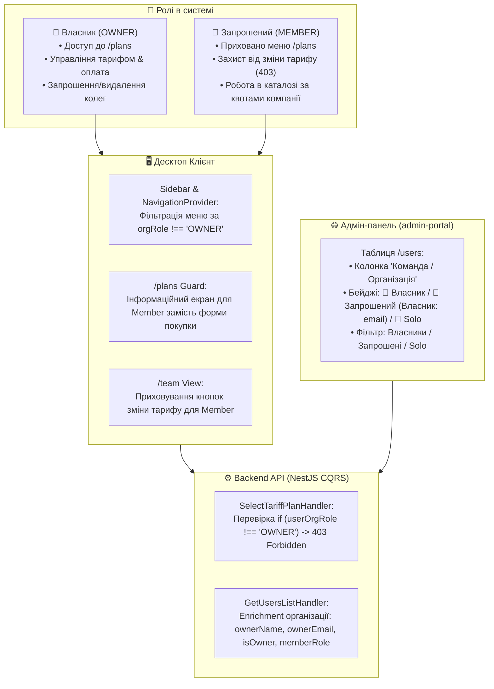

# 👥 План: Диференціація Ролей у Команді (Власник vs Запрошений) та Ієрархія в Адмін-панелі

> **Статус:** ✅ **Реалізовано та протестовано (100% тестів пройдено)**  
> **Дата виконання:** 27.08.2026

---

## 📌 1. Мета та Бізнес-Контекст

У системі сформована чітка бізнес-диференціація між ролями у воркспейсі:

1. **👑 Головний / Власник Компанії (`OWNER`)**:
   - Створив організацію (або зареєструвався як бізнес).
   - Оплачує та обирає тарифні плани (`STARTER`, `GROWTH`, `PRO`, `ENTERPRISE`).
   - Керує підпискою, білінгом та квотами команди.
   - Має ексклюзивне право запрошувати та видаляти учасників.
2. **👥 Запрошений у Команду Співробітник (`MEMBER` / `ADMIN` усередині воркспейсу)**:
   - Прийняв інвайт-посилання від Власника.
   - **НІКОЛИ не повинен бачити розділ тарифів («Тарифи»), кнопки зміни підписки чи білінг**, оскільки це зона відповідальності виключно Власника.
   - Використовує робочий простір (каталоги, AI, хмарний бекап) за рахунок корпоративної ліцензії Власника.
   - У розділі «Команда» бачить своїх колег, але не може змінювати тарифи чи квоти.
3. **🛡 Супер-Адміністратор в Адмін-панелі (`apps/admin-portal`)**:
   - Повинен **миттєво та чітко бачити в таблиці користувачів (`/users`) та ліцензій (`/licenses`)**:
     - Хто є **Власником (Головним)** конкретної організації.
     - Хто є **Запрошеним співробітником** і до якого саме Власника він прив'язаний.
     - Хто є **Solo-користувачем** (індивідуальний акаунт без команди).
     - Можливість фільтрувати користувачів за статусом у команді (Усі / Власники / Запрошені / Solo).

---

## 🏛 2. Архітектурне Рішення



---

## 🛠 3. Детальний План Змін по Компонентах

### 3.1. Спільні Контракти (`packages/shared`)

- **`packages/shared/src/dtos/user.dto.ts`**:
  - Розширити `UserListItemDto` структурою `organizationSummary`:
    ```typescript
    export interface UserOrganizationSummary {
      organizationId: string;
      organizationName: string;
      memberRole: 'OWNER' | 'ADMIN' | 'MEMBER';
      isOwner: boolean;
      ownerEmail?: string | null;
      ownerFullName?: string | null;
    }

    export interface UserListItemDto {
      // ... існуючі поля
      organization?: UserOrganizationSummary | null;
    }
    ```
  - Оновити фільтри `UsersQueryDtoSchema`: додати опціональне поле `orgRoleFilter?: 'ALL' | 'OWNERS' | 'MEMBERS' | 'SOLO'`.

---

### 3.2. Бекенд API (`services/backend-api`)

- **`services/backend-api/src/modules/users/queries/get-users-list.handler.ts`**:
  - Додати підтягування зв'язків `organizationMemberships -> organization -> owner`.
  - Мапити для кожного користувача статус:
    - Якщо `membership.role === 'OWNER'` -> `isOwner: true`, `memberRole: 'OWNER'`, `organizationName`.
    - Якщо `membership.role !== 'OWNER'` -> `isOwner: false`, `memberRole: 'MEMBER'`, `ownerEmail: org.owner.email`, `ownerFullName: org.owner.fullName`.
    - Якщо членств немає -> `organization: null` (Solo user).
  - Підтримка фільтрації за `orgRoleFilter`.
- **`services/backend-api/src/modules/licenses/commands/select-tariff-plan.handler.ts`**:
  - Додати перевірку: якщо користувач є учасником організації з роллю `MEMBER`, і при цьому не є `OWNER` жодної організації, повертати `ForbiddenException({ code: 'ONLY_OWNER_CAN_CHANGE_PLAN', message: 'Тільки власник організації має право змінювати тарифний план' })`.

---

### 3.3. Десктоп Клієнт (`apps/desktop`)

- **`apps/desktop/src/components/layout/Sidebar.tsx` & `NavigationContext.tsx`**:
  - Враховувати роль користувача в організації (`user.organization?.role` або `user.organization?.isOwner`).
  - Якщо користувач є `MEMBER` (запрошений), пункт меню `Тарифи` (`/plans`) **автоматично приховується з бічного меню навігації**.
- **`apps/desktop/src/pages/PlansPage.tsx`**:
  - Якщо запрошений учасник вводить пряму URL-адресу `/plans`, показувати інформаційну картку:
    > **💼 Корпоративний тариф компанії "{organizationName}"**  
    > Управління тарифом, білінгом та квотами здійснюється власником вашої організації ({ownerEmail}).  
    > Ваш поточний рівень доступу: **{planType}**.
    > (Без кнопок купівлі чи вибору плану).
- **`apps/desktop/src/pages/TeamPage.tsx`**:
  - Приховати кнопку "Змінити тариф" та "Запросити колегу" для запрошених співробітників (`user.organization?.role !== 'OWNER'`).

---

### 3.4. Адмін-Панель (`apps/admin-portal`)

- **`apps/admin-portal/src/components/users/UsersTable.tsx` & `UserTableRow.tsx`**:
  - Додати нову колонку: **"Команда / Організація"**.
  - Відображати стилізовані бейджі:
    - 👑 **Власник** (`Rozetka Hub`) — бейдж бурштинового кольору.
    - 👥 **Запрошений** (`Rozetka Hub`, Власник: `ceo@rozetka.ua`) — бейдж синього кольору з підказкою.
    - 👤 **Solo** (Індивідуальний) — нейтральний бейдж.
- **`apps/admin-portal/src/components/users/UserRoleFilter.tsx` & `page.tsx`**:
  - Додати таби/селектор фільтрації за командним статусом: `Всі користувачі` | `👑 Власники компаній` | `👥 Запрошені співробітники` | `👤 Solo`.
- **`apps/admin-portal/src/locales/uk/users.json` та `locales/en/users.json`**:
  - Додати 100% переклади для нових колонок, бейджів, тултіпів та фільтрів.

---

## 🧪 4. План Тестування та Верифікації

### 4.1. Backend Jest E2E (`services/backend-api/test/`)

1. `test/team-invitations.e2e-spec.ts`:
   - Додати перевірку заборони зміни тарифу для запрошеного учасника (`POST /api/licenses/select-plan` від імені `MEMBER` повертає `403 Forbidden`).
2. `test/users.e2e-spec.ts`:
   - Перевірити, що `GET /api/users` повертає коректну інформацію про організацію, роль `OWNER` vs `MEMBER` та email власника.

### 4.2. Desktop Playwright E2E (`apps/desktop/e2e/`)

1. `e2e/team.spec.ts` & `e2e/plans.spec.ts`:
   - Тест: Вхід під акаунтом запрошеного співробітника -> пункт меню `Тарифи` відсутній у сайдбарі.
   - Тест: Прямий перехід на `/plans` показує інформаційний корпоративний статус без кнопок зміни тарифу.

### 4.3. Admin Portal Playwright E2E (`apps/admin-portal/e2e/`)

1. `e2e/users.spec.ts`:
   - Тест: Відображення бейджів 👑 Власник та 👥 Запрошений (із зазначенням власника).
   - Тест: Фільтрація списку за командним статусом.
   - Тест: 100% білінгвальність UA ⇄ EN.

---

## 📋 5. Очікування на Підтвердження

> [!IMPORTANT]
> Відповідно до Правила 10 (Правило планів), агент зупиняється та очікує вашої явної команди для старту реалізації (наприклад: **"роби"**, **"виконуй"**, **"починай"**).
