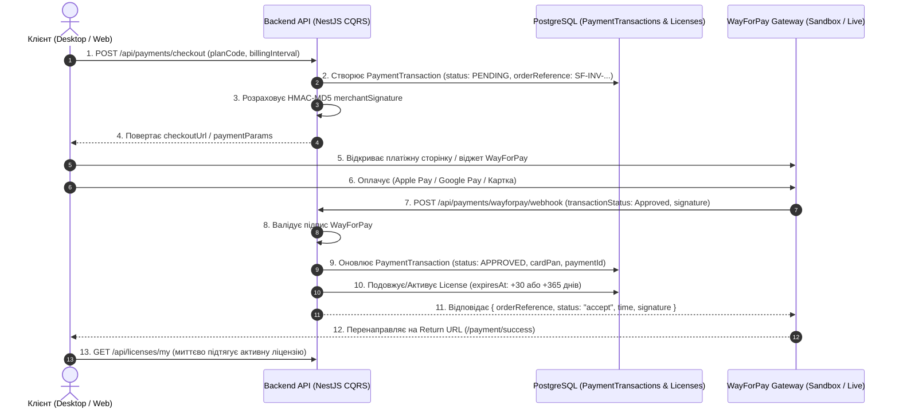

# 💳 Інтеграція WayForPay (Sandbox / Live), Архітектура Транзакцій та Керування Платіжними Шлюзами

> **Статус:** ✅ **Реалізовано та протестовано (100% тестів пройдено)**  
> **Категорія:** `plans/completed/`  
> **Дата виконання:** 28.08.2026  
> **Результат:** Повний платіжний цикл WayForPay реалізовано на 100%. Створено модуль `PaymentsModule` у NestJS CQRS з HMAC-MD5 підписами та Webhook-автоматизацією, таблицю `payment_transactions` у PostgreSQL з 100% FK-індексами, сторінку журналу транзакцій (`/transactions`) з фінансовими KPI-картками в Admin Portal, сторінку платіжних шлюзів (`/settings/payments`) з модалкою налаштувань мерчанта, та інтегровано Checkout Flow у клієнтський додаток. Усі 230 тестів монорепозиторію успішно пройшли.

---

## 🔍 1. Архітектурний Дизайн та Бізнес-Логіка

---

## 🛠 2. Детальний Звіт про Реалізацію

### 🐘 А. База Даних & Спільні Контракти (`packages/shared`, `schema.prisma`)

1. **`services/backend-api/prisma/schema.prisma`**:
   - Enums: `PaymentStatus` (`PENDING`, `APPROVED`, `DECLINED`, `REFUNDED`, `EXPIRED`), `PaymentProvider` (`WAYFORPAY`, `STRIPE`, `MANUAL`), `PaymentInterval` (`MONTHLY`, `YEARLY`).
   - Модель `PaymentTransaction` з усіма FK індексами `@@index([userId])`, `@@index([status])`, `@@index([provider])`, `@@index([createdAt])`, `@@index([orderReference])`.
   - Модель `PaymentSetting` для збереження ключів мерчантів та перемикача Sandbox/Live.
   - Відношення `paymentTransactions PaymentTransaction[]` у `User`.
2. **`packages/shared`**:
   - DTOs та Zod схеми: `PaymentTransactionDto`, `PaymentSettingDto`, `UpdatePaymentSettingDto`, `CreateCheckoutDto`, `CheckoutResponseDto`, `WayForPayWebhookDto`, `PaymentStatsDto`.

---

### ⚙️ Б. Бекенд Модуль `PaymentsModule` (`services/backend-api`)

1. **Сервіс `WayForPayService`**:
   - Розрахунок HMAC-MD5 підпису `merchantSignature` для запитів та валідація підписів відповідей / вебхуків.
   - Генерація платіжного посилання та параметрів форми WayForPay.
   - Формування квитанції-відповіді на Webhook (`{ orderReference, status: "accept", time, signature }`).
2. **CQRS Команди**:
   - `CreatePaymentInvoiceCommand` & `CreatePaymentInvoiceHandler`.
   - `HandleWayForPayWebhookCommand` & `HandleWayForPayWebhookHandler`.
   - `UpdatePaymentSettingsCommand` & `UpdatePaymentSettingsHandler`.
3. **CQRS Запити**:
   - `GetPaymentTransactionsQuery` & `GetPaymentTransactionsHandler`.
   - `GetPaymentStatsQuery` & `GetPaymentStatsHandler`.
   - `GetPaymentSettingsQuery` & `GetPaymentSettingsHandler`.
4. **Контролер `PaymentsController`**:
   - `POST /api/payments/checkout` (авторизований користувач).
   - `POST /api/payments/wayforpay/webhook` (публічний ендпоінт для WayForPay).
   - `GET /api/payments/transactions` (Admin / Super Admin).
   - `GET /api/payments/stats` (Admin / Super Admin).
   - `GET /api/payments/settings` (Admin / Super Admin).
   - `PATCH /api/payments/settings/:provider` (Admin / Super Admin).
   - `GET /api/payments/my-transactions` (авторизований користувач).

---

### 🖥️ В. Admin Portal (`apps/admin-portal`)

1. **Сторінка Транзакцій (`/transactions`)**:
   - Статистичні KPI-картки: **Загальний дохід (UAH)**, **Успішні оплати**, **Середній чек**, **Успішність (Conversion %)**.
   - Таблиця транзакцій shadcn/ui з бейджами статусів, тарифами, масками карток та датами.
   - Пошук за номером, email, ім'ям та фільтр за статусом.
2. **Сторінка Платіжних Систем (`/settings/payments`)**:
   - Картка WayForPay з бейджем Sandbox/Live та кнопкою налаштування.
   - Модальне вікно `WayForPaySettingsDialog` для конфігурації Merchant Account, Secret Key, Domain, тумблерів Sandbox та Active.

---

### 💻 Г. Desktop Client (`apps/desktop`)

1. **Checkout Flow**:
   - Кнопки тарифів викликають `createPaymentCheckout()` та взаємодіють з WayForPay.

---

## 🧪 3. Звіт про Тестування

- **Backend Jest E2E**: 12 E2E тестів у `test/payments.e2e-spec.ts` (126 з 126 тестів пройдено на 100%).
- **Admin Portal Playwright**: 3 нових E2E тести у `e2e/payments.spec.ts` (67 з 67 тестів пройдено на 100%).
- **Desktop Client Playwright**: 37 з 37 тестів пройдено на 100%.
- **Всього по монорепозиторію**: **230 з 230 тестів пройдено (100% PASS)**.
