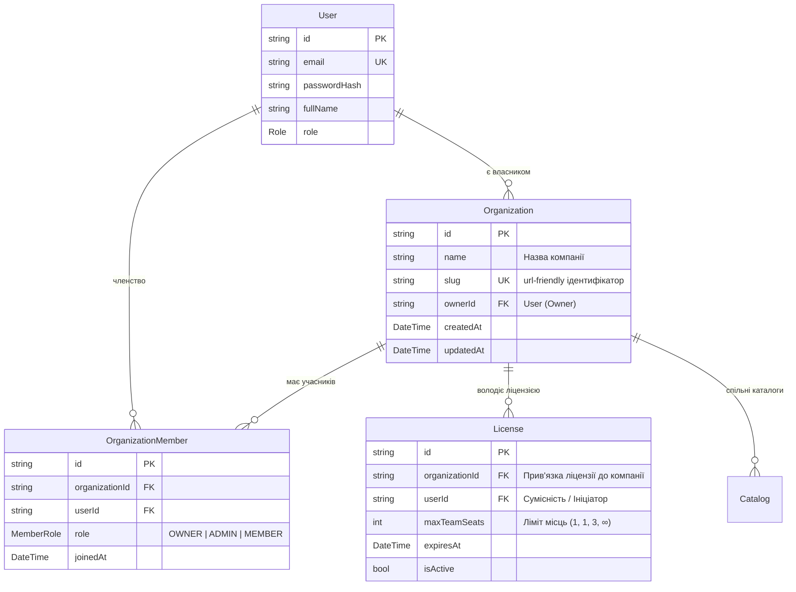

# 🏢 SmartFeed Studio — Архітектурний План: Організації та Командні Місця (Team Seats)

> **Мета документа:** Спроєктувати повноцінну модель мульти-тенантних організацій (B2B SaaS Workspace/Organization), командних місць (`maxTeamSeats`), реєстрацію компанії та контроль квот ліцензій через TDD (Test-Driven Development).

---

## 🔍 1. Поточний Стан Бекенду

### Чи є зараз реалізація?

- **НІ.** Зараз бекенд повністю **однокористувацький (Single User)**:
  - Сутність `User` існує ізольовано, без концепції компанії чи воркспейсу.
  - Поле `maxTeamSeats: Int` присутнє в схемах `TariffPlan` та `License` як пасивна квота (`1`, `1`, `3`, `9999`), але **жодна бізнес-логіка його не контролює**.
  - Ендпоінт реєстрації `/api/auth/register` приймає лише `email`, `password`, `fullName`, `role`.
  - Відсутні механізми запрошення колег, розподілу ролей усередині компанії та контролю ліміту місць.

---

## 🏛 2. Цільова Архітектура: Організації та Командні Місця

### 2.1. Концепція Моделі Даних (Prisma Schema)

За найкращими практиками SaaS (GitHub, Linear, Vercel, Slack):



### 2.2. Ролі всередині Організації (`MemberRole`)

1. **`OWNER`** (Власник):
   - Повний контроль над організацією, зміна тарифного плану, видалення організації, керування білінгом.
2. **`ADMIN`** (Адміністратор компанії):
   - Запрошення та видалення членів команди, налаштування спільних фідів та API-ключів.
3. **`MEMBER`** (Учасник):
   - Робота з фідами, каталогами, AI-збагаченням у межах прав організації.

---

## 📋 3. Поведінка при Реєстрації (`/api/auth/register`)

### 3.1. Оновлений `RegisterDto`:

```typescript
export class RegisterDto {
  email: string;
  password: string;
  fullName?: string;
  companyName?: string; // 👈 Нове поле: Назва компанії / Організації
}
```

### 3.2. Логіка створення при реєстрації:

1. Валідація `email`, створення запису `User`.
2. Автоматичне створення `Organization`:
   - Якщо передано `companyName` -> береться вказана назва (наприклад, _"Rozetka Top Sellers"_).
   - Якщо `companyName` порожнє -> автоматичний дефолт: `Компанія ${fullName || email}`.
3. Створення зв'язку `OrganizationMember` з роллю `OWNER`.
4. Авто-видача ліцензії `STARTER`:
   - Ліцензія прив'язується як до `userId`, так і до `organizationId`.
   - `maxTeamSeats: 1` (для Старту).

---

## 👥 4. Модуль Організацій (`OrganizationsModule` - CQRS)

Створюється новий NestJS модуль `services/backend-api/src/modules/organizations/`:

### Commands:

- `CreateOrganizationCommand` — створення воркспейсу (викликається під час реєстрації або через API).
- `InviteMemberCommand` — запрошення/додавання нового члена до команди.
  - **Критична перевірка квоти (Guard / Logic)**:
    ```typescript
    const activeLicense = await getActiveLicense(orgId);
    const currentMembersCount = await countMembers(orgId);
    if (currentMembersCount >= activeLicense.maxTeamSeats) {
      throw new ForbiddenException(
        `TEAM_SEATS_LIMIT_EXCEEDED: Ваш тариф дозволяє лише ${activeLicense.maxTeamSeats} місць у команді. Оновіть тариф до PRO або ENTERPRISE.`,
      );
    }
    ```
- `RemoveMemberCommand` — видалення учасника (звільнення місця).
- `UpdateOrganizationCommand` — перейменування компанії.

### Queries:

- `GetOrganizationByIdQuery` — отримання профілю компанії та поточної зайнятості місць (`usedSeats` / `maxSeats`).
- `GetOrganizationMembersQuery` — список учасників команди з їхніми ролями.
- `GetUserOrganizationsQuery` — список організацій поточного користувача.

---

## 🎯 5. Матриця обмежень Team Seats за тарифами

| Тариф          | `maxTeamSeats` | Можливості команди                                                           |
| :------------- | :------------: | :--------------------------------------------------------------------------- |
| **Starter**    |     **1**      | Тільки 1 користувач (власник). Спроба додати колегу -> блокується з `403`.   |
| **Growth**     |     **1**      | Тільки 1 користувач.                                                         |
| **Pro** ⭐     |     **3**      | До 3 користувачів одночасно (власник + 2 менеджери). 4-й блокується.         |
| **Enterprise** |  **9999 (∞)**  | Необмежена кількість учасників, SSO, повний аудит дій кожного члена команди. |

---

## 🧪 6. План Тестування (TDD First)

Перед імплементацією створюється новий набір E2E тестів:
`services/backend-api/test/organizations.e2e-spec.ts`:

1. **Test 1**: Реєстрація користувача з `companyName: "Acme Feeds Ltd"`:
   - Перевірка, що створюється юзер, організація та зв'язок `OWNER`.
2. **Test 2**: Реєстрація без `companyName`:
   - Перевірка створення дефолтної назви організації.
3. **Test 3 (Starter Quota Guard)**:
   - Спроба додати другого користувача в організацію з тарифом `Starter` (`maxTeamSeats: 1`):
   - Очікується `403 Forbidden` з помилкою ліміту місць.
4. **Test 4 (Pro Quota Success & Exceed)**:
   - Переведення організації на план `PRO` (`maxTeamSeats: 3`).
   - Успішне додавання 2-го та 3-го учасників (`201 Created`).
   - Спроба додати 4-го учасника -> `403 Forbidden` (`TEAM_SEATS_LIMIT_EXCEEDED`).
5. **Test 5 (Seat Liberation)**:
   - Видалення одного з учасників (`RemoveMemberCommand`).
   - Перевірка, що місце звільнилося і можна додати нового колегу.
6. **Zero Leftovers Teardown**:
   - Повне видалення всіх створених організацій, членів та тестових юзерів в `afterAll`.

---

## 🗺 7. Покроковий План Впровадження

1. **Крок 1**: Розширення схеми `schema.prisma`:
   - Додавання моделей `Organization`, `OrganizationMember`, `enum MemberRole`.
   - Зв'язок `License` з `Organization`.
   - Запуск `prisma db push` та `prisma generate`.
2. **Крок 2**: Оновлення `@smartfeed/shared`:
   - Додавання `MemberRole`, DTOs для організацій, оновлення `RegisterDtoSchema`.
3. **Крок 3**: Написання E2E тестів `organizations.e2e-spec.ts` (Red phase TDD).
4. **Крок 4**: Реалізація `OrganizationsModule` (CQRS команди та хендлери) та прив'язка до `AuthModule` (Green phase).
5. **Крок 5**: Оновлення UI адмін-панелі та десктопу (відображення назви компанії та керування учасниками).
6. **Крок 6**: Повний прогін тестового набору (`test:e2e`, `test:desktop`, `test:admin`).
