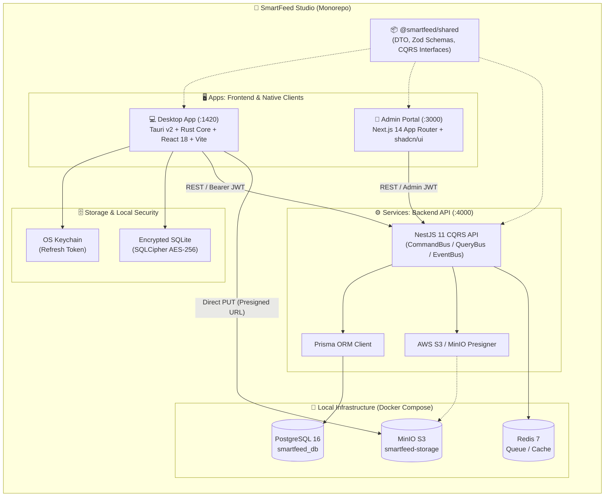

# 🏛 Високорівнева Архітектура — SmartFeed Studio

## 📌 Загальна Архітектурна Схема Monorepo

Проект організовано за структурою **Monorepo** з використанням менеджерів робочих просторів **pnpm workspaces** та конвеєра збирання **Turborepo**.

---

## 🏗 Основні Компоненти Системи

| Компонент            | Шлях у репозиторії     | Технології                                           | Призначення                                                                                                         |
| :------------------- | :--------------------- | :--------------------------------------------------- | :------------------------------------------------------------------------------------------------------------------ |
| **Shared Contracts** | `packages/shared`      | TypeScript, Zod                                      | Єдине джерело правди для DTO, Zod валідації, CQRS контрактів та enum'ів.                                            |
| **Backend API**      | `services/backend-api` | NestJS 11, CQRS, Prisma ORM                          | Центральний REST API з модульною архітектурою (Auth, Users, Plans, Licenses, Storage, Navigation).                  |
| **Desktop Client**   | `apps/desktop`         | Tauri v2 (Rust), React 18, Vite, Tailwind, shadcn/ui | Нативний кросплатформний клієнт з локальним шифруванням бази та збереженням токенів у системному зв'язці ключів ОС. |
| **Admin Portal**     | `apps/admin-portal`    | Next.js 14 App Router, React 18, shadcn/ui           | Панель адміністратора для моніторингу користувачів, конфігурації тарифів та управління навігацією.                  |
| **Infrastructure**   | `docker-compose.yml`   | Docker, Postgres 16, Redis 7, MinIO                  | Локальне контейнеризоване середовище для розробки та E2E тестування.                                                |

---

## 🛡 Принципи Ізоляції та Безпеки

1. **Суворе CQRS розмежування**:
   - `UsersModule` відповідає **виключно** за запис і читання з бази користувачів через Prisma.
   - `AuthModule` координує авторизацію, токени та відновлення паролів, взаємодіючи з `UsersModule` через шину `CommandBus` / `QueryBus`.
2. **Нульове навантаження на сервер при передачі важких файлів (Direct S3)**:
   - Клієнти запитують одноразовий Presigned Upload URL у `StorageModule`.
   - Завантаження гігабайтних бекапів чи каталогів виконується безпосередньо у сховище MinIO/S3 за протоколом HTTP PUT, минаючи бекенд.
3. **Безпека робочої станції користувача**:
   - Жодних чутливих токенів у незахищеному `localStorage` на Desktop: Refresh токен зберігається через Rust бібліотеку `keyring` у Keychain.
   - Локальна копія товарів шифрується AES-256 у базі даних SQLCipher.
