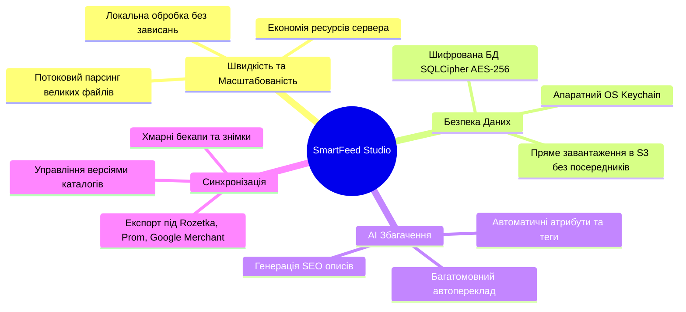

# 🎯 Місія та Бачення Продукту — SmartFeed Studio

## 📌 Що таке SmartFeed Studio?

**SmartFeed Studio** — це високопродуктивна корпоративна платформа (Desktop + Cloud API + Admin Portal) нового покоління, створена для e-commerce бізнесів, маркетплейсів, інтернет-магазинів та digital-агенцій.

Платформа вирішує ключову проблему сучасної електронної комерції: **складність роботи з велетенськими товарними каталогами (від десятків тисяч до мільйонів позицій) у форматах XML, CSV та YML**.

---

## 🚀 Ключові Проблеми, які вирішує платформа

1. **Падіння пам'яті (OOM) при імпорті каталогів**:
   - Традиційні інструменти намагаються завантажити весь XML/CSV файл у пам'ять, через що зависають на файлах розміром 500 МБ+.
   - _Рішення SmartFeed Studio:_ Потоковий парсинг на Rust/Node.js та локальне збереження у високошвидкісну вбудовану БД.

2. **Захист конфіденційних даних та облікових записів**:
   - Токени API та паролі постачальників не можна зберігати у відкритому вигляді.
   - _Рішення SmartFeed Studio:_ Нативна інтеграція з апаратними сховищами ключів ОС (macOS Keychain, Windows Credential Manager, Linux Secret Service) та шифрування локальної бази алгоритмом AES-256 через SQLCipher.

3. **Низька якість контенту та відсутність SEO**:
   - Постачальники часто надають сухі або неповні описи товарів.
   - _Рішення SmartFeed Studio:_ Інтегровані AI-моделі для автогенерації привабливих описів, структурованих характеристик і пошукових тегів з контролем витрат через систему AI-кредитів.

4. **Гнучкість тарифних моделей без жорсткого кодування**:
   - Бізнес потребує можливості налаштовувати тривалість тріалу (наприклад, 7, 14 чи 30 днів) без перезбирання коду.
   - _Рішення SmartFeed Studio:_ Повністю динамічні тарифи в PostgreSQL, автоматичний підрахунок залишку днів, м'яке сповіщення та надійне блокування при завершенні терміну дії.

5. **Мультипостачальництво, усунення дублікатів та правила Buy Box**:
   - Селлери отримують один і той самий товар від кількох постачальників за різними цінами та із різними залишками на складах.
   - _Рішення SmartFeed Studio:_ Єдина картка товару (Master Product), автоматичне об'єднання за штрих-кодом (EAN) або артикулом, сумування залишків, гнучкі правила націнки за постачальником та інтелектуальний алгоритм Buy Box (вибір найвигіднішої пропозиції в наявності).

---

## 👥 Цільова Аудиторія

- **Інтернет-магазини та Селлери**: Швидка підготовка та регулярне оновлення цін/залишків на Prom.ua, Rozetka, Epicentr, Kasta, Allo.
- **Маркетингові та SEO Агенції**: Масове збагачення товарів та вивантаження оптимізованих фідів для Google Shopping, Facebook Catalog.
- **Дистриб'ютори та Дропшиппінг-постачальники**: Автоматизована роздача каталогів суб-дилерам з контролем доступних колонок та категорій.
