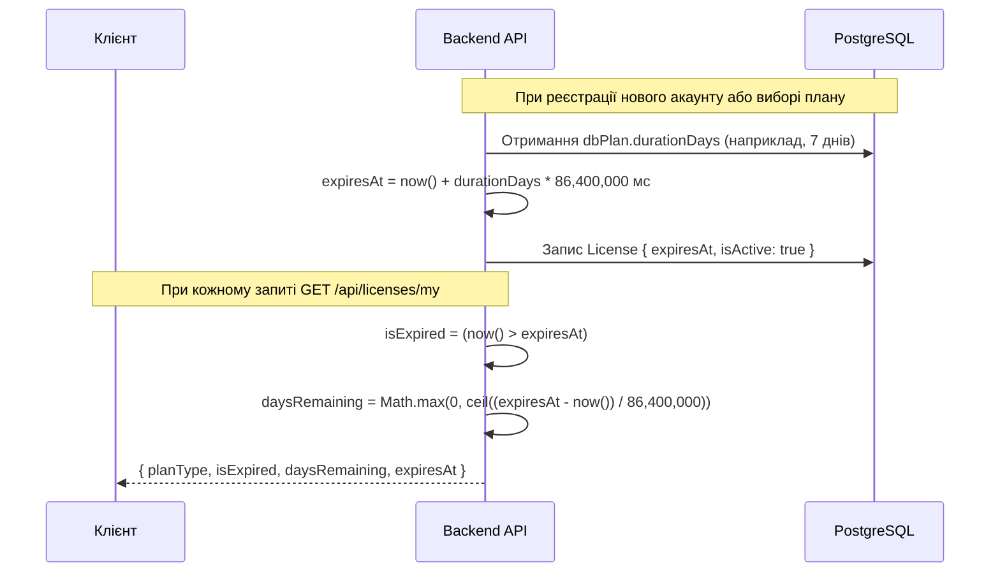

# ⏱ Політика Динамічної Тривалості Тарифів та Блокування Доступу

## 📌 Чому динамічна тривалість?

У ранніх версіях платформи терміни дії тарифів хардкодилися (або безкоштовний тариф вважався вічним). За вимогою бізнесу систему було переведено на **повністю конфігуровану динамічну модель тривалості**:

- Поле `durationDays` у сутності `TariffPlan` (за замовчуванням: `STARTER: 7`, `GROWTH: 30`, `PRO: 30`, `ENTERPRISE: 365`).
- Адміністратор у будь-який момент може змінити тривалість (наприклад, встановити Starter на 14 днів для маркетингової акції), і всі нові користувачі автоматично отримають оновлений термін.

---

## 🧮 Формули Розрахунку Термінів



### Формула обчислення `expiresAt`

```typescript
const expiresAt = dbPlan?.durationDays
  ? new Date(Date.now() + dbPlan.durationDays * 24 * 60 * 60 * 1000)
  : null;
```

### Формули обчислення `isExpired` та `daysRemaining`

```typescript
const isExpired = Boolean(license.expiresAt && new Date(license.expiresAt) < new Date());

const daysRemaining = license.expiresAt
  ? Math.max(
      0,
      Math.ceil((new Date(license.expiresAt).getTime() - Date.now()) / (1000 * 60 * 60 * 24)),
    )
  : null;
```

---

## 🔒 Механізм Блокування Доступу (RequireActiveLicenseGuard)

Коли термін дії ліцензії користувача закінчується (`isExpired === true` або `isActive === false`):

1. **На рівні Бекенду**:
   - Захищені ресурсні ендпоінти (наприклад, генерація S3 Presigned URL для збереження каталогів `POST /api/storage/presigned-url`) захищені гардом `RequireActiveLicenseGuard`.
   - При спробі виклику повертається помилка **`403 Forbidden`** зі стандартизованим тілом:
     ```json
     {
       "statusCode": 403,
       "error": "Forbidden",
       "message": "LICENSE_EXPIRED",
       "details": "Your current subscription plan has expired. Please renew or upgrade your plan."
     }
     ```

2. **На рівні Десктопного Клієнта**:
   - Сторінки робочого функціоналу (`/catalogs`, `/ai-enrichment`, `/cloud-sync`) автоматично відображають інтерактивний блокувальник `<ExpiredPlanBlocker />`.
   - Всі операції блокуються, а користувачу показується чітке повідомлення з кнопкою **"Обрати тариф"**, яка спрямовує на `/plans`.
   - Сторінки `/plans` (вибір та поновлення тарифу) та `/settings` (профіль користувача) **залишаються відкритими**.

3. **Миттєве Розблокування (Instant Unlock)**:
   - Користувач переходить на `/plans`, обирає бажаний тарифний план (наприклад, `PRO` або `ENTERPRISE`), викликається `POST /api/licenses/select-plan`.
   - Бекенд генерує новий ключ ліцензії, встановлює новий `expiresAt` (`now + durationDays`), скидає `isExpired` у `false`.
   - Десктопний додаток миттєво знімає блокувальник і повертає повний доступ до каталогів.
