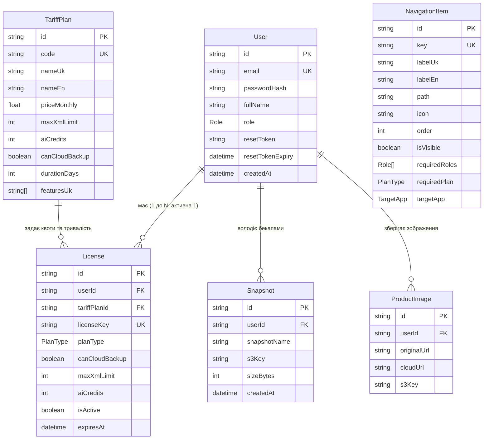

# 🔗 Зв'язки Сутностей (ERD) та Каскадні Правила

## 📌 Діаграма зв'язків сутностей (Entity-Relationship Diagram)

---

## 🛡 Каскадні Правила та Цілісність Даних

1. **Видалення Користувача (`User` -> `License`, `Snapshot`, `ProductImage`)**:
   - `onDelete: Cascade` налаштовано для сутностей `License`, `Snapshot`, та `ProductImage`.
   - При видаленні користувача (чи в робочому процесі, чи під час очистки тестів `afterAll`), всі пов'язані з ним ліцензії, бекапи та зображення **автоматично видаляються з PostgreSQL**, запобігаючи накопиченню осиротілих записів.

2. **Видалення Тарифного Плану (`TariffPlan` -> `License`)**:
   - `onDelete: SetNull` налаштовано для зв'язку `tariffPlanId` у моделі `License`.
   - Якщо адміністратор видаляє кастомний тарифний план, вже видані користувачам ліцензії **не втрачають працездатності** — їхній `tariffPlanId` встановлюється в `null`, але квоти (`maxXmlLimit`, `aiCredits`) та термін дії (`expiresAt`) зберігаються без змін.
