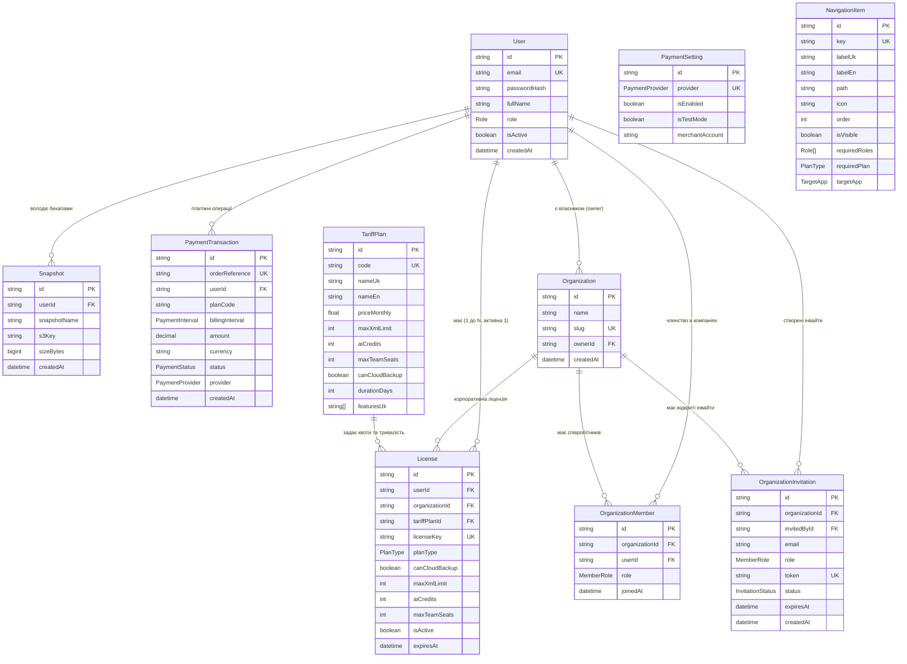

# 🔗 Зв'язки Сутностей (ERD) та Каскадні Правила

## 📌 Діаграма зв'язків сутностей (Entity-Relationship Diagram)

---

## 🛡 Каскадні Правила та Цілісність Даних

1. **Видалення Користувача (`User` -> `License`, `Snapshot`, `PaymentTransaction`, `Organization`)**:
   - `onDelete: Cascade` налаштовано для сутностей `License`, `Snapshot`, `PaymentTransaction`, `Organization`.
   - При видаленні користувача всі пов'язані з ним ліцензії, бекапи та транзакції **автоматично видаляються з PostgreSQL**.

2. **Видалення Тарифного Плану (`TariffPlan` -> `License`)**:
   - `onDelete: SetNull` налаштовано для зв'язку `tariffPlanId` у моделі `License`.
   - Якщо адміністратор видаляє кастомний тарифний план, вже видані користувачам ліцензії **не втрачають працездатності** — їхній `tariffPlanId` встановлюється в `null`, але квоти (`maxXmlLimit`, `aiCredits`) та термін дії (`expiresAt`) зберігаються без змін.

3. **Локальні Товари та Каталоги**:
   - Усі товарні каталоги, фотографії, атрибути, постачальники, правила націнок та канали експорту обробляються та зберігаються **виключно у локальній зашифрованій базі даних клієнта (SQLCipher / SQLite на Rust Tauri)**.
