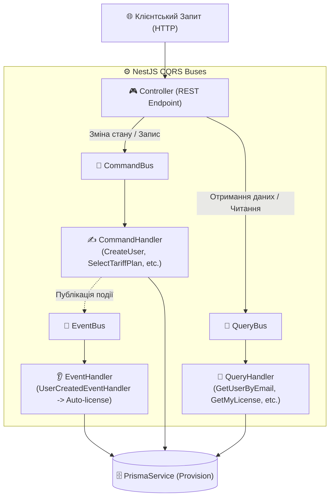

# 🔄 Архітектура CQRS у NestJS — SmartFeed Studio

## 📌 Чому CQRS (Command Query Responsibility Segregation)?

У звичайних монолітних архітектурах один сервіс (наприклад, `UserService`) часто виконує і валідацію, і бізнес-логіку, і запис у базу, і генерацію JWT токенів, що призводить до циклічних залежностей та розростання "божественних" об'єктів (God Objects).

У **SmartFeed Studio** застосовано суворий патерн **CQRS** за допомогою бібліотеки `@nestjs/cqrs`:



---

## 🏛 Модульне Розмежування (Single Responsibility Principle)

1. **`UsersModule` (Рівень Збереження Даних)**:
   - Відповідає **тільки** за сутність `User` у PostgreSQL.
   - Ніколи не імпортує `AuthModule`, JWT, Passport або токени.
   - Обробляє команди: `CreateUserCommand`, `ResetPasswordCommand`, `ChangePasswordCommand`.
   - Обробляє запити: `GetUserByEmailQuery`, `GetUserByIdQuery`, `GetUsersListQuery`, `GetUsersStatsQuery`.

2. **`AuthModule` (Орган Авторизації та Видачі Токенів)**:
   - Керує ендпоінтами `/auth/register`, `/auth/login`, `/auth/refresh`, `/auth/me`, `/auth/forgot-password`, `/auth/reset-password`.
   - Спілкується з `UsersModule` **виключно** через шини `CommandBus` та `QueryBus`:
     ```typescript
     // При реєстрації:
     await this.commandBus.execute(new CreateUserCommand(email, password, fullName, role));

     // При логіні:
     const user = await this.queryBus.execute(new GetUserByEmailQuery(email));
     ```

3. **`LicensesModule` (Асинхронна Реакція на Події)**:
   - Слухає подію `UserCreatedEvent` на шині `EventBus`.
   - Автоматично генерує ліцензійний ключ формату `SF-STARTER-XXXX-XXXX-XXXX`, прив'язує активний план та обчислює термін дії `expiresAt`.

4. **`PlansModule` (Керування Тарифами)**:
   - CRUD для тарифних планів: `CreateTariffPlanCommand`, `UpdateTariffPlanCommand`, `DeleteTariffPlanCommand`, `GetTariffPlansQuery`.
