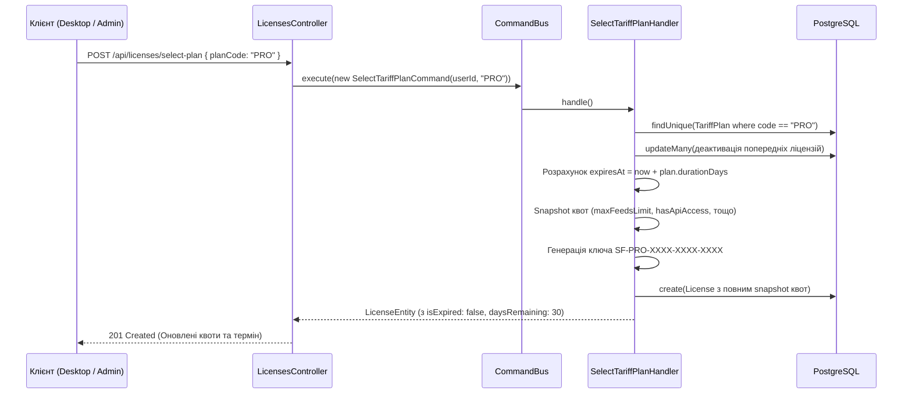

# 💳 Модуль Тарифних Планів та Ліцензій — SmartFeed Studio

## 📌 4-Рівнева Система Тарифів

SmartFeed Studio використовує **4-тарифну систему** з прогресивним доступом до функціоналу:

| Тариф          | Код          | Ціна/міс | SKU  | Фіди | Канали | AI кредити | Оновлення   |
| :------------- | :----------- | :------: | :--: | :--: | :----: | :--------: | :---------- |
| **Старт**      | `STARTER`    |    $0    | 500  |  1   |   1    |     0      | Вручну      |
| **Зріст**      | `GROWTH`     |   $29    | 10K  |  5   |   3    |     50     | Щодня       |
| **Про**        | `PRO`        |   $79    | 100K |  ∞   |   15   |    500     | Кожні 4 год |
| **Корпоратив** | `ENTERPRISE` |   $249   |  ∞   |  ∞   |   ∞    |    5000    | Щогодини    |

### Feature Flags по тарифах

| Функція         | STARTER | GROWTH | PRO | ENTERPRISE |
| :-------------- | :-----: | :----: | :-: | :--------: |
| `hasApiAccess`  |    ✗    |   ✗    |  ✓  |     ✓      |
| `hasFeedDiff`   |    ✗    |   ✗    |  ✓  |     ✓      |
| `hasWebhooks`   |    ✗    |   ✗    |  ✗  |     ✓      |
| `hasWhiteLabel` |    ✗    |   ✗    |  ✗  |     ✓      |
| `hasSso`        |    ✗    |   ✗    |  ✗  |     ✓      |
| `hasAuditLog`   |    ✗    |   ✗    |  ✗  |     ✓      |
| `hasCustomS3`   |    ✗    |   ✗    |  ✗  |     ✓      |
| `hasPriorityAi` |    ✗    |   ✗    |  ✗  |     ✓      |
| SLA Uptime      |    —    |   —    |  —  |   99.9%    |
| Команда (seats) |    1    |   1    |  3  |     ∞      |
| Постачальники   |    1    |   3    | 15  |     ∞      |

---

## 📌 Ендпоінти Тарифів та Ліцензій

### Тарифи (`/api/plans`)

- `GET /api/plans`: Отримання списку активних тарифів для вибору в додатку (Публічний).
- `GET /api/plans/admin`: Повний список планів для адмін-панелі (`Bearer Admin`).
- `POST /api/plans`: Створення нового плану (`Bearer Admin`).
- `PATCH /api/plans/:id`: Редагування назви, цін, квот, списку переваг та `durationDays` (`Bearer Admin`).
- `DELETE /api/plans/:id`: Безпечне видалення плану (`Bearer Admin`).

### Ліцензії (`/api/licenses`)

- `GET /api/licenses/my`: Отримання поточної ліцензії, залишку днів (`daysRemaining`), статусу (`isExpired`) та пов'язаного плану з усіма quota-полями (`Bearer`).
- `POST /api/licenses/select-plan`: Вибір нового тарифу або поновлення (`Bearer`).
- `GET /api/licenses/admin`: Перегляд усіх виданих ліцензій (`Bearer Admin`).

---

## ⚡ CQRS Сценарій: Вибір та Активація Тарифу



---

## 🌱 Авто-provisioning при реєстрації

При реєстрації нового користувача:

1. `CreateUserHandler` публікує `UserCreatedEvent` на `EventBus`.
2. `UserCreatedEventHandler` (в `LicensesModule`) отримує подію.
3. Автоматично видає `STARTER` ліцензію з ключем `SF-STARTER-XXXX-XXXX-XXXX`.
4. `durationDays` береться з динамічного `TariffPlan.code = 'STARTER'` (за замовчуванням 7 днів).
5. Адмін може змінити `durationDays` через `PATCH /api/plans/:id` — нові реєстрації одразу отримають оновлений термін.

---

## 🛡 Гард `RequireActiveLicenseGuard`

Гард підключається до критичних ендпоінтів (`StorageController`, майбутні feed-обробники, AI-генерація):

```typescript
@UseGuards(JwtAuthGuard, RequireActiveLicenseGuard)
@Post('presigned-url')
async getPresignedUrl(...) { ... }
```

### Логіка перевірки:

1. Завантажує активну ліцензію через `QueryBus` (`GetLicenseByUserIdQuery`).
2. Якщо ліцензія відсутня або `isActive === false` або `now > expiresAt`:
   - Викидає `ForbiddenException` з кодом `LICENSE_EXPIRED`.
3. Якщо ліцензія діє — пропускає запит до хендлера.

---

## 📊 Константи `PLAN_LIMITS_MAP`

Статична карта квот у `@smartfeed/shared` виступає **fallback** коли `TariffPlan` відсутній у БД:

```typescript
// packages/shared/src/constants/index.ts
export const PLAN_LIMITS_MAP: Record<PlanType, PlanLimits> = {
  [PlanType.STARTER]:    { maxXmlLimit: 500,       aiCredits: 0,    canCloudBackup: false, ... },
  [PlanType.GROWTH]:     { maxXmlLimit: 10000,     aiCredits: 50,   canCloudBackup: true,  ... },
  [PlanType.PRO]:        { maxXmlLimit: 100000,    aiCredits: 500,  canCloudBackup: true,  ... },
  [PlanType.ENTERPRISE]: { maxXmlLimit: 999999999, aiCredits: 5000, canCloudBackup: true,  ... },
};
```
