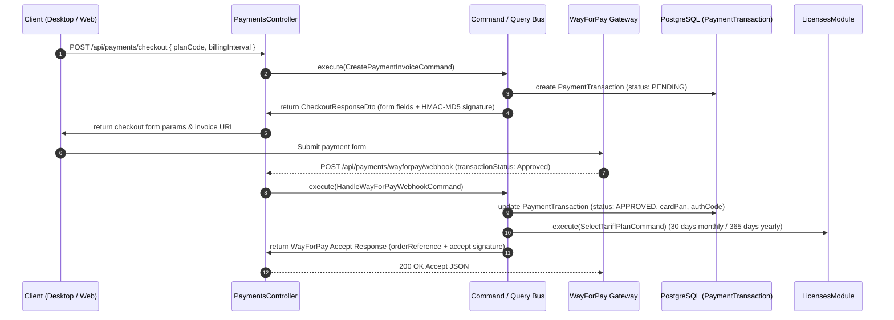

# 💳 Модуль Платежів та Інтеграція WayForPay (`PaymentsModule`)

## 📌 Огляд та Архітектура

Модуль `PaymentsModule` реалізує повний життєвий цикл платіжного шлюзу **WayForPay** (включаючи тестовий Sandbox та бойовий Live режими), генерацію інвойсів, валідацію HMAC-MD5 підписів, обробку вебхуків, автоматичне продовження ліцензій та повний фінансовий облік транзакцій.

---

## 🏛 Архітектурний Стек & CQRS Розподіл



---

## 🔐 Алгоритм Розрахунку Підписів (HMAC-MD5)

### 1. Формування підпису запиту на оплату (`merchantSignature`):

```typescript
const signString = [
  merchantAccount,
  merchantDomainName,
  orderReference,
  orderDate,
  amount,
  currency,
  ...productName,
  ...productCount,
  ...productPrice,
].join(';');

const signature = crypto
  .createHmac('md5', merchantSecretKey)
  .update(signString, 'utf8')
  .digest('hex');
```

### 2. Валідація підпису Webhook (`merchantSignature`):

```typescript
const webhookSignString = [
  merchantAccount,
  orderReference,
  amount,
  currency,
  authCode || '',
  cardPan || '',
  transactionStatus,
  reasonCode || '',
].join(';');

const expectedSignature = crypto
  .createHmac('md5', merchantSecretKey)
  .update(webhookSignString, 'utf8')
  .digest('hex');
```

### 3. Формування відповіді підтвердження (`accept`):

```typescript
const time = Math.floor(Date.now() / 1000);
const acceptSignString = [orderReference, 'accept', time].join(';');
const acceptSignature = crypto
  .createHmac('md5', merchantSecretKey)
  .update(acceptSignString, 'utf8')
  .digest('hex');

return {
  orderReference,
  status: 'accept',
  time,
  signature: acceptSignature,
};
```

---

## 📊 Доступні Ендпоінти

| Метод   | Ендпоінт                                 | Опис                                                 | Доступ                         |
| :------ | :--------------------------------------- | :--------------------------------------------------- | :----------------------------- |
| `POST`  | `/api/payments/checkout`                 | Створення інвойсу та параметрів форми WayForPay      | Авторизований користувач       |
| `POST`  | `/api/payments/wayforpay/webhook`        | Прийом та валідація вебхуку результату оплати        | Публічний (перевірка HMAC)     |
| `POST`  | `/api/payments/simulate-sandbox-webhook` | Симуляція Sandbox оплати (Approved/Declined)         | Авторизований користувач       |
| `GET`   | `/api/payments/transactions`             | Список транзакцій з пагінацією та пошуком            | Тільки `ADMIN` / `SUPER_ADMIN` |
| `GET`   | `/api/payments/stats`                    | Фінансова аналітика (дохід, конверсія, середній чек) | Тільки `ADMIN` / `SUPER_ADMIN` |
| `GET`   | `/api/payments/settings`                 | Налаштування платіжних систем                        | Тільки `ADMIN` / `SUPER_ADMIN` |
| `PATCH` | `/api/payments/settings/:provider`       | Оновлення ключів мерчанта, домену та Sandbox режиму  | Тільки `ADMIN` / `SUPER_ADMIN` |
| `GET`   | `/api/payments/my-transactions`          | Історія оплат поточного користувача                  | Авторизований користувач       |
