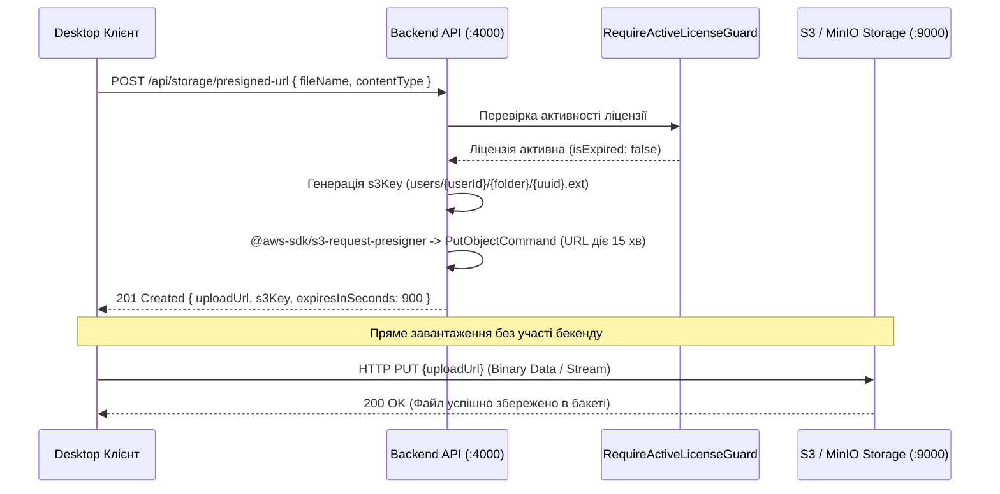

# ☁️ Хмарне Сховище та S3 Presigned URLs — SmartFeed Studio

## 📌 Чому Presigned URLs?

Каталоги e-commerce можуть містити сотні тисяч товарів із фотографіями та досягати сотень мегабайт. Якщо передавати файли спочатку на бекенд, а звідти в S3:

1. Бекенд блокуватиметься тривалими потоками вводу-виводу (I/O).
2. Різко зростає споживання оперативної пам'яті (RAM).
3. Збільшується ризик мережевих обривів.

**Архітектурне рішення SmartFeed Studio:**
Бекенд генерує тимчасовий авторизований URL (Presigned Upload URL), за яким клієнт вивантажує файл безпосередньо у сховище MinIO або Cloudflare R2/AWS S3.

---

## 🔒 Перевірка Прав Доступу

Генерація Presigned URL захищена двома рівнями:

- `JwtAuthGuard`: перевіряє валідність сесії користувача.
- `RequireActiveLicenseGuard`: перевіряє, чи не закінчився термін дії тарифного плану. Якщо план прострочено, бекенд відмовляє у видачі посилання з помилкою `403 LICENSE_EXPIRED`.
