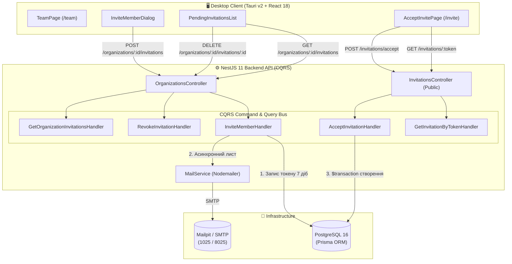
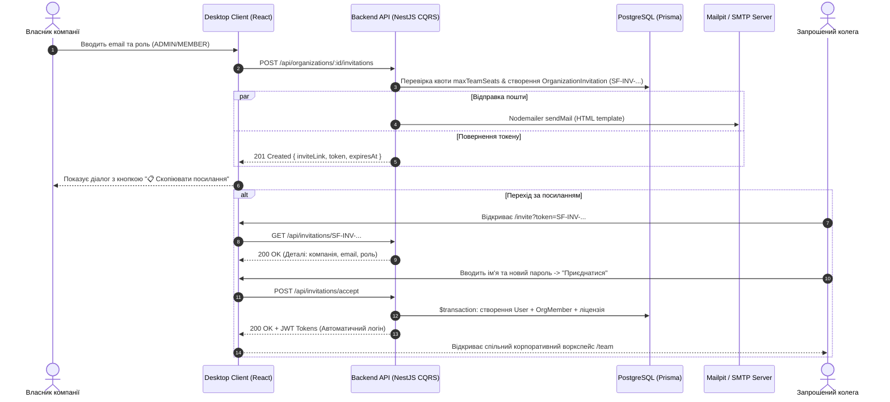

# ✉️ Запрошення в Команду та Поштовий Сервіс (Team Invitations & Mail Service)

## 📌 Огляд Архітектури

SmartFeed Studio використовує **двоканальну гібридну модель** доставки запрошень до корпоративного простору компанії:

1. **Миттєве токен-посилання (`SF-INV-...`)**:
   - Криптографічний 256-бітний токен генерується на бекенді та діє 7 діб.
   - Відображається в діалоговому вікні клієнта з кнопкою «Скопіювати посилання» для миттєвої відправки в будь-який корпоративний месенджер (Telegram, Slack, Teams).
2. **Асинхронний поштовий сервіс (`MailService`)**:
   - Паралельно Nodemailer формує брендований HTML-лист із кнопкою прямого переходу.
   - У локальному Docker середовищі використовується **Mailpit** (SMTP: `localhost:1025`, Web UI: `http://localhost:8025`).
   - У продакшені підтримується будь-який стандартний SMTP сервер (SendGrid, Postmark, AWS SES, Resend) без зміни жодного рядка коду.

---

## 🗺 Архітектурна Схема Компонентів (Component Diagram)



### 📋 Текстова Архітектурна Схема (ASCII / Unicode Flow)

```text
┌────────────────────────────────────────────────────────────────────────────────────────┐
│                        🖥 DESKTOP CLIENT (Tauri v2 + React 18)                         │
│                                                                                        │
│   ┌───────────────────────────┐      ┌──────────────────────────┐                      │
│   │   InviteMemberDialog      │      │    AcceptInvitePage      │                      │
│   │ (Генерація + Копіювання)  │      │ (/invite?token=SF-INV-)  │                      │
│   └─────────────┬─────────────┘      └────────────┬─────────────┘                      │
└─────────────────┼─────────────────────────────────┼────────────────────────────────────┘
                  │ POST /invitations               │ POST /invitations/accept
                  ▼                                 ▼
┌────────────────────────────────────────────────────────────────────────────────────────┐
│                        ⚙️ BACKEND API (NestJS 11 CQRS Pattern)                          │
│                                                                                        │
│   ┌───────────────────────────────┐     ┌──────────────────────────────────────────┐   │
│   │ OrganizationsController       │     │ InvitationsController (Public)           │   │
│   └─────────────┬─────────────────┘     └─────────────────┬────────────────────────┘   │
│                 │                                         │                            │
│                 ▼                                         ▼                            │
│   ┌───────────────────────────────┐     ┌──────────────────────────────────────────┐   │
│   │ InviteMemberHandler           │     │ AcceptInvitationHandler                  │   │
│   │ • Генерація токену 7 діб      │     │ • Перевірка терміну дії (expiresAt)      │   │
│   │ • Перевірка maxTeamSeats      │     │ • Створення нового User + хеш паролю     │   │
│   └───────┬───────────────┬───────┘     │ • Транзакція: OrgMember + Ліцензія       │   │
│           │               │             └─────────────────┬────────────────────────┘   │
│           ▼               ▼                               │                            │
│   ┌──────────────┐ ┌──────────────┐                       │                            │
│   │  MailService │ │  Prisma DB   │ ◄─────────────────────┘                            │
│   │ (Nodemailer) │ │  PostgreSQL  │                                                    │
│   └───────┬──────┘ └──────────────┘                                                    │
└───────────┼────────────────────────────────────────────────────────────────────────────┘
            │ SMTP (1025 / 587)
            ▼
┌────────────────────────────────────────────────────────────────────────────────────────┐
│                    🐳 INFRASTRUCTURE (Mailpit / Production SMTP)                       │
│                                                                                        │
│   📧 Mailpit (Web UI: http://localhost:8025  |  SMTP: localhost:1025)                 │
│   📦 PostgreSQL 16 (Таблиці: users, organizations, organization_invitations)           │
└────────────────────────────────────────────────────────────────────────────────────────┘
```

---

## 🔄 Діаграма Послідовності Запрошення (Sequence Diagram)



### 📋 Текстова Діаграма Життєвого Циклу (Step-by-Step Flow)

```text
[1. ВЛАСНИК В UI] ──────────► [2. POST /api/organizations/:id/invitations]
                                       │
            ┌──────────────────────────┴──────────────────────────┐
            ▼                                                     ▼
 [Канал 1: Токен-лінк]                                 [Канал 2: Поштовий сервіс]
  • Генерується токен (7 діб)                           • Nodemailer формує HTML-лист
  • Повертається в UI                                   • Відправка через Mailpit/SMTP
  • Кнопка «Скопіювати посилання»                       • Кнопка «Приєднатися» в листі
            │                                                     │
            └──────────────────────────┬──────────────────────────┘
                                       │
                                       ▼
                  [3. КОЛЕГА ВІДКРИВАЄ /invite?token=SF-INV-...]
                                       │
                                       ▼
                  [4. GET /api/invitations/:token (Публічний)]
                  • Завантаження назви компанії та email
                                       │
                                       ▼
                  [5. POST /api/invitations/accept]
                  • $transaction у PostgreSQL:
                    - Створення нового юзера з паролем (або прив'язка існуючого)
                    - Додавання в OrganizationMember (MEMBER/ADMIN)
                    - Оновлення статусу інвайту на ACCEPTED
                    - Успадкування активної ліцензії воркспейсу
                                       │
                                       ▼
                  [6. АВТОМАТИЧНИЙ ВХІД & СИНХРОНІЗАЦІЯ]
                  • Видача JWT токенів
                  • Перенаправлення у спільний простір /team
```

---

## 🏛 CQRS Команди та Запити

| Тип         | Назва                             | Призначення                                                                                                       |
| :---------- | :-------------------------------- | :---------------------------------------------------------------------------------------------------------------- |
| **Command** | `InviteMemberCommand`             | Створює запис `OrganizationInvitation` (токен, термін 7 діб) та надсилає лист через `MailService`                 |
| **Command** | `RevokeInvitationCommand`         | Анулює активне запрошення зі зміною статусу на `REVOKED`                                                          |
| **Command** | `AcceptInvitationCommand`         | Приймає запрошення: створює нового юзера або підключає існуючого, додає в `OrgMember` у транзакції `$transaction` |
| **Query**   | `GetOrganizationInvitationsQuery` | Отримує список активних очікуваних інвайтів для адміна/власника                                                   |
| **Query**   | `GetInvitationByTokenQuery`       | Публічний запит деталей інвайту (назва компанії, email, роль)                                                     |

---

## ⚙️ Змінні Оточення Поштового Сервісу

```env
APP_URL=http://localhost:1420
MAIL_HOST=localhost
MAIL_PORT=1025
MAIL_USER=
MAIL_PASS=
MAIL_FROM="SmartFeed Studio <no-reply@smartfeed.studio>"
MAIL_ENABLED=true
```

---

## 📬 Як Переглядати Листи у Локальному Поштовому Сервісі (Mailpit)

Для перевірки та тестування надісланих email-повідомлень (запрошення до команди, відновлення паролю тощо) у середовищі розробки використовується вбудований сервіс **Mailpit**.

### 1. Автоматичний запуск разом з усіма сервісами

Mailpit автоматично піднімається в Docker-контейнері при запуску загальної команди проекту:

```bash
# Запуск усієї інфраструктури та додатків (PostgreSQL, Redis, MinIO, Mailpit + Next.js + Vite + NestJS)
pnpm dev:all
# або
pnpm docker:up
```

### 2. Веб-інтерфейс перегляду листів (Web UI)

- **URL у браузері**: [http://localhost:8025](http://localhost:8025)
- **Швидка команда з терміналу**:
  ```bash
  pnpm mail:open
  ```
- **Перегляд логів роботи поштового сервера**:
  ```bash
  pnpm mail:logs
  ```

### 3. Що можна робити у веб-інтерфейсі Mailpit:

- **Миттєвий перегляд нових листів**: всі вихідні листи з бекенду потрапляють у Mailpit без потреби мати реальний інтернет чи діючий поштовий ящик.
- **Попередній перегляд HTML-шаблону**: інтерактивний перегляд стилізованого листа зі смарт-кнопками (`Приєднатися до компанії`, `Скинути пароль`).
- **Перемикання розширень екрану**: перевірка відображення на мобільних пристроях та десктопі.
- **Аналіз заголовків та сирого тексту**: перегляд Message-ID, MIME-частин, DKIM та точних полів адресата (`To`, `From`, `Subject`).
- **Копіювання токенів та посилань**: можливість клікнути посилання прямо з листа для переходу на сторінку прийняття інвайту.
